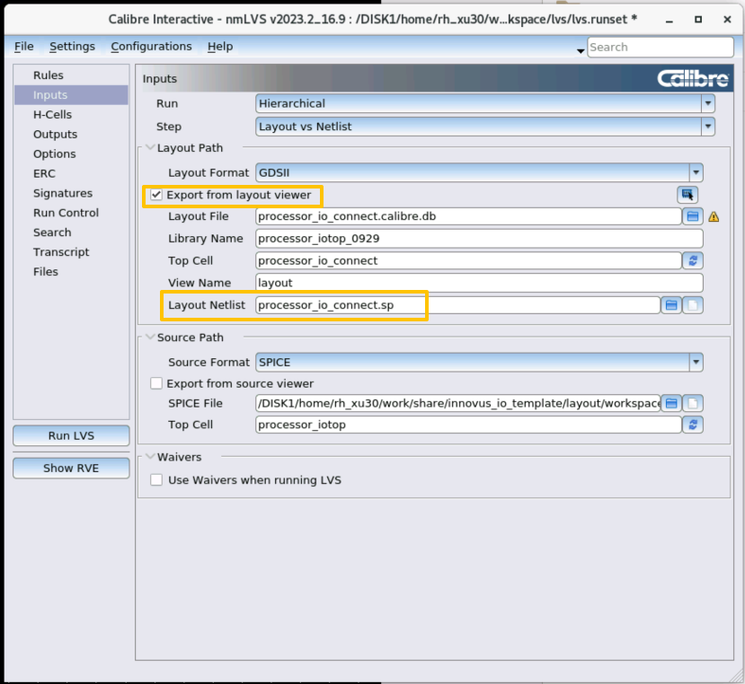
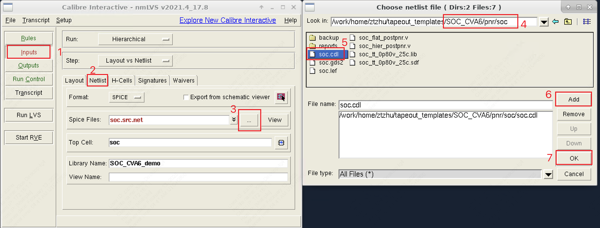

# DRC(calibre flow)

## 准备工作

如果virtuoso界面没有calibre选项卡，参见[virtuoso](./virtuoso.md/##在virtuoso显示calibre选项卡)

### 说明文档

T1CentOS/T2CentOS服务器上，在工艺库安装路径`/DISK2/Tech_PDK/TSMC_22NM_RF_ULL/Doc/CL-DR/TN22CLDR001_1_5.pdf`。在DRC debug的时候对任何violation有问题应该在该文档中查找说明以及图例。

用于DRC的规则文件则可以在工艺库目录中找到：`/DISK2/Tech_PDK/TSMC_22NM_RF_ULL/PDK/PDK_20211230_LO_0.8V_2.5V_1P9M_6X1Z1U_UT_ALRDL_StarRC_QRC/Calibre/drc/calibre.drc`。可以拷贝一份到自己的工作目录，对其中的文件头设置进行修改，用于当前设计的DRC。

## 标准操作步骤

0.  Prepare drc rule file, and **change the header** in it. Make sure the configurations are suited for your design(e.g. whether it is full_chip, whether it is with seal_ring, the boudary of the chip).

1.  In the layout window, go to Calibre → Run DRC.

2.  If you have already created the runset, skip to Step 9. Otherwise, close the "Load Runset File" form.

3.  In the interactive window, select the "Rules" tab and click ... to choose drc file. Then, select "Load".

4.  Make a new directory(or use an existed one but it will be overwrited) for the drc information to be stored.

5.  **Change your "DRC Run Directory" to this location** so you don't flood your project space with drc files.

6.  Let's save this runset. Go to File → Save Runset.

7.  With the "File Path" empty, press OK.

8.  In the next window, give it a name (e.g. xxx.runset). Select OK.

9.  If you came here from step 2, load the runset we created. Otherwise, continue next step.

10.  Click on the "Inputs" tab and verify that the file information is correct.

11.  In "Run Control" tab, it is recommended to **choose multi thread** rather than single thread to accelerate checking.

12.  Now, select "Run DRC".

13.  Once it is complete (which may take a while, even on campus), a summary file and the Results Viewing Environment (RVE) window will appear.

14.  Once you select a check/cell in the left column in RVE window, double-clicking or pressing the light button in the toolbar will highlight and zoom in on the error. Follow the description to resolve the error.

It is important to note that even though there are a lot of errors, often one fix will solve many other problems.

## 注意事项

### 修改drc rule文件头设置

drc规则文件拿来不要直接用，要注意根据实际情况修改文件头设置。

例如对于FULL CHIP且带seal ring的顶层设计，可以这样设置文件头：

```verilog
/* SWITCH DEFINITION START */
//  OPTION SETUP
//================

// OPTION FOR CHIP/IP LEVEL
//=========================
#DEFINE FULL_CHIP                       // Turn on for chip level design
#DEFINE WITH_SEALRING                   // Turn on if Seal-Ring is already added in chip layout 
#DEFINE CHECK_LOW_DENSITY               // Turn on to check OD/PO/Metal local low density. 

// OPTION FOR FBEOL
//=================
#DEFINE WIRE_BOND                     // Turn on for wire bond package (FBEOL option1/3); Turn off for flip chip package (FBEOL option2/4)
#DEFINE WITH_APRDL                      // Turn on if with AlCu RDL (FBEOL option3/4); Turn off if without AlCu RDL (FBEOL option1/2)
//#DEFINE INFO_TOP_DIE_DRC                 // Turn on for INFO package
//#DEFINE DBOC                          // Turn on for direct-bump-on-copper flip chip package
//#DEFINE WLCSP                         // Turn on for WLCSP package
#DEFINE WITH_POLYIMIDE                  // Turn off when process without Polyimide

// OPTION FOR RULE GROUP
//======================
#DEFINE DATATYPE_WARNING                // Turn on to flag NW/OD/PO/CO warning datatype
#DEFINE FRONT_END                       // Turn on to check Front-End rules
#DEFINE BACK_END                        // Turn on to check Back-End rules
#DEFINE M1_V1_M2_CHECKS                 // Turn on to check M1/VIA1/M2 rules
#DEFINE DVIAxR3_For_NonFlipChip         // DVIAx.R.3 is must for Flip-Chip PAD application and also strongly recommended for Non Flip-Chip PAD
#DEFINE GUIDELINE_ESD                   // Turn on to check ESD protection guidelines
#DEFINE GUIDELINE_ANALOG                // Turn on to check Analog guidelines
#DEFINE VOLTAGE_RULE_CHECK  //Turn off to unslect voltage-dependent rules
//#DEFINE VOLTAGE_RULE_CHECK_ONLY // Turn on to only select voltage-dependent rules
#DEFINE ESD_LUP_RULE_CHECK        // Turn off to unselect ESD/LUP rules
//#DEFINE ESD_LUP_RULE_CHECK_ONLY //Turn on to only select ESD/LUP rules.
#DEFINE N22_ULL  //Turn on to check ULL-process rules

#DEFINE NW_SUGGESTED                    // Turn on to use conservative way to check NW.S.3/NW.S.4 
//#DEFINE CHECK_VIRTUAL_CO              // Turn on to check CO related rules on virtual CO(30;30) 
//#DEFINE CHECK_VIRTUAL_CO_ONLY         // Turn on to check only CO related rules on virtual CO(30;30)
//#DEFINE CHECK_VIRTUAL_VIAx            // Turn on to check VIAx related rules on virtual VIAx(5x;200) 
//#DEFINE CHECK_VIRTUAL_VIAx_ONLY       // Turn on to check only VIAx related rules on virtual VIAx(5x;200)

// OPTION FOR DENSITY/EMPTY ERROR PREVENTION 
//==========================================
#DEFINE IP_TIGHTEN_DENSITY            // Turn on to tighten local density check in IP/macro/block level. 

// OPTION FOR CHECKING METHODOLOGY
//================================
//#DEFINE SKIP_CELL_BOUNDARY            // Turn on to skip PO.W.15~20 boundary check in cell level.
//#DEFINE USE_IO_VOLTAGE_ON_CORE_TO_IO_NET  // Turn on to use IO voltage on net without voltage marker and connect to IO & core MOS simultaneously
//#DEFINE USE_SD_VOLTAGE_ON_CORE_TO_IO_NET  // Turn on to use S/D voltage on net without voltage text/marker and connect to IO & core MOS simultaneously
//#DEFINE ALL_AREA_IO   //Turn on for treat OD injector as same as AAIO
//#DEFINE DISCONNECT_ALL_RESISTOR         // Turn on to disconnect all resistors between pad and device for Latch-Up rule check.
//#DEFINE CONNECT_ALL_RESISTOR            // Turn on to connect all resistors between pad and device for Latch-Up rule check.
#DEFINE DEFINE_PAD_BY_TEXT              // Turn on to recognize IO PAD by following text for Latch-Up rules 
VARIABLE PAD_TEXT  "?PAD?"                  // Pin name of PAD
VARIABLE VDD_TEXT  "?VDD?"               // Pin name of VDD
VARIABLE VSS_TEXT  "?VSS?"               // Pin name of VSS 
//#DEFINE CHECK_FLOATING_GATE_BY_TEXT     // Turn on to avoid PO.R.19 false error from empty IP by following text
//#DEFINE CHECK_FLOATING_GATE_BY_PRIMARY_TEXT   // Turn on to check PO.R.19 in cell level and avoid false error  by following primary text
VARIABLE IP_PIN_TEXT  "?"               // pin name of IP 

// OPTION FOR CHIP/IP BOUNDARY
//============================
#DEFINE UseprBoundary     // Turn on to specify chip boundary by prBoundary(108;0) layer
//#DEFINE UseRoutingBlockage // Turn on to specify IP boundary by each metal routing blockage layer  
//#DEFINE ChipWindowUsed    // Turn on to specify chip boundary directly by following variables  
VARIABLE xLB   0.0        // x-coordinate(um) of left-bottom corner for user defined chip window 
VARIABLE yLB   0.0        // y-coordinate(um) of left-bottom corner for user defined chip window 
VARIABLE xRT   1000.0      // x-coordinate(um) of right-top corner for user defined chip window  
VARIABLE yRT   1000.0     // y-coordinate(um) of right-top corner for user defined chip window 
// The following variables are for Mask Field Utilization Check. Please change it if using different value. 
VARIABLE ScribeLineX    180.0       // Width of scribe_line X (um)
VARIABLE ScribeLineY    180.0       // Width of scribe_line Y (um)

//  OPTION SETUP OF EFP RULES
//===============================
#DEFINE EFP                             // Turn on to check EFP rules 
//#DEFINE EFP_ONLY                      // Turn on to check EFP rules only

//  OPTION SETUP OF DFM RULES
//===============================
//#DEFINE DFM_ONLY          // Turn on to check DFM rules only
//#DEFINE DFM               // Turn on to check DFM rules

VARIABLE CellsForRRuleRecommended "*"      // include cell in Recommendations check 
VARIABLE CellsForRRuleAnalog " "           // include cell in Analog Recommendations and Guidelines check (default is empty) 
VARIABLE CellsForRRuleGuideline "*"        // include cell in Guidleline check 
VARIABLE ExclCellsForRRuleRecommended " "  // exclude cell from Recommendations check 
VARIABLE ExclCellsForRRuleAnalog " "       // exclude cell from Analog Recommendations and Guidelines check
VARIABLE ExclCellsForRRuleGuideline " "    // exclude cell from Guidleline check

// select by DFM category 
#DEFINE Recommended        // Turn on to check Recommendations
#DEFINE Analog             // Turn on to check Analog Recommendations
#DEFINE Guideline          // Turn on to check Guidelines

// select by DFM Grouping
#DEFINE First_priority         // Turn on to check DFM rules of first priority group 
#DEFINE Manufacturing_concern  // Turn on to check DFM rules of manufacturing-concern group
#DEFINE Device_performance      // Turn on to check DFM rules of device performance group


// select by DFM category 
// select by each DFM rule respectively
// Recommendations
//================
#DEFINE _ODW1_
#DEFINE _ODS1_
//...
#DEFINE _COS8_    
#DEFINE _COR6_
/* SWITCH DEFINITION END */


// ENVIRONMENT SETUP
//==================

/* SWITCH DEFINITION START */
PRECISION    1000
RESOLUTION      5    // For 0.005um layout grid  

LAYOUT SYSTEM GDSII
LAYOUT PATH "GDSFILENAME"
LAYOUT PRIMARY "TOPCELLNAME"

DRC RESULTS DATABASE "DRC_RES.db"
DRC SUMMARY REPORT "DRC.rep"  // HIER
DRC KEEP EMPTY NO
DRC CHECK TEXT ALL
DRC MAXIMUM RESULTS ALL
//DRC BOOLEAN NOSNAP45 YES
//DRC CELL NAME YES CELL SPACE XFORM ALL
TEXT PRINT MAXIMUM 1000
FLAG OFFGRID YES     // For layout grid check. default grid value is resolution size  //IF Disable than >>
FLAG ACUTE YES
FLAG SKEW YES
FLAG NONSIMPLE YES
FLAG NONSIMPLE PATH YES
LAYOUT PROCESS BOX RECORD YES
//LAYOUT ALLOW DUPLICATE CELL YES
//LAYOUT ERROR ON INPUT NO
LAYOUT CLONE ROTATED PLACEMENTS YES  // For DFM PROPERTY
//LAYOUT INPUT EXCEPTION SEVERITY TEXTSTRING_ASTRING 1
/* SWITCH DEFINITION END */
```

重点注意的几个选项：

- DEFINE FULL_CHIP: Turn on for chip level design
- DEFINE WITH_SEALRING: Turn on if Seal-Ring is already added in chip layout
- DEFINE WIRE_BOND: Turn on for wire bond package (FBEOL option1/3); Turn off for flip chip package (FBEOL option2/4)
- #DEFINE UseprBoundary: Turn on to specify chip boundary by prBoundary(108;0) layer. 对于加了seal ring但是出现SR.R.1或者SLR.EN.1或CSR.EN.x的违例情况，可以尝试手动在顶层版图画一个prBndry矩形将chip window包住，然后开启此选项。

### DRC violation能不能waive？

#### can waive

- All "CSR.*" (Corner Stress Relief) errors can be ignored **if it's not the entire chip**. Metals and vias are not allowed in chip corners, but we are not creating the entire chip.
- Any "*.EN" (Enclosure) errors **regarding chip edge** can be waived; all others should be resolved according to the rule described in the explanation window.
- All "MOM.*" errors can be waived if no MOM caps are used at all in the design.
- All "ESD.*" errors can be waived.
- All "*.WARN" errors can be waived.

#### can't waive

- All "*.S" (Spacing) errors should be resolved. Move metals or vias to meet the minimum spacing requirements. 
- All "*.W" (Width) errors should be resolved. Resize any flagged objects to meet the maximum/minimum width rules.
- All "*.A" (Area) errors should be resolved. Resize the metal/via as described in the check.
- All "G.*" (Grid) errors should be resolved. The grid is the minimum resolution that can be manufactured. If you used paths with variable ends and specified a length less than the grid resolution (for some unknown reason), you will receive an error. All other path ends are fixed to the grid. Additionally, do not change the grid resolution from 0.005 in the layout display options ("e").
- All ".DN " (Density) errors should be resolved (with the exception of the aforementioned case). Certain metal and oxide densities are required for fabrication. TSMC recommends their autofill script.

### 某些DRC违例的解决方法

#### NW.S.2

```text
NW.S.2 { @ Space of 2 NW1V with different potentials >= 0.8 
  NW1V_NODAL = STAMP NW1V BY NWi
  EXT NW1V_NODAL < NW_S_2 ABUT < 90 NOT CONNECTED SINGULAR REGION
}
```



类似于[IC训练营项目典型Calibre DRC案例](https://zhuanlan.zhihu.com/p/567673036)中分析的原因，DRC报错直接原因是检测到不同voltage的NW间距小于0.8，但是按理说std cell就是这么摆的，摆完就是这个间距。因此可以推断DRC将两条VDD rail识别成了不同的电压。为什么会识别成不同的电压，进一步观察我们可以发现这一块区域的VDD power rail没有跟任何power stripe或者power ring接上，因此工具无法识别他们的电压（是否一致）。由此发现pr过程的问题，由于这一块区域是core区域右侧，sram和power ring的小缝隙，这一部分没有打到任何纵向的stripe，导致VDD rail没有可以接上的纵向stripe，因此悬空。需要重新做一次pr



#### SR.R.1, SLR.EN.1, CSR.EN.x

没有正确地识别seal ring或者边界。对于SR.R.1中提到的三种seal ring层是不需要手动加的，本就包含在CSR1DMY，CSR2DMY等模块中。消除这个DRC的方法是手动在顶层版图画一个prBndry矩形将chip window包住，然后在drc文件中开启#DEFINE UseprBoundary选项

#### 