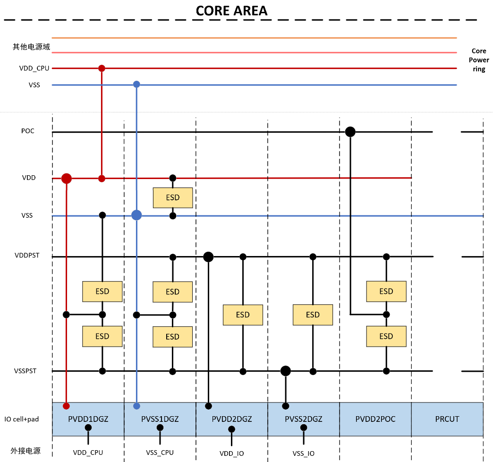

# io详解

## 0. 概述

### 图示


所有的信号从外部（直流电源或者fpga）进入到芯片内部（core区域）需要依次经过pad，I/O cell。

### pad，io cell，io pad，io ring概念辨析

- pad就是一块高层金属，形状为矩形（几十微米尺寸），用于金线连接芯片与封装管座。在有些工艺库中I/O cell是已经带了pad的，而在TSMC22的标准I/O库中I/O cell和pad（如PAD73D60）是分开的，需要手动将他们放在一起；

- I/O cell可以理解为一个buffer，用于为各种信号提供驱动和稳压，它不仅仅是将一根信号线直连起来这么简单，其内部有ESD保护电路，并且它本身也是一个有源器件，需要外部的供电才可以工作。分为 Pre-driver（工作在核心电压如0.8V，处理逻辑功能如三态控制） 和 Post-driver （工作在I/O电压如2.5V，提供大驱动能力和ESD保护）两级.
- Io pad一般就是指io cell和pad合起来，或者指某些本身就带了pad的io cell
- 所有的I/O需要连接起来，如果有断开的部分，也需要用filler填充，使得I/O形成一个连接的环，称为I/O ring。


### PAD的间距要求

我们所采用的Wire Bond PAD为 PAD52D6GU，这意味着两个相邻的信号/电源PAD的PITCH不能低于52μm，通常情况下我们选择60μm作为一个较为合适的间距。

### 分类

对于TSMC22工艺，常用的I/O cell库为`tphn22ullgv2od3_c171206_120a`，其说明文档datasheet在T1CentOS服务器路径`/DISK2/Tech_PDK/TSMC_22NM_RF_ULL/IP/Std_IO/tphn22ullgv2od3_c171206_120a/digital/Documentation/documents/tphn22ullgv2od3_c171206_120a`。常用的有以下几种类别：

| 类别 | 典型Cell | 核心功能 | 尺寸 |
| :--- | :--- | :--- | :--- |
| 物理连接类 | Corner Pad, Filler | 电源环连续性与DRC合规 | PCORNER110x110 |
| 物理隔离类 | PRCUT | 不同电源域之间的隔离 | PRCUT110x20 |
| 电源信号类 | PVDD, PVSS, POC | 电源输入,稳压与保护 | 110x20 |
| 普通信号类 | PDD | 信号驱动与电平转换 | 110x20 |

## 1. 普通信号I/O

### 原理图和功能

主要是PDDWUW0408SDGH_H（水平）和PDDWUW0408SDGH_V（竖直），他们只有水平和竖直的区别，功能上完全是一样的。可以用作输入或者输出io。详见文档中原理图以及功能：


核心模块包括
 
| 模块 | 功能 | 典型电路 |
| :--- | :--- | :--- |
| ESD/保护电路 | 静电泄放路径，防止栅氧化层击穿 | 单/双二极管+电阻结构 (正/负电压泄放) |
| 电平转换器 | 转换核心电压 (低压) 与I/O电压 (高压) | Level Shifter电路 |
| 施密特触发器 | 抗噪声，整形输入信号 | 内置缓冲器 |
| 驱动电路 | 增强信号驱动能力 (输出模式) 或缓冲输入信号 (输入模式) | 反相器链 (大电容负载) |

- 输入模式：外部信号 → Pad → 施密特触发器 → 核心电路（高阻态接收）
- 输出模式：核心信号 → Pre-driver → Post-driver → Pad（推挽或开漏驱动）
- 双向模式：通过三态门（OEN信号）切换方向

### 综合前的例化

在综合前就需要将这种信号io例化在rtl中，因为有些端口需要tie0或者tie1，综合工具需要将这些net连接到特定的tiehi或者tielo单元上。例如

```Verilog
//输入型
PDDWUW0408SDGH_V I_refclk (
    .OEN    (1'b1),      // 输出使能关
    .IE     (1'b1),      // 输入使能开
    .PU     (1'b0),      // 上拉关闭
    .DS     (1'b0),      // 驱动强度配置
    .PAD    (refclk),    // 连接到顶层输入
    .C      (refclk_int),// 连接到处理器内部
    .PD     (1'b0),      // 下拉关闭
    .I      (1'b0)       // 未用(输入模式)
);

//输出型
PDDWUW0408SDGH_H I_tdo (
    .OEN    (1'b0),      // 输出使能开
    .IE     (1'b0),      // 输入使能关
    .PU     (1'b0),      // 上拉关闭
    .DS     (1'b1),      // 驱动强度增强
    .PAD    (tdo),       // 连接到顶层输出
    .C      (),          // 未用(输出模式)
    .PD     (1'b0),      // 下拉关闭
    .I      (tdo_int)    // 来自处理器输出
);
```

可以将这些信号io看作一种特殊的buffer标准单元，需要在rtl中例化，并且各端口需要连线，而且还需要供电，只不过与core区域内的标准单元由带有core电压（如0.8V）的power rail供电不同，这些信号io由io ring上的带有io电压（如2.5V）的VDDPST/VSSPST环来供电。需要注意的是该信号的pad端应该使用IO电压，也就是逻辑高电平应该使用VDDIO而不是VDDCORE

### 版图


 
左图是右图仅显示M3~M5的版图，可以更清晰地看到PDDWUW0408SDGH_H上面有一条一条的VDDPST，VSSPST，VDD，VSS，POC。其中VDDPST/VSSPST就是给io供电的。

## 2. 电源信号I/O

### 分类

常用的cell如下（忽略了_H/_V后缀以及配对的VSS io）
 
| 单元名称 | 电源类型 | 功能定位 | 适用场景 | 关键特性 | 伸出pin金属层 |
| --- | --- | --- |--- | --- | --- |
| PVDD1ANA | 模拟电源 (核心电压) | 专用模拟供电，可置于数字I/O域 | 混合信号电路、噪声敏感模块 (如PLL、ADC) | 独立模拟电源，避免数字噪声干扰; 需连接低噪声LDO | M1, M2|
| PVDD1DGZ | 数字电源 (核心电压) | 数字核心供电焊盘 | 数字逻辑单元主电源 (CPU/GPU核心) | 标准数字供电; 支持多电压域; 需配合电源门控单元 | M2|
| PVDD2ANA | 模拟电源 (I/O电压) | 专用模拟供电，可置于数字I/O域 | 高速I/O接口 (如SerDes) 、模拟收发器 | 为I/O模拟电路供电; 支持电平转换; 需隔离数字地 | M1, M2|
| PVDD2DGZ | 数字电源 (I/O电压) | 数字I/O供电焊盘 | 通用I/O接口、数字信号输出缓冲 | 高驱动能力; 支持电压缩放; 需ESD保护 | |
| PVDD2POC | 数字电源 (控制电压) | 上电控制专用电源 | 电源管理单元 (PMIC) 、上电序列控制逻辑 | 支持"电源门控" (Power Gating) ; 集成SLEEP控制引脚 | |

### 版图

以PVDD1DGZ_H为例，以下是其版图。最上部的VDD pin金属rectangle上接core ring上的相应power ring，它在cell内部是和最下部的高层金属相连的，后者可以外接pad，从而可以让外部电源从pad进入，最终传输到cell的最上部。PVSS1DGZ_H也类似，只是最上部突出的金属是用于接到core ring上的相应vss ring。


在顶层的版图中也可以看到，PVDD1DGZ/PVSS1DGZ上边伸出的VDD/VSS端口连到了core ring上。


### 多电源域划分

设计中往往会为不同的模块使用各自的电源，例如希望供给PLL的电源和标准数字单元的电源是分开的，这样不仅可以更精细地控制不同模块的电压，还可以测出不同模块分别的能耗。此时就需要进行电源域的划分。实现单独供电有两种方式：

1.	将IO Ring用PRCUT切断，使不同的数字电源域物理隔离
2.	将希望单独供电的电源接到模拟电源PAD上（PVDD2ANA）

#### 法1：PRCUT隔离数字电源域

对于某个数字电源域（示例中为CPU电源域，且使用数字core电压值例如0.8V），所需io类型以及连接关系如下图



- PVDD1DGZ向外可接pad接到外部电源，向内可接core ring中的VDD_CPU，其电压为core电压例如0.8V；
- PVSS1DGZ向外可接pad接到外部地，向内可接core ring中VSS
- PVDD2DGZ向外可接pad接到外部电源，其内部则接在io ring的VDDPST环中，电压使用io电压如2.5V，为周围的所有的io cell供电。最好每一个电源域都配有这样的cell（连到外部电源VDD_IO）来为周围的io供电，但在外部邦线的时候不同电源域的供电VDD_IO可以连到一起
- PVSS2DGZ向外可接pad接到外部地，其内部则接在io ring的VSSPST环中
- PRCUT可以切割VDDPST，VSSPST，VDD，从而隔离不同电源域。但是需要注意，VSS是没有被PRCUT隔断的


#### 法2：PVDD1ANA/PVDD2ANA提供独立模拟电源

在法1中，可以看到io的VDD以及VSS都是连在一起的，无法做到一个io pad单独给出一个和其他io隔离的电源。但是根据PVDD1ANA/PVDD2ANA的版图，可以看出他们有自己单独的AVDD信号，可用于单独供电：


 
在物理划分（两个PRCUT之间的部分）出的每一个电源域上均需要至少有一组VDD_IO（PVDD2DGZ, PVSS2DGZ）以给IO供电，一个POC PAD（PVDD2POC）进行电压波动保护。

### PVDD2POC

PVDD2POC是电源域的启动控制节点，负责管理整个I/O电源域的上电顺序。它确保电源在达到稳定电压后才允许信号传输，防止因电压未稳定导致的逻辑错误或闩锁效应（Latch-up）。PVDD2POC连接ESD保护电路（如PRCUTA结构），为静电放电提供低阻抗泄放路径。当I/O引脚遭遇静电冲击时，电流通过PVDD2POC导向VSS，而非流入内部逻辑电路，从而保护敏感器件。
没有PVDD1POC或PVSS2POC
每个电源域必需且仅需1个PVDD2POC，尤其是多电压域芯片、高可靠性应用（如车规级芯片）必须使用PVDD2POC。PVDD2POC无需外接PAD，也无需内接core ring。它只是连在io ring中起到一个保护作用。在布局上应靠近电源域入口。（如果非要外接PAD，可以由外接PAD输入VDDPST信号）


## 3. 物理连接I/O

PCORNER置于四角，使得VDD，VSS，VDDPST，VSSPST，POC形成的io ring保持完整连接。


此外，由于PAD比较大，而io cell相对比PAD窄，所以如果一个io cell配一个PAD，为了满足PAD之间的间距（至少不能重合），io cell之间可能会出现空隙。此时就需要PFILLER来填充这些空隙，保持io ring（包括VDD，VSS，VDDPST，VSSPST，POC）的完整联通。PFILLER有多种规格，用于填充不同大小的空隙。


## 4. 物理隔离I/O

常用的主要是PRCUT，用于隔断VDD，VSSPST，VSSPST，POC，但是不隔断VSS。以下是其隐藏dummy后的版图：


用于VDDPST，VSSPST，POC会被它隔断，因此每两个PRCUT之间的部分（即物理划分出的每一个电源域）均需要至少有一组VDD_IO（PVDD2DGZ, PVSS2DGZ）以给IO供电，一个POC PAD（PVDD2POC）进行电压波动保护

## 5. PAD摆放方式

主要是分为in-line和stagger两种，比较如下图


对于TSMC22，stagger是如下形式：


 
即PAD可以交替分布在io的上下两端，内侧PAD可以与core区域有交叠
