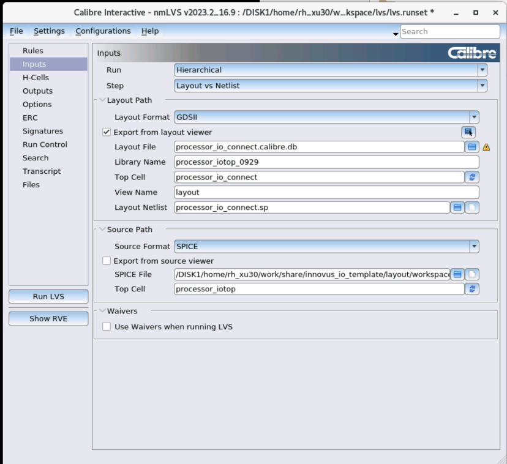
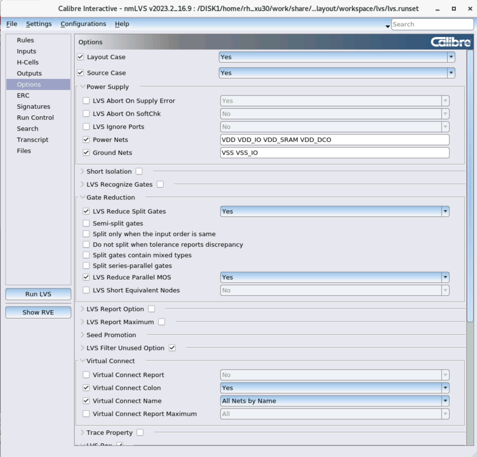

# LVS

LVS全称layout versus schematic，即版图与电路原理图的对比。在模拟流程（即使用virtuoso完成原理图设计和版图设计）中，需要比对一个cell的layout和schematic这两个view是否一致。对于数字流程（使用innovus数字后端生成版图并生成网表），则需要将生成的版图和网表（cdl）进行比对。本文主要是从数字流程的视角来举例。

## 说明文档

用于LVS的规则文件则可以在工艺库目录中找到：`/DISK2/Tech_PDK/TSMC_22NM_RF_ULL/PDK/PDK_20211230_LO_0.8V_2.5V_1P9M_6X1Z1U_UT_ALRDL_StarRC_QRC/Calibre/lvs/calibre.lvs`。在同一个目录下还可以找到一个叫`source.added`的文件，需要手动在cdl网表中include一下：

```spice
.INCLUDE "/DISK2/Tech_PDK/TSMC_22NM_RF_ULL/PDK/PDK_20211230_LO_0.8V_2.5V_1P9M_6X1Z1U_UT_ALRDL_StarRC_QRC/Calibre/lvs/source.added"
```

## 准备工作

1. 确保被检查的版图中，io cell已经和core ring连接好，并且所有pad上已经打上了顶层所有端口（包括电源端口）的标签。

2. 检查用于比对的cdl网表文件，在文件头处需要有`.INCLUDE "/DISK2/Tech_PDK/TSMC_22NM_RF_ULL/PDK/PDK_20211230_LO_0.8V_2.5V_1P9M_6X1Z1U_UT_ALRDL_StarRC_QRC/Calibre/lvs/source.added"`

3. 检查顶层模块端口是否齐全，应该包含所有信号、电源（包括VDD_IO或VDDPST）、地（包括VSS或VSSPST）

4. 在网表部分，不应该包含任何纯物理单元的实例（比如PAD52D6GU，FILLER等），他们没有任何逻辑功能，工艺库也没有为他们提供spi描述，因此可能在lvs中被识别为未定义的子电路导致lvs无法进行。如果出现了这些实例，可以直接删掉。


> 为了从一开始导出cdl就不要包含这些实例，应该合理设置`saveNetlist -excludeCellInst`选项。

5. 此外，重点检查所有io cell的端口是否完整且正确的连接，例如PVDD1DGZ单元（有VDD, VSS, VDDPST, VSSPST, POC这些端口），PVDD2ANA（有VDD, VSS, VDDPST, VSSPST, POC, AVDD）这些端口都得连好。如果没连好。手动将这些信号连接到对应的端口上。


> 为了从一开始导出cdl就连接完整，应该在数字后端poerplan的时候就完整设置globalNetConnect，不要忘记连AVDD和POC。容易忽略的是POC，因此可以在init_pwr_net时就加上POC，然后再`globalNetConnect POC -type pgpin -pin POC -all`

6. 如果virtuoso界面左上角工具栏没有calibre选项卡，参见[virtuoso](./virtuoso.md/##在virtuoso显示calibre选项卡)

## 操作步骤

1. 打开需要做lvs的cell的版图，在上方菜单栏中选择 `Calibre -> Run nmLVS`。打开界面后会弹出窗口让你选择recent runset（如果是第一次使用则为空），你可以选择load其中一个runset，也可以不选，重新开始配置。
2. `Rules`选项卡中LVS Rule File选择工艺库中提供的lvs规则文件，例如`/DISK2/Tech_PDK/TSMC_22NM_RF_ULL/PDK/PDK_20211230_LO_0.8V_2.5V_1P9M_6X1Z1U_UT_ALRDL_StarRC_QRC/Calibre/lvs/calibre.lvs`。lvs规则文件不像drc文件那样需要修改文件头中的各种配置。
3. `Rules`选项卡中Run Directory请选择一个专门的文件夹，因为lvs会在该目录下生成很多文件。建议是新建一个文件夹。
4. `Inputs`选项卡中，`Run`可以选择hierarchical和flat，这是两种不同的验证方式，但是原则上来讲，两种验证方法对于 LVS 正确性没有影响。`Step`选择默认的layout vs netlist

> 层次化(hierarchical)验证保留了设计的层次结构，每个模块在验证过程中都作为一个独立的单元进行检查。层次化验证速度更快，可以减少相同子模块的重复验证计算。扁平化(flat)验证将设计的所有模块展开为一个平面结构，即所有模块的内部细节都被展开并作为一个整体进行检查。检查会更加全民啊，但是速度较慢、内存占用更高。

5. `Inputs`选项卡中`layout`相关的部分已经自动填充好，检查是否正确即可（如果就是在要检查lvs的cell的版图下打开的话一般就没问题）。在calibre2023版本（2021的版本中似乎没有这个选项所以不用管）的界面中会出现让你勾选`export from layout viewer"的选项，这个可以不选。如果勾选的话，下面的layout netlist文件是根据layout会自己生成的文件，并不需要提前准备一个已经存在的文件供读取。


6. `Inputs`选项卡中`netlist`相关的部分(在2023版本界面中称为`source`)，需要选择一个网表文件，这个文件就是lvs中的s（schematic），可以是verilog、vhdl、spice等格式。这里选择spice（不论是对于virtuoso中的schemtic还是数字后端生成的cdl文件）。spice file就选择数字后端生成的cdl文件。对于2023版本界面的不用勾选export from source viewer，这个选项是用于要比对的原理图来自virtuoso schematic的，如果勾选了，也是用于自动生成schematic对应的网表文件，所以无需准备一个已经存在的文件供读取。但是对于数字后端出的cdl，就不要勾选这个选项了。



7. `Options`选项卡中，supply部分需要填写所有的pg端口名称



> 如果没有`Options`选项卡，对于2021版本界面则需要在lvs界面左上方菜单点击 Setup并勾选 LVS Options，对于2023版本界面则是settings--> show pages--> options，然后就可以看到options选项卡了

8. `Options`选项卡中在 `Connect` 中勾选 Connect nets with colon，以及 Don't connect nets by name，如下所示


9. `Options`选项卡中在`(gate->)filter unused options`勾选Q选项，即 `MOS, bipolar, resistor, capacitor, and diode devices with no general paths to any non-power/ground pads`.


> 此前 Innovus 中进行物理实现时，添加了许多 Physical-only cells，而且在 Signoff 阶段生成门级网表时设置了 saveNetlist -excludeCellInst 选项，因此在 CDL 网表中没有这些特殊的标准单元，例如 End-Cap，Well-Tap 等单元，而版图中却实际包含它们，因此如果没有选择这个Q选项，LVS 物理验证会报错。

10. `Options`选项卡中在`LVS Box`中可以选择添加模块“黑盒”，即不展开其内部结构进行详细检查，而是只检查其外部连接是否正确。使用 LVS Box 可以简化和加速 LVS 检查过程，特别是在处理复杂设计时，但是同时可以确保这些模块的外部连接是正确的。需要在 GUI 界面中手动添加想设置为 Box 的子模块名称，版图中的名称需要和原理图（网表）中的名称保持一致。例如此处想将`sram_sp_2048_32`作为一个黑盒子，即不检查其内部lvs，并且已经保证在版图和网表中该模块名称一致，则可以这样设置：


> 在版图和网表中该模块名称一致（假设都叫AAA）时，Parameters（或Value）可以写为`AAA AAA`也可以写为`AAA`。假如该模块在版图和网表中的名称不一样，则比较复杂，需要使用到h cell的声明，具体可以看[LVS  Box使用](https://blog.eetop.cn/blog-1550883-6944231.html)

11. `Run Control`选项卡中可以根据允许使用的cpu核数来设置多线程并行，从而加快检查速度。


12. 其他设置可以保持默认状态。点击Run LVS即开始lvs检查。

13. 如果要保存这一组设置，可以在 Calibre Interactive 上方菜单栏选择 File -> Save Runset As 可以将 以上对于 LVS 物理验证的配置（包括输入读取文件路径、LVS Options 选项等）统一写入到一个 Runset 文件中（该文件可以不存在）。 

14. 通过的lvs应该如下图。可以看到`sram_sp_2048_32`作为一个黑盒处理。


## LVS Debug
