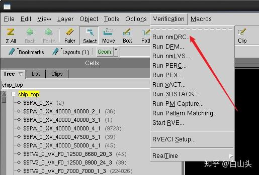
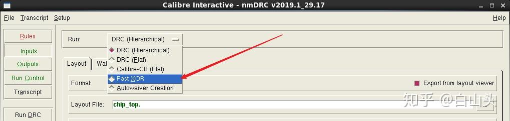
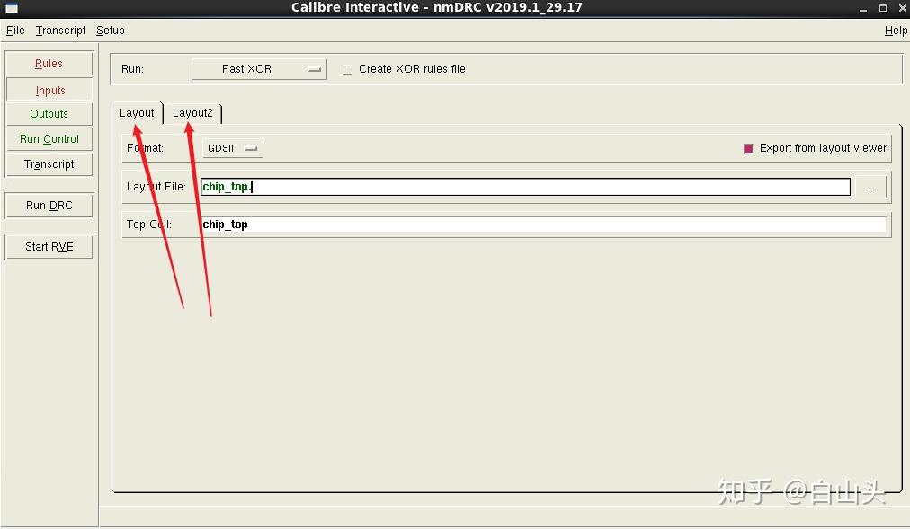
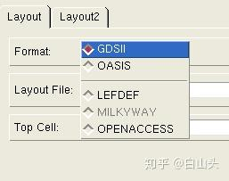
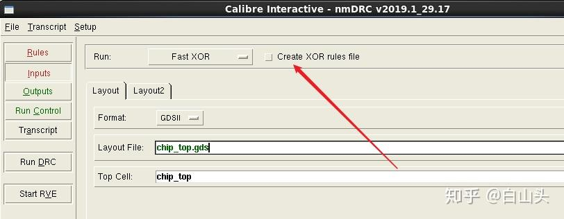

# Calibredrv

## lvl 版图比对

### 命令行形式

```bash
# define source and target
setenv SOURCE /work/home/rhxu/SMIC2025.bk/I0_TOP_before_rm.gds
setenv TARGET /work/home/rhxu/SMIC2025.bk/top_cadence/I0_TOP_final_0305.gds
SetenV SOURCE_MODULE NAME IO_TOP
SetenV TARGET_MODULE NAME IO_TOP

# generate xor rules for comparing
dbdiff -system GDS -design $SOURCE $SOURCE_MODULE_NAME -refsystem GDS -refdesiGn $TARGET $TARGET_MODULE_NAME -write_xor_rules xor.rules -turbo

# generate comparison gds
calibre -drc -hier -turbo -turbo_all -64 -hyper -fx xor.rules
```

然后在当前目录下会生成一个xor.rules.gds文件，可以通过virtuoso或者calibredrv等工具查看版图比对结果

### 图形界面形式

1. 首先用calibredrv打开任意一个gds版图文件

```bash
b calibredrv

# calibredrv shell, starting with a %
set gdsfile "/work/home/rhxu/I0_TOP_final.gds"
set L [ layout create $gdsfile -dt_expand -preservePaths -preserveTextAttributes -preserveProperties]
```

也可以在virtuoso的选项卡打开Calibre。注意可能需要在工作目录下加一个cds.init文件才可以让calibre选项显示。

2. 打开nmDRC界面



3. 选择fast xor



4. 填写两个需要比对的layout gds和top cell名称,记得勾选生成xor rules文件





5. Run DRC并在RVE中查看结果

