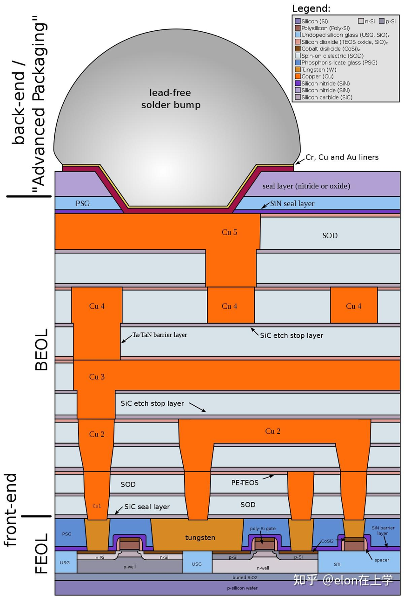
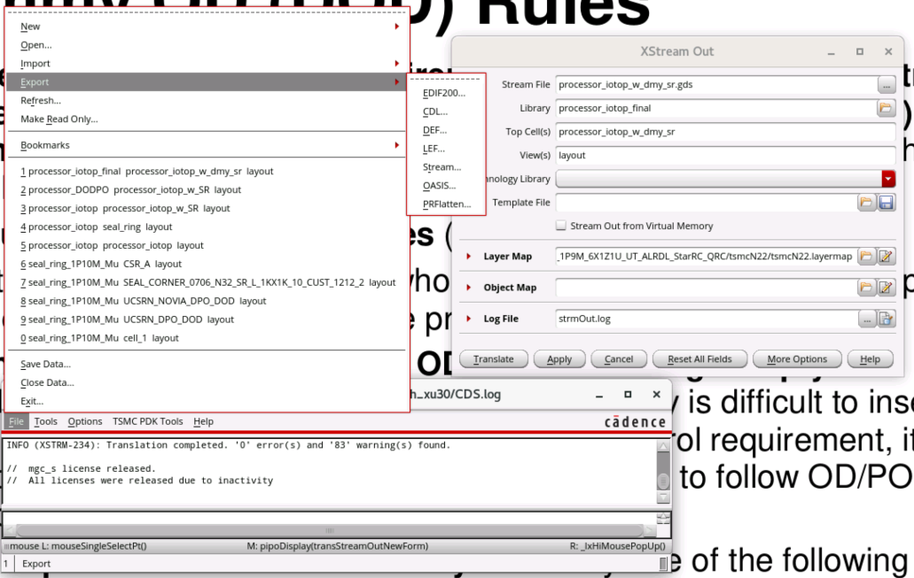
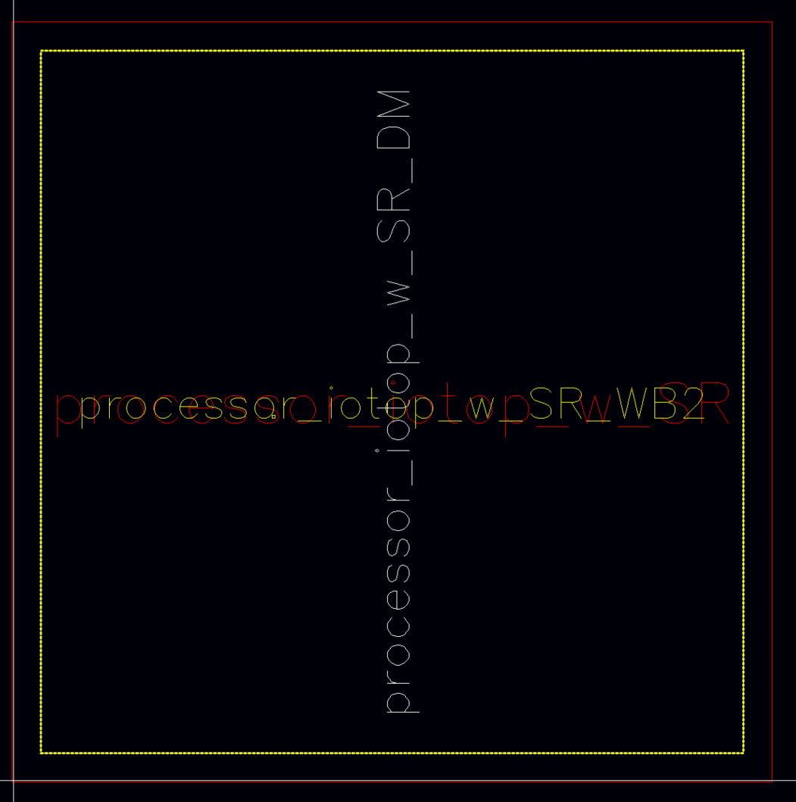
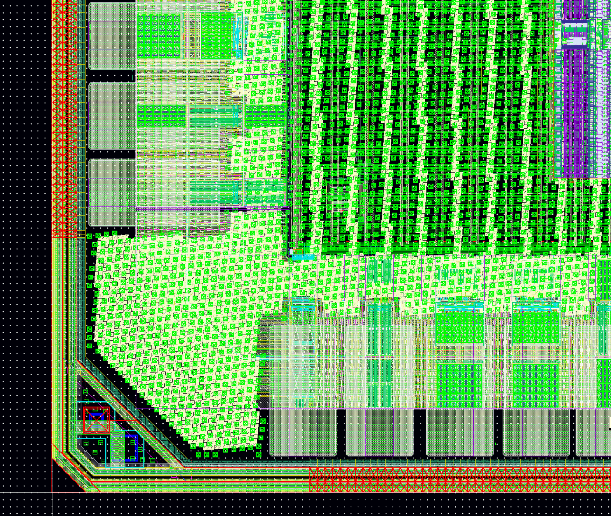

# Dummy

## 概述

Dummy 是指一个没有功能的半导体元件或结构，通常用于填充芯片中未使用的区域，以确保其它部分的结构和性能能够得到保持。这些填充物通常是由与芯片相同的材料制成，但是它们不会被用于任何电路或逻辑功能。
添加Dummy的作用有

- 1、增强结构强度: Dummy可以填充芯片中的空白区域，调整物理结构，从而增加晶圆边缘的机械强度，减少在划片和后续封装过程中的芯片损坏。
- 2、保持工艺一致性: 在晶圆的边缘或切割道中添加Dummy有助于保持整个晶圆上工艺的均匀性，因为它们可以模拟中心区域的密集电路布局，从而减少工艺变化。
- 3、保证可制造性: Dummy可以避免在制造过程中会因为曝光过渡或不足而导致的蚀刻失败，从而缩小由于光刻过程中光的反射与衍射而影响到关键元器件物理图形的精度进又而影响其尺寸，从而保证可制造性。
- 4、控制应力和翘曲: Dummy可以帮助平衡晶圆上的应力分布，减少由于工艺引起的晶圆翘曲。
- 5、避免杂波的影响: Dummy还可以避免芯片中杂波对关键信号的影响，比如在关键信号的周围加上dummy routing layer或者dummy元器件。

### 说明文档

T1CentOS/T2CentOS服务器上，在工艺库安装路径`/DISK2/Tech_PDK/TSMC_22NM_RF_ULL/Doc/CL-DR/TN22CLDR001_1_5.pdf`第6节详细讲述了dummy相关规则。工艺库中的具体相关的脚本在`/DISK2/Tech_PDK/TSMC_22NM_RF_ULL/Doc/CL-DR/Dummy_FEOL_Calibre_22nm_001_V13a`和`/DISK2/Tech_PDK/TSMC_22NM_RF_ULL/Doc/CL-DR/Dummy_BEOL_Calibre_22nm_001_V13a`。

该脚本也可以在示例pr模板`/DISK1/home/rh_xu30/work/share/innovus_io_template/layout/dummy`中找到。会用到的脚本文件有两个：`Dummy_BEOL_Calibre_22nm_001.13a`,`Dummy_FEOL_Calibre_22nm_001.13a`。

### FEOL，BEOL区别

前道工艺（FEOL）是集成电路制造的第一个主要阶段，主要目标是在半导体晶圆上完成各类器件的制造和图案化。这些器件包括晶体管、电容、电阻等，是构成电路功能的基本单元。FEOL从裸片晶圆开始，最终完成所有器件的加工和结构搭建。FEOL中常见的关键工艺步骤包括

- 氧化（Oxidation）：在硅晶圆表面形成氧化层（如SiO₂），作为晶体管栅极绝缘体或掩膜层。
- 光刻（Photolithography）：使用光刻技术定义器件的精确几何形状。
- 刻蚀（Etching）：通过湿法或干法刻蚀去除不需要的材料，形成所需图案。
- 离子注入（Ion Implantation）：将掺杂元素（如磷、硼）植入硅中，改变其导电特性，形成N型或P型区域。
- 薄膜沉积（Deposition）：沉积导电或绝缘材料（如多晶硅、氮化硅等），用于形成器件的不同部分。
- 退火（Annealing）：通过高温加热修复晶体结构，并激活掺杂的离子。

后道工艺（BEOL）是集成电路制造的第二个主要阶段，主要目标是通过沉积金属互连层，将前道制造的器件连接起来，形成完整的电路。这一阶段从器件图案化完成后开始，直到整个电路制造完成。
以下是BEOL中常见的工艺步骤：

- 介电层沉积（Dielectric Deposition）：沉积绝缘材料（如SiO₂或低k材料），用于隔离金属层。
- 金属沉积（Metal Deposition）：沉积金属材料（如铝、铜），形成电路的导线。
- 化学机械抛光（CMP）：通过抛光平整金属和介电层表面，为多层互连准备平整基底。
- 通孔（Via）制作：在不同金属层之间形成垂直连接的通孔。
- 多层金属互连：通过多次沉积和刻蚀，构建复杂的金属互连网络。



## 步骤

### 1. 导出gds

将需要加dummy的版图所在的library在virtuoso中stream out，生成gds文件。记该文件路径为path/to/origin/gds



## 2. 运行Dummy_FEOL_Calibre_22nm_001.13a

按照文件中的说明更改开头设置部分

```bash
/* SWITCH DEFINITION START */

//   ENVIRONMENT SETUP
//-----------------------
PRECISION    1000
RESOLUTION      5                               // tool resolution

LAYOUT SYSTEM GDSII
LAYOUT PATH "processor_iotop_wo_dmy_w_sr.gds"   // GDS file name
LAYOUT PRIMARY "processor_iotop_w_SR"           // top cell name
DRC RESULTS DATABASE "DODPO.gds" GDSII          // Output topcell name is the same as the original layout,
                                                // please do not stream-in to the library of original design.
//DRC RESULTS DATABASE "DODPO.gds" GDSII _DODPO // Output topcell name will be suffixed by _DODPO
DRC SUMMARY REPORT "DODPO.sum"
DRC MAXIMUM RESULTS ALL
DRC KEEP EMPTY NO
//LAYOUT ALLOW DUPLICATE CELL YES
//LAYOUT ERROR ON INPUT NO

//******* User defined chip area  **************************************
//#DEFINE UseprBoundary     // use layer prBoundary(108) to define the chip window
//#DEFINE ChipWindowUsed    // use specified coordinate to define the chip window
VARIABLE xLB   0.0          // x-coordinate of left-bottom corner for user defined chip window
VARIABLE yLB   0.0          // y-coordinate of left-bottom corner for user defined chip window
VARIABLE xRT   671.2       // x-coordinate of right-top corner for user defined chip window
VARIABLE yRT   671.2       // y-coordinate of right-top corner for user defined chip window
LAYER ChipWindow 500        // layer number for constructing chip boundary

//******* Option for chip corner empty area definition ***********************
//#DEFINE dmOnCorner        // turn on to insert dummy inside Chip Corner (apply to cell or macro level design)
#DEFINE WithSealring      // already with the sealring structure assembled?

//******* Options for output structure ****************
#DEFINE USE_AREF            // use AREF output
//#DEFINE USE_AUTOREF       // use AUTOREF output
VARIABLE PRE_FIX "TSMC"     // output cell name prefix when using AUTOREF output

//******* Select patterns to be filled ******************************************
#DEFINE FILL_SRDOD_SRDPO    // insert MOS-like patterns / SR_DOD / SR_DPO
#DEFINE FILL_TCD_PATTERN    // insert dummy TCD patterns
#DEFINE FILL_DOD_DPO        // insert Standard cell-like patterns / DOD / DPO / PP
#DEFINE InsideINDDMY_HD_MD  // insert DOD/DPO inside INDDMY_HD/INDDMY_MD

#DEFINE COMBINE_DODPO_DMVIA // combine dummy OD/PO and dummy Metal/Via utilities
//#DEFINE TOP_M5                      // Connect TOP metal M5 to AP
//#DEFINE TOP_M6                      // Connect TOP metal M6 to AP
//#DEFINE TOP_M7                      // Connect TOP metal M7 to AP
//#DEFINE TOP_M8                      // Connect TOP metal M8 to AP
#DEFINE TOP_M9                      // Connect TOP metal M9 to AP
//#DEFINE TOP_M10                      // Connect TOP metal M10 to AP
//#DEFINE TOP_M11                      // Connect TOP metal M11 to AP
//#DEFINE TOP_M12                      // Connect TOP metal M12 to AP
//#DEFINE TOP_M13                      // Connect TOP metal M13 to AP
//#DEFINE USE_SD_VOLTAGE_ON_CORE_TO_IO_NET  // Turn on to use S/D voltage on net without voltage text/marker and connect to IO & core MOS simultaneously
//#DEFINE USE_IO_VOLTAGE_ON_CORE_TO_IO_NET  // Turn on to use IO voltage on net without voltage marker and connect to IO & core MOS simultaneously

/* SWITCH DEFINITION END */
```

然后在终端运行

```
calibre -hyper -turbo -hier -drc Dummy_FEOL_Calibre_22nm_001.13a |tee run.log
```

就会生成一个名为DODPO.gds（按照脚本里自己定义的输出文件名）的版图文件。这个版图文件的顶层cell名跟原输入gds的top cell名称一样，但是它只包含了FEOL的dummy部分，并不没有包含原gds的信息。

### 3. 运行Dummy_BEOL_Calibre_22nm_001.13a

同理，修改后端dummy脚本的文件头。

```bash
/* SWITCH DEFINITION START */
#IFNDEF COMBINE_DODPO_DMVIA

//   ENVIRONMENT SETUP
//-----------------------
PRECISION    1000
RESOLUTION      5                               // tool resolution

LAYOUT SYSTEM GDSII
LAYOUT PATH "processor_iotop_wo_dmy_w_sr.gds"
LAYOUT PRIMARY "processor_iotop_w_SR"

//DRC RESULTS DATABASE "DM.gds" GDSII             // Output topcell name is the same as the original layout,
                                                // please do not stream-in to the library of original design.
DRC RESULTS DATABASE "DM.gds" GDSII _DM       // Output topcell name will be suffixed by _DM
DRC SUMMARY REPORT "drc.sum"

DRC MAXIMUM RESULTS ALL
DRC KEEP EMPTY NO
//LAYOUT ALLOW DUPLICATE CELL YES
//LAYOUT ERROR ON INPUT NO

//******* User defined chip area  **************************************
//#DEFINE UseprBoundary     // use layer prBoundary(108) to define the chip window
//#DEFINE ChipWindowUsed    // use specified coordinate to define the chip window
VARIABLE xLB   0.0          // x-coordinate of left-bottom corner for user defined chip window
VARIABLE yLB   0.0          // y-coordinate of left-bottom corner for user defined chip window
VARIABLE xRT   671.2       // x-coordinate of right-top corner for user defined chip window
VARIABLE yRT   671.2        // y-coordinate of right-top corner for user defined chip window
LAYER ChipWindow 500        // layer number for constructing chip boundary

//******* Option for chip corner empty area definition ***********************
//#DEFINE dmOnCorner        // turn on to insert dummy inside Chip Corner (apply to cell or macro level design)
#DEFINE WithSealring      // already with the sealring structure assembled?

//******* Options for output structure ****************
#DEFINE USE_AREF            // use AREF output
//#DEFINE USE_AUTOREF       // use AUTOREF output
VARIABLE PRE_FIX "TSMC"     // output cell name prefix when using AUTOREF output
//#DEFINE TOP_M5                      // Connect TOP metal M5 to AP
//#DEFINE TOP_M6                      // Connect TOP metal M6 to AP
//#DEFINE TOP_M7                      // Connect TOP metal M7 to AP
//#DEFINE TOP_M8                      // Connect TOP metal M8 to AP
#DEFINE TOP_M9                      // Connect TOP metal M9 to AP
//#DEFINE TOP_M10                      // Connect TOP metal M10 to AP
//#DEFINE TOP_M11                      // Connect TOP metal M11 to AP
//#DEFINE TOP_M12                      // Connect TOP metal M12 to AP
//#DEFINE TOP_M13                      // Connect TOP metal M13 to AP
#ENDIF
//#DEFINE USE_SD_VOLTAGE_ON_CORE_TO_IO_NET  // Turn on to use S/D voltage on net without voltage text/marker and connect to IO & core MOS simultaneously
//#DEFINE USE_IO_VOLTAGE_ON_CORE_TO_IO_NET  // Turn on to use IO voltage on net without voltage marker and connect to IO & core MOS simultaneously


//******* Select layers to be filled ******************************************
// Note:
// For utility's correct judgement, even if you don't need to fill DMx or DMx_O for some metal layers,
// you must still set the correct metal type for every metal layer.
#DEFINE FILL_DM1            // turn on to fill dummy M1.  Dummy M1 is DM(x) if no thick dummy metal is specified.
 #DEFINE FILL_M1_DTCD       // turn on to fill M1 dummy TCD also
 #DEFINE VERTICAL_DM1       // turn on/off to fill vertical/horizontal dummy M1 and OPC dummy M1
 #DEFINE FILL_indDM1        // turn on to fill dummy M1 in INDDMY_MD/INDDMY_HD region
 //#DEFINE 2K_THICK_My_M1      // turn on to design DM1/OPC_DM1 as 2K thick dummy metal, DM(y)/DM_O(y)
 //#DEFINE 2_6K_THICK_Mxy_M1    // turn on to design DM1 as 2.6K thick dummy metal, DM(xy)
 //#DEFINE 5K_THICK_Myz_M1      // turn on to design DM1 as 5K thick dummy metal, DM(yz)
 //#DEFINE 9K_THICK_Mz_M1      // turn on to design DM1 as 9K thick dummy metal, DM(z)
 //#DEFINE 12K_THICK_Mr_M1     // turn on to design DM1 as 12k thick dummy metal, DM(r)
 //#DEFINE 34K_THICK_Mu_M1     // turn on to design DM1 as 34K thick dummy metal, DM(u)
 
#DEFINE FILL_DM2            // turn on to fill dummy M2.  Dummy M2 is DM(x) if no thick dummy metal is specified.
 #DEFINE FILL_M2_DTCD       // turn on to fill M2 dummy TCD also
 //#DEFINE VERTICAL_DM2     // turn on/off to fill vertical/horizontal dummy M2 and OPC dummy M2
 #DEFINE FILL_indDM2        // turn on to fill dummy M2 in INDDMY_MD/INDDMY_HD region
 //#DEFINE 2K_THICK_My_M2      // turn on to design DM2/OPC_DM2 as 2K thick dummy metal, DM(y)/DM_O(y)
 //#DEFINE 2_6K_THICK_Mxy_M2    // turn on to design DM2 as 2.6K thick dummy metal, DM(xy)
 //#DEFINE 5K_THICK_Myz_M2      // turn on to design DM2 as 5K thick dummy metal, DM(yz)
 //#DEFINE 9K_THICK_Mz_M2      // turn on to design DM2 as 9K thick dummy metal, DM(z)
 //#DEFINE 12K_THICK_Mr_M2     // turn on to design DM2 as 12k thick dummy metal, DM(r)
 //#DEFINE 34K_THICK_Mu_M2     // turn on to design DM2 as 34K thick dummy metal, DM(u)

#DEFINE FILL_DM3            // turn on to fill dummy M3.  Dummy M3 is DM(x) if no thick dummy metal is specified.
 #DEFINE FILL_M3_DTCD       // turn on to fill M3 dummy TCD also
 #DEFINE VERTICAL_DM3       // turn on/off to fill vertical/horizontal dummy M3 and OPC dummy M3
 #DEFINE FILL_indDM3        // turn on to fill dummy M3 in INDDMY_MD/INDDMY_HD region
 //#DEFINE 2K_THICK_My_M3      // turn on to design DM3/OPC_DM3 as 2K thick dummy metal, DM(y)/DM_O(y)
 //#DEFINE 2_6K_THICK_Mxy_M3    // turn on to design DM3 as 2.6K thick dummy metal, DM(xy)
 //#DEFINE 5K_THICK_Myz_M3      // turn on to design DM3 as 5K thick dummy metal, DM(yz)
 //#DEFINE 9K_THICK_Mz_M3      // turn on to design DM3 as 9K thick dummy metal, DM(z)
 //#DEFINE 12K_THICK_Mr_M3     // turn on to design DM3 as 12k thick dummy metal, DM(r)
 //#DEFINE 34K_THICK_Mu_M3     // turn on to design DM3 as 34K thick dummy metal, DM(u)

#DEFINE FILL_DM4            // turn on to fill dummy M4.  Dummy M4 is DM(x) if no thick dummy metal is specified.
 #DEFINE FILL_M4_DTCD       // turn on to fill M4 dummy TCD also
 //#DEFINE VERTICAL_DM4     // turn on/off to fill vertical/horizontal dummy M4 and OPC dummy M4
 #DEFINE FILL_indDM4        // turn on to fill dummy M4 in INDDMY_MD/INDDMY_HD region
 //#DEFINE 2K_THICK_My_M4      // turn on to design DM4/OPC_DM4 as 2K thick dummy metal, DM(y)/DM_O(y)
 //#DEFINE 2_6K_THICK_Mxy_M4    // turn on to design DM4 as 2.6K thick dummy metal, DM(xy)
 //#DEFINE 5K_THICK_Myz_M4      // turn on to design DM4 as 5K thick dummy metal, DM(yz)
 //#DEFINE 9K_THICK_Mz_M4      // turn on to design DM4 as 9K thick dummy metal, DM(z)
 //#DEFINE 12K_THICK_Mr_M4     // turn on to design DM4 as 12k thick dummy metal, DM(r)
 //#DEFINE 34K_THICK_Mu_M4     // turn on to design DM4 as 34K thick dummy metal, DM(u)

#DEFINE FILL_DM5            // turn on to fill dummy M5.  Dummy M5 is DM(x) if no thick dummy metal is specified.
 #DEFINE FILL_M5_DTCD       // turn on to fill M5 dummy TCD also
 #DEFINE VERTICAL_DM5       // turn on/off to fill vertical/horizontal dummy M5 and OPC dummy M5
 #DEFINE FILL_indDM5        // turn on to fill dummy M5 in INDDMY_MD/INDDMY_HD region
 //#DEFINE 2K_THICK_My_M5      // turn on to design DM5/OPC_DM5 as 2K thick dummy metal, DM(y)/DM_O(y)
 //#DEFINE 2_6K_THICK_Mxy_M5    // turn on to design DM5 as 2.6K thick dummy metal, DM(xy)
 //#DEFINE 5K_THICK_Myz_M5      // turn on to design DM5 as 5K thick dummy metal, DM(yz)
 //#DEFINE 9K_THICK_Mz_M5      // turn on to design DM5 as 9K thick dummy metal, DM(z)
 //#DEFINE 12K_THICK_Mr_M5     // turn on to design DM5 as 12k thick dummy metal, DM(r)
 //#DEFINE 34K_THICK_Mu_M5     // turn on to design DM5 as 34K thick dummy metal, DM(u)

#DEFINE FILL_DM6            // turn on to fill dummy M6.  Dummy M6 is DM(x) if no thick dummy metal is specified.
 #DEFINE FILL_M6_DTCD       // turn on to fill M6 dummy TCD also
 //#DEFINE VERTICAL_DM6     // turn on/off to fill vertical/horizontal dummy M6 and OPC dummy M6
 #DEFINE FILL_indDM6        // turn on to fill dummy M6 in INDDMY_MD/INDDMY_HD region
 //#DEFINE 2K_THICK_My_M6      // turn on to design DM6/OPC_DM6 as 2K thick dummy metal, DM(y)/DM_O(y)
 //#DEFINE 2_6K_THICK_Mxy_M6    // turn on to design DM6 as 2.6K thick dummy metal, DM(xy)
 //#DEFINE 5K_THICK_Myz_M6      // turn on to design DM6 as 5K thick dummy metal, DM(yz)
 //#DEFINE 9K_THICK_Mz_M6      // turn on to design DM6 as 9K thick dummy metal, DM(z)
 //#DEFINE 12K_THICK_Mr_M6     // turn on to design DM6 as 12k thick dummy metal, DM(r)
 //#DEFINE 34K_THICK_Mu_M6     // turn on to design DM6 as 34K thick dummy metal, DM(u)

#DEFINE FILL_DM7            // turn on to fill dummy M7.  Dummy M7 is DM(x) if no thick dummy metal is specified.
 #DEFINE FILL_M7_DTCD       // turn on to fill M7 dummy TCD also
 #DEFINE VERTICAL_DM7       // turn on/off to fill vertical/horizontal dummy M7 and OPC dummy M7
 #DEFINE FILL_indDM7        // turn on to fill dummy M7 in INDDMY_MD/INDDMY_HD region
 //#DEFINE 2K_THICK_My_M7      // turn on to design DM7/OPC_DM7 as 2K thick dummy metal, DM(y)/DM_O(y)
 //#DEFINE 2_6K_THICK_Mxy_M7    // turn on to design DM7 as 2.6K thick dummy metal, DM(xy)
 //#DEFINE 5K_THICK_Myz_M7      // turn on to design DM7 as 5K thick dummy metal, DM(yz)
 //#DEFINE 9K_THICK_Mz_M7      // turn on to design DM7 as 9K thick dummy metal, DM(z)
 //#DEFINE 12K_THICK_Mr_M7     // turn on to design DM7 as 12k thick dummy metal, DM(r)
 //#DEFINE 34K_THICK_Mu_M7     // turn on to design DM7 as 34K thick dummy metal, DM(u)

#DEFINE FILL_DM8            // turn on to fill dummy M8.  Dummy M8 is DM(x) if no thick dummy metal is specified.
 //#DEFINE FILL_M8_DTCD       // turn on to fill M8 dummy TCD also
 //#DEFINE VERTICAL_DM8     // turn on/off to fill vertical/horizontal dummy M8 and OPC dummy M8
 #DEFINE FILL_indDM8        // turn on to fill dummy M8 in INDDMY_MD/INDDMY_HD region
 //#DEFINE 2K_THICK_My_M8      // turn on to design DM8/OPC_DM8 as 2K thick dummy metal, DM(y)/DM_O(y)
 //#DEFINE 2_6K_THICK_Mxy_M8    // turn on to design DM8 as 2.6K thick dummy metal, DM(xy)
 //#DEFINE 5K_THICK_Myz_M8      // turn on to design DM8 as 5K thick dummy metal, DM(yz)
 #DEFINE 9K_THICK_Mz_M8      // turn on to design DM8 as 9K thick dummy metal, DM(z)
 //#DEFINE 12K_THICK_Mr_M8     // turn on to design DM8 as 12k thick dummy metal, DM(r)
 //#DEFINE 34K_THICK_Mu_M8     // turn on to design DM8 as 34K thick dummy metal, DM(u)

#DEFINE FILL_DM9          // turn on to fill dummy M9.
 #DEFINE VERTICAL_DM9       // turn on/off to fill vertical/horizontal dummy M9 and OPC dummy M9
 #DEFINE FILL_indDM9        // turn on to fill dummy M9 in INDDMY_MD/INDDMY_HD region
 //#DEFINE 2K_THICK_My_M9      // turn on to design DM9/OPC_DM9 as 2K thick dummy metal, DM(y)/DM_O(y)
 //#DEFINE 2_6K_THICK_Mxy_M9    // turn on to design DM9 as 2.6K thick dummy metal, DM(xy)
 //#DEFINE 5K_THICK_Myz_M9      // turn on to design DM9 as 5K thick dummy metal, DM(yz)
 //#DEFINE 9K_THICK_Mz_M9      // turn on to design DM9 as 9K thick dummy metal, DM(z)
 //#DEFINE 12K_THICK_Mr_M9     // turn on to design DM9 as 12k thick dummy metal, DM(r)
 #DEFINE 34K_THICK_Mu_M9     // turn on to design DM9 as 34K thick dummy metal, DM(u)

//#DEFINE FILL_DM10          // turn on to fill dummy M10.
 //#DEFINE VERTICAL_DM10     // turn on/off to fill vertical/horizontal dummy M10 and OPC dummy M10
 #DEFINE FILL_indDM10        // turn on to fill dummy M10 in INDDMY_MD/INDDMY_HD region
 //#DEFINE 2K_THICK_My_M10      // turn on to design DM10/OPC_DM10 as 2K thick dummy metal, DM(y)/DM_O(y)
 //#DEFINE 2_6K_THICK_Mxy_M10    // turn on to design DM10 as 2.6K thick dummy metal, DM(xy)
 //#DEFINE 5K_THICK_Myz_M10      // turn on to design DM10 as 5K thick dummy metal, DM(yz)
 //#DEFINE 9K_THICK_Mz_M10      // turn on to design DM10 as 9K thick dummy metal, DM(z)
 //#DEFINE 12K_THICK_Mr_M10     // turn on to design DM10 as 12k thick dummy metal, DM(r)
 //#DEFINE 34K_THICK_Mu_M10     // turn on to design DM10 as 34K thick dummy metal, DM(u)

//#DEFINE FILL_DM11          // turn on to fill dummy M11.
 #DEFINE VERTICAL_DM11       // turn on/off to fill vertical/horizontal dummy M11 and OPC dummy M11
 #DEFINE FILL_indDM11        // turn on to fill dummy M11 in INDDMY_MD/INDDMY_HD region
 //#DEFINE 2K_THICK_My_M11      // turn on to design DM11/OPC_DM11 as 2K thick dummy metal, DM(y)/DM_O(y)
 //#DEFINE 2_6K_THICK_Mxy_M11    // turn on to design DM11 as 2.6K thick dummy metal, DM(xy)
 //#DEFINE 5K_THICK_Myz_M11      // turn on to design DM11 as 5K thick dummy metal, DM(yz)
 //#DEFINE 9K_THICK_Mz_M11      // turn on to design DM11 as 9K thick dummy metal, DM(z)
 //#DEFINE 12K_THICK_Mr_M11     // turn on to design DM11 as 12k thick dummy metal, DM(r)
 //#DEFINE 34K_THICK_Mu_M11     // turn on to design DM11 as 34K thick dummy metal, DM(u)

//#DEFINE FILL_DM12          // turn on to fill dummy M12.
 //#DEFINE VERTICAL_DM12     // turn on/off to fill vertical/horizontal dummy M12 and OPC dummy M12
 #DEFINE FILL_indDM12        // turn on to fill dummy M12 in INDDMY_MD/INDDMY_HD region
 //#DEFINE 2K_THICK_My_M12      // turn on to design DM12/OPC_DM12 as 2K thick dummy metal, DM(y)/DM_O(y)
 //#DEFINE 2_6K_THICK_Mxy_M12    // turn on to design DM12 as 2.6K thick dummy metal, DM(xy)
 //#DEFINE 5K_THICK_Myz_M12      // turn on to design DM12 as 5K thick dummy metal, DM(yz)
 //#DEFINE 9K_THICK_Mz_M12      // turn on to design DM12 as 9K thick dummy metal, DM(z)
 //#DEFINE 12K_THICK_Mr_M12     // turn on to design DM12 as 12k thick dummy metal, DM(r)
 //#DEFINE 34K_THICK_Mu_M12     // turn on to design DM12 as 34K thick dummy metal, DM(u)

//#DEFINE FILL_DM13          // turn on to fill dummy M13.
 #DEFINE VERTICAL_DM13       // turn on/off to fill vertical/horizontal dummy M13 and OPC dummy M13
 #DEFINE FILL_indDM13        // turn on to fill dummy M13 in INDDMY_MD/INDDMY_HD region
 //#DEFINE 2K_THICK_My_M13      // turn on to design DM13/OPC_DM13 as 2K thick dummy metal, DM(y)/DM_O(y)
 //#DEFINE 2_6K_THICK_Mxy_M13    // turn on to design DM13 as 2.6K thick dummy metal, DM(xy)
 //#DEFINE 5K_THICK_Myz_M13      // turn on to design DM13 as 5K thick dummy metal, DM(yz)
 //#DEFINE 9K_THICK_Mz_M13      // turn on to design DM13 as 9K thick dummy metal, DM(z)
 //#DEFINE 12K_THICK_Mr_M13     // turn on to design DM13 as 12k thick dummy metal, DM(r)
 //#DEFINE 34K_THICK_Mu_M13     // turn on to design DM13 as 34K thick dummy metal, DM(u)


//******* Option to output old metal datatype of dummy metal ***************************
//#DEFINE OLD_METAL_SCHEME  // turn on to output non-OPC dummy metal in GDS file with
                            // datatype 1 for all thick metal

/* SWITCH DEFINITION END */
```

然后在终端运行

```bash
calibre -hyper -turbo -hier -drc Dummy_BEOL_Calibre_22nm_001.13a |tee run.log
```

就会生成一个名为DM.gds（按照脚本里自己定义的输出文件名）的版图文件。这个版图文件的顶层cell名跟原输入gds的top cell名称一样，但是它只包含了BEOL的dummy部分，并不没有包含原gds的信息。

### 4. merge原gds和两个dummy gds

现在需要将原gds和FEOL dummy gds和BEOL dummy gds合并。在终端运行

```bash
#calibredrv -a layout filemerge -in file1.gds -in file2.gds -rename -createtop new_top_cell_name -out out.gds
calibredrv -a layout filemerge -in processor_iotop_wo_dmy_w_sr.gds -in DM.gds -in DODPO.gds -rename -createtop processor_iotop_w_dmy_sr -out processor_iotop_w_dmy_sr.gds
```

即可生成processor_iotop_w_dmy_sr.gds的最终版图文件。导入到virtuoso观察



可以发现在原gds（顶层cell为processor_iotop_w_SR）基础上，多了processor_iotop_w_SR_WB2和processor_iotop_w_SR_DM两个cell。这三者merge起来就是加了dummy的顶层了。



## bash脚本一步到位版

在`/DISK1/home/rh_xu30/work/share/innovus_io_template/layout/dummy`中，准备好需要加dummy的原gds，然后修改好`Dummy_BEOL_Calibre_22nm_001.13a`,`Dummy_FEOL_Calibre_22nm_001.13a`。在终端运行run_Dummy脚本文件：

```bash
#!/bin/csh -f

#generate dummy metal & dummy odpo gds
calibre -hyper -turbo -hier -drc Dummy_FEOL_Calibre_22nm_001.13a |tee run.log # DODPO.gds generated
calibre -hyper -turbo -hier -drc Dummy_BEOL_Calibre_22nm_001.13a |tee run.log # DM.gds generated

#merge gds
#calibredrv -a layout filemerge -in file1.gds -in file2.gds -rename -createtop new_top -out out.gds
calibredrv -a layout filemerge -in <origin_gds>.gds -in DM.gds -in DODPO.gds -rename -createtop <new_top_cell_name> -out <final_gds>.gds
```

尖括号中的需要自行修改，并且和`Dummy_BEOL_Calibre_22nm_001.13a`,`Dummy_FEOL_Calibre_22nm_001.13a`。在终端运行run_Dummy脚本文件中做好对应。
