# 使用Calibre抽取寄生参数

完成模拟模块的版图后，可以根据其版图信息抽取RC寄生参数，用于更精确的仿真，该过程称为后仿（相较于使用不含layout信息的schematic进行仿真即前仿）。因此后仿的第一步就是提取出包含有寄生参数的网表。

## 准备工作

### schematic/layout

版图和对应的电路或者网表（确保lvs可以通过后做pex，有时lvs过了，但是有需要修复的软连接错误时pex也时无法进行的，要先修掉后才能做，但不是所有软连接都需要修复，比如小IP的tap软连接就无需修复）

### pex规则文件

calibre是mentor的工具，抽取寄生参数使用的是XRC，其规则文件.rcx可以去pdk路径下寻找。

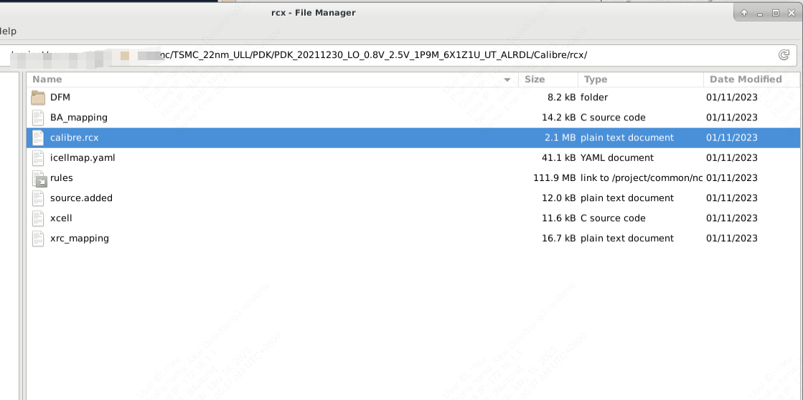

### 在virtuoso显示calibre选项卡

如果virtuoso界面没有calibre选项卡，则可以在工作目录下创建一个.cdsinit文件并写入以下内容：

```text
;;;;;;;;;;;;;;;;;;;;;;;;;;;;;;;;;;;;;;;;;;;;;;;;;;;;;;;;;;;;;;;;;;;;;;;;;;;;;;;;;

;
; check CALIBRE_HOME
;
cal_home=getShellEnvVar("CALIBRE_HOME")
if( cal_home==nil then
    cal_home=getShellEnvVar("MGC_HOME")
    if( cal_home!=nil then
        printf("// CALIBRE_HOME environment variable not set; setting it to value of MGC_HOME\n");
    )
)

if( cal_home!=nil && isDir(cal_home) && isReadable(cal_home) then

    ; Load calibre.skl or calibre.4.3.skl, not both!

    if( getShellEnvVar("MGC_CALIBRE_REALTIME_VIRTUOSO_ENABLED") && 
        getShellEnvVar("MGC_REALTIME_HOME") && dbGetDatabaseType()=="OpenAccess" then
      load(strcat(getShellEnvVar("MGC_REALTIME_HOME") "/lib/calibre.skl"))
    else
      ; Load calibre.skl for Cadence versions 4.4 and greater
      load(strcat(cal_home "/lib/calibre.skl"))
    )

    ;;;;Load calibre.4.3.skl for Cadence version 4.3
    ;;; load(strcat(cal_home "/lib/calibre.4.3.skl"))

else

    ; CALIBRE_HOME is not set correctly. Report the problem.

    printf("//  Calibre Error: Environment variable ")

    if( cal_home==nil || cal_home=="" then
        printf("CALIBRE_HOME is not set.");
    else
        if( !isDir(cal_home) then
            printf("CALIBRE_HOME does not point to a directory.");
        else
            if( !isReadable(cal_home) then
                printf("CALIBRE_HOME points to an unreadable directory.");
            )
        )
    )
    printf(" Calibre Skill Interface not loaded.\n")

    ; Display a dialog box message about load failure.

    hiDisplayAppDBox(
        ?name           'MGCHOMEErrorDlg
        ?dboxBanner     "Calibre Error"
        ?dboxText       "Calibre Skill Interface not loaded."
        ?dialogType     hicErrorDialog
        ?dialogStyle    'modal
       ?buttonLayout   'Close
    )
)

;;;;;;;;;;;;;;;;;;;;;;;;;;;;;;;;;;;;;;;;;;;;;;;;;;;;;;;;;;;;;;;;;;;;;;;;;;;;;;;;;
```

这样就可以调用calibre的功能了。点击`run PEX`按钮。

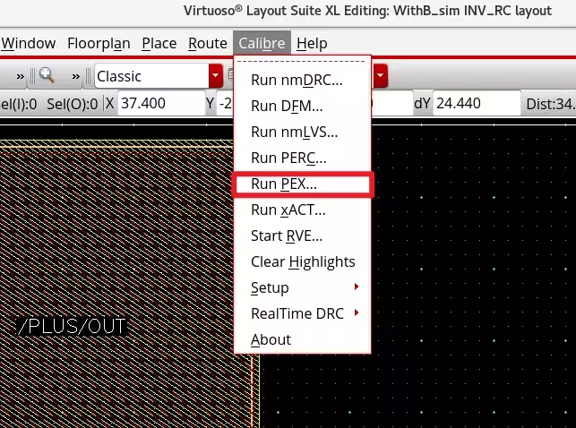

## 设置规则

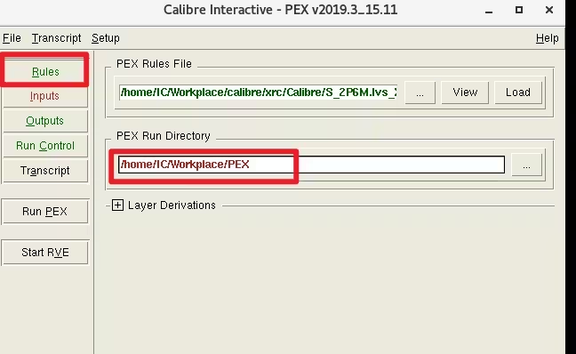

`pex rules file`选择工艺库中找到的.rcx文件。`run directory`建议是在工作目录下建一个空文件夹。

## 设置输入

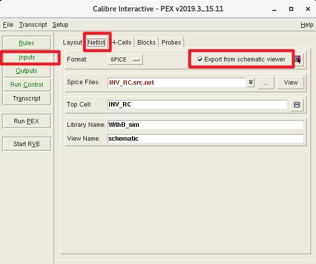

在Netlist选项卡中，其他都不用改，勾选上export from schematic view

## 设置输出

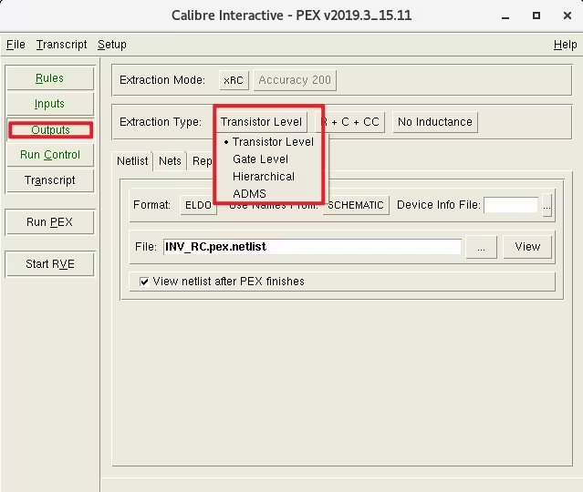

设计中常用的两种提取方式是Transistor Level和gate level提取，两者的区别如下：

- TransistorLevel提取又称为flatten提取，它是把版图TOP全部打散后的寄生参数提取，精度最高，提取速度慢；

- GateLevel提取会把版图Top到Xcells边界处的寄生进行提取，而不打散Xcells。该方式会忽略Xcell内部的寄生，提取速度较快。该提取方式一个典型的用途是防止MOM电容的重复提取发生，但是需要在Xcells中定义MOM电容。Xcells可在下图中的菜单栏中进行指定，一般厂商会提供对应的文件。

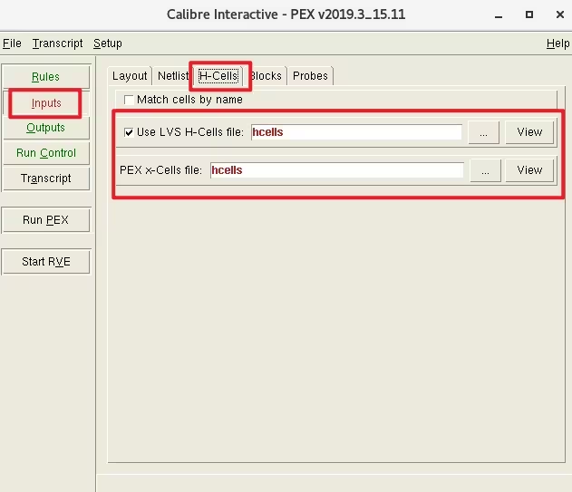

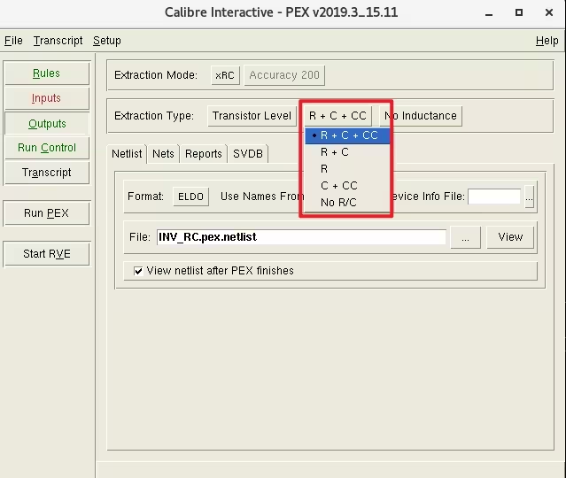

根据电路的需求，可以选择对应的寄生提取类型。

R代表寄生电阻，C代表节点对地的寄生电容，CC表示节点与节点之间的寄生电容。由于提R时会增加电路的节点个数，而仿真器的运算速度与电路节点数量正相关，故电路规模较大时一般选择C+CC的方式以加快验证。

NO R/C虽然不提取版图上的寄生电阻电容，但会引入MOS管的高阶效应（如WPE、STI等）以及相关的寄生二极管。

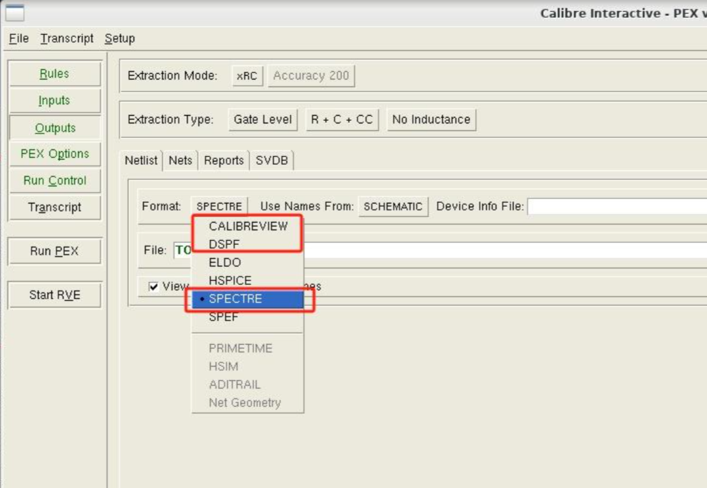

`Use Names From`选`SCHEMATIC`. `Format`选择`SPECTRE`或者`CALIBREVIEW`.

## 设置pex options

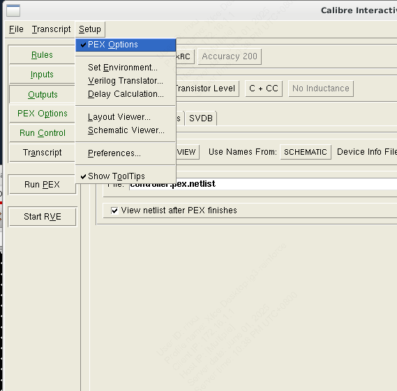

点击Setup中的PEX options来显示PEX options选项卡。

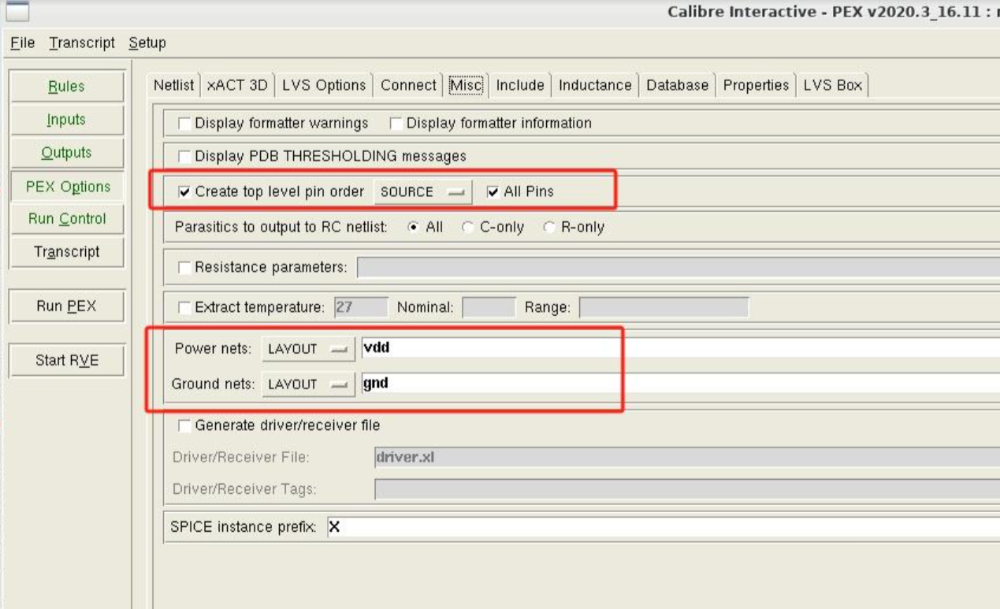

在Misc选项卡中，把Layout的电源和地加上，把“Create top level pin order”勾上，选择“source”，勾上“All Pins”。这一步对后面的后仿很重要。

在LVS Option选项卡中填写之前LVS时的设置，如果filter Unused Device Options不跟过lvs时一致会导致寄生参数提取报warning，比如比lvs多设置过滤项会导致部分抽提器件找不到报warning.

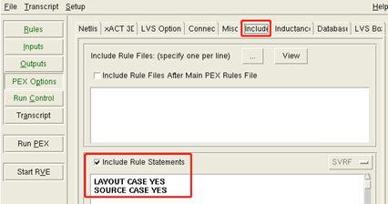

Include选项卡填写LAYOUT CASE YES and SOURCE CASE YES,如图，否则版图中的小写字母pin会报错。

## 设置run control多线程

## Run PEX

## Calibre view setup（如果format选择了CALIBREVIEW）

如果format选择了CALIBREVIEW，则PEX跑完后会自动弹出`Calibre view setup`窗口。填写如下：

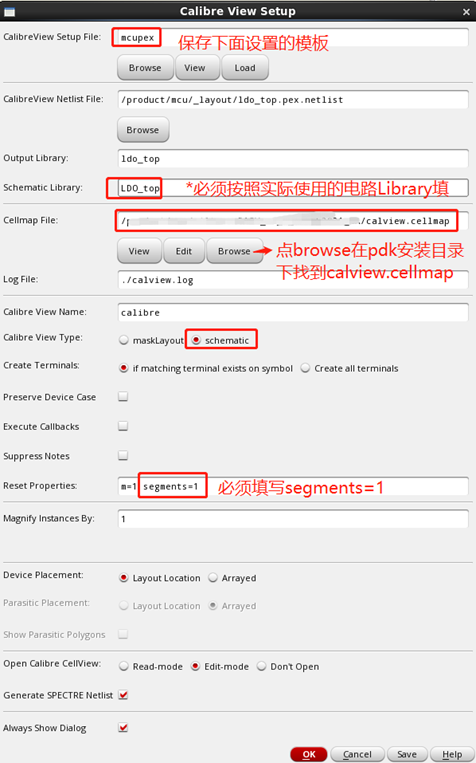

setup file类似runset，可以自己新建一个空文件用于指定。output library则是calibre view生成所在的cell所在的lib，建议填写testbench中调用symbol的cell所在的lib。schematic library则是需要填写cell schematic所在的lib。cellmap可以去pdk中寻找calview.cellmap文件或者icellmap.yaml文件。Segments=1必须添加，否则电阻会按串提取。

点击OK后会生成calibre view文件，这个过程可能导致所有virtuoso界面卡住，不要着急，耐心等待，不要强制关闭virtuoso。完成后会出现如下提示，请确保error和warning全部为0.

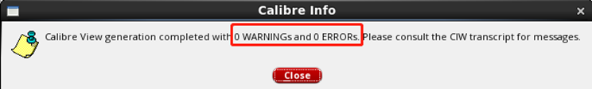

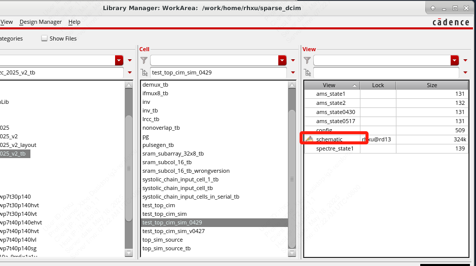