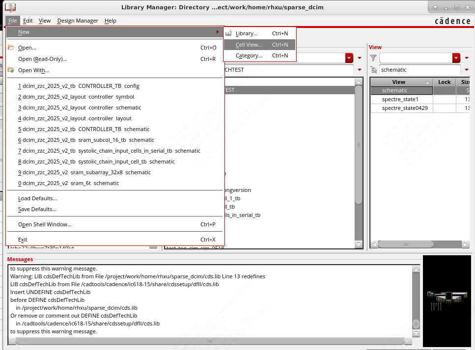
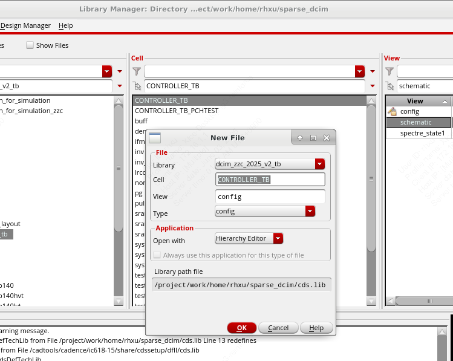
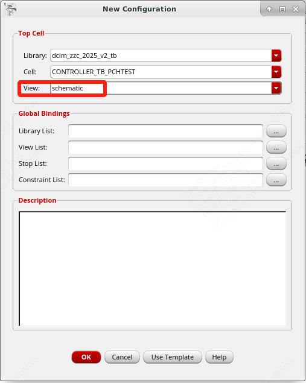
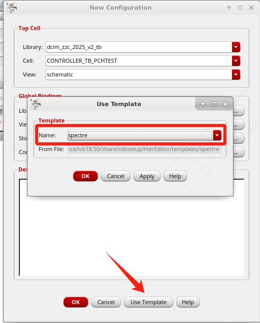
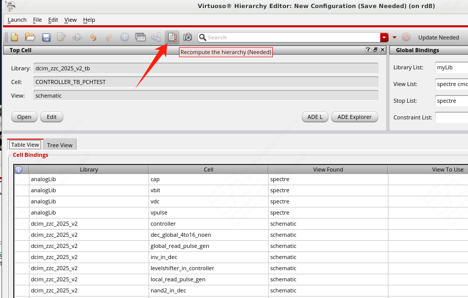
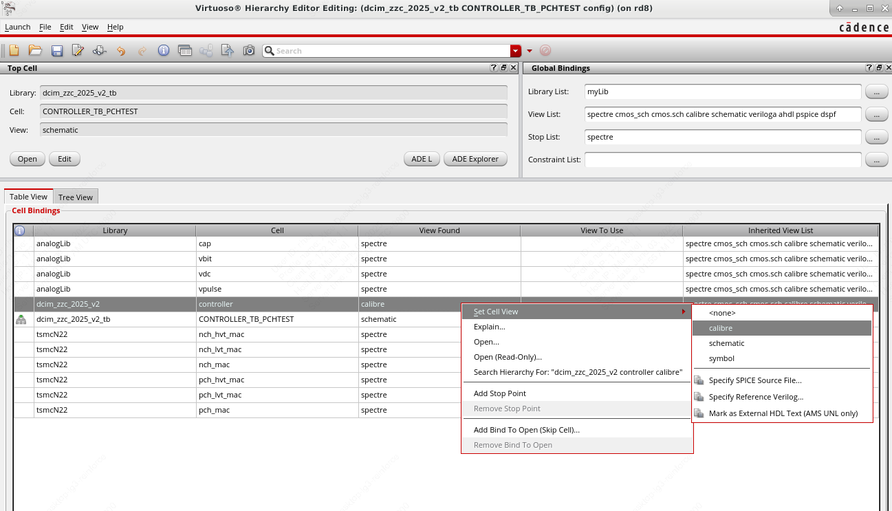
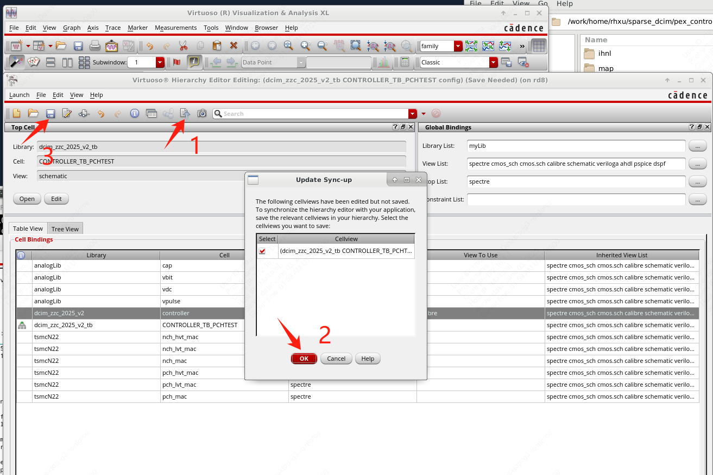
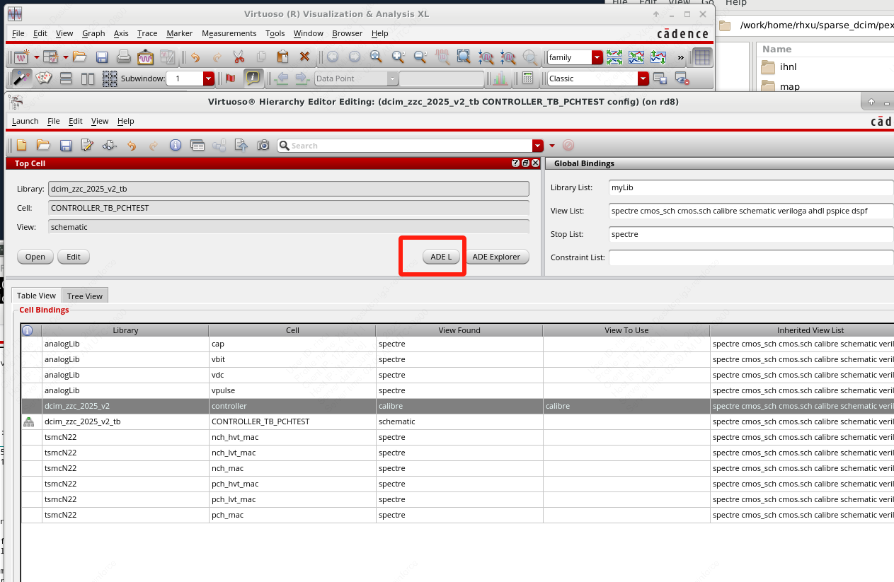

# 后仿步骤

## 提取寄生参数

详见[提取寄生参数](pex.md)

## 设置仿真config并仿真

为需要后仿的testbench新建一个config的cell view

然后点击use template，并选择相应的仿真器。如果需要数模混仿则选择AMS，否则一般选spectre

按ok后在弹出的hierarchy窗口中，在View list里schematic字样前面加上calibre，这样可以让有calibre view的cell优先使用calibre view

手动设置需要使用calibre view的cell的view为calibre view

然后按recompute hierarchy，并save config。最后在该界面打开ADE L就可以开始仿真了。

