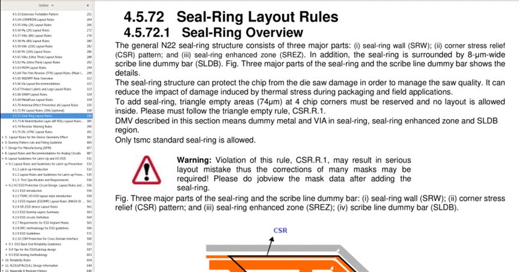
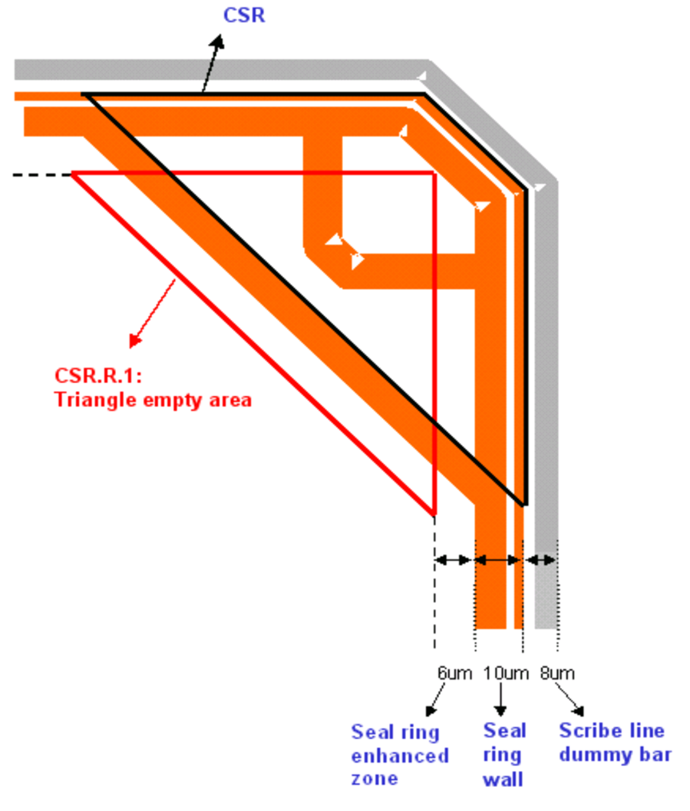
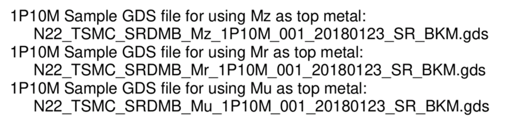
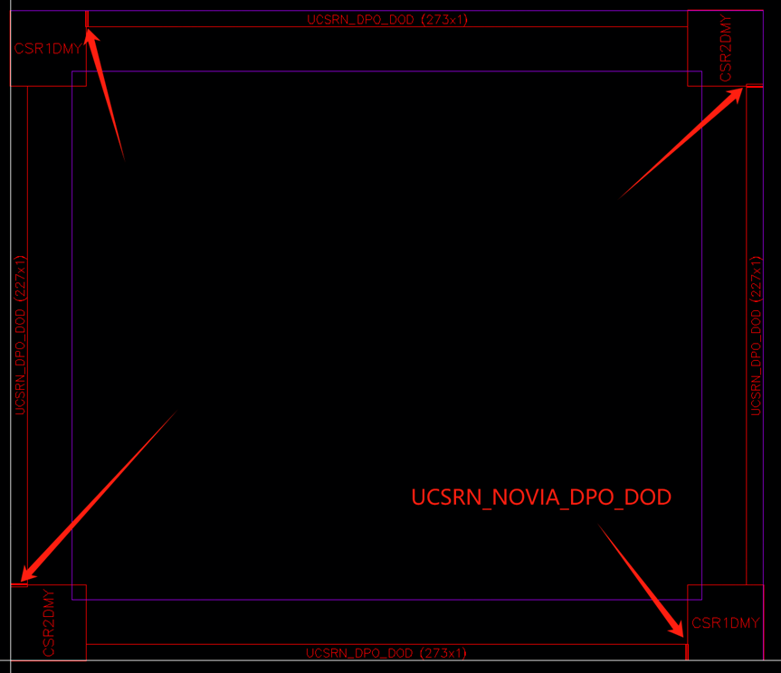
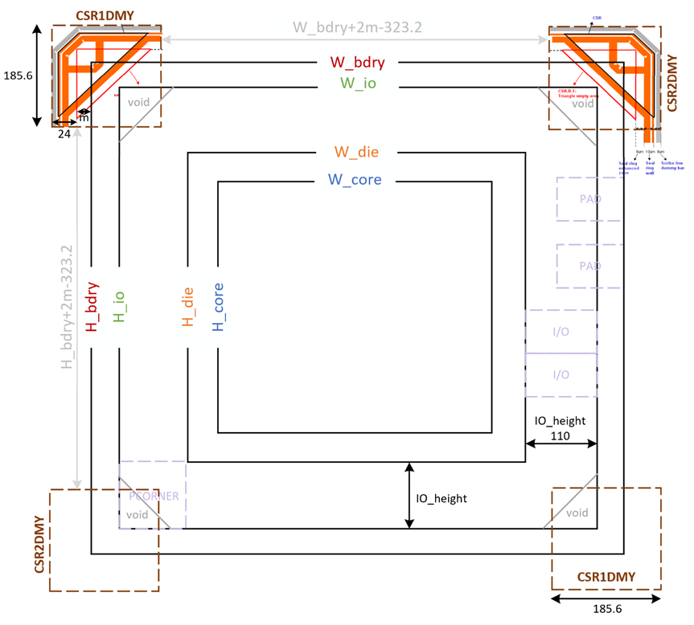
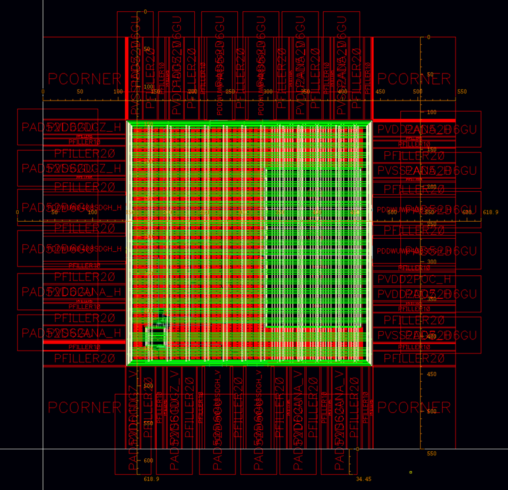
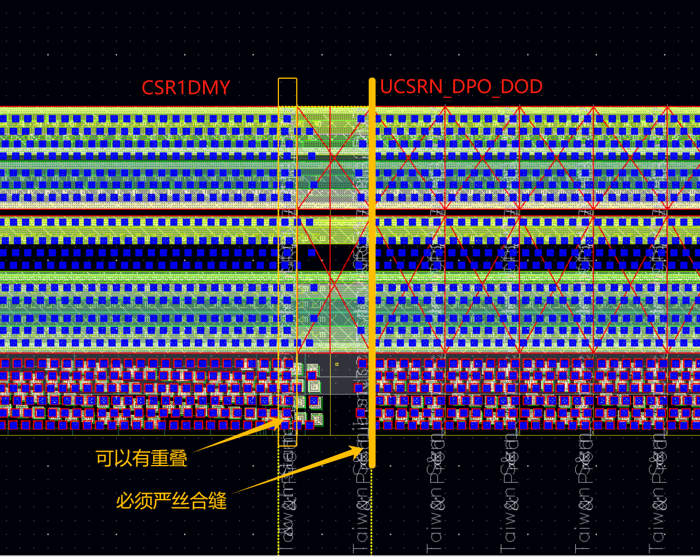
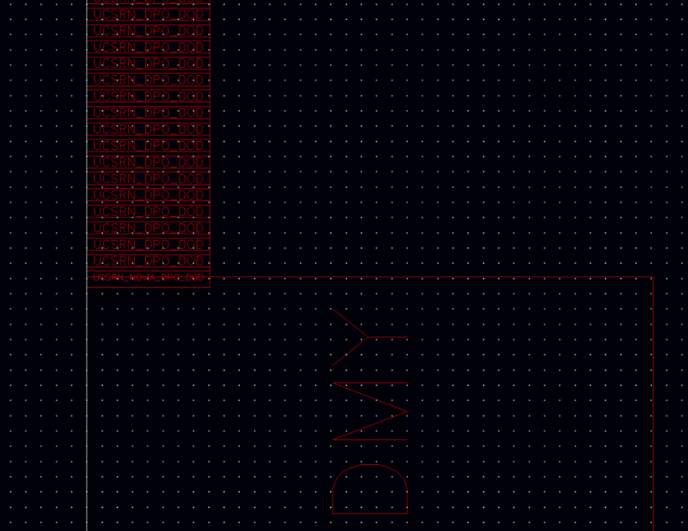
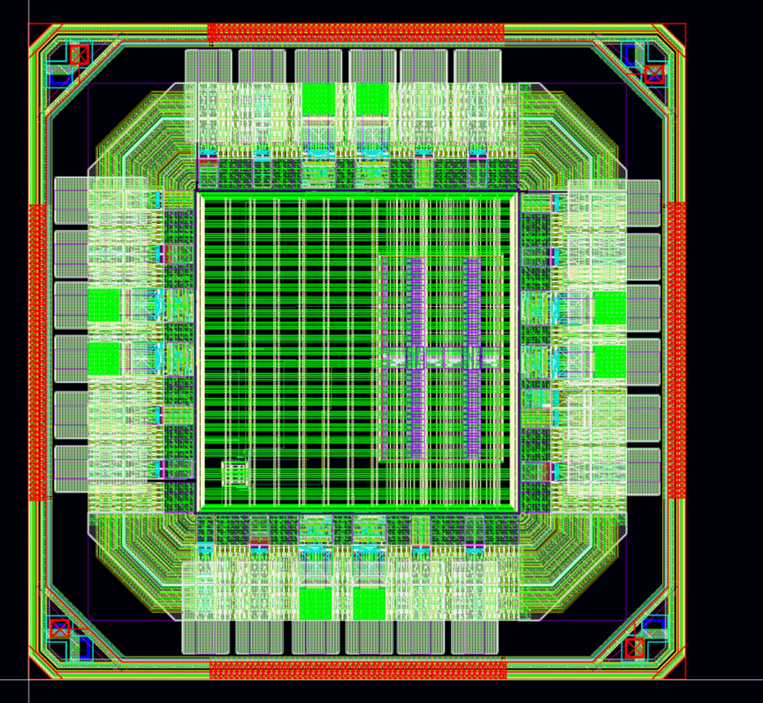

# Seal Ring

## 功能介绍

### 物理组成

- 从layout角度看，seal ring是一个由diff（有源区）、 contact（过孔）、 via（通孔）和metal（金属）等layer（层次）按照一定的规则叠加组成的图形，（参照所给的design rule严格的画）。
- 从工艺角度看，seal ring是一种金属层、氧化层、钝化层结构。像一圈堤坝，将芯片围在圈内保护起来。
- 从晶圆角度看，seal ring是介于芯片（chip）和划片槽（scribe line）之间的（保护）环。

### 功能

- 把Seal ring接地，屏蔽芯片外的干扰；
- Seal ring可以防止潮气从侧面断口侵入；
- 将切割所产生的静电就近接地，再由切割时邻近的Seal ring共同分摊所产生的电流，将对die本体的冲击降到最小。

### Seal ring，Guard ring，Scribe line

- Seal ring是在芯片IO ring 之外的密闭环（所用层基本涵盖所有mask layer）；
- Guard ring通常用于电路内部block与block之间的隔离，所用层通常是nwell 或psub，或两者一同使用。
- Scribe line，是把芯片从晶圆上切下来的线，是要实际走刀子的地方，而Seal ring是围在芯片周围的一圈从衬底到最上层金属全部都打一圈的保护圈。

### 说明文件

在工艺库安装路径`/DISK2/Tech_PDK/TSMC_22NM_RF_ULL/Doc/CL-DR/TN22CLDR001_1_5.pdf`第4.5.72节

## 添加方法

如果不想承担什么风险， 给芯片添加seal ring这件事可以交给foundry，出钱就行。不过多数时候我们宁可自己动手去做这些事情。一般情况下foundry都会在design rule中清楚的规定seal ring的结构及尺寸。常见的seal ring会将工艺中所有的层都列出来，并标明 dark or clear，用这里的dark和clear去对照工艺制作过程中这些layer的dark或clear，如果同为dark或clear则seal ring上面有这层，反之则seal ring上没有这层。
根据经验，建议自己去画这个seal ring。一方面，design rule上面一般都会给的很清楚，并非难事。另一方面，也是自己对芯片的可控性问题。
design rule中的contact和via都是我们常用的方孔，固定尺寸的。这是工艺中实际实验出来的最优的方案。但是seal ring一般情况下都是采用的是长孔，像环一样的包围起来，起到像长城阻挡外围的作用。
seal ring一般要离芯片core有一定的距离，如果芯片面积宽松可以参考design rule，因为rule的规定通常比较大；当然出于成本的考虑，我们宁可根据流片经验自己定义。一般design rule上的这个距离是保守的。
seal ring外面有划封线，这个是用来分裂芯片的，为避免造成对内部电路的破坏，所以seal ring到内部电路有10um距离要求。

### 模板导入

TSMC22提供了SEAL RING的sample，路径在`/DISK2/Tech_PDK/TSMC_22NM_RF_ULL/Doc/`，有三个gds文件，分别对应使用了不同顶层金属的情况：

由于我们选用的metal option是1P9M_6X1Z1U，因此Mu是顶层金属，使用的是第三个。将这个gds导入到virtuoso中，方便观察和调用。

### 使用到的cell

一个完整的seal ring如下图

使用到的cell有四个：CSR1DMY，CSR2DMY，UCSRN_DPO_DOD，UCSRN_NOVIA_DPO_DOD

### 尺寸计算

其中m≥0.
在此例中,W_bdry与H_bdry为618.9,取m=2.15,则两个CSR1DMY/CSR2DMY之间间隔300.

先根据计算的结果摆放四个角(使用CSR1DMY,CSR2DMY),然后在四条边上摆放多个UCSRN_DPO_DOD(宽度为5.4),最后剩余的距离用UCSRN_NOVIA_DPO_DOD补全.需要注意，相邻的UCSRN_DPO_DOD之间需要严丝合缝，不能留空也不能有重叠；余空用UCSRN_NOVIA_DPO_DOD补齐的时候，需要和最后一个UCSRN_DPO_DOD严丝合缝，不能留空也不能重叠，但是可以和CSR1DMY/CSR2DMY有重叠。观察UCSRN_NOVIA_DPO_DOD的版图可以发现，它一边是有via的，一边没有via。有via的那一边要严丝合缝贴着UCSRN_DPO_DOD，而另一边则可以和CSR1DMY/CSR2DMY重合。否则会出现drc问题。

完成后,再新建一个cell,将iotop和seal ring放在一起即可

