# Sram Compiler使用

通常来说，数字芯片需要大量的片上SRAM，而这些SRAM是由SRAM compiler产生的。SRAM compiler并不是由代工厂（如TSMC）提供的，而是第三方设计公司（如ARM）提供的。SRAM compiler快速产生不同规格大小sram的各种文件，主要view文件包括：

- Verilog（用于功能性仿真）
- CDL（用于LVS）
- GDS（用于最终合成）
- LIB（用于后端timing closure）

| 文件类型                            | 文件名格式                                 |
| ------------------------------- | ------------------------------------- |
| Verilog Model                   | `<instance_name>.v`                   |
| Verilog RTL model               | `<instance_name>_rt1.v`               |
| Liberty model for each corner a | `<instance_name>_<corner>.1ib`        |
| LEF footprint                   | `<instance_name>.lef`                 |
| LEF antenna                     | `<instance_name>_ant.lef`             |
| LEF antenna (C1F)               | `<instance_name>_ant.c1f`             |
| TetraMAX                        | `<instance_name>.tv`                  |
| GDSII layout                    | `<instance_name>.gds2`                |
| LVS netlist                     | `<instance_name>.cdl`                 |
| FastScan                        | `<instance_name>.mdt`                 |
| Bitmap                          | `<instance_name>.bitmap`              |
| ECSM-Timing                     | `<instance_name>.1ib-ecsm_t`          |
| CTL model                       | `<instance_name>.ctl`                 |
| CPF model                       | `<instance_name>.cpf`                 |
| Emulation model                 | `<instance>.memlib`                   |
| Tessent memory BIST model       | `<instance>_emulation.v`              |
| Apache AVM                      | `<instance_name>.avm`                 |
| CCS Timing                      | `<instance_name>_<corner>.1ib_ccs_t` |
| PostScript                      | `<instance_name>_<corner>.ps`         |
| ASCII datatable                 | `<instance_name>_<corner>.dat`        |

## 执行文件路径

```text
###### TSMC22 ######

# NCC服务器
work/home/tyiia/common/TSMC_22NM_ULL/sram_sp_hde_svt_mvt/rlp0/bin/sram_sp_hde_svt_mvt

# T1CentOS/T2CentOS服务器
/DISK2/Tech_PDK/TSMC_22NM_RF_ULL/IP/Memory_Compiler/

# EDA2服务器
/data/data_eda2/PDK_Tech/TSMC_22NM_RF_ULL/IP/Memory_Compiler

##### simc22 ##### 
# NCC服务器
/ftp/Design_rule/SMIC/SMIC28HKD_22ULP/Sram compiler/
work/home/wumeng/SMIC28HKD_22ULP_INSTALL/SMIC22HKD_22ULP/IP/Sram compiler/

##### UMC28 #####
# T1CentOS服务器SRAM Compiler路径
/DISK2/Tech_PDK/XIATRI_28nm_RRAM/IP/Memory_Compiler
```

- 对于tsmc22，在终端输入`ksh ${可执行文件的路径}`，就可以打开sram compiler图形界面。{可执行文件路径}类似于`/DISK2/Tech_PDK/TSMC_22NM_RF_ULL/IP/Memory_Compiler/sram_sp_hde_svt_mvt/r1p0/bin/sram_sp_hde_svt_mvt`
- 对于smic22，进入上述文件夹，可以看到A001和A000两个文件夹（或压缩包）。A001是2024三月发布的，A000是2023十一月发布的。进入任意一个文件夹（例如A000），有两个文件夹（或压缩包），一个是FE，一个是FB。将它们解压（如果还没解压的话）。FB里面是提供了gds的生成库，需要复制到FE的文件夹里面。然后再以和TSMC22nm相似的启动方式打开FE文件夹里的sram_sp_hde_svt_mvt,启动后，可以看到sram compiler的GUI如下页：

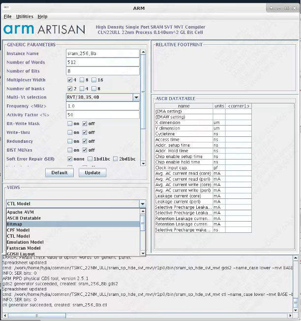

> （For SMIC）为什么会有FB和FE两个文件夹？可以理解为厂商提供sram compiler是将生成不同view的功能分割开来的，例如给你一个压缩包，里面有可以打开图形界面的可执行文件，但是这个压缩包里面只给你提供了几个可以生成特定几个view的库，这样虽然你可以打开sram compiler图形界面，但是生成view的功能是不齐全的。所以现在给了两个压缩包，里面提供了不同的view生成所需的库文件，所以需要将两个压缩包的文件融合起来，并且还需要增改一些库文件的声明，这样最后打开的图形界面就有齐全的view生成功能。

single-port (SP)的SRAM compiler是最常用的SRAM，同一个时钟内仅能读或者写。特殊情况下，可以使用Dual-port SRAM，这种SRAM可以同时读写，但是同样容量下面积的成本也会接近double，所以我们不会常用。

hde=high density, uhde=ultrahigh density. SVT-MVT indicates that logic SVT is used for BASE mode and MVT is used in LL(low leakage) & HP(high performance) mode. 随着工艺的发展，静态功耗影响非常大，所以选择合适的VT cell，对功耗影响很大，ulvt功耗是lvt的5倍，是svt的10倍，但是这是用时序换功耗。

## 产生view文件

由于每个芯片通常需要多个不同大小的sram，每次在产生sram时特别小心sram名字。不用使用默认的Instance Name，否则容易混淆。要根据sram的大小进行命名，如sram_sp_4096x16。

通过需要根据设计需求更改一下设置：

- Number of Words: SRAM的深度，字长，有多少个地址
- Number of Bits：SRAM port的宽度，即一次读出的数据宽度，字宽，每个地址存的比特数
- Multiplier Width，Number of Banks: 不会影响SRAM容量，但会影响物理实现方式（包括长度、宽度）。通常对特别小或者特别大容量的SRAM需要更改这两个参数，才能物理产生SRAM。

> 阵列行数x列数=总容量=字长x字宽

对于tsmc的sram阵列，列数=字长 / mux_width，行数=字宽 x mux_width，即mux_width越大，macro越瘦长。而对于smic则相反，行数=字长 / mux_width，列数=字宽 x mux_width。mux越大，速度越快，面积越大。频率要求低时，一般是500M以下时，可以选择column较小的，降低面积。

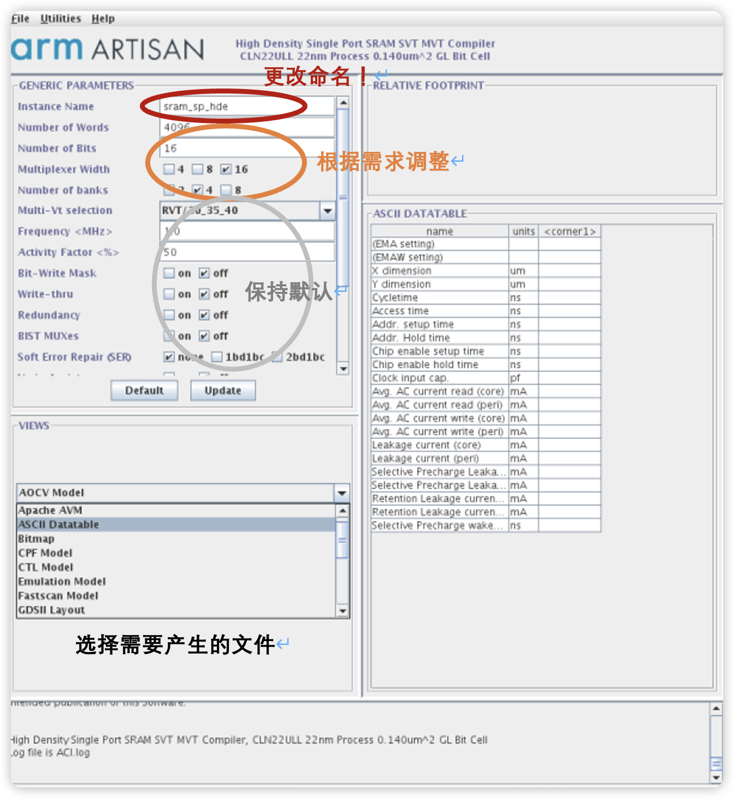

如果要一次性产生多种view，可以在`Utilities->Generate Menu`中勾选需要的view。

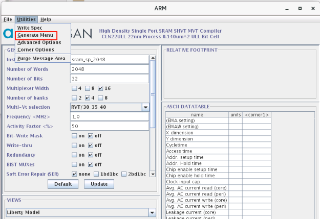

## 产生版图文件（GDSII）并导入virtuoso

- 在sram compiler的导出view中选择GDSII格式，导出的GDSII文件即为版图文件。
- 在virtuoso菜单栏中 file-import-stream ,流文件导入：

  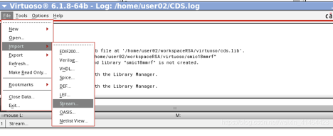

- stream file 选择需要导入的GDS文件, library 可输入新库的名字 或者选择导入已有库中

  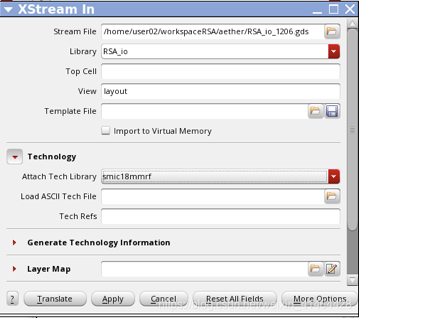

- 导入后，会在导入的目标库中产生很多个layout文件，都是sram的不同层级的（子）模块。其中，与GDSII文件同名的文件是顶层模块。如果想要知道模块层次，可以打开顶层模块的layout，然后按shift+F显示细节，再按shift+T显示树结构，即可得到模块层次。

  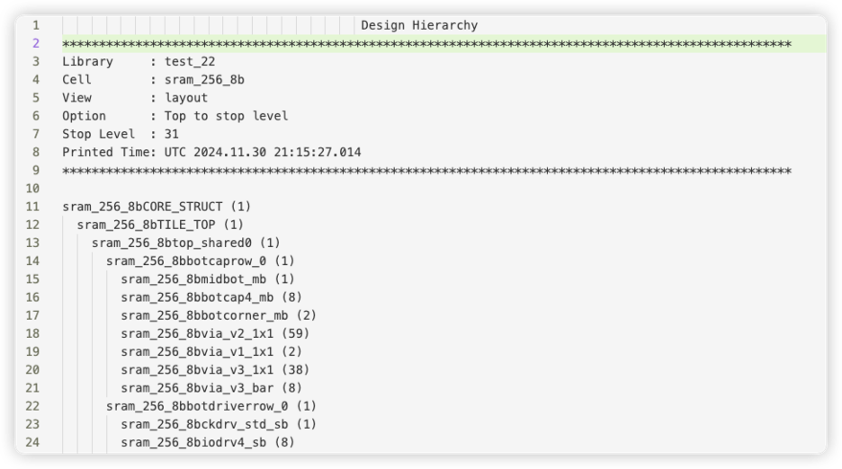

## SRAM的RTL功能仿真

### SRAM的接口

关于SRAM的架构可以参考手册：`work/home/tyiia/common/TSMC_22NM_ULL/sram_sp_hde_svt_mvt/rlp0/doc/sram_sp_hde_svt_mvt_userguide.pdf`或`/DISK2/Tech_PDK/TSMC_22NM_RF_ULL/IP/Memory_Compiler/sram_sp_hde_svt_mvt/r1p0/doc/sram_sp_hde_svt_mvt_userguide.pdf`

以下是常见SRAM的ports：
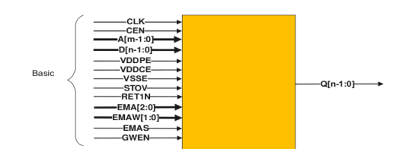

以下是对各个端口的简要解释，具体参见手册：

- CLK：SRAM的时钟，上升沿触发
- CEN：chip enable，通常置于0，SRAM才能工作
- A：读或者写的address
- D：写入的数据
- GWEN: 读写的enable，0：写，1：读
- Q：读出的数据
- VDDPE，VDDCE，VSSE：power。在仿真时不需要考虑，但在后端时要考虑！确保SRAM的power都最终都被连上到顶层的power grid了！
- EMA, EMAW, EMAS: extra margin adjustment。可以调整SRAM的读取速度。如果不是特别需要调整，可以把这些pin hard-wired到VDD/VSS。但是这些pin一定要接上！不能floating！
- STOV, RET1N: 同EMA，一定要接上！可以参考我后面的仿真设置。

> 再次强调: VDD*, VSS*, EMA*, RET*, STOV这些pin通常容易被忽略，但一定要确保接好，不能floating，不然流片后SRAM不会工作！具体接0还是1可以参考sram compiler文件夹中的README文件例如`README-tsmc-cln22ul-sram_sp_hde_shvt_mvt.txt`

```text
Recommended EMA Settings
    o Default EMA settings are as follows for 0.9v/0.9v voltage domain:
       EMA[2:0]  = 010 
       EMAW[1:0] =  00 
       EMAS      =   0 
       
    o Default EMA settings are as follows for 0.8v/0.8v voltage domain:
       EMA[2:0]  = 100 
       EMAW[1:0] =  00
       EMAS      =   0 

    o Default EMA settings are as follows for 0.7v/0.8v voltage domain:
       EMA[2:0]  = 011 
       EMAW[1:0] =  00
       EMAS      =   0
     
    o Default EMA settings are as follows for 0.6v/0.8v voltage domain:
       EMA[2:0]  = 001 
       EMAW[1:0] =  01
       EMAS      =   0

    o Default Read/write assist settings are as follows for 0.9v/0.9v voltage domain:
       WABL=1 
       WABLM[2:0] = 000 
       RAWL = 0  
       RAWLM[1:0] = 00 
       
    o Default Read/write assist settings are as follows for 0.8v/0.8v voltage domain:
       WABL=1 
       WABLM[2:0] = 001 
       RAWL = 0
       RAWLM[1:0] = 00

    o Default Read/write assist settings are as follows for 0.7v/0.8v voltage domain:
       WABL=1 
       WABLM[2:0] = 001 
       RAWL = 0
       RAWLM[1:0] = 00   

     o Default Read/write assist settings are as follows for 0.6v/0.8v voltage domain:
       WABL=1 
       WABLM[2:0] = 011 
       RAWL = 0
       RAWLM[1:0] = 00
```

- 基本端口

| Port | Width | Direction | Function                     |
|------|-------|-----------|------------------------------|
| CLK  | 1     | input     | clock                        |
| A    | 12    | input     | address (A[0]=LSB)           |
| D    | 16    | input     | data inputs (D[0]=LSB)       |
| Q    | 16    | output    | data outputs (Q[0]=LSB)      |
| CEN  | 1     | input     | chip enable, active LOW      |
| WEN  | 1     | input     | global write enable, active LOW |

> 注意D，Q的位宽是和memory compiler设置里的number of bits以及multiplixer width,要保持一致。而A决定了存储器深度，和memory compiler设置中的number of words之间相互换算关系是number of words = 2^A_width，即2的指数。

- 其他控制信号

| Port     | Width | Direction | Function                                      |
|----------|-------|-----------|-----------------------------------------------|
| RET1N    | 1     | input     | retention mode enable1, active LOW            |
| EMA      | 3     | input     | extra margin adjustment, EMA[0]=LSB            |
| EMAW     | 2     | input     | extra margin adjustment write, EMAW[0]=LSB     |
| TEN      | 1     | input     | test mode enable, active LOW. 0=test operation, 1=normal operation |
| TA       | 12    | input     | address test input, TA[0]=LSB                  |
| TD       | 16    | input     | test mode data inputs, TD[0]=LSB               |
| TCEN     | 1     | input     | chip enable test input, active LOW            |
| TWEN     | 1     | input     | write enable test inputs, active LOW           |
| CENY     | 1     | output    | chip enable multiplexer output                 |
| WENY     | 1     | output    | write enable multiplexer output                |
| AY       | 12    | output    | address multiplexer output, AY[0]=LSB          |
| SO       | 2     | output    | scan output bus                               |
| SI       | 2     | input     | scan input bus                                |
| SE       | 1     | input     | scan enable input                             |
| DFTRAMBYP| 1     | input     | test control input                            |

- 电源端口

VDDPE，VDDCE和VSSE，VSSE就是地, VDDPE是periphery power supply pin，即外围电路的电源，而VDDCE是core array power supply pin，即核心阵列的供电，为什么要分成两个电源，是因为对于低功耗设计来说，在SRAM只需要保持数据不需要进行读写操作时，可以通过VDDPE给关掉，只留VDDCE保持数据。

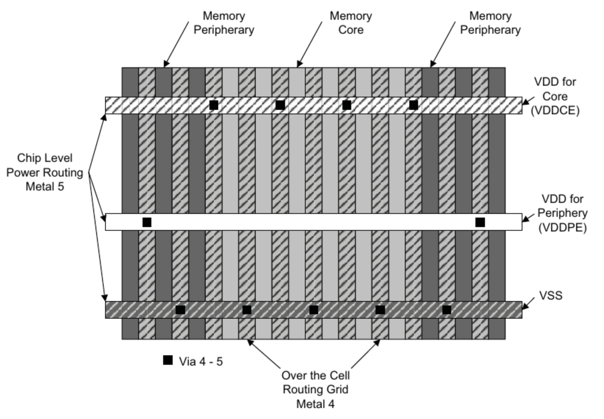

### SRAM的时序

GWEN=1，读数据。读出的数据Q是在ADDR的下一个cycle出现的
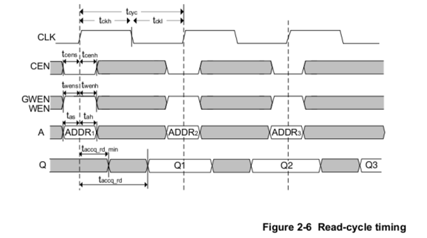

GWEN=0，写数据。数据D是在ADDR的下一个cycle写入的
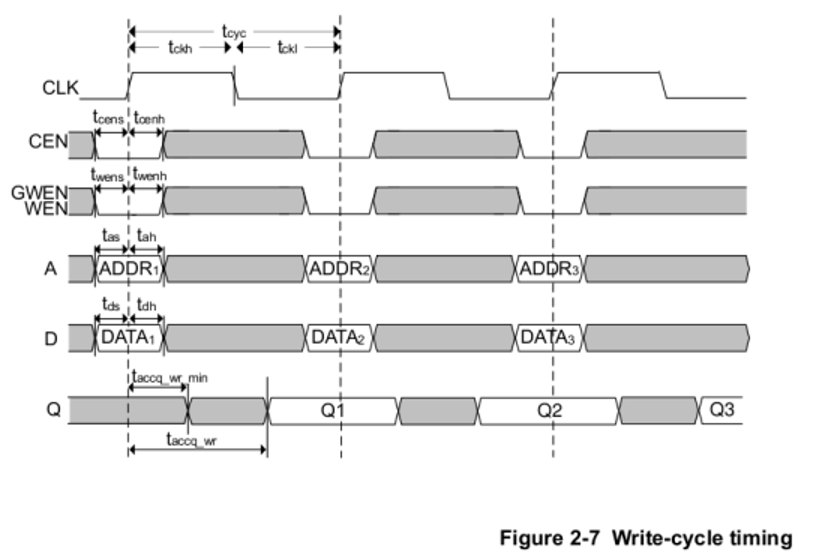

### SRAM的仿真

具体例子参见EDA02服务器（可以拷贝到自己的路径，尝试类似的仿真）/data/home/rh_xu30/work/share/sram_tsmc22
里面有三个文件夹：

- rtl：在此文件夹打开SRAM compiler，并产生所需要的view文件（目前已有verilog文件）
- verify：testbench。
- work：在此处启动仿真。仿真前查看list.f是否完整包含了需要仿真的verilog

仿真步骤：

1. 进入verify文件夹， 查看testbench: tb_sram_sp_2048_32.v
2. 进入work文件夹，运行命令：make all，会出现以下时序信息

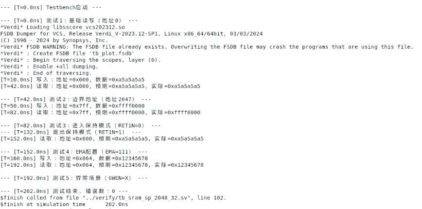

此仿真仅验证了简单的读写操作，可根据具体需要修改mem_tb。
并不是所以的EMA*, STOV, RET设置都能进行仿真，参考mem_tb中的设置。

## 参考资料

[sram compiler使用](https://www.cnblogs.com/sasasatori/p/17964224)
