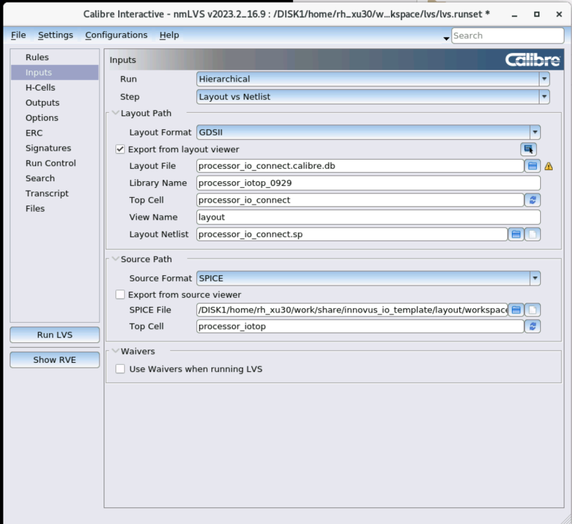
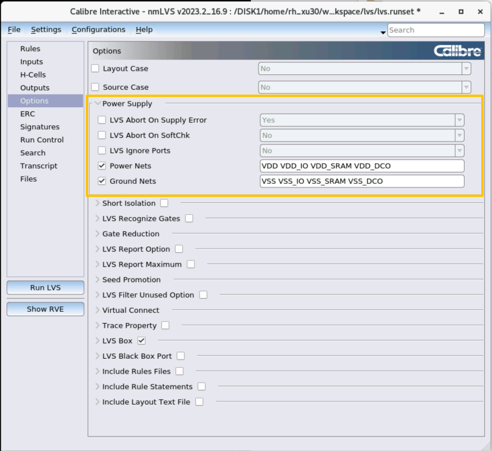
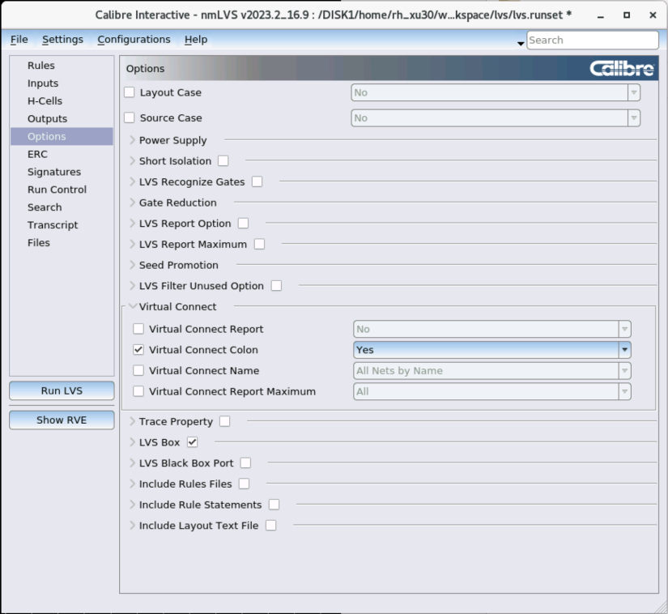
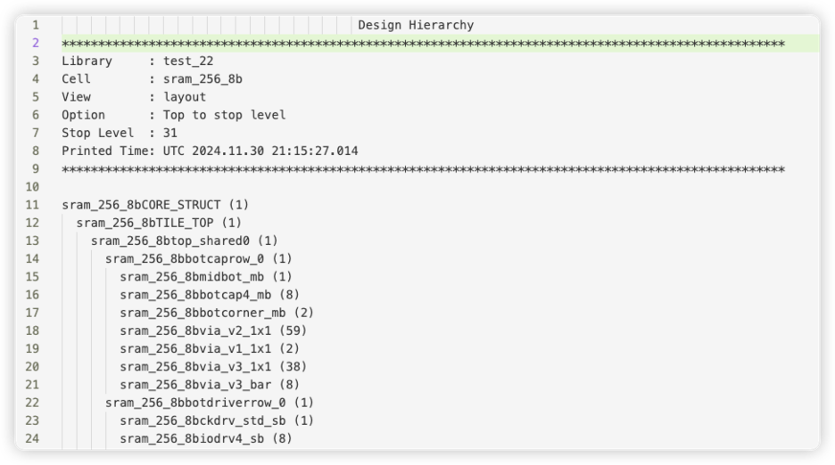
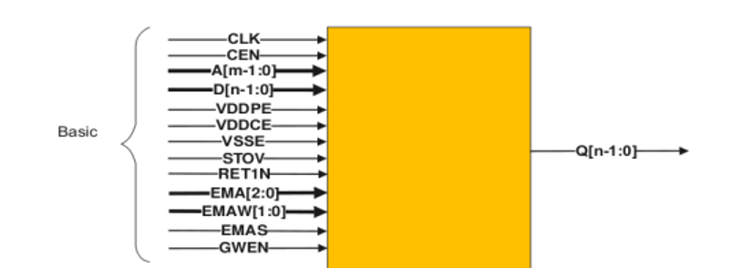
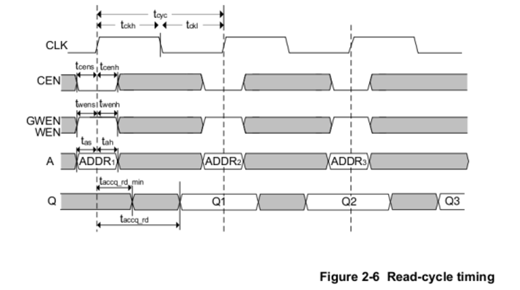
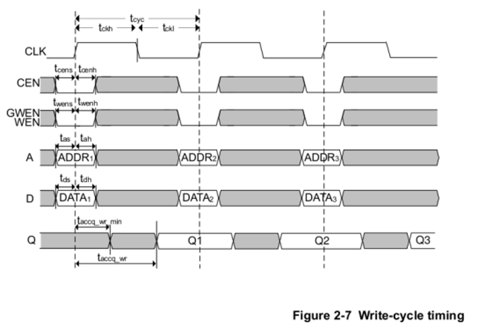
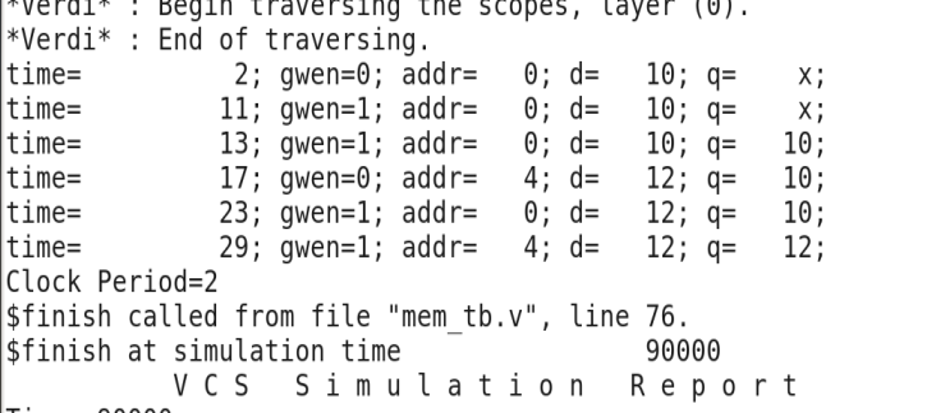

# Sram Compiler使用

通常来说，数字芯片需要大量的片上SRAM，而这些SRAM是由SRAM compiler产生的。SRAM compiler并不是由代工厂（如TSMC）提供的，而是第三方设计公司（如ARM）提供的。SRAM compiler快速产生不同规格大小sram的各种文件，主要view文件包括：

- Verilog（用于功能性仿真）
- CDL（用于LVS）
- GDS（用于最终合成）
- LIB（用于后端timing closure）


## 执行文件路径

```text
# tsmc22
work/home/tyiia/common/TSMC_22NM_ULL/sram_sp_hde_svt_mvt/rlp0/bin/sram_sp_hde_svt_mvt

# simc22
/ftp/Design_rule/SMIC/SMIC28HKD_22ULP/Sram compiler/
# or 
work/home/wumeng/SMIC28HKD_22ULP_INSTALL/SMIC22HKD_22ULP/IP/Sram compiler/
```

- 对于tsmc22，在终端输入这个可执行文件的路径，就可以打开sram compiler图形界面
- 对于smic22，进入上述文件夹，可以看到A001和A000两个文件夹（或压缩包）。A001是2024三月发布的，A000是2023十一月发布的。进入任意一个文件夹（例如A000），有两个文件夹（或压缩包），一个是FE，一个是FB。将它们解压（如果还没解压的话）。FB里面是提供了gds的生成库，需要复制到FE的文件夹里面。然后再以和TSMC22nm相似的启动方式打开FE文件夹里的sram_sp_hde_svt_mvt,启动后，可以看到sram compiler的GUI如下页：


> 为什么会有FB和FE两个文件夹？可以理解为厂商提供sram compiler是将生成不同view的功能分割开来的，例如给你一个压缩包，里面有可以打开图形界面的可执行文件，但是这个压缩包里面只给你提供了几个可以生成特定几个view的库，这样虽然你可以打开sram compiler图形界面，但是生成view的功能是不齐全的。所以现在给了两个压缩包，里面提供了不同的view生成所需的库文件，所以需要将两个压缩包的文件融合起来，并且还需要增改一些库文件的声明，这样最后打开的图形界面就有齐全的view生成功能。

这里仅安装了single-port (SP)的SRAM compiler，这也是最常用的SRAM，同一个时钟内仅能读或者写。特殊情况下，可以使用Dual-port SRAM，这种SRAM可以同时读写，但是同样容量下面积的成本也会接近double，所以我们不会常用。

> 由于每个芯片通常需要多个不同大小的sram，每次在产生sram时特别小心sram名字。不用使用默认的Instance Name，否则容易混淆。要根据sram的大小进行命名，如sram_sp_4096x16。

通过需要根据设计需求更改一下设置：
- Words: SRAM的行数，depth
- Bits：SRAM port的宽度，即一次读出的数据宽度
- Multiplier Width，Number of Banks: 不会影响SRAM容量，但会影响物理实现方式（包括长度、宽度）。通常对特别小或者特别大容量的SRAM需要更改这两个参数，才能物理产生SRAM。



## 产生版图文件（GDSII）并导入virtuoso

- 在sram compiler的导出view中选择GDSII格式，导出的GDSII文件即为版图文件。
- 在virtuoso菜单栏中 file-import-stream ,流文件导入：
  
- stream file 选择需要导入的GDS文件, library 可输入新库的名字 或者选择导入已有库中
  
- 导入后，会在导入的目标库中产生很多个layout文件，都是sram的不同层级的（子）模块。其中，与GDSII文件同名的文件是顶层模块。如果想要知道模块层次，可以打开顶层模块的layout，然后按shift+F显示细节，再按shift+T显示树结构，即可得到模块层次。
  

## SRAM的RTL功能仿真

### SRAM的接口

关于SRAM的架构可以参考手册：`work/home/tyiia/common/TSMC_22NM_ULL/sram_sp_hde_svt_mvt/rlp0/doc/sram_sp_hde_svt_mvt_userguide.pdf`

以下是常见SRAM的ports 和读写时序：

以下是对各个端口的简要解释，具体参见手册：
- CLK：SRAM的时钟，上升沿触发
- CEN：chip enable，通常置于0，SRAM才能工作
- A：读或者写的address
- D：写入的数据
- GWEN: 读写的enable，0：写，1：读
- Q：读出的数据
- VDDPE，VDDCE，VSSE：power。在仿真时不需要考虑，但在后端时要考虑！确保SRAM的power都最终都被连上到顶层的power grid了！
- EMA, EMAW, EMAS: extra margin adjustment。可以调整SRAM的读取速度。如果不是特别需要调整，可以把这些pin hard-wired到VDD/VSS。但是这些pin一定要接上！不能floating！
- STOV, RET1N: 同EMA，一定要接上！可以参考我后面的仿真设置。

> 再次强调: VDD*, VSS*, EMA*, RET*, STOV这些pin通常容易被忽略，但一定要确保接好，不能floating，不然流片后SRAM不会工作！

GWEN=1，读数据。读出的数据Q是在ADDR的下一个cycle出现的


GWEN=0，写数据。数据D是在ADDR的下一个cycle写入的


### SRAM的仿真
具体例子参见（可以拷贝到自己的路径，尝试类似的仿真）`work/home/tyiia/common/example/sram_22nm`.
里面有两个文件夹：
- sram_sp_4096x16：在此文件夹打开SRAM compiler，并产生所需要的view文件
- tb：进行简单的仿真验证。

仿真步骤：
1.	进入tb文件夹， 查看testbench: mem_tb.v
2.	运行命令：b make compile，会出现以下时序操作



此仿真仅验证了简单的读写操作，可根据具体需要修改mem_tb。
并不是所以的EMA*, STOV, RET设置都能进行仿真，参考mem_tb中的设置。
