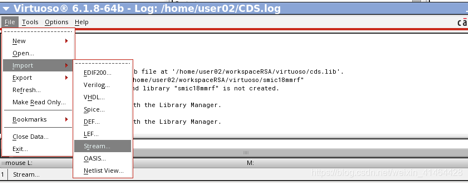

# Cadence Virtuoso使用技巧

## 导入gds文件

- 在virtuoso菜单栏中 file-import-stream ,流文件导入：

  

- stream file 选择需要导入的GDS或GDSII文件（如果在目标文件夹下找不到.gds2类型文件，可以将文件类型选择为all）, library 可输入新库的名字或者选择导入已有库中。一般导入gds后会产生很多个cell，因此在不确定的情况下建议是新建一个库然后再导入到新建的库中。

  

- top cell一般无需指定，缺省即可；如果目标导入的库再创建时已经绑定了工艺库，那么此处attach tech library也可以直接缺省。最后直接点击tranlate即可。注意在弹出的”你是否要查看警告或者报错信息”的弹窗中，请尽量选择No，因为选择Yes有可能会导致服务器崩溃（实测，但是原因未知）。如果要查看translate过程中的warning则可以去查看StreamIn.log文件。

## 修改默认仿真波形曲线风格

使用ADE L仿真后得到的波形曲线有可能默认是虚线，非常不清晰。因此可以修改默认仿真波形曲线风格。

原理：在virtuoso启动的目录下，会自动寻找`display.drf`文件。该文件就是默认仿真波形曲线风格的配置文件。

- 可以直接把别人配置好的drf文件拿过来，放在自己的目录下并命名为`display.drf`
- 通过virtuoso tool中的Display resource manager来编辑和生成drf文件。参考：[Cadence virtuoso 瞬态仿真的波形是很细的虚线------解决办法](https://blog.csdn.net/XC86866812/article/details/145834590)。

### Display resource manager使用方法

1. 在CIW界面，点击tools;
2. 找到Display resource manager，点击；
3. 点击edit，进入Display resource manager界面
4. Device下面的那个下拉框打开，并选择“All packets”,如下图所示;


5. 在下面的搜索框中输入“y0_drawing”,点击，在右侧的“line style”中，将虚线改成实线，并点击右下角的"modify current packet"保存修改；（一定要点击，不要不会保存）
6. 重复第六步的操作，依次修改y1_darwing、y1_darwing.......y9_drawing;
7. 关闭virtuoso，在弹出的保存display文件对话框中将配置文件保存为`display.drf`文件。
8. 打开virtuoso，进行仿真，即可得到实线波形

## 在virtuoso显示calibre选项卡

如果virtuoso界面没有calibre选项卡，则可以在工作目录下创建一个.cdsinit文件并写入以下内容：

```text
;;;;;;;;;;;;;;;;;;;;;;;;;;;;;;;;;;;;;;;;;;;;;;;;;;;;;;;;;;;;;;;;;;;;;;;;;;;;;;;;;

;
; check CALIBRE_HOME
;
cal_home=getShellEnvVar("CALIBRE_HOME")
if( cal_home==nil then
    cal_home=getShellEnvVar("MGC_HOME")
    if( cal_home!=nil then
        printf("// CALIBRE_HOME environment variable not set; setting it to value of MGC_HOME\n");
    )
)

if( cal_home!=nil && isDir(cal_home) && isReadable(cal_home) then

    ; Load calibre.skl or calibre.4.3.skl, not both!

    if( getShellEnvVar("MGC_CALIBRE_REALTIME_VIRTUOSO_ENABLED") && 
        getShellEnvVar("MGC_REALTIME_HOME") && dbGetDatabaseType()=="OpenAccess" then
      load(strcat(getShellEnvVar("MGC_REALTIME_HOME") "/lib/calibre.skl"))
    else
      ; Load calibre.skl for Cadence versions 4.4 and greater
      load(strcat(cal_home "/lib/calibre.skl"))
    )

    ;;;;Load calibre.4.3.skl for Cadence version 4.3
    ;;; load(strcat(cal_home "/lib/calibre.4.3.skl"))

else

    ; CALIBRE_HOME is not set correctly. Report the problem.

    printf("//  Calibre Error: Environment variable ")

    if( cal_home==nil || cal_home=="" then
        printf("CALIBRE_HOME is not set.");
    else
        if( !isDir(cal_home) then
            printf("CALIBRE_HOME does not point to a directory.");
        else
            if( !isReadable(cal_home) then
                printf("CALIBRE_HOME points to an unreadable directory.");
            )
        )
    )
    printf(" Calibre Skill Interface not loaded.\n")

    ; Display a dialog box message about load failure.

    hiDisplayAppDBox(
        ?name           'MGCHOMEErrorDlg
        ?dboxBanner     "Calibre Error"
        ?dboxText       "Calibre Skill Interface not loaded."
        ?dialogType     hicErrorDialog
        ?dialogStyle    'modal
       ?buttonLayout   'Close
    )
)

;;;;;;;;;;;;;;;;;;;;;;;;;;;;;;;;;;;;;;;;;;;;;;;;;;;;;;;;;;;;;;;;;;;;;;;;;;;;;;;;;
```

这样就可以调用calibre的功能了。

## 加快ADE L仿真速度

###  ADE L→Setup→High performance simulation

1. 默认是Spectre，可以改为选择APS
2. 勾上++aps
3. errpreset可以选择moderate或者liberal。（精度conservative > moderate > liberal，速度反之）
4. 将多线程multi-Threading改为手动manual，选择32或64等。

## 批量替换instance

1. 在原理图上选择【Edit】——【Replace】
2. 然后就会有如下弹窗：【Search For】选择master，【Replace With】也选择master，符号选择“==”，然后在后面的栏里填写你要更换的器件以及更换的器件；如在【Replace With】后面的栏里填写【tsmc18rf(更换器件所属的库) pmos3v(更换的器件) symbol】,即把库1的P_50_G2器件更换为tsmc18rf库里的pmos3v器件。搜索范围【Search Scope】，我选择的是库【library】，这个可以根据需求自己选择。


3. 点击replace all

## bug汇总

### 遇到内存锁问题

在ADE L中使用多线程仿真的时候，遇到内存锁警告导致仿真卡住，警告信息类似`xrun: *W,WKWTLK: Waiting for a Exclusive lock on file '/data/home/rh_xu30/simulation/top_cim-module_tb/ams/config/netlist/xcelium.d/DCIM_sparse_tb.top_cim-module_tb_config.lnx8664.23.09.d/.xmlib.lock'. pid:94184.`。解决办法就是停止仿真，并在命令行查找相关进程（例如可以通过`ps aux | grep xmsim`）pid，然后杀死该进程（`kill -9`），再重启仿真。

### 选择需要plot的信号失败

在选择需要plot的信号的时候，CIW出现

```text
*Error* Could not get adjusted path of /I0/I2/I57/I57/I41/I22/DIN<63:32>.

<<< Break >>> on explicit 'break' request
Entering new debug toplevel due to breakpoint:
Type (help "debug") for a list of commands or debugQuit to exit the toplevel.
```

之后都无法再选任何信号。此时应该在CIW终端输入debugQuit，就可以重新选择其他信号去plot了。

