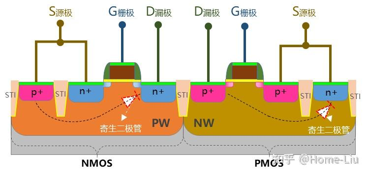
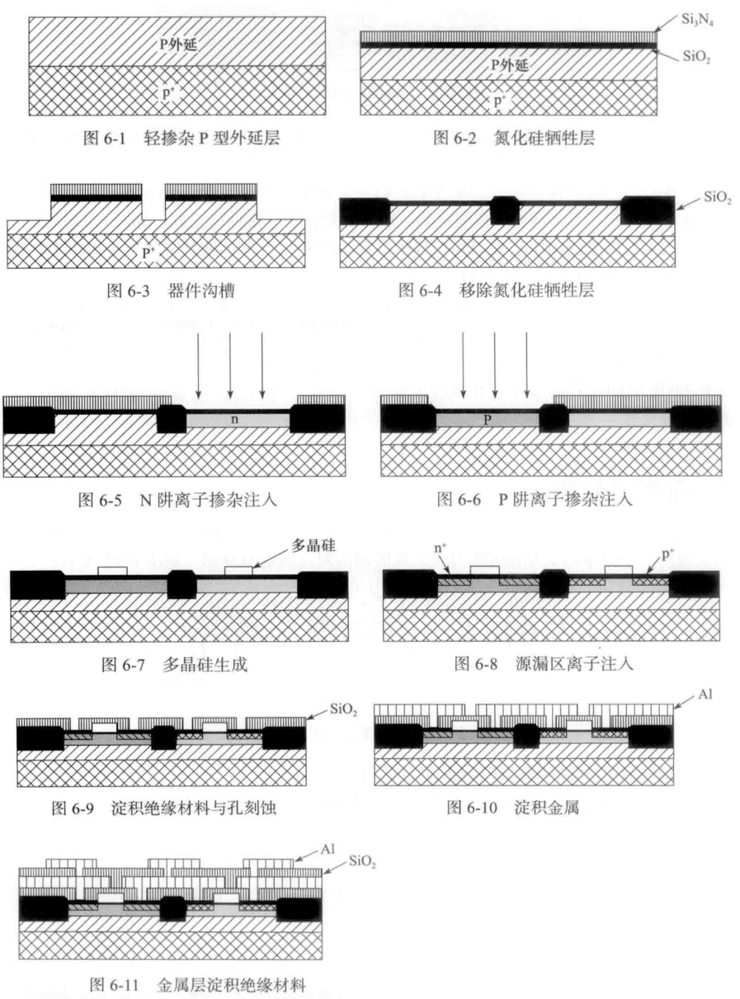
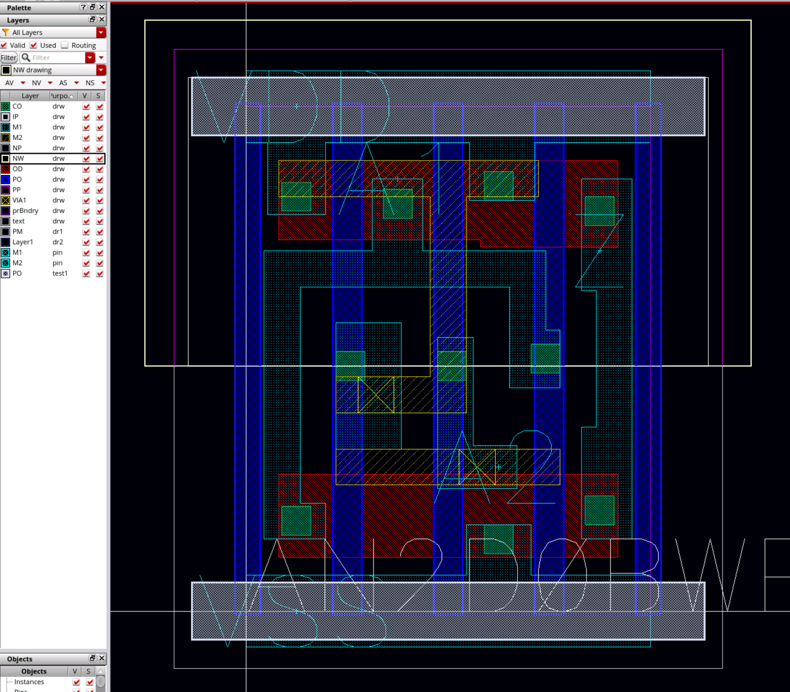

# CMOS工艺版图基础知识（tsmc22N）

## 参考文档

关于各层信息在工艺库安装路径`/DISK2/Tech_PDK/TSMC_22NM_RF_ULL/Doc/CL-DR/TN22CLDR001_1_5.pdf`中第3节

## 基础知识

### N阱工艺

N阱工艺就是在 P型硅衬底上，通过离子注入或扩散的方式，形成一个掺杂了N型杂质的区域，这个区域就是 “N阱”。

在传统的CMOS工艺中，NMOS晶体管可以直接在P型衬底上制造，因为它的源极和漏极是N型掺杂，与P型衬底形成PN结。但PMOS晶体管的源极和漏极是P型掺杂，如果直接在P型衬底上制造，就无法形成有效的PN结来隔离晶体管。

这时，N阱就起到了一个“隔离”的作用。通过在P型衬底中先制造一个N阱，然后在这个N阱内部制造PMOS晶体管。这样一来，PMOS的P型源极和漏极就与N阱形成了PN结，而N阱又与P型衬底形成了另一个PN结，从而实现了NMOS和PMOS晶体管之间的电学隔离，避免了电路短路。

双阱工艺在P型衬底上同时制造N阱和P阱，允许设计师在同一块芯片上制造性能更优的NMOS和PMOS器件。

### SOI材料（Silicon-On-Insulator）

**SOI** 是一种特殊的**衬底材料技术**，它指的是一种特殊的硅片结构，由三层组成：

1.  **顶层硅（Top Silicon Layer）**：用于制造晶体管的**有源区**，非常薄。
2.  **中间埋氧层（Buried Oxide Layer, BOX）**：一层绝缘材料（通常是二氧化硅）。这是 SOI 的核心，它将顶层硅与下面的衬底完全隔离开。
3.  **底部衬底（Bottom Substrate）**：提供机械支撑的硅片。

**SOI 的核心优势**在于埋氧层提供了**天然的电学隔离**。在传统的**块状硅（Bulk Silicon）**工艺中，晶体管的源极、漏极和衬底之间会形成寄生电容和寄生二极管，导致漏电流增加和功耗升高。而 SOI 通过埋氧层，从根本上消除了这些寄生效应，从而带来以下好处：

* **更低的功耗**：由于寄生电容大大减少，芯片工作时需要的电荷更少，功耗也更低。
* **更高的速度**：寄生电容的减少也意味着开关速度更快。
* **更好的抗辐射能力**：埋氧层能有效阻挡来自衬底的电荷，使芯片对辐射更具抵抗力，这在航空航天、军事等领域非常重要。

### STI 工艺 (Shallow Trench Isolation)

**STI** 是一种**隔离工艺**，用于在同一块芯片上**电学隔离不同的晶体管**。

在传统的块状硅工艺中，晶体管是通过**LOCOS (Local Oxidation of Silicon)**工艺来隔离的，但随着晶体管尺寸的缩小，LOCOS 会导致严重的**鸟嘴效应（Bird's Beak Effect）**，浪费了宝贵的芯片面积。

STI 技术解决了这个问题。其基本原理是：

1.  在硅片表面刻蚀出很浅的**沟槽**（Trench）。
2.  在这些沟槽中填充绝缘材料，通常是**二氧化硅**。
3.  通过**化学机械抛光（CMP）**等方法，将多余的绝缘材料磨平，使之与硅片表面平齐。

这样一来，每个晶体管都被一个绝缘的“浅沟槽”隔离开来，像是一堵堵小墙，防止了晶体管之间的漏电流。

**STI 的主要优点**是：

* **更高的集成度**：由于没有鸟嘴效应，STI 能够实现更小的隔离距离，从而在相同的面积上集成更多的晶体管。
* **更好的隔离效果**：与 LOCOS 相比，STI 提供了更平坦的表面和更有效的电学隔离。

### FEOL，BEOL区别

前道工艺（FEOL）是集成电路制造的第一个主要阶段，主要目标是在半导体晶圆上完成各类器件的制造和图案化。这些器件包括晶体管、电容、电阻等，是构成电路功能的基本单元。FEOL从裸片晶圆开始，最终完成所有器件的加工和结构搭建。FEOL中常见的关键工艺步骤包括

- 氧化（Oxidation）：在硅晶圆表面形成氧化层（如SiO₂），作为晶体管栅极绝缘体或掩膜层。
- 光刻（Photolithography）：使用光刻技术定义器件的精确几何形状。
- 刻蚀（Etching）：通过湿法或干法刻蚀去除不需要的材料，形成所需图案。
- 离子注入（Ion Implantation）：将掺杂元素（如磷、硼）植入硅中，改变其导电特性，形成N型或P型区域。
- 薄膜沉积（Deposition）：沉积导电或绝缘材料（如多晶硅、氮化硅等），用于形成器件的不同部分。
- 退火（Annealing）：通过高温加热修复晶体结构，并激活掺杂的离子。

后道工艺（BEOL）是集成电路制造的第二个主要阶段，主要目标是通过沉积金属互连层，将前道制造的器件连接起来，形成完整的电路。这一阶段从器件图案化完成后开始，直到整个电路制造完成。
以下是BEOL中常见的工艺步骤：

- 介电层沉积（Dielectric Deposition）：沉积绝缘材料（如SiO₂或低k材料），用于隔离金属层。
- 金属沉积（Metal Deposition）：沉积金属材料（如铝、铜），形成电路的导线。
- 化学机械抛光（CMP）：通过抛光平整金属和介电层表面，为多层互连准备平整基底。
- 通孔（Via）制作：在不同金属层之间形成垂直连接的通孔。
- 多层金属互连：通过多次沉积和刻蚀，构建复杂的金属互连网络。

## 层汇总

`/DISK2/Tech_PDK/TSMC_22NM_RF_ULL/Doc/CL-DR/TN22CLDR001_1_5.pdf`中第3节

| Key Process Sequence | Mask Name | Mask ID | Digitized Areas (Dark or Clear) | CAD Layer | Description |
| :---: | :---: | :---: | :---: | :---: | :--- |
| 1 | OD | 120 | D | Derived | Device, ACTIVE, STRAP and interconnection regions. |
| 2* | DNW | 119 | C | 1:0 | Deep N-Well. |
| 3 | PW1V | 191 | D | Derived | Core device P-Well. |
| 4 | PW2V | 193 | C | Derived | 1.8V or 2.5V P-Well. |
| 5* | PWHV | 195 | C | Derived | I018 based 6.5V or 6.5UD5.5V HV PMOS drift implantation. |
| 6 | NW1V | 192 | C | Derived | Core device N-Well. |
| 7 | NW2V | 194 | C | Derived | 1.8V or 2.5V N-Well. |
| 8 | OD2 | 152 | D | 16:0 | 1.8V or 2.5V thick oxide for DGO process. |
| 9 | ODR | 121 | C | 18:0 | STI step height control |
| 10 | PO | 130 | D | Derived | Poly-Si. |
| 11 | CPO | 139 | C | 17:11 | Double PO patterning |
| 12 | P2V | 115 | C | Derived | 1.8V or 2.5V PLDD implantation. |
| 13* | VTUL_P | 110 | C | 152:0 | Ultra-low VT PMOS implantation. |
| 14 | PTV | 118 | D | Derived | Core device PLDD implantation. |
| 15* | VTH_P | 117 | C | Derived | Low VT PMOS implantation. |
| 16* | VTH_P | 11G | C | 68:0 | High VT PMOS implantation. |
| 17* | UHVT_P | 11A | C | Derived | Ultra-high VT PMOS implantation |
| 18 | SSD | 123 | D | Derived | Strained Si/D |
| 19 | N2V | 116 | C | Derived | 1.8V or 2.5V NLDD implantation. |
| 20 | N1V | 121 | C | Derived | Core device NLDD implantation. |
| 21* | VTUL_N | 118 | D | Derived | Low VT NMOS implantation |
| 22* | VTLN_N | 11R | C | 151:0 | Ultra-low VT NMOS implantation |
| 23* | VTH_N | 11H | C | 67:0 | High VT NMOS implantation. |
| 24* | UHVTH_N | 11M | C | Derived | Ultra-high VT NMOS implantation |
| 25* | VTC_N | 112 | C | Derived | SRAM NMOS cell implantation |
| 26* | VTC_P | 199 | C | Derived | SRAM PMOS cell implantation |
| 27 | PP | 197 | C | Derived | P+ implantation. |
| 28 | NP | 198 | C | Derived | N+ implantation. |
| 29* | ESD | 111 | C | 189:0 | ESD implantation. |
| 30 | BPO | 155 | D | 19:0 | Silicide protection. |
| 31 | SDS-HMR | 13A | C | Derived | SDS Hard mask remove |
| 32 | PMET | 13D | D | 205:6 | P-type metal |
| 33* | HI_R | 13F | C | Derived | High R resistor |
| 34 | CP | 13C | C | Derived | Contact window from M1 to OD or PO. |
| 35 | M1 | 380 | C | 51:0 | 1st metal for interconnection. |
| 36 | VIA1 | 378 | C | 51:0 | Via1 hole between M2 and M1. |
| 37 | M2 | 380 | C | 32:0 | 2nd metal for interconnection. |
| 38 | VIA2 | 379 | C | 32:0 | Via2 hole between M3 and M2. |
| 39 | M3 | 381 | C | 33:0 | 3rd metal for interconnection. |
| 40 | VIA3 | 373 | C | 53:0 | Via3 hole between M4 and M3. |
| 41 | M4 | 384 | C | 34:0 | 4th metal for interconnection. |
| 42 | VIA4 | 374 | C | 54:0 | Via4 hole between M5 and M4. |
| 43 | M5 | 385 | C | 35:0 | 5th metal for interconnection. |
| 44 | VIA5 | 375 | C | 55:0 | Via5 hole between M6 and M5. |
| 45 | M6 | 386 | C | 36:0 | 6th metal for interconnection. |
| 46 | VIA6 | 376 | C | 56:0 | Via6 hole between M7 and M6. |
| 47 | M7 | 387 | C | 37:0 | 7th metal for interconnection. |
| 48 | VIA7 | 377 | C | 57:0 | Via7 hole between M8 and M7. |
| 49 | M8 | 388 | C | 38:0 | 8th metal for interconnection. |
| 50 | VIA8 | 372 | C | 58:0 | Via8 hole between M9 and M8. |
| 51 | M9 | 389 | C | 39:0 | 9th metal for interconnection. |
| 52 | VIA9 | 37A | C | 59:0 | Via9 hole between M10 and M9. |
| 53 | M10 | 38A | C | 40:0 | 10th metal for interconnection. |
| 54 | CB-VD | 306 | C | Derived | Passivation-1 open for bond pad, Al RDL via. |
| 55 | AP-MD | 309 | D | Derived | AlCu pad, Al RDL. |
| 56 | CB2 | 308 | C | 86:20 | Passivation-2 open. |
| 57* | PM | 009 | D | 5:0 | Polyimide opening |

*为optional mask。这里重点关注：

### NW1V/NW2V（N well）

N-Well是一个通过离子注入或扩散在P型硅衬底中形成的N型掺杂区域。它就像一个“池塘”，在这个“池塘”里可以制造P沟道MOSFET (PMOS)。在标准的CMOS工艺中，NMOS晶体管可以直接在P型衬底上制造，而PMOS晶体管则需要一个N型的“地基”。N-Well就是为PMOS晶体管提供的这个N型衬底。N-Well可以用来将PMOS晶体管与P型衬底隔离开来，从而防止它们之间的寄生效应，如闩锁效应（Latch-up）。通过给N-Well施加正电压，可以控制PMOS晶体管的体偏置，从而调整其阈值电压和性能。

### OD (Oxide Diffusion)

指的是有源区（Active Area，因此在SMIC工艺里这个层叫AA）。这个区域是晶体管、电阻等器件实际制造的“地基”。在这个区域内，会进行后续的离子注入（如N型或P型掺杂），形成晶体管的源极、漏极以及体区，或者制作出电阻、二极管等。与“Active”相对的是场区（Field Region），也就是器件之间被隔离的区域。

在CMOS工艺中，OD层通常是指一个“开口”，通过这个开口将硅衬底暴露出来，后续在其中进行离子注入，形成N阱（N-Well）或P阱（P-Well）内的源漏区。离子注入后，OD层内的区域就成为了晶体管的源极和漏极，晶体管的体区也位于OD层定义的区域内。

### PO (Poly-Silicon)

多晶硅（Poly-Silicon）层。在MOSFET晶体管中，多晶硅层被用作栅极，它通过栅氧化层与硅衬底隔离。当在栅极上施加电压时，可以控制源极和漏极之间的导通与截止，实现开关功能。此外，由于多晶硅具有一定的导电性（通过掺杂），它也可以作为局部的互连线，用于连接不同的器件。尤其是在一些旧工艺或对性能要求不高的场合，多晶硅互连线很常见。多晶硅的电阻率可以通过掺杂浓度来精确控制，因此它也常被用来制造片上电阻。

PO层掩模版定义了多晶硅的形状和位置。在实际工艺中，先在硅片上生长一层薄薄的栅氧化层，然后在其上沉积一层多晶硅，再使用PO掩模版进行光刻和刻蚀，形成栅极和其他多晶硅结构。

### PP（P+）

P+通常指的是重掺杂的P型区域（P-type heavily doped）。用于定义需要进行高浓度P型离子注入的区域。这些区域通常是P沟道MOSFET（PMOS）的源极和漏极，以及P-Well或P型衬底上的欧姆接触区域。高浓度的掺杂可以降低电阻，从而提高器件性能并确保良好的电学接触。

### NP（N+）

N+通常指的是重掺杂的N型区域（N-type heavily doped）。用于定义需要进行高浓度N型离子注入的区域。这些区域通常是N沟道MOSFET（NMOS）的源极和漏极，以及N-Well上的欧姆接触区域。同样，高浓度掺杂是为了降低电阻。

### CO（Contact）

接触孔层。接触孔是半导体芯片中，连接不同导电层（如金属层M1）与下层导电层（如OD层、PO层）的“垂直通路”。在芯片中，各种导电层（如多晶硅、扩散层、金属层）之间通常被绝缘介质（如二氧化硅）隔开。为了实现电学连接，必须在绝缘层上“打孔”，然后用导电材料（如钨或铜）填充这些孔，形成接触。

CO掩模版定义了所有需要打孔的位置。通过光刻、刻蚀（干法或湿法）在绝缘层上开出窗口，然后通过化学气相沉积（CVD）等技术在孔中沉积金属（如钨塞），最后再沉积M1层并进行刻蚀，从而形成完整的电学连接。

### PM（Polyimide）

PM层通常指**聚酰亚胺（Polyimide）**层。聚酰亚胺是一种高性能的聚合物材料，在半导体封装和芯片制造中被广泛用作绝缘层和钝化层。酰亚胺层通常位于芯片的最上层，作为钝化层（Passivation layer）。它的主要作用是保护芯片内部的金属互连线和器件免受外部环境（如水分、污染物、机械损伤）的侵蚀和损坏。聚酰亚胺具有良好的机械性能和热稳定性，可以作为应力缓冲层，减轻由于封装过程中的热膨胀系数差异所产生的应力，从而提高芯片的可靠性。聚酰亚胺也是一种优良的介电材料，可以作为层间介质，用于隔离不同的金属层。

"Polyimide opening"（聚酰亚胺开口）是PM层最关键的作用。为了实现芯片与外部世界的电气连接，需要在聚酰亚胺钝化层上“开窗”，暴露出下方的键合焊盘（bond pad）。PM掩模版的作用就是定义这些开口的位置和大小，确保后续的引线键合操作能够准确地连接到焊盘上。

PM层位于CB2（Passivation-2 open）之后。这说明PM层是更上层的钝化层，而CB2可能定义了更下层钝化层的开口。最终，PM层的开口会暴露下面的焊盘（AP-MD层），从而实现外部连接。

## CMOS工艺步骤

NMOS晶体管和PMOS晶体管是构成CMOS集成电路设计的基本器件，其制造需要许多工艺步骤来完成，每一个步骤都包括一系列基本操作。一个基本的CMOS 工艺先从产生有源区开始，晶体管就在这个区域中形成的。

下面通过基于一个简化的**双阱CMOS**工艺流程进行介绍。同时会标出tsmc22N工艺中对应的层（如果有对应的话）。

1. 整个CMOS工艺从一个P型衬底开始，它的表面是一层轻掺杂的P型外延层，如图 6-1 所示。
2. 之后淀积一层很薄的二氧化硅，以后它将成为晶体管的栅氧层，然后再淀积上一层较厚的氨化硅牺牲层，淀积栅氧和氮化硅牺牲层(作为缓冲层)，如图6-2所示。
3. 接着利用有源区(OD或AA)掩膜的互补区域进行等离子刻蚀，以形成隔离器件的沟槽，如图6-3所示。
4. 在完成沟道阻挡注入后，沟槽内填满二氧化硅，接着进行一系列的抛光工序来平整表面(包括与有源区图形相反区域的氧化物以及化学机械抛光)。这时，化硅牺牲层就被移去了，如图 6-4所示。
5. 用N阱掩膜（NW）只曝光N阱区域(圆片的其余部分被一层厚缓冲材料所覆盖)，之后进行注人-退火工序调整阱的掺杂。接着是第二次注入步骤以调整PMOS管的阈值电压。这次注人只对栅氧层下面的区域的掺杂产生影响，如图6-5所示。
6. 采用类似的操作(用其他掺杂剂)来形成P阱并调整NMOS管的值，如图6-6所示。
7. 借助多晶硅掩膜（PO）的帮助将多晶硅薄层进行化学淀积并形成图形。多晶硅用于晶体管的栅电极和互连材料，如图6-7所示。
8. 根据掩膜PP，NP，依次用离子注人分别注人PMOS和NMOS晶体管的源区和漏区(P+和N+)，对源漏区进行掺杂，如图 6-8所示。

在此之后，刻蚀掉未被多晶硅覆盖的栅氧薄层。同样，注入用来对多晶硅表面进行掺杂以减小它的电阻率，因为未掺杂多晶硅的栅氧薄层具有非常高的电阻率。接下来的工艺步骤是淀积多层金属互连层，包括下列重复进行的步骤(9~11)。

9. 淀积绝缘材料(多为二氧化硅)刻蚀接触孔和通孔（M1与OD/PO的通孔为CO，后端金属层则为相应VIA层），如图6-9所示。
10. 淀积金属(多为铝Al和铜Cu，但是在较低的互连层中也常使用钨W)以及形成的金属层图形。这中间的平面化步骤采用化学机械抛光以保证即便存在多个互连层时，表面仍保持适度的平整，如图 6-10所示。
11. 在最后一层金属淀积后，最终要淀积一层钝化层即覆盖玻璃加以保护。该层一般是二氧化硅，但常常还要再淀积一层氮化物，因为氮化物的防潮性能更好，如图6-11所示。
12. 最后一步工序是刻蚀出用来焊接引线的压焊块的开孔。光学掩膜定义了转移到半导体材料不同工艺层上的图形，由此在硅片上形成了电子器件的元件和互连线，可见一个集成电路是按特定次序将不同材料层叠加在一起，形成三维结构的构成。因此建立每层掩膜版图形是芯片设计过程中的关键部分，它确定了所有MOS管的位置和尺寸，并且规定如何将晶体管连接在一起。

可以对照这个标准单元（tcbn22ullbwp7t40p140 AN2D0BWP7T40P140）的版图理解。
