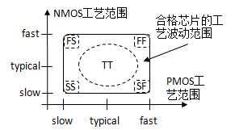
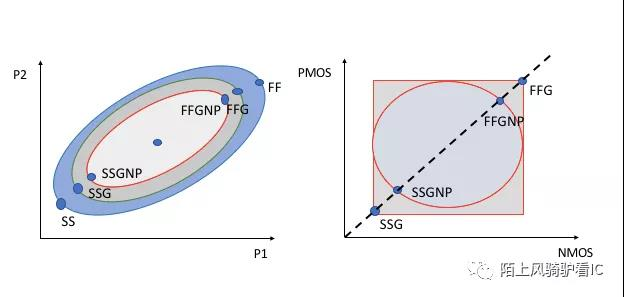

# PDK及IP相关知识

## 目录结构（SMIC28HKD）

SMIC28HKD路径在

```text
/work/home/wumeng/SMIC22_INSTALL/SMIC28HKD_22ULP
```

目录结构如下：

```text
IP
    IO  
    STD  
    Sram Complier
SMIC_CalDRC_28HKD_091825_V1.0_REV2_0_offline241017 # 与设计规则检查（DRC）相关的文件
    1P6M_4Ic_1TMc_1MTTc_ALPA2_offline241017.drc
    ...(*.drc)
SPDK28HKD_0918_OA_CDS_V1.0_REV0_0 # PDK
    smic28HKD_0918_1P8M_6Ic_1TMc_1MTTc_ALPA2_oa_cds_2023_12_15_v1.0_rev0_0
    smic28HKD_0918_1P9M_7Ic_1TMc_1MTTc_ALPA2_oa_cds_2023_12_15_v1.0_rev0_0
TD-LO28-DR-2020_V2 # design rules，里面都是一些gds文件，还有一个详细的说明文档
TD-LO28-DT-2080_V0 
TD-LO28-KA-2129_V0
TD-LO28-LC-2023_V0
TD-LO28-PE-2004_V0
TD-LO28-PE-2005_V0
TD-LO28-SP-2016_V0 # spice model
TD-LO28-TF-2011_V2 # technology file(.tf), layer map(.map), display file(.drf) for Virtuoso
TD-LO28-XC-2066-V1 # calibre XRC 使用说明
```

## 工艺库层级的理解

最底层的大层级是pdk（process design kit，也有fab称为foundry design kit），描述的是模拟版图层级的晶体管级的物理实现，例如源漏栅尺寸、金属层之类的。这是在模拟版图阶段或者数字后端最后阶段会用到的。
往上一个层级是IP（这边暂时称为IP），里面包含了标准单元、IO、sram compiler，这里面描述的层级就到了标准件层级，例如反相器、触发器等等。

## 字母数字组合的意义

### Process Corner（工艺角）

在不同的晶片之间以及在不同的批次之间，MOSFETs参数变化很大。为了在一定程度上减轻电路设计任务的困难，工艺工程师们要保证器件的性能在某个范围内，大体上，他们以报废超出这个性能范围的芯片的措施来严格控制预期的参数变化。通常提供给设计师的性能范围只适用于数字电路并以“工艺角”（Process Corner）的形式给出。如图，其思想是：把NMOS和PMOS晶体管的速度波动范围限制在由四个角所确定的矩形内。这四个角分别是：快NFET和快PFET，慢NFET和慢PFET，快NFET和慢PFET，慢NFET和快PFET。例如，具有较薄的栅氧、较低阈值电压的晶体管，就落在快角附近。





上面这张图的左侧，大致表示了SS, SSG, SSGNP 跟FF, FFG, FFGNP 的相对关系，假设在相同工艺下对相同cell 分别用三种模型做了仿真，则cell delay 的关系为：SSGNP < SSG < SS, FFGNP > FFG > FF.

### PVT（process voltage temperature, 电压温度）

- PVT代表process（工艺），voltage（电压），temperature（温度）。corner（工艺角）是用来表征process的，包括了tt，ff，ss等。
- p是小数点的意思。例如0p88就是0.88V。
- c是摄氏度的意思，m是负号的意思。125c就是125摄氏度，m40或-40就是-40摄氏度。
- VT（阈值电压）
- HVT， LVT， SVT（RVT）是指工艺库中可提供的cell类型，HVT表示高阈值电压，功耗低（因为low leakage）、速度慢，LVT表示低阈值电压，功耗高但速度快，SVT（也有叫RVT）居中。一般在后端优化过程中，会根据timing情况，自动使用上述的几种cell类型，timing紧的地方就选用LVT，timing比较松的地方就是用HVT，即在满足timing的前提下，尽量使用HVT cell，降低功耗。

### best(worst) case

- best case 对应ffg、low temperature、high voltage（可以跑的最高频率）
- worst case 对应ssg、high temperature、low voltage （可以跑的最低频率）

### layer

| 名称 | 描述 | 注释 |
| --- | --- | --- |
| P | poly layers | 多晶硅层 |
| M | total metal layers excluding AL pad/AI RDL | 除了铝焊盘或者铝重布线层外的所有金属层 |
| Ic | Cu inter metal layers (included M1) | 内部铜金属层 |
| TMC | Cu top metal layers | 顶部铜金属层，与内部铜相比，顶层铜会更厚 |
| MTTc | Cu Ultra thick metal | 超厚铜金属层 |
| STMc | Cu 2X top metal layers (0.2um design) | 两倍厚的顶层铜 |
| ALPA | AL pad/AI RDL | 铝焊盘或RDL(全称是 ReDistribution Layer, 是一个可以灵活配置厚度的版层，和最高层是可以分开对待) |
| x | number of poly layers | 多晶硅层数 |
| y | number of total metal layers | 所有金属层数 |
| z | number of top metal layers | 顶层金属层数 |
| w | number of Ultra thick metal layers | 超厚层金属层数 |
| v | number of 2X top metal layers | 两倍厚顶层铜金属层数 |
| u | type of AL, 1 type AL14.5k, 2 type AL28k | 顶层铝金属的厚度，1=14.5KÅ，2=28KÅ |

### 示例一

```text
scc28nhkd_hdc30p140_rvt_ffg_v0p88_-40c.aocv
```

* `scc`: 可能表示该文件属于标准单元库 (Standard Cell Library) 或 SMIC定制单元 (SMIC Custom Cells)。
* `28nm`: 28纳米 (28 nanometer) 工艺节点
* `nhkd`: 这部分可能表示N型高介电常数 (N High-K Dielectric)。在半导体制造中，High-K介电材料常用于栅极电介质。
* `hd`: 可能与高密度单元 (High Density)有关.
* `c30`: 沟长30nm
* `p140`: 
* `rvt`: 常规阈值电压 (Regular Threshold Voltage)。
* `ffg`: 快-快 (Fast-Fast)工艺角，通常用于描述在极端快速工艺条件下的性能。在这种情况下，通常用于最坏情况的时序分析，以确保设计的速度满足要求。
* `v0p88`: 0.88伏特 (0.88 Volts)的操作电压。在文件命名中，"p" 通常用作小数点。
* `-40c`: 负40摄氏度 (-40 degrees Celsius)的操作温度。有些fab会写作`m40c`.
* `.aocv`: 高级片上变异 (Advanced On-Chip Variation)。AOCV是一种在半导体设计中用于更精确地建模和分析芯片内部工艺变异对时序影响的技术，尤其适用于40纳米及以下的高级工艺节点。

### 示例二

```text
smic28HKD_0918_1P8M_6Ic_1TMc_1MTTc_ALPA2_oa_cds_2023_12_15_v1.0_rev0_0
```

- `1P8M`：表示 1 层多晶硅（Poly）和 8 层金属（Metal）的工艺层。
- `6Ic`：表示 6 层互连（Interconnect）。
- `1TMc`：表示 1 层顶部金属（Top Metal）。厚金属层
- `1MTTc`：可能表示 1 层金属到金属的通孔（Metal-to-Metal Through Contact）。超厚金属层

使用的金属层是6+1+1，即M1~M6, TM1, MTT2，一共八层。
说明文件在`/work/home/wumeng/SMIC22_INSTALL/SMIC28HKD_22ULP/TD-LO28-DR-2020_V2/TD-LO28-DR-2020v2.pdf`

### 示例三

## 金属层的分配策略

### (1) 低层金属（M1、M2、M3）

- 标准单元之间的信号布线。
- 特点：布线密度高，适合短距离信号传输。
- 注意事项：避免过度拥挤，防止 DRC 违规。

### (2) 中层金属（M4、M5）

- 中等距离信号布线和电源带。
- 特点：电阻和电容较低，适合中等距离信号传输。
- 注意事项：合理分配电源带和信号布线资源。

### (3) 高层金属（M6、M7、M8 及以上）

- 长距离信号布线、电源网格和时钟树布线。
- 特点：电阻和电容低，适合长距离信号传输和高电流承载。
- 注意事项：优先用于全局电源网络和关键信号布线。

### 示例：典型金属层分配

| 金属层 | 方向 | 用途 |
| --- | --- | --- |
| M1 | 水平 | 标准单元信号布线 |
| M2 | 垂直 | 标准单元信号布线 |
| M3 | 水平 | 中等距离信号布线 |
| M4 | 垂直 | 中等距离信号布线和电源带 |
| M5 | 水平 | 长距离信号布线和电源带 |
| M6 | 垂直 | 电源网格和时钟树布线 |
| M7 | 水平 | 电源网格和时钟树布线 |
| M8 | 垂直 | 电源网格和特殊信号布线 |

## 文件名后缀

1. .lib (Liberty Format)：C家时序库，可读
  - 用于描述标准单元库的时序和功耗信息。EDA 工具使用这些文件进行时序分析和功耗估算。
  - 根据不同的driver model，可以分成三类：Concurrent Current Source (CCS), Effective Current Source Model (ECSM), Non-Linear Delay Model (NLDM)

    | Library Format | Accuracy | Computation Speed | Filesize | Usage |Suitable for Noise & Power Analysis | Definition |
    | --- | --- | --- | --- | --- | --- | --- |
    | CCS | High | Slow | Large | Sign off | Yes | A highly accurate library format using multiple current sources to model the behavior of digital gates. |
    | ECSM | Medium | Moderate | Medium | Large design | Limited | A library format that uses effective current sources to approximate the behavior of digital circuits, balancing accuracy and computational complexity. |
    | NLDM | Low | Fast | Small | Out-dated nodes| No | A library format that models delay and output transition using look-up tables (LUTs) as a function of input slew and output load. |

  - 一般一个lib文件的文件名中就蕴含了一个pvt条件（例如ttg_v0p9_25c），这样的话一个文件就对应了一个pvt条件下的时序和功耗信息。

2. .db (Database)：S家时序库，不可读
  - 通常是 Synopsys 的数据库格式，包含综合后的网表和其他设计信息。
  - Synopsis不读取lib格式，所以需要将lib格式的库文件转换为db格式的库文件。

  ```tcl
  # 启动library compiler shell
  lc_shell 
   
  # 转换
  read_lib xxx.lib 
  write_lib xxx0 -format db -output xxx.db
  # 注意此处的xxx0是原先lib文件中lib名（并非文件名，虽然一般lib名和文件名一样）
  ```

3. .lef (Library Exchange Format)：物理库
  - 包含物理设计信息，如单元的大小、引脚位置和金属层信息。用于布局和布线（Place and Route）工具。是C 家物理库的描述格式。LEF 分为tech lef 跟cell lef 两种，不论是哪个阶段的工具要使用lef 都必须先读入tech lef 再读入cell lef, 因为cell lef 中要引用tech lef 中定义的信息。
  - Tech lef 中定义了metal layer, via, design rule 等信息，请详细研读下面几张从油管上抠出来的图，图中较详细介绍了tech lef, cell lef 各包含哪些信息以及cell lef 跟cell abstract view 的对应关系。

4. .gds (Graphic Data System)：
  - 包含芯片的物理布局信息，用于制造掩模。GDSII 是集成电路设计中的标准格式。

5. .v (Verilog)：
  - 用于描述电路的功能和行为。Verilog 文件通常用于仿真和综合。

6. .cdl (Circuit Description Language)：
  - 包含电路的网表信息，用于 LVS（Layout vs. Schematic）检查。

7. .spice (Simulation Program with Integrated Circuit Emphasis)：
  - 用于电路仿真，描述电路的网表和元件参数。

8. .tcl (Tool Command Language)：
  - 脚本文件，用于自动化 EDA 工具的操作和流程。

9. .def (Design Exchange Format)：
  - 包含设计的物理布局信息，如单元的位置和连接关系。用于布局和布线工具。

10. .sdc (Synopsys Design Constraints)：
  - 包含设计的时序约束信息，用于时序分析和优化。
  - Sdc文件是我们在进行电路RTL设计后，对所做设计进行时序约束的DC综合脚本文件，以便于综合工具按照SDC文件时序约束要求进行电路综合产生电路网表，也会产生相应的sdf文件和sdc文件，此时的sdc文件格式与我们在综合前sdc文件格式上不同，实质上是一样的

11. .sdf (Standard Delay File)：
  - 包含综合后的时序信息，用于时序分析和优化。
  - 我们通过综合工具产生了电路网表和sdf，但此时的sdf时序文件只是粗略的描述了电路上的时序和cell延时，因为此时的网表只是按照RTL设计和时序约束映射成foundry的stand_cell链接关系，没有位置关系；后续的布局布线我们才会定下cell的位置以及cell之间的net长度，由于要修善时序，我们还会做时钟树，也就是在net上加buffer，等等.
  - 即是说我们在做布局布线时会导入综合前或后的sdc文件以及综合网表来产生具有准确时序信息的sdf文件用于后仿真。

11. .spef (Standard Parasitic Exchange Format)：
  - 包含寄生参数信息，用于时序分析和信号完整性检查。
  
12. .map (Mapping File)：
  - 用于映射不同的文件格式或命名约定，通常在 LVS 和 DRC 检查中使用。

13. .aocv (Advanced On-Chip Variation): 
  - 高级片上变异。AOCV是一种在半导体设计中用于更精确地建模和分析芯片内部工艺变异对时序影响的技术，尤其适用于40纳米及以下的高级工艺节点。

## TSMC22安装实录（EDA02）

### path

original pdk installer: 

```text
/data/data_eda2/PDK_Installer/TSMC_22NM_CMOS_RF_ULTRA_LOW_LEAKAGE_0.81.8V_PDK(IPDK)(INCLUDES_CRN22ULL0.82.5V)-20220111
```

pdk&ip installed: 

```text
/data/data_eda2/PDK_Tech/TSMC_22NM_RF_ULL
|
|--Doc
|--PDK: for anything about device(e.g. nmos, pmos) and technology(QRC, StarRC,layermap) you should find it here
|--IP: for memorycompiler(e.g. sram compiler)/stdcell(e.g. DFF, AND, XOR)/stdio(e.g. PAD) you should find it here
```

### part1-PDK

original pdk is `/data/data_eda2/PDK_Installer/TSMC_22NM_CMOS_RF_ULTRA_LOW_LEAKAGE_0.81.8V_PDK(IPDK)(INCLUDES_CRN22ULL0.82.5V)-20220111/PDK`where 2 zip files are included, and main pdk zip is TN22CRSP004W1_1_3_1P1A.zip and the patch is another. 

destination path is `/data/data_eda2/PDK_Tech/TSMC_22NM_RF_ULL/PDK/PDK`

to install another new pdk, e.g., of other metal stack options, you should 

- extract two original zip files into destination dir(first completely extract main pdk zip TN22CRSP004W1_1_3_1P1A.zip where a inner zip is included. within the inner zip are 2 tar.extract them directly and make sure the extracted PDK_doc dir is the same level with tsmcN22 dir. then extract patch tar under main pdk root dir as a patch dir, also the same level as tsmcN22 dir) 
- into the patch dir and install the patch. using perl pdkPatchInstall.pl
- then install the whole pdk using perl pdkInstall.pl(to use cadence virtuoso you should choose pdk type as skill Pcell. LO denoting logic should be chosen instead of RF.)
- after successful installation you should rename the pdk dir based on your installation options such as 0.8V_2.5V_1P9M_6X2R_UT_ALRDL_StarRC_QRC to display detailed pdk info to avoid confusion.

note all options

- io voltage: the higher, the noise resistency and driving capbility is better; the lower, the less power-consuming

- LO/RF: for digital design, LO is preferred usually; you can check it further online.

- 1p8m 5x1z1u:1 poly, 1 metal1, 5 metal layer of x thickness, 1 metal layer of z thickness, and 1 metal layer of u thickness. In most cases, z means top metal layer, u means  ultra thick metal layer.

additional QRC XRC etc can be found in `/data/data_eda2/PDK_Installer/TSMC_22NM_CMOS_RF_ULTRA_LOW_LEAKAGE_0.81.8V_PDK(IPDK)(INCLUDES_CRN22ULL0.82.5V)-20220111/RC_File_20221206`.

1p9m_6x1z1u is the metal option we usually used, install it first.notice that pdk installer does not provide QRC and StarRC for this metal option. you can find them in `/data/data_eda2/PDK_Installer/TSMC_22NM_CMOS_RF_ULTRA_LOW_LEAKAGE_0.81.8V_PDK(IPDK)(INCLUDES_CRN22ULL0.82.5V)-20220111/RC_File_20221206` and extract them in destination pdk dir with new dir name QRC and StarRC.

### part2-IP

#### memory compiler

All original installation tgz is at
`/data/data_eda2/PDK_Installer/TSMC_22NM_CMOS_RF_ULTRA_LOW_LEAKAGE_0.81.8V_PDK(IPDK)(INCLUDES_CRN22ULL0.82.5V)-20220111/Memory_compiler/TS83`

While the same prefix means one category(e.g. CAxxx are about sram_sp_xxxxx while CBxxx are about sram_dp_xxxxx),but you can still view one dir as one specific kind(e.g. CA000 is about sram_sp_uhde_shvt_mvt while CA001 is about sram_sp_hde_shvt_mvt). therefore, it is recommanded that you process one dir(e.g. CA000) at a time. steps are as follows

- copy those CAxxx and other from the original path to destination path like /data/data_eda2/PDK_Tech/TSMC_22NM_RF_ULL/IP/Memory_Compiler.
- copy unpack_sram.sh into CA000 for example, and execute it.
- then sram_sp_uhde_shvt_mvt/ should all be extracted into /data/data_eda2/PDK_Tech/TSMC_22NM_RF_ULL/IP/Memory_Compiler
- delete CAxxx and so on(dont delete them from the original path because that's an original copy)

Note that because the shared hirerachy of each tgz is `arm/tsmc/cln22ul/`, so `arm/tsmc/cln22ul/` structure is abandoned. sram_unpack.sh is as follows

```bash
#!/bin/bash

source_dir="."
target_dir="/data/data_eda2/PDK_Tech/TSMC_22NM_RF_ULL/IP/Memory_Compiler"

mkdir -p "$target_dir"

find "$source_dir" -type f -name "*.tgz" -print0 | while IFS= read -r -d '' tgz_file; do
    echo "Extracting $tgz_file to target directory"
    tar -xzf "$tgz_file" --strip-components=3 -C "$target_dir"
done
```

Currently all CAxxx(single port sram) are processed.

#### std_io

In original path `/data/data_eda2/PDK_Installer/TSMC_22NM_CMOS_RF_ULTRA_LOW_LEAKAGE_0.81.8V_PDK(IPDK)(INCLUDES_CRN22ULL0.82.5V)-20220111/IP`, tpbn22v_110a, tpbn22v_eu_lf_bump_080b, tpbn22v_eu_lf_bump_080b, tphn22ullgv18e_150b the four are std io. Copy them to destination path like `/data/data_eda2/PDK_Tech/TSMC_22NM_RF_ULL/IP/Std_IO`. Execute extract.sh and merge_all.sh in order.(Or you can just use the very bash scripts used in std_cell part, which we will mention it later)

```bash
#!/bin/bash


for dir in */; do
  if [[ -d "$dir" ]]; then

    cd "$dir"

    for file in *.tar.gz; do
      if [[ -f "$file" ]]; then
        filename=$(basename "$file" .tar.gz)

        mkdir "$filename" && tar -xzf "$file" -C "$filename"
        echo "extract $dir $filename\n"
        rm "$file"
      fi
    done
    cd ..
  fi
done
```

```bash
#!/bin/bash

# ---------------------------------------------------------------------------
# Bash Script for Batch Directory Merging (Back_End, Front_End, Documentation) and Cleanup
# Author: Your Name (Optional)
# Date: May 17, 2025
# Description: Navigates into each subdirectory in the current location,
#              merges Back_End, Front_End, and Documentation directories from their
#              ./<first_level_folder>/TSMCHOME/digital/ structures into
#              ./digital/ within that subdirectory, and then removes
#              the original TSMCHOME structure.
# ---------------------------------------------------------------------------

# Exit immediately if a command exits with a non-zero status.
set -e

# Treat unset variables as an error.
set -u

# ---------------------------------------------------------------------------
# Function to process a single root-like directory
# This function expects to be called from inside the directory it should process.
# ---------------------------------------------------------------------------
process_single_directory() {
    local current_root_dir=$(pwd)
    echo "-> Processing directory: ${current_root_dir}"

    # Define the target directories relative to the current directory (root)
    local TARGET_DIGITAL_DIR="./digital"
    local TARGET_BACKEND_DIR="${TARGET_DIGITAL_DIR}/Back_End"
    local TARGET_FRONTEND_DIR="${TARGET_DIGITAL_DIR}/Front_End"
    local TARGET_DOCUMENTATION_DIR="${TARGET_DIGITAL_DIR}/Documentation" # Added Documentation target

    # ---------------------------------------------------------------------------
    # Step 1: Create the target base directories if they don't exist
    # ---------------------------------------------------------------------------
    echo "  Ensuring target directories exist:"
    echo "    - ${TARGET_BACKEND_DIR}"
    echo "    - ${TARGET_FRONTEND_DIR}"
    echo "    - ${TARGET_DOCUMENTATION_DIR}" # Added Documentation target creation
    # Use -p to create parent directories as needed and avoid errors if they exist
    mkdir -p "${TARGET_BACKEND_DIR}" "${TARGET_FRONTEND_DIR}" "${TARGET_DOCUMENTATION_DIR}"
    echo "  Target directories are ready."

    # ---------------------------------------------------------------------------
    # Step 2: Iterate through all items in the current directory
    # ---------------------------------------------------------------------------
    echo "  Scanning for first-level subfolders within ${current_root_dir}..."

    # Loop through all items in the current directory (*)
    for item in *; do
        # Check if the item is a directory AND it's not our target 'digital' directory
        if [ -d "$item" ] && [ "$item" != "$(basename "$TARGET_DIGITAL_DIR")" ]; then
            echo "  Processing subfolder: ${item}"

            # Define the expected source directories within this subfolder
            local SOURCE_BACKEND_DIR="${item}/TSMCHOME/digital/Back_End"
            local SOURCE_FRONTEND_DIR="${item}/TSMCHOME/digital/Front_End"
            local SOURCE_DOCUMENTATION_DIR="${item}/TSMCHOME/digital/Documentation" # Added Documentation source
            local CLEANUP_SOURCE_TSMCHOME="${item}/TSMCHOME" # The directory to clean up

            local merged_anything=0 # Flag to check if we found anything to merge

            # -------------------------------------------------------------------
            # Step 3: Check for and merge Back_End directory
            # -------------------------------------------------------------------
            if [ -d "$SOURCE_BACKEND_DIR" ]; then
                echo "    Found Back_End source: ${SOURCE_BACKEND_DIR}"
                echo "    Merging contents to: ${TARGET_BACKEND_DIR}"
                rsync -av "${SOURCE_BACKEND_DIR}/" "${TARGET_BACKEND_DIR}/"
                echo "    Back_End merge complete for ${item}."
                merged_anything=1
            else
                echo "    Back_End source not found in ${item} (looked for ${SOURCE_BACKEND_DIR}). Skipping."
            fi

            # -------------------------------------------------------------------
            # Step 4: Check for and merge Front_End directory
            # -------------------------------------------------------------------
            if [ -d "$SOURCE_FRONTEND_DIR" ]; then
                echo "    Found Front_End source: ${SOURCE_FRONTEND_DIR}"
                echo "    Merging contents to: ${TARGET_FRONTEND_DIR}"
                rsync -av "${SOURCE_FRONTEND_DIR}/" "${TARGET_FRONTEND_DIR}/"
                echo "    Front_End merge complete for ${item}."
                merged_anything=1
            else
                echo "    Front_End source not found in ${item} (looked for ${SOURCE_FRONTEND_DIR}). Skipping."
            fi

            # -------------------------------------------------------------------
            # Step 5: Check for and merge Documentation directory (Added)
            # -------------------------------------------------------------------
            if [ -d "$SOURCE_DOCUMENTATION_DIR" ]; then
                echo "    Found Documentation source: ${SOURCE_DOCUMENTATION_DIR}"
                echo "    Merging contents to: ${TARGET_DOCUMENTATION_DIR}"
                rsync -av "${SOURCE_DOCUMENTATION_DIR}/" "${TARGET_DOCUMENTATION_DIR}/"
                echo "    Documentation merge complete for ${item}."
                merged_anything=1
            else
                echo "    Documentation source not found in ${item} (looked for ${SOURCE_DOCUMENTATION_DIR}). Skipping."
            fi


            # -------------------------------------------------------------------
            # Step 6: Clean up the source TSMCHOME structure after attempting merge
            # -------------------------------------------------------------------
            # Clean up if the TSMCHOME structure exists.
            if [ -d "$CLEANUP_SOURCE_TSMCHOME" ]; then
               echo "    Cleaning up source structure: ${CLEANUP_SOURCE_TSMCHOME}"
               # !!! BE EXTREMELY CAREFUL WITH rm -rf !!!
               # This command will permanently delete the directory and its contents.
               # Consider adding a prompt here for safety if you uncomment the rm line below.
               # read -p "    Confirm removal of ${CLEANUP_SOURCE_TSMCHOME}? (y/n) " confirm
               # if [[ "$confirm" == [yY] ]]; then
               #    rm -rf "${CLEANUP_SOURCE_TSMCHOME}"
               #    echo "    Removed."
               # else
               #    echo "    Skipping removal."
               # fi
               # --- Uncomment the direct removal below if you are confident ---
               rm -rf "${CLEANUP_SOURCE_TSMCHOME}"
               echo "    Removed."
            else
               echo "    Source TSMCHOME structure not found for cleanup: ${CLEANUP_SOURCE_TSMCHOME}. Skipping cleanup."
            fi


        else
            # Skip items that are not directories or are the target 'digital' directory
            echo "  Skipping non-directory or target item within ${current_root_dir}: ${item}"
        fi
    done

    echo "-> Finished processing directory: ${current_root_dir}"
}

# ---------------------------------------------------------------------------
# Main script execution starts here
# This part iterates through subdirectories in the current location
# ---------------------------------------------------------------------------

echo "Starting batch directory merge (Back_End, Front_End, Documentation) and cleanup process..."
echo "Script is running from: $(pwd)"
echo "Will process all subdirectories found in the current location."
echo ""
echo "!!! WARNING: This script will permanently delete source TSMCHOME directories !!!"
echo "!!!          Ensure you have a backup before proceeding!                   !!!"
echo ""
# Optional: Add a delay or confirmation here before starting
# read -p "Press Enter to start the process or Ctrl+C to abort..."

# Iterate through all items in the current directory (the parent level)
for project_dir in *; do
    # Check if the item is a directory AND it's not the script file itself
    if [ -d "$project_dir" ] && [ "$project_dir" != "$(basename "$0")" ]; then
        echo "--------------------------------------------------"
        # Use pushd/popd to safely change directory and return
        if pushd "$project_dir" > /dev/null; then # > /dev/null suppresses pushd output
            # Call the function to process the current directory
            process_single_directory
            # Return to the previous directory (where the script is running from)
            popd > /dev/null # > /dev/null suppresses popd output
        else
            echo "Error: Could not enter directory ${project_dir}. Skipping."
            # If pushd failed, we are still in the original directory, no need for popd
        fi
        echo "--------------------------------------------------"
        echo ""
    else
        # Skip items that are not directories or are the script file itself
        echo "Skipping non-directory or script file: ${project_dir}"
    fi
done

echo "Batch directory merge and cleanup process finished for all subdirectories."

# ---------------------------------------------------------------------------
# End of Script
# ---------------------------------------------------------------------------
```

#### std_cell

In original path `/data/data_eda2/PDK_Installer/TSMC_22NM_CMOS_RF_ULTRA_LOW_LEAKAGE_0.81.8V_PDK(IPDK)(INCLUDES_CRN22ULL0.82.5V)-20220111/IP`, except for tpbn22v_110a, tpbn22v_eu_lf_bump_080b, tpbn22v_eu_lf_bump_080b, tphn22ullgv18e_150b which are std io, all others are std cell ip. Copy them to destination path like `/data/data_eda2/PDK_Tech/TSMC_22NM_RF_ULL/IP/Std_Cell`. Execute untar.sh then.

```bash
#!/bin/bash

# Loop through all directories in the current directory
for dir in */; do
    # Check if the item is indeed a directory
    if [ -d "$dir" ]; then
        echo "Entering directory: $dir"
        # Change into the directory, exit if failed
        cd "$dir" || exit

        # Loop through all .tar.gz files in the current directory
        for tar_file in *.tar.gz; do
            # Check if the item is indeed a regular file
            if [ -f "$tar_file" ]; then
                echo "Extracting file: $tar_file to current directory..."
                # Extract the tar.gz file
                tar -xzf "$tar_file"

                # Check if extraction was successful
                if [ $? -eq 0 ]; then
                    echo "Extraction successful, deleting archive: $tar_file"
                    # Remove the original tar.gz file
                    rm "$tar_file"
                else
                    echo "Extraction failed: $tar_file"
                fi
            fi
        done
        echo "Exiting directory: $dir"
        # Go back to the parent directory, exit if failed
        cd .. || exit
    fi
done

echo "All .tar.gz files processed."
```

Note that tar format is different from zip format. It is allowed for several tar files share the same prefix directory structure and when you extract them together, the directory structure will be preserved and merged automatically. That's why the IP libraries are usually archived into tar.gz format. You just directly extract them where they are, and the shared prefix directories are merged automatically. Don't complicate things by trying to extract them into a different directory structure.