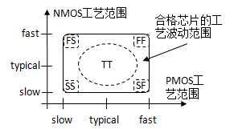
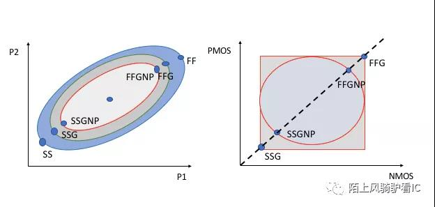

# SMIC28HKD

## 工艺库路径

```text
/work/home/wumeng/SMIC22_INSTALL/SMIC28HKD_22ULP
```

## 目录结构

```text
IP
    IO  
    STD  
    Sram Complier
SMIC_CalDRC_28HKD_091825_V1.0_REV2_0_offline241017 # 与设计规则检查（DRC）相关的文件
    1P6M_4Ic_1TMc_1MTTc_ALPA2_offline241017.drc
    ...(*.drc)
SPDK28HKD_0918_OA_CDS_V1.0_REV0_0 # PDK
    smic28HKD_0918_1P8M_6Ic_1TMc_1MTTc_ALPA2_oa_cds_2023_12_15_v1.0_rev0_0
    smic28HKD_0918_1P9M_7Ic_1TMc_1MTTc_ALPA2_oa_cds_2023_12_15_v1.0_rev0_0
TD-LO28-DR-2020_V2 # design rules，里面都是一些gds文件，还有一个详细的说明文档
TD-LO28-DT-2080_V0 
TD-LO28-KA-2129_V0
TD-LO28-LC-2023_V0
TD-LO28-PE-2004_V0
TD-LO28-PE-2005_V0
TD-LO28-SP-2016_V0 # spice model
TD-LO28-TF-2011_V2 # technology file(.tf), layer map(.map), display file(.drf) for Virtuoso
TD-LO28-XC-2066-V1 # calibre XRC 使用说明
```

## 工艺库层级的理解

最底层的大层级是pdk（process design kit），描述的是模拟版图层级的晶体管级的物理实现，例如源漏栅尺寸、金属层之类的。这是在模拟版图阶段或者数字后端最后阶段会用到的。
往上一个层级是IP（这边暂时称为IP），里面包含了标准单元、IO、sram compiler，这里面描述的层级就到了标准件层级，例如反相器、触发器等等。里面应该包含了这个层级的单元的属性，例如查找表形式的

## 字母数字组合的意义

```text
scc28nhkd_hdc30p140_rvt_ffg_v0p88_-40c.aocv
```

### Process Corner（工艺角）

在不同的晶片之间以及在不同的批次之间，MOSFETs参数变化很大。为了在一定程度上减轻电路设计任务的困难，工艺工程师们要保证器件的性能在某个范围内，大体上，他们以报废超出这个性能范围的芯片的措施来严格控制预期的参数变化。通常提供给设计师的性能范围只适用于数字电路并以“工艺角”（Process Corner）的形式给出。如图，其思想是：把NMOS和PMOS晶体管的速度波动范围限制在由四个角所确定的矩形内。这四个角分别是：快NFET和快PFET，慢NFET和慢PFET，快NFET和慢PFET，慢NFET和快PFET。例如，具有较薄的栅氧、较低阈值电压的晶体管，就落在快角附近。





上面这张图的左侧，大致表示了SS, SSG, SSGNP 跟FF, FFG, FFGNP 的相对关系，假设在相同工艺下对相同cell 分别用三种模型做了仿真，则cell delay 的关系为：SSGNP < SSG < SS, FFGNP > FFG > FF.

### PVT（process voltage temperature, 电压温度）

- PVT代表process（工艺），voltage（电压），temperature（温度）。corner（工艺角）是用来表征process的，包括了tt，ff，ss等。
- p是小数点的意思。例如0p88就是0.88V。
- c是摄氏度的意思，m是负号的意思。125c就是125摄氏度，m40或-40就是-40摄氏度。
- VT（阈值电压）
- HVT， LVT， SVT（RVT）是指工艺库中可提供的cell类型，HVT表示高阈值电压，功耗低（因为low leakage）、速度慢，LVT表示低阈值电压，功耗高但速度快，SVT（也有叫RVT）居中。一般在后端优化过程中，会根据timing情况，自动使用上述的几种cell类型，timing紧的地方就选用LVT，timing比较松的地方就是用HVT，即在满足timing的前提下，尽量使用HVT cell，降低功耗。

### best(worst) case

- best case 对应ffg、low temperature、high voltage（可以跑的最高频率）
- worst case 对应ssg、high temperature、low voltage （可以跑的最低频率）

```text
smic28HKD_0918_1P8M_6Ic_1TMc_1MTTc_ALPA2_oa_cds_2023_12_15_v1.0_rev0_0
```

### layer

这次我们使用的金属层是6+1+1，即M1~M6, TM1, MTT2，一共八层。
说明文件在

```text
 /work/home/wumeng/SMIC22_INSTALL/SMIC28HKD_22ULP/TD-LO28-DR-2020_V2/TD-LO28-DR-2020v2.pdf
 ```

- 1P8M：表示 1 层多晶硅（Poly）和 8 层金属（Metal）的工艺层。
- 6Ic：表示 6 层互连（Interconnect）。
- 1TMc：可能表示 1 层顶部金属（Top Metal）。厚金属层
- 1MTTc：可能表示 1 层金属到金属的通孔（Metal-to-Metal Through Contact）。超厚金属层

| 名称 | 描述 | 注释 |
| --- | --- | --- |
| P | poly layers | 多晶硅层 |
| M | total metal layers excluding AL pad/AI RDL | 除了铝焊盘或者铝重布线层外的所有金属层 |
| Ic | Cu inter metal layers (included M1) | 内部铜金属层 |
| TMC | Cu top metal layers | 顶部铜金属层，与内部铜相比，顶层铜会更厚 |
| MTTc | Cu Ultra thick metal | 超厚铜金属层 |
| STMc | Cu 2X top metal layers (0.2um design) | 两倍厚的顶层铜 |
| ALPA | AL pad/AI RDL | 铝焊盘或RDL(全称是 ReDistribution Layer, 是一个可以灵活配置厚度的版层，和最高层是可以分开对待) |
| x | number of poly layers | 多晶硅层数 |
| y | number of total metal layers | 所有金属层数 |
| z | number of top metal layers | 顶层金属层数 |
| w | number of Ultra thick metal layers | 超厚层金属层数 |
| v | number of 2X top metal layers | 两倍厚顶层铜金属层数 |
| u | type of AL, 1 type AL14.5k, 2 type AL28k | 顶层铝金属的厚度，1=14.5KÅ，2=28KÅ |

### 金属层的分配策略

#### (1) 低层金属（M1、M2、M3）

- 标准单元之间的信号布线。
- 特点：布线密度高，适合短距离信号传输。
- 注意事项：避免过度拥挤，防止 DRC 违规。

#### (2) 中层金属（M4、M5）

- 中等距离信号布线和电源带。
- 特点：电阻和电容较低，适合中等距离信号传输。
- 注意事项：合理分配电源带和信号布线资源。

#### (3) 高层金属（M6、M7、M8 及以上）

- 长距离信号布线、电源网格和时钟树布线。
- 特点：电阻和电容低，适合长距离信号传输和高电流承载。
- 注意事项：优先用于全局电源网络和关键信号布线。

#### 示例：典型金属层分配

| 金属层 | 方向 | 用途 |
| --- | --- | --- |
| M1 | 水平 | 标准单元信号布线 |
| M2 | 垂直 | 标准单元信号布线 |
| M3 | 水平 | 中等距离信号布线 |
| M4 | 垂直 | 中等距离信号布线和电源带 |
| M5 | 水平 | 长距离信号布线和电源带 |
| M6 | 垂直 | 电源网格和时钟树布线 |
| M7 | 水平 | 电源网格和时钟树布线 |
| M8 | 垂直 | 电源网格和特殊信号布线 |

## 文件名后缀

1. .lib (Liberty Format)：C家时序库，可读
  - 用于描述标准单元库的时序和功耗信息。EDA 工具使用这些文件进行时序分析和功耗估算。
2. .db (Database)：S家时序库，不可读
  - 通常是 Synopsys 的数据库格式，包含综合后的网表和其他设计信息。
3. .lef (Library Exchange Format)：物理库
  - 包含物理设计信息，如单元的大小、引脚位置和金属层信息。用于布局和布线（Place and Route）工具。是C 家物理库的描述格式。LEF 分为tech lef 跟cell lef 两种，不论是哪个阶段的工具要使用lef 都必须先读入tech lef 再读入cell lef, 因为cell lef 中要引用tech lef 中定义的信息。
  - Tech lef 中定义了metal layer, via, design rule 等信息，请详细研读下面几张从油管上抠出来的图，图中较详细介绍了tech lef, cell lef 各包含哪些信息以及cell lef 跟cell abstract view 的对应关系。
4. .gds (Graphic Data System)：
  - 包含芯片的物理布局信息，用于制造掩模。GDSII 是集成电路设计中的标准格式。
5. .v (Verilog)：
  - 用于描述电路的功能和行为。Verilog 文件通常用于仿真和综合。
6. .cdl (Circuit Description Language)：
  - 包含电路的网表信息，用于 LVS（Layout vs. Schematic）检查。
7. .spice (Simulation Program with Integrated Circuit Emphasis)：
  - 用于电路仿真，描述电路的网表和元件参数。
8. .tcl (Tool Command Language)：
  - 脚本文件，用于自动化 EDA 工具的操作和流程。
9. .def (Design Exchange Format)：
  - 包含设计的物理布局信息，如单元的位置和连接关系。用于布局和布线工具。
10. .sdc (Synopsys Design Constraints)：
  - 包含设计的时序约束信息，用于时序分析和优化。
11. .spef (Standard Parasitic Exchange Format)：
  - 包含寄生参数信息，用于时序分析和信号完整性检查。
12. .map (Mapping File)：
  - 用于映射不同的文件格式或命名约定，通常在 LVS 和 DRC 检查中使用。

