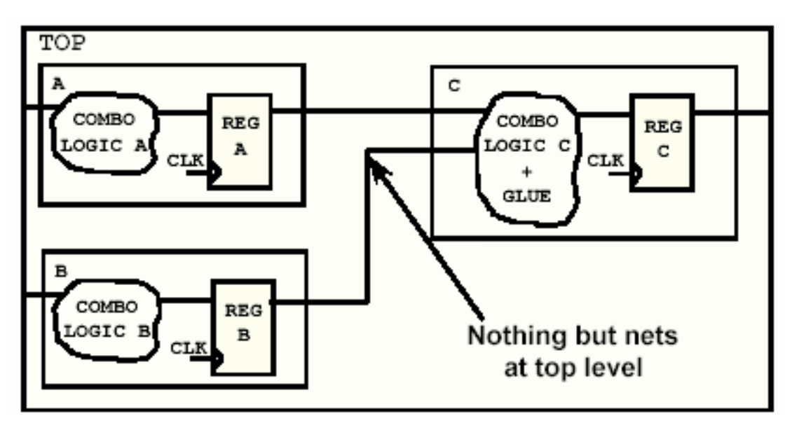

# verilog规范

## naming and file

- 一个文件最多包含一个module
- 每个文件都要有一个文件头，包含文件名，作者，日期，目的，参数描述
- 采用小写字母定义wire，reg和input/output
- 采用大写字母定义参数，参数名小于20个字母，例如"parameter PARAM = 2'b00"
- 对齐；
- 避免用tab，因为不同系统中tab的间距不一样
- 使用降序定义向量位宽，最低位为0，例如"wire [3:0] vector"
- 所有文件使用UTF-8格式进行编码

## reliability

- 条件表达式应该只有一位
  > dont use `if (data)`, use `if (data > 0)` instead.
- 所有未使用的端口必须有一个驱动，不能悬空
- 状态机必须有一个默认的状态，防止陷入混乱
- if和case语句要写全所有情况，避免产生latch
- 组合逻辑always块用阻塞语句，时序逻辑always块用非阻塞语句
- 内部延时赋值时不可综合的，会被综合工具忽略
- 避免将时钟信号作为数据信号输入
- 避免使用inout端口
- 不要在时钟/复位路径上添加任何buffer（即让原始的时钟/复位信号穿过任何逻辑再输出到其他模块作为时钟/复位）

## DFT

- 避免使用三态器件
- 避免使用双向网线
- 避免使用锁存器、clock gating
- 避免使用双沿时钟
- 避免使用内部产生的时钟和复位信号
- 避免常量输入和悬浮输出

## IP

- 输出端口信号必须是寄存器

  

  > 上图中的组合逻辑电路存在于寄存器A 与寄存器C 之间，它同时穿过了模块A、模块B 以及模块C。
  > 前面提到了，如果直接将这样的划分交给DC 综合，那么综合后的电路将仍旧保持上面的层次关系，即端口定义不会改变。
  > 这样的话，DC 在作组合电路的优化的时候就会分别针对A、B、C 三块电路进行，这样势必会影响到DC 的优化能力，不必要的增加了这条路径的延时和面积。

  

  > 在这张图里，组合逻辑被划到了C 模块中，它不仅能保证组合的最佳优化还能保证时序的最佳优化，因为里面的寄存器在优化的过程中
  > 可以吸收前面的组合逻辑，从而形成其他形式的时序元件，如由原先的D 触发器变成JK 触发器、T 触发器、带时钟使能端的触发器等等。 
  > 这样工艺库中的大量的时序单元都可以得到充分的利用了。

- 避免手动clock gating，应该让eda做
- 必须有复位信号
- 避免使用与工艺有关的特定标准单元
- ip的接口应使用总线
- 硬ip的长宽应接近1：1
- 硬ip应尽量保留上层绕线资源
- 硬ip的管脚应该在不同的方向预留金属层

## top

- 顶层模块仅仅是例化子模块并拼接在一起，不应该独立的电路结构（组合逻辑等）
  
  > 一个与非门连接了A、B、C 三个模块，同样的不难看出来，它也会影响到C 的组合逻辑的优化。一般这种情况只会在至下而上的综合策略中才出现。可以通过把与非门吸收到C 中的组合逻辑的方法消除粘滞逻辑.这样的另一个好处是可以使得在至下而上的设计策略中不需要编译顶层模块。
  
  