# AMS数模混合仿真

本文以数字激励源模块与模拟原理图模块混合仿真为例。首先需要在virtuoso中创建testbench所在的library，并准备好待验证模拟模块。我们知道在全模拟流程的testbench本身schematic中，会调用DUT（design under test，待检测模块）并搭建全模拟激励源，现在只是将激励源换成verilog描述的模块进行调用。

## 1. 使用verilog编写数字激励源cell

新建一个cellview，作为verilog描述的激励源。这里命名为`source_1`

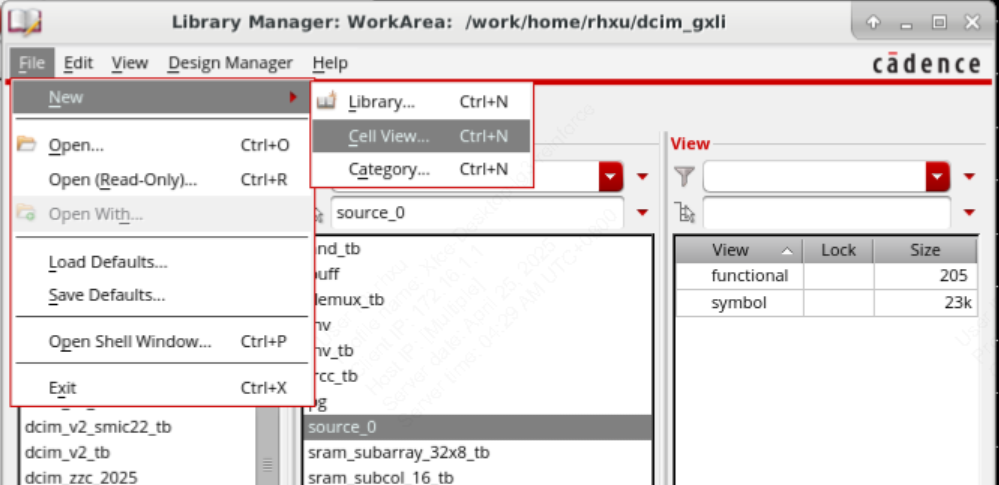

`Type`选择`Verilog`，按Ok

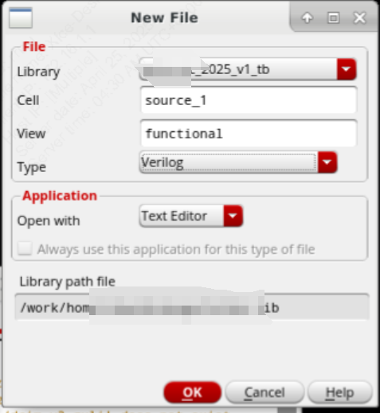

填写完毕后保存，并选择`Build a database of instances, nets and pins found in file`.然后在弹出的对话框`Cellview synbol does not exist`中选择yes。然后就可以看到`source_1`这个cell已经产生了symbol的view。

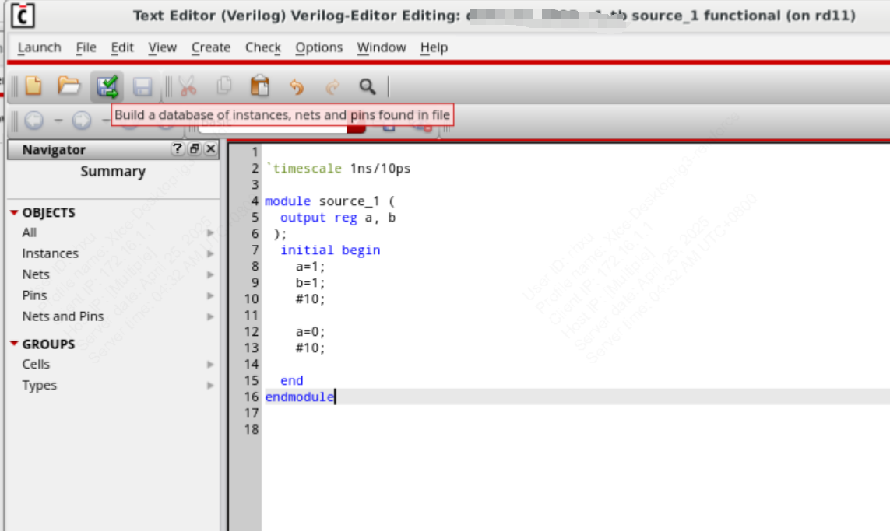

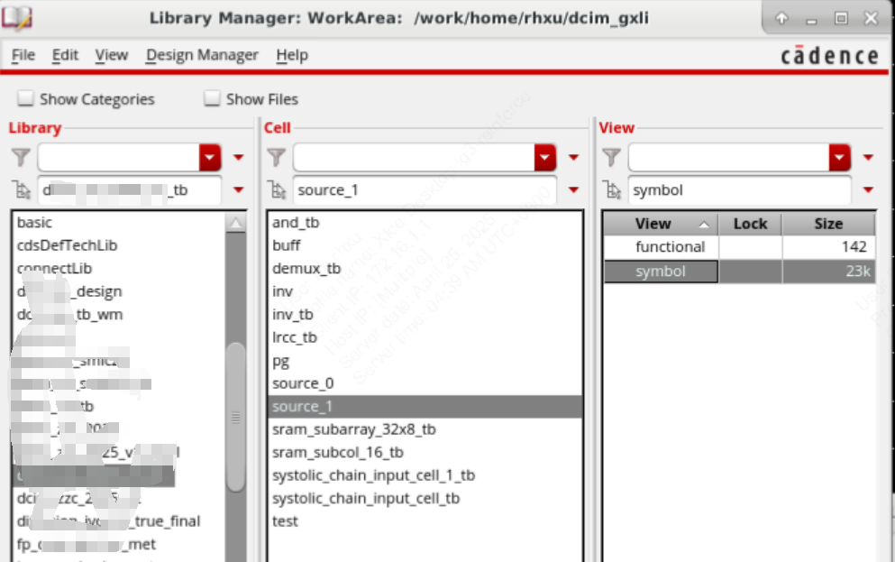

## 2. 画testbench原理图

在testbench的库中新建一个cellview作为tb的cell，这里命名为`and_tb`，画tb原理图。画完后保存。

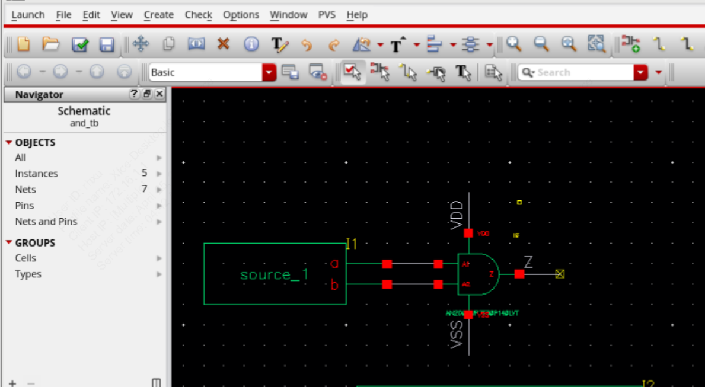

## 3. 设置testbench的config

画完原理图后，在原理图的界面上方选项卡中，`File`->`New...`，新建一个Type为`config`的view。注意Cell的名称和tb的名称一样，也就是为刚才创建的tb的cell新增一个config的view。

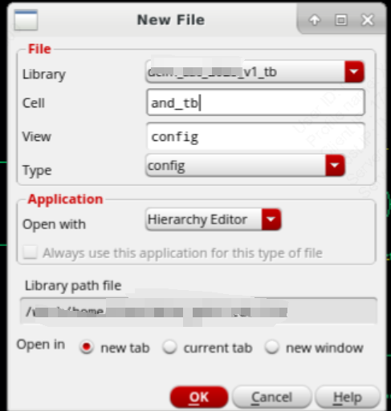

然后在弹出的界面中View选择schematic，按`Use Template`

然后选择AMS的仿真器后按OK

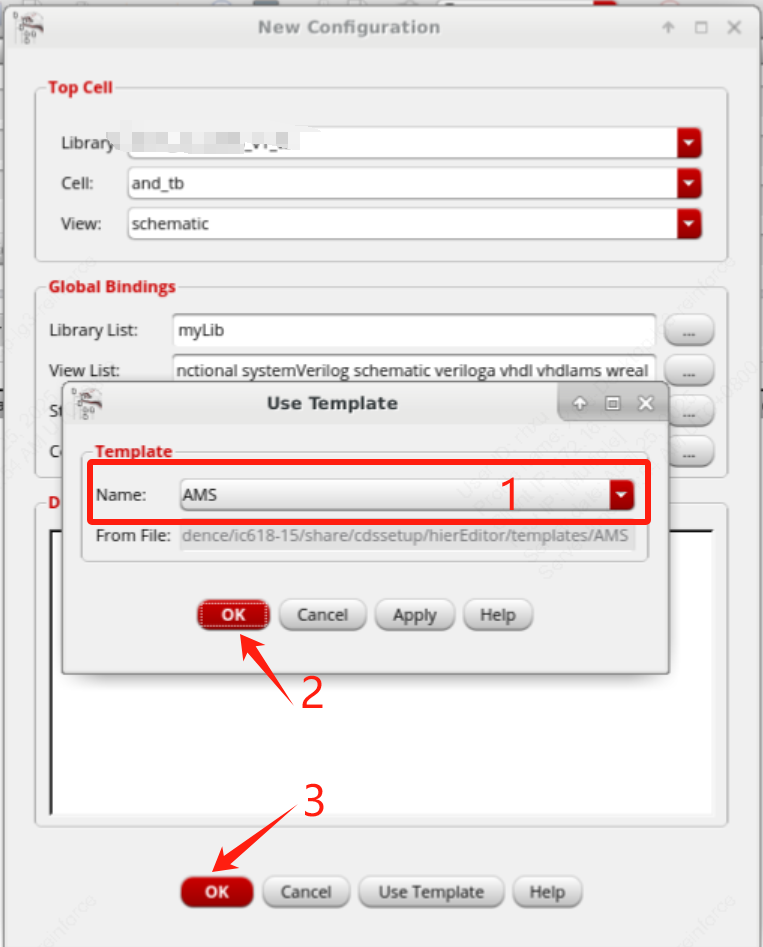

对config进行保存

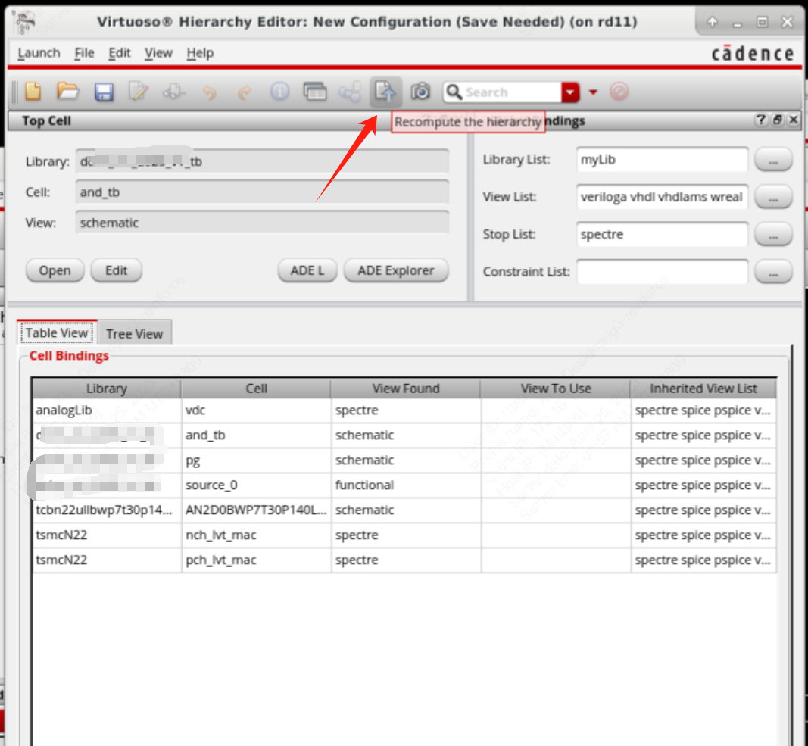

## 4. 打开ADE L并设置AMS

打开ADE L

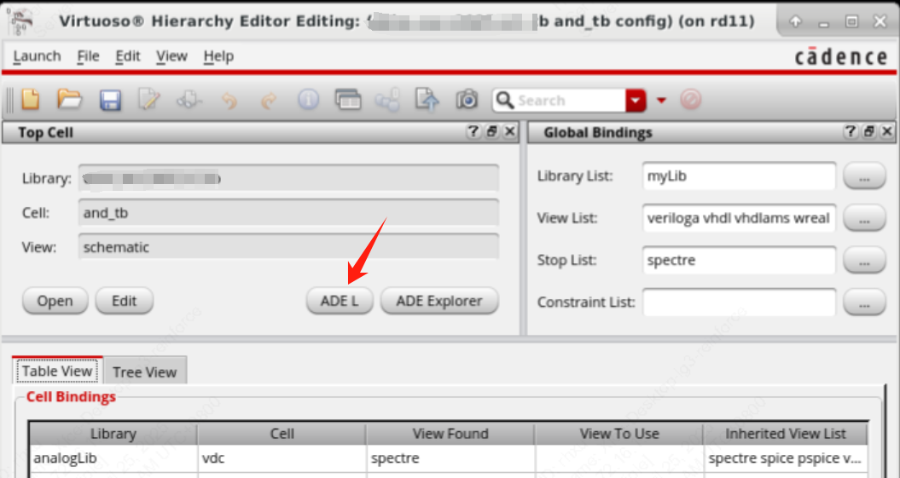

选择数字模块供电电压

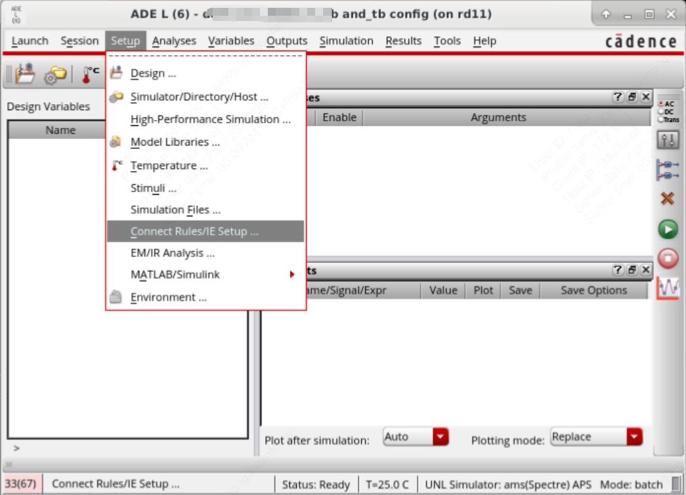

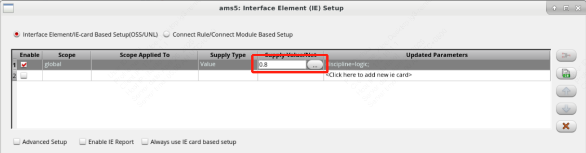

然后就可以按照正常的ADE仿真流程来做仿真了。
