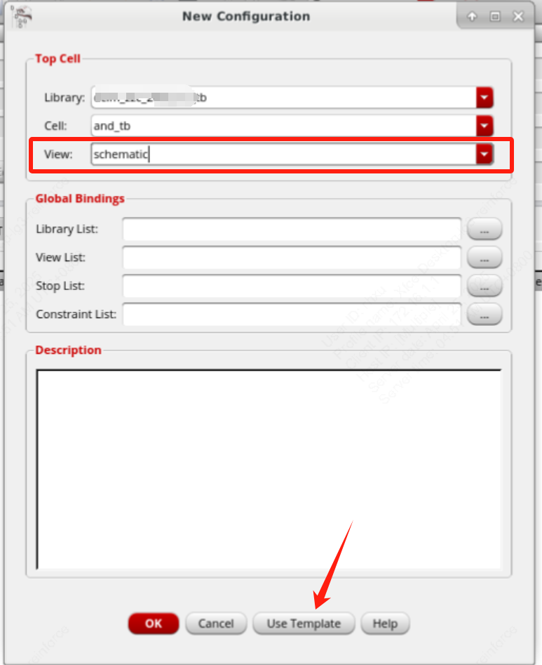
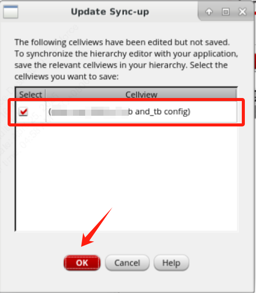

# AMS数模混合仿真

本文以数字激励源模块与模拟原理图模块混合仿真为例。首先需要在virtuoso中创建testbench所在的library，并准备好待验证模拟模块。我们知道在全模拟流程的testbench本身schematic中，会调用DUT（design under test，待检测模块）并搭建全模拟激励源，现在只是将激励源换成verilog描述的模块进行调用。

## 1. 使用verilog编写数字激励源cell

新建一个cellview，作为verilog描述的激励源。这里命名为`source_1`

`Type`选择`Verilog`，按Ok

填写完毕后保存，并选择`Build a database of instances, nets and pins found in file`.然后在弹出的对话框`Cellview synbol does not exist`中选择yes。然后就可以看到`source_1`这个cell已经产生了symbol的view。

## 2. 画testbench原理图

在testbench的库中新建一个cellview作为tb的cell，这里命名为`and_tb`，画tb原理图。画完后保存。

## 3. 设置testbench的config

画完原理图后，在原理图的界面上方选项卡中，`File`->`New...`，新建一个Type为`config`的view。注意Cell的名称和tb的名称一样，也就是为刚才创建的tb的cell新增一个config的view。

然后在弹出的界面中View选择schematic，按`Use Template`

然后选择AMS的仿真器后按OK

对config进行保存

## 4. 打开ADE L并设置AMS

打开ADE L

选择数字模块供电电压

然后就可以按照正常的ADE仿真流程来做仿真了。

## 附录：ADE中各仿真器的区别

Q1: 在ADE里选择Simulator的时候，有hspiceD，spectre，UltraSim以及APS可供选择。在什么情况下选择合适的Simulator以保证仿真的有效性呢？

A1：选哪个仿真器取决于你的服务器上安装了什么。

hspiceD不是真正的仿真器，而是Cadence在ADE中为调用Synopsys家的Hspice而做的一个接口，其中“D”的意思是“Direct”，意思就是，可以直接调用Hspice完成仿真。毕竟在过去很长的一段时间里，Hspice都是工业界对于仿真器的事实标准。换言之，使用hspiceD的前提是，你的服务器上已经安装了Hspice。

但是，这个接口能够实现的功能非常有限，无法发挥Hspice的完整功能，更何况，近年来因为性能改善以及与virtuoso平台的深度绑定，Cadence的spectre仿真器已经逐渐有取代Hspice成为工业界标准的趋势。现在用Hspice的人在逐渐减少，而且即便是用Hspice仿真的工程师，大多也只是用hspiceD这个接口来生成电路网表，然后用命令行调用Hspice完成仿真，何况Hspice还提供了ADE UI Interface，功能完善得多。

spectre和Ultrasim都是Cadence家的仿真器，其中spectre是精确模拟仿真器，一般模拟电路仿真都用它；而Ultrasim是快速仿真器，一般用在大规模的、尤其是混合信号电路的前、后仿验证。

目前ultrasim早已落伍，甚至已经不再维护。之前Cadence在推出IC610平台时，将spectre和ultrasim合并为MMSIM6.1，而MMSIM的最后一个版本是15.1，到下一版就改名叫Spectre16了，而到了Spectre19，软件包中就已经不包含ultrasim了，已经彻底被抛弃。

APS全名是spectre Accelerated Parallel Simulator，是Cadence基于spectre开发的针对多线程仿真的优化，在保持精度的同时，大大加快了spectre仿真的速度，一般都可以用它来替代纯粹的spectre.

> https://bbs.eetop.cn/thread-958618-1-1.html

Q2: 如何将ADE中默认的ams仿真环境设为默认spectre仿真器？

A2：在启动目录的.cdsinit文件里加入以下环境变量：`envSetVal("hed.ade" "setAmsSimulator" 'boolean nil)`

> https://community.cadence.com/cadence_technology_forums/f/custom-ic-design/38452/preventing-the-config-view-from-defaulting-to-ams

Q3: 怎么把默认的APS mode切换成spectre mode?

A3：在启动目录的.cdsinit文件里加入以下环境变量：`envSetVal("spectre.turboOpts" "uniMode"  'string   "Spectre")`

> https://community.cadence.com/cadence_technology_forums/f/custom-ic-design/57242/changing-default-simulator-from-aps-to-spectre
