# Synthesis using Design Compiler

2025.1.23

## 概述

逻辑综合（synthesis）就是将前端设计工程师编写的RTL代码，映射到特定的工艺库上，通过添加约束信息，对RTL代码进行逻辑优化，形成门级网表。 对于逻辑综合步骤来说，我们通常使用的工具为Design Compiler，将一个RTL code在DC里做综合时，工具会先将代码转换成一个GTECH网表（generic technology （GTECH）netlist），然后在映射不同的工艺库形成真正的门级网表。

逻辑综合分为三个阶段：

- 转译（Translation）：把电路转换为EDA内部数据库(GTECH)，这个数据库跟工艺库是独立无关的；
- 链接（Linking）：link是介于Translate和Compile之间的一个小的步骤，主要目的在于解决设计中所有的reference。设计中的所有instances必须要找到它们自己的定义。这些instances可以分为三类：已经Translate的GTECH网表、stdcell、macros（RAM、ROM、IP、etc）
- 优化（Optimization）：根据工作频率、面积、功耗来对电路优化，来推断出满足设计指标要求(sdc约束)的门级网表；
- 映射（Mapping）：将门级网表映射到晶圆厂给定的工艺库上，最终形成该工艺库对应的门级网表。优化和映射可以合称为编译（compile）。

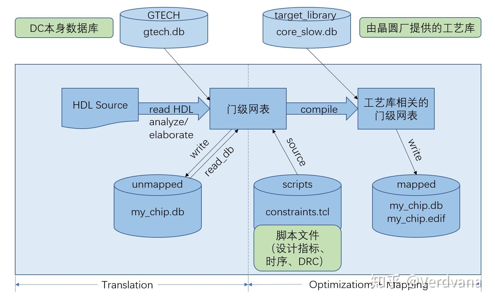

DC在综合过程中会把电路划分为以下处理对象：

- Design：A circuit that performs one or more logicafunctions
- Cell：An instance of a design or library primitivewithin a design
- Reference：The name of the original design that a cellinstance "points to"
- Port：The input or output of a design
- Pin: The input or output of a cell
- Net：The wire that connects ports to pins and/or pinsto each other
- Clock：A timing reference object in DC memory whichdescribes a waveform for timing analysis
- Library：A collection of cells and their associated metadata

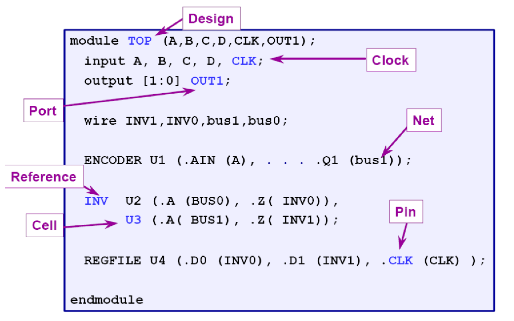

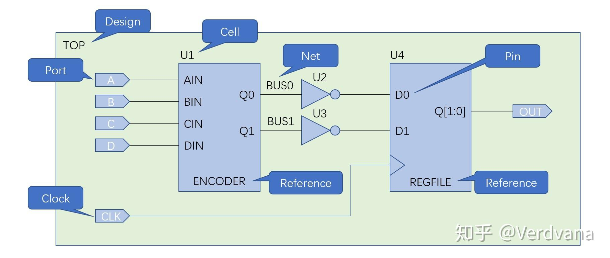

## 流程

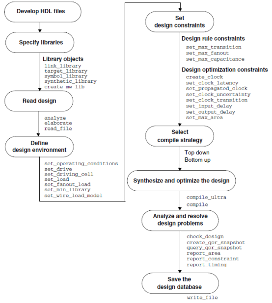

可以写一个makefile：

```makefile
dc:
    dc_shell -f tcl/synthesis.tcl | tee ./dc.log
```

### 预综合过程（Pre-Synthesis Processes）：在综合过程之前的一些为综合做准备的步骤

#### DC启动

如果要一行一行地输tcl命令，可以启动dc_shell:

```tcl
dc_shell
```

#### 设置各种库文件

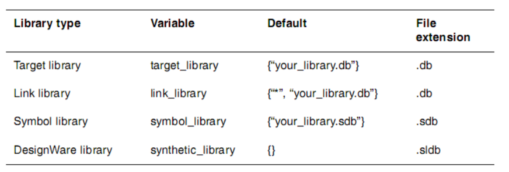

可以用`list_libs`命令查看当前已加载的库

- **target_library（标准单元，综合后电路网表要最终映射到的库，db格式）**

  > 读入的HDL代码首先由Synopsys自带的GTECH库转成DC内部交换的格式，然后经过映射到目标库，最后生成优化的门级网表。
  > 目标库包含了各个门级单元的行为、引脚、面积、时序信息等，有的还包含了功耗方面的参数。
  > DC在综合时就是根据目标库中给出的单元路径的延迟信息来计算路径的延时，并根据各个单元的延时、面积和驱动能力的不同选择合适的单元来优化电路。

  ```tcl
  set search_path [list /path/to/library_dir]
  set target_library "target_library.db" ;# if search_path is set, target_library is the relative path to the search_path
  ```

- **link_library（所有DC可能用到的库，以及购买的付费IP、存储器、IO、PAD、PLL等的库，db格式）**

  > 在link_library的设置中必须包含"*"，表示DC在引用实例化模块或者单元电路时首先搜索已经调进DC memory的模块和单元电路（已经translate过的GTECH网表）。
  > 该库中的cells, DC 无法进行映射（成门电路），例如：RAM, ROM 及Pad，在RTL 设计中，这些cells以实例化的方式引用
  > 如果在你的rtl代码中手动例化了foundary厂家提供的stdcell，当然GTECH网表中就会存在这个stdcell实例，那么link lib就必须包含这个stdcell的库（target_library）
  > 如果所有rtl中全部是逻辑描述，没有例化任何macro，sram，特定的std cell等，那么link_library可以为空。

  > 对于dcim的ip，是用模拟后端定制的，它作为一个macro，可以用db格式的库文件来表征引脚、时序信息等。在前端的时候，我们的完整rtl中可能写了一个dcim ip的行为级模型，但那个module只是用来行为级验证的，并不是用来综合的。综合的时候不要把这个行为级模型rtl包进来，而是采用db格式的库文件来作为顶层中dcim ip的reference。此时就应该将这个macro的db库作为link_library。这样在综合的时候，顶层模块例化了一个dcim ip，这个ip的reference并不是一个逻辑的行为级rtl module，而是一个db描述的macro。这样这个macro作为一个整体，内部的逻辑我们是不关心的，dc也是不会去综合这个macro内部结构的，我们关心的其实只是这个macro的pin和时序。

  ```tcl
  lappend search_path "/path/to/link_library_dir" ;# optional
  set link_library [list * $target_library link_library.db] ;# if search_path is set, link_library is the relative path to the search_path
  ```

- **symbol_library（符号库，单元电路显示的原理图库，sdb格式）**

  > Symbol Library用于显示原理图电路；Netlist或GTECH中每一个cell都有一个符号表示
  > 如果不指定symbol library，dc会根据从.db中识别出的Cell的功能找一个合适的符号显示

  ```tcl
  lappend search_path "/path/to/symbol_library_dir" ;# optional
  set symbol_library "symbol_library.sdb" ;# if search_path is set, symbol_library is the relative path to the search_path
  ```

- **synthetic_library（DesignWare library, 算数运算库）**

  > DesignWare：设计构建，一些可重用的电路设计结构，是一种HardCoding的电路，无法修改其结构，但与工艺库无关。
  > Synopsys免费提供基本的数学运算，如+/-/*/</>/<=/>=/selector等,在安装目录下，DC默认会加载。
  > 可以开发或购买额外的designware库，然后设置在synthetic_library中。
  > Multiple architectures for each macro allow DC to evaluate speed/area tradeoffs and choose the best implementation

  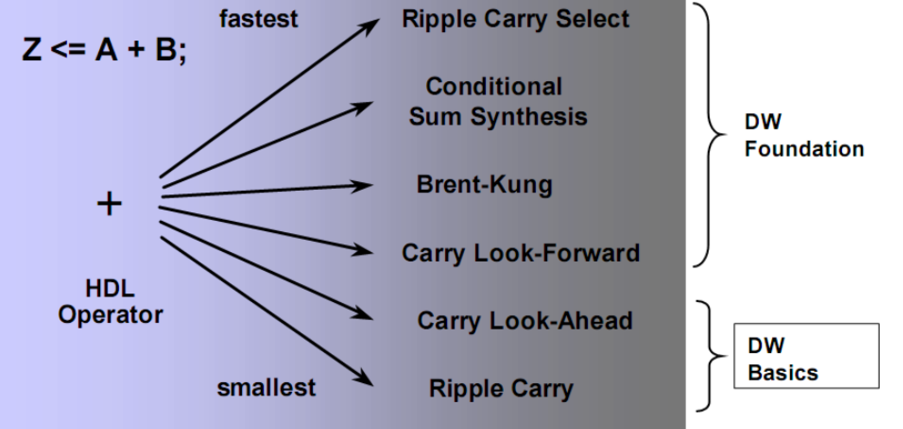

  ```tcl
  set synthetic_library "/path/to/synthetic_library.sldb"
  ```

#### 其他初始设置

#### 读入设计文件

建议写一个list.f, 包含了所有需要读入的verilog文件

> 读入设计有两种实现方法实现方法：read_verilog 和 analyze & elaborate（实际上read_verilog是analyze与elaborate的打包操作）。analyze & elaborate  可以自由指定设计库，
> 并生成 GTECH中间文件前生成.syn 文件存储于 work 目录下，便于下次 elaborate 节省时间，我们一般选择analyze & elaborate的方法读入设计。

```tcl
analyze -f sverilog "path/to/list.f"
elaborate "top_module_name" <optional [-parameter "DATA_WIDTH = 8,ADDR_WIDTH = 8"]> 
# 只有elaborate可以设定顶层文件的parameter
current_design "top_module_name"
# 要综合哪个模块，就把哪个模块设置为当前设计
link
uniquify ;# Each instance gets a unique design name
```

### 设置环境

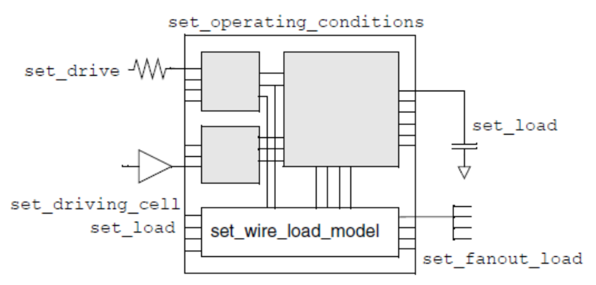

- `set_operating_coditions`: 设置PVT条件

  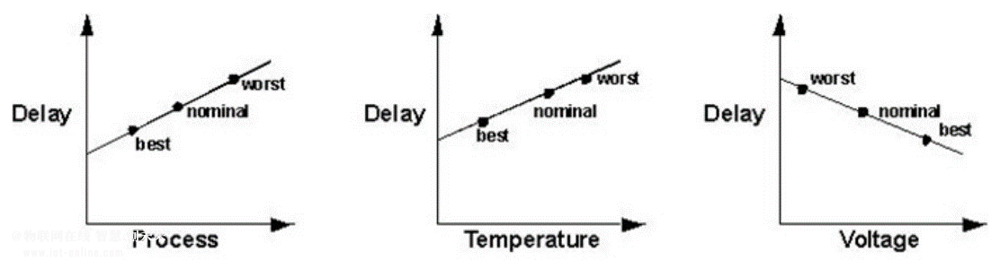

  > PVT代表process（工艺），voltage（电压），temperature（温度）。corner（工艺角）是用来表征process的，包括了tt，ff，ss等。
  > 静态时序分析一般仅考虑Best Case和Worst Case，也称作Fast Process Corner 和Slow Process Corner，分别对应极端的PVT条件。

  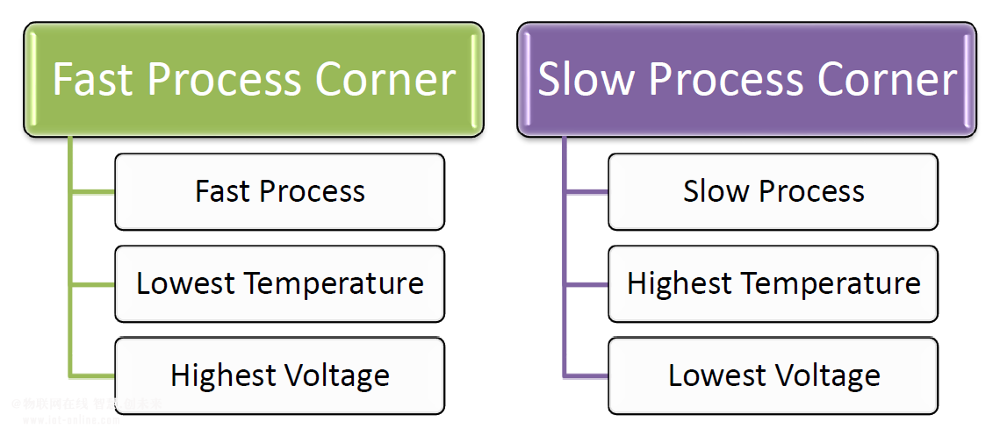

  | Corner Condition       | Cell Designator | Process (PMOS) | Process (NMOS) | Voltage    | Temperature |
  |------------------------|------------------|----------------|----------------|------------|-------------|
  | Worst                  | WCCOM            | Slow           | Slow           | 0.9*V_dd   | 125°C       |
  | Typical                | NCCOM            | Typical        | Typical        | V_dd       | 25°C        |
  | Best                   | BCCOM            | Fast           | Fast           | 1.1*V_dd   | 0°C         |
  | Low Temperature        | LTCOM            | Fast           | Fast           | 1.1*V_dd   | -40°C       |
  | Worst at Low Temperature | WCLCOM          | Slow           | Slow           | 0.9*V_dd   | -40°C       |
  | Maximum Leakage        | MLCOM            | Fast           | Fast           | 1.1*V_dd   | 125°C       |
  | Worst at 0°C           | WCZCOM           | Slow           | Slow           | 0.9*V_dd   | 0°C         |

- `set_wire_load`: A wire load model is an estimate of a net’s RC parasitics based on the net’s fanout.

  > wire_load 模型的选择很重要，太悲观或太乐观的模型都将产生综合的迭带，在pre-layout 的综合中应选用悲观的模型(ss, high temp, low voltage)

  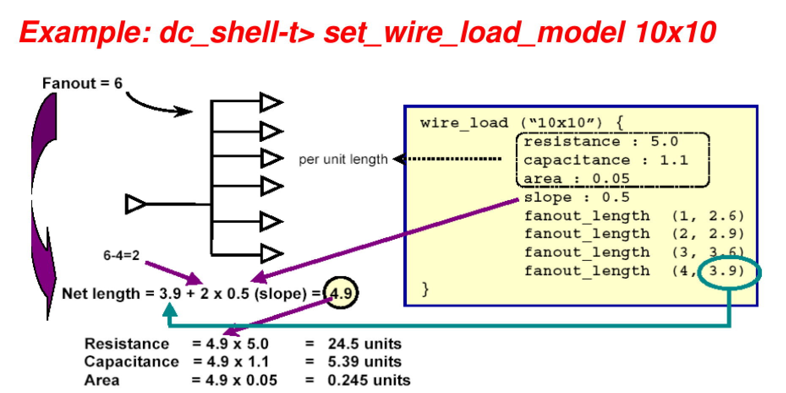

  ```tcl
  set_wire_load_model -name "10*10" -library my_lib.db
  set_wire_load_model -name "10*10" my_lib.db 
  current_design LOW
  set_wire_load_model  -name "10*10" 
  current_design TOP
  set_wire_load_mode enclosed
  set_wire_load_model  -name "20*20MIN" -min
  ```

- `set_drive`: Sets the rise_drive or fall_drive attributes to specified **resistance** values on specified input and inout ports. (Kohm)

  ```tcl
  set_drive 2.0 {A B C}
  set_drive 2 .0 "A B C"
  set_drive 2 [all_inputs]
  set_drive -rise 1 [get_ports B]
  set_drive -rise drive_of(-rise TECH_LIBRARY/INVERTER/OUT) [get_ports C]
  # drive_of : Returns the drive resistance value of the specified library cell pin.
  ```

- `set_driving_cell`: sets attributes on input or inout ports of the current design that specify that a library cell or output pin of a library cell drives the specified ports.

  > By default, DC assumes that the external signal has a transition time of 0.
  > Placing a driving cell on the input ports causes DC to calculate the actual (non-zero) transition time on the input signal
  > as though the specified library cell was driving it.

  ```tcl
  set_driving_cell -lib_cell AND2 {IN1}
  set_driving_cell -lib_cell INV -pin Z -library tech_lib [all_inputs]
  set_driving_cell -lib_cell INV -dont_scale {IN1}
  set_driving_cell -rise -lib_cell BUF1_TS -pin Z {IN1}
  set_driving_cell -fall -lib_cell DFF_TS -pin Q {IN1}
  ```

- `set_load`: Sets the load attribute to a specified value on specified ports and nets.

  > By default, DC assumes that the external load of ports is 0. You can specify some other constant value, or the `load of` command can be used to specify the external load as the pin load of a cell in your technology library.

  ```tcl
  set MAX_LOAD [load_of slow/AND2X1/A]
  set_load [expr $MAX_LOAD*15] [all_outputs]
  set_load 2 in1
  set port_load [expr 2.5+3*[load_of tech_lib/IV/A]]
  set_load $port_load [all_outputs]
  set_load [load_of tech_lib/IV/Z] {input_1 inoput_2}
  ```

- `set_fanout_load`: model the external fanout effects by specifying the expected fanout load values on output ports. Design Compiler tries to ensure that the sum of the fanout load on the output port plus the fanout load of cells connected to the output port driver is less than the maximum fanout limit of the library, library cell, and design.

  > fanout load is not the same as load. fanout load is a unitless value that represents a numerical contribution to the total fanout. Load is a capacitance value. Design Compiler uses fanout load primarily to measure the fanout presented by each input pin. An input pin normally has a fanout load of 1, but it can have a higher value.

### 施加设计约束

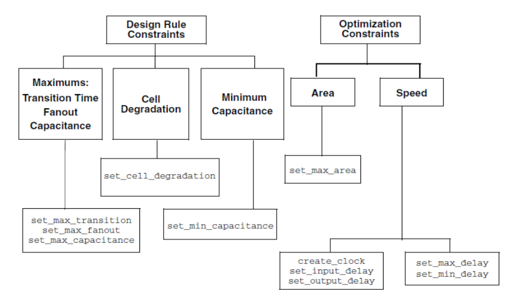

#### 为什么需要时序约束

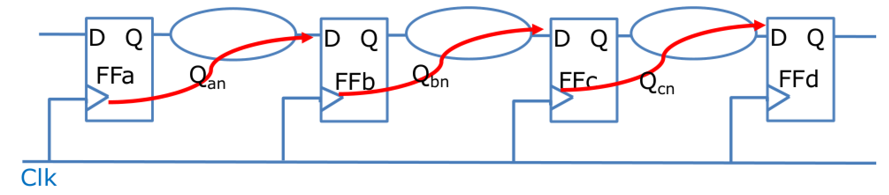

- **setup constraints**: Qan从FFa/Q传到FFb/D不能超过一个T。这就是timing path的SETUP检查；SETUP检查要求数据不能传播太慢/太久
- **hold constraints**: Qan传播到FFb/D的过程不能太快，不能再第n个Clk的上升沿就被FFb采到。要求数据不能传播太快

#### 时序类型

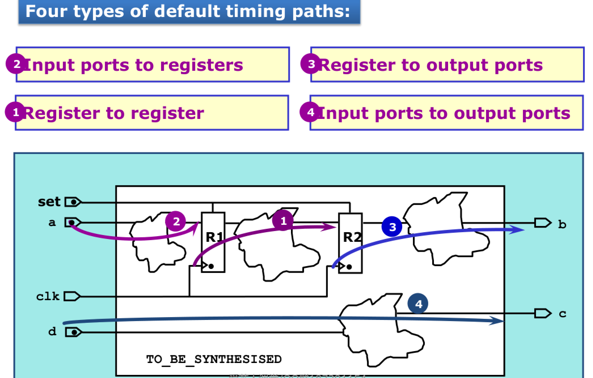

> Path: 每一条路径都由startpoint 和endpoint;

> statrpoint: input ports 或时序cell 的clock pins;

> endpoint: output ports 或时序cell 的data pins;

#### 设计规则的约束：technology-specific restriction

|command|object|
|-------|------|
|set_max_fanout | input ports and designs|
|set_fanout_load | output ports|
|set_load|ports or nets|
|set_max_transition|ports or designs|
|set_cell_degradation |input ports|
|set_min_capacitance|input ports|

- `set_max_transition`: set the maximum transition time for specified clocks, ports, or designs.(ns)

  ```tcl
  # Port: late riser.
  set_max_transition 2.0 late riser 
  # Design: TEST
  set_max_transition 2.0 TEST 
  # Clock Path: clk
  set_max_transition 2.0 [get_clocks clk1] 
  # Data Path: clk1
  set_max_transition 2.0 -datapath [get_clocks clk1]
  ```

  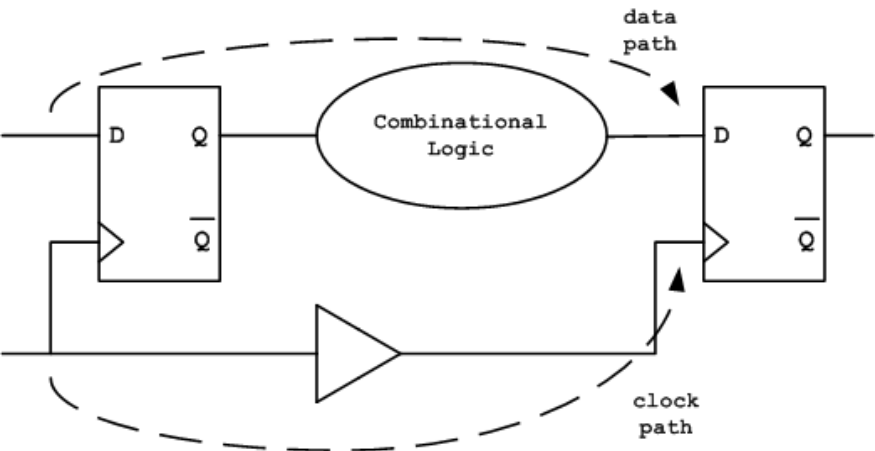

- `set_max_fanout`: set the max_fanout attribute to a specified value on input ports and designs

  > set_fanout_load is design envoronment; set_max_fanout is a design constraint.
  > Design Compiler models fanout restrictions by associating a fanout_load attribute with each input pin and a max_fanout attribute with each output (driving) pin on a cell.

  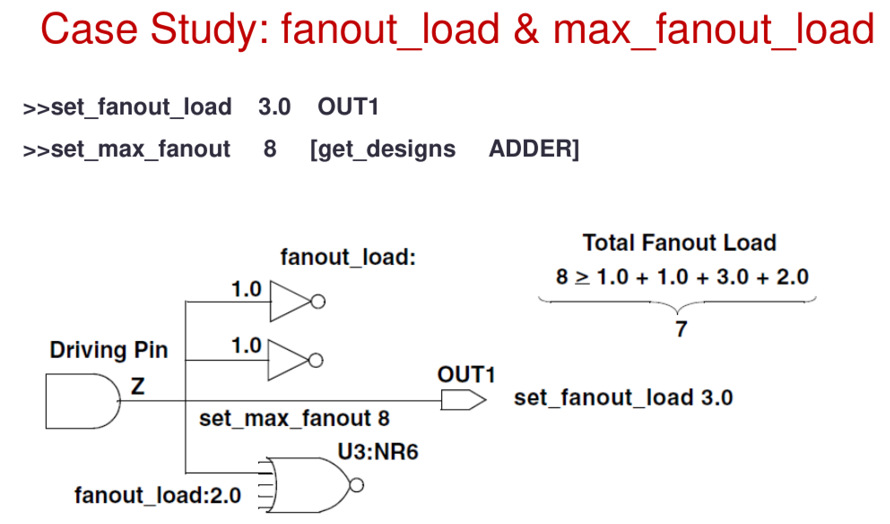

  > An input pin normally has a fanout load of 1, but it can have a higher value. The fanout load imposed by a driven cell (U3)is not necessarily 1.0.
  > Library developers can assign higher fanout loads (for example,2.0) to model internal cell fanout effects.
  > You can also set a fanout load on an output port (OUT1) to model external fanout effects.

- `set_max_capacitance`: It is set as a pin-level attribute that defines the  maximum total capacitive load that an output pin can drive.

  > The max capacitance design rule constraint allows you to control the capacitance of nets directly. (The design rule constraints max fanout and max transition limit the actual capacitance of nets indirectly.)
  > The max capacitance attribute functions independently, so you can use it with max_fanout and  max transition.

  ```tcl
  set_max_capacitance 2.0 [get_ports late_riser]
  set_max_capacitance 2.0 [current_design]
  set_max_capacitance 2.0 [get_clocks clk1]
  set_max_capacitance 2.0 -datapath [get_clocks clk1]
  ```

#### 优化的约束：design goals and requirements

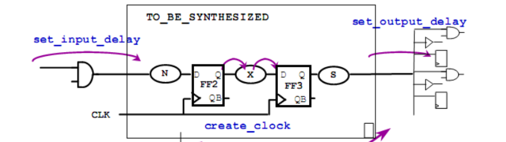

- `create_clock`: 主要定义一个Clock 的source 源端、周期、占空比（时钟高电平与周期的比例）及信号上升沿及下降沿的时间点。

  > Clock 三要素：Waveform、Uncertainty 和Clock group。

  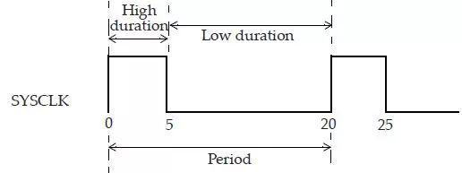

  ```tcl
  create_clock -name SYSCLK -period 20 -waveform {0 5} [get_ports2 SCLK]
  ```

  ```tcl
  # if waveform is not specified, it will be {0,period/2} for default.
  create_clock -period 12.5 [get_ports clkM]

  # Pre-layout阶段，估计时钟树的延时和抖动
  Set_clock_skew –delay 2.5 –uncertainty 0.5 clkM

  Set_clock_transition 0.2 clkM

  # do not re-bufer the clock network.
  set_dont_touch_network [get_clocks clkM]
  ```

- `create_generated_clock`: generated clocks 是从master clock 中取得的时钟定义。master clock就是指create_clock 命令指定的时钟产生点

  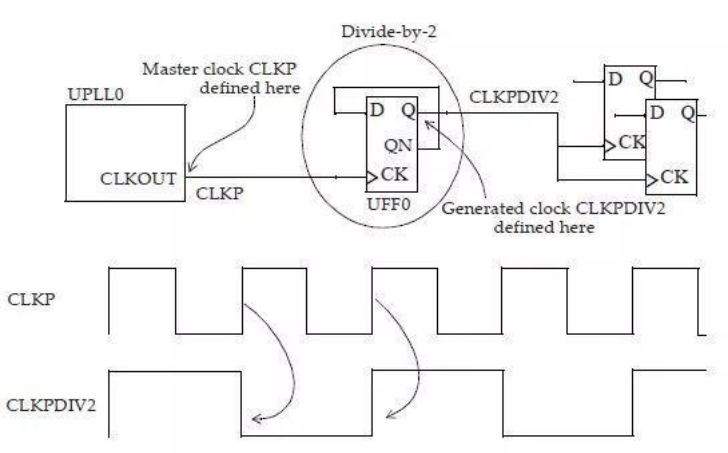

  ```tcl
  #定义master clock
  create_clock -name CLKP -period 10 -waveform {0 5} [get_pins UPLL0/CLKOUT]

  #在Q 点定义generated clock
  create_generated_clock -name CLKPDIV2 -source UPLL0/CLKOUT -master_clock CLKP -divide_by 2 [get_pins UFF0/Q]
  ```

  > 一般我们把时钟的源头会定义成create_clock，而分频时钟则会定义为create_generated_clock. 两者的主要区别在于CTS 步骤，
  > generated clock并不会产生新的clock domain, 而且定义generated clock 后，clock path的起点始终位于master clock,
  > 这样source latency 并不会重新的计算。这是定义generated clock 的优点所在。

- `set_clock_uncertainty`: 主要定义了Clock 信号到时序器件的Clock 端可能早到或晚到的时间。主要是用来降低jitter 对有效时钟周期的影响。值得注意的是，在setup check 中，clock uncertainty 是代表着降低了时钟的有效周期；而在hold check 中，clock uncertainty 是代表着hold check所需要满足的额外margin。

  ```tcl
  set_clock_uncertainty -from VIRTUAL_SYS_CLK -to SYS_CLK -hold 0.05
  set_clock_uncertainty -from VIRTUAL_SYS_CLK -to SYS_CLK -setup 0.3
  ```

- `set_dont_touch_network`: 常用于port 或net 阻止DC 隔离该net，和该net 相连的门具有dont_touch 属性。常用于CLK 和RST

  > 当一个模块例用原始的时钟作为输入，在该模块内部利用分频逻辑产生了二级时钟，则应对二级时钟output port 上设置set_dont_touch_network.
  > 当一个电路包含门时钟逻辑时，若在时钟的输入设置set_dont_touch_network，则阻止DC 隔离该门逻辑，导致DRC 发现时钟信号冲突，对门RESET 同样。

  > 在时钟pin 设置set_dont_touch_network,使DC 不会buffer up 时钟网，这个方法对于不包含门时钟的设计都可满足。对包含门时钟的设计，
  > 因set_dont_touch_network 会沿着时钟网组合逻辑进行传播，直到遇到寄存器，从而使门逻辑具有dont_touch 属性，会阻止DC size up 门逻辑，造成DRC 违例。
  > 为了避免这种情况，需移去set_dont_touch_network 并执行incremental compilation。

- `set_false_path` & `set_clock_groups`: 看起来比较深奥，没有去研究

- `set_input_delay`: constrains input paths. it specify how much time is used by external logic. Then DC calculates how much time is left for the internal logic(Tcycle-Tinput_delay). 定义信号相对于时钟的到达时间。指一个信号，在时钟沿之后多少时间到达。

  
  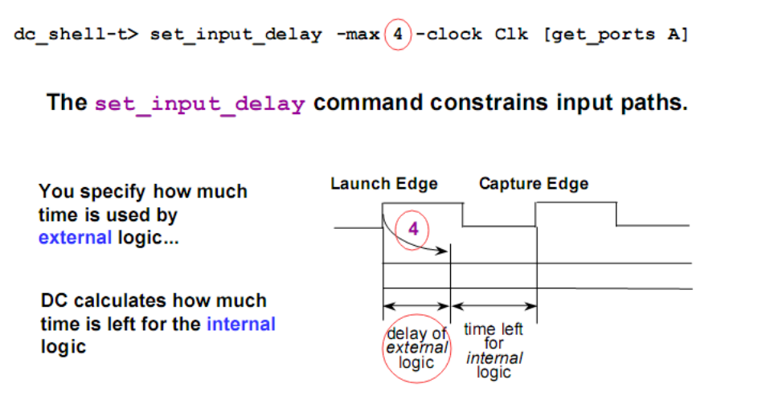

- `set_output_delay`: constrains output paths. it specify how much time is used by external logic. Then DC calculates how much time is left for the internal logic(Tcycle-Toutput_delay).

  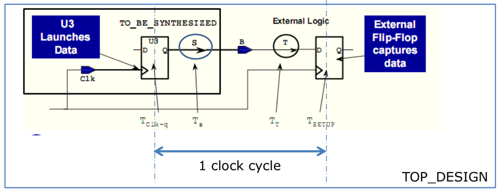
  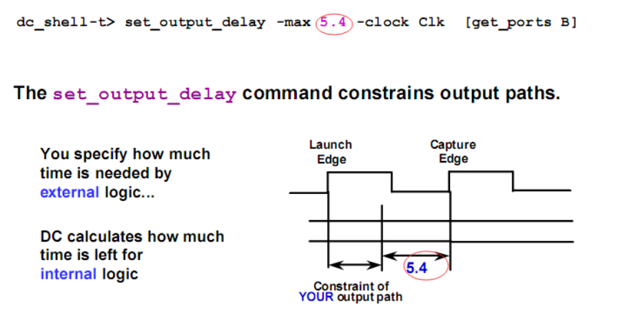

- `set_max_area`: To reduce the area as much as possible, you can use `set max_area 0`. The area violation will disclose the total area of your design after synthesis.

- `set_cost_priority`

### 设计综合(compile)

#### 编译策略

- Top-down hierarchical compile：顶层设计和子设计在一起编译，所有的环境和约束设置针对顶层设计，虽然此种策略自动考虑到相关的内部设计，但是此种策略不适合与大型设计，因为 top down 编译策略中，所以设计必须同时驻内存，硬件资源耗费大。
- Time-budget compile ；
- Compile-characterize-write-script-recompile(CCWSR)；

#### 优化策略

To meet the constraints, DC performs several optimization strategies to reduce the delay and area of the design.

- logical level optimization strategy: first flatten then structure(they are two oppose process). global influence
  - flatten : remove structure. `set_flatten true`(false for default) 目的在于通过移去中间变量，减少输入和输出之间的逻辑层次，提高速度，但会带来面积上的压力。
  - structure: minimize generic logic. `set_structure true`通过添加中间变量，使逻辑共享。但会增加逻辑的延时。常用于非关键时序电路，如：随机逻辑和有限状态机。
- gate level optimization strategy: make design technology-dependent. local influence
  - Combinational Mapping
  - Sequential Mapping

```tcl
compile –map_effort <medium(default) | high>
# high, it does critical path re-synthesis, but it will use more CPU time, in some case the action of compile will not terminate.
# 如果用“-map_effort high”,则DC 不可能structured 设计
# "compile -map_effort high"，相当于使用"compile_ultra"
compile_ultra <-area_high_effort_script | -timing_high_effort_script>

compile –incremental_mapping
# Perform incremental gate level optimization but no logical level optimization
# Incremental会导致大量的计算时间，但是对于将最差的slack减为0，这是最有效的方法。为了减少DC运算时间，可将那些已经满足时序要求的模块设置为dont_touch属性

compile –only_design_rule
# Perform only design rule fixing, take less time than regular compile because it is incremental.
```

### 后综合
