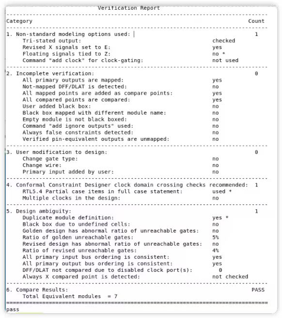

# Synthesis using Genus(Cadence flow)

## 模板文件

我们使用 processor 作为逻辑综合模板示例，其文件夹路径为：(T1CenOS)

```
/DISK1/home/rh_xu30/work/share/genus_template
```

该文件夹的结构为：

```
genus_template
├── src                                         # RTL Source Files
│   ├── macro
│   │   └── DCO
│   │       ├── DCO.lef                  # DCIM physical library
│   │       ├── DCO_tt_0p80v_25c.lib     # DCIM timing library
│   │       └── DCO_tt_0p80v_85c.lib     # DCIM timing library
│   ├── sram                             # Compiler Generated SRAM
│   │   └── sram_sp_2048_32
│   │       ├── sram_sp_2048_32.v        # SRAM Behavior Module
│   │       └── ...
│   └── ...
├── syn
│   ├── scripts
│   │   ├── genus_synthesis.tcl                 # main synthesis script
│   │   ├── init_syn_none_opt.tcl               # init synthesis script
│   │   ├── init_syn_standard_opt.tcl           # init synthesis script
│   │   ├── init_syn_extreme_opt.tcl            # init synthesis script
│   │   └── syn_mmmc.tcl                        # define MMMC constraints
│   └── Makefile
├── config
│   ├── constraints_processor.sdc                     # define timing constraints
│   ├── global_define.tcl                       # define global parameters
│   └── user_define.tcl                         # user-specific parameters
├── Makefile                                    # Top-level Makefile
├── ...
...                                             # Other Folders/Files
```

其中DCO和sram是hard macro，由customed flow或者memory compiler获得，需要带有配套lef，lib文件。关于sram compiler可以参阅文档SRAM编译器。config文件夹中的sdc文件需要命名为constraints_<top_name>.sdc

## 逻辑综合流程

### 添加源文件

在 src/filelist.f 中添加你的子模块源文件。
如果在子模块中例化了 SRAM IP，或者其他的定制 IP，则不需要在 src/filelist.f 中添加源文件，但是需要在后续综合参数中添加 SRAM 实例以及宏单元的名称。

### 修改综合参数

根据注释修改 config/user_define.tcl 中的综合参数。 你需要定义的参数如下：

- rm_core_top：顶层模块的名称。
- rm_clock_pin：顶层模块的时钟端口名称。
- rm_clock_period：时钟周期，单位 ns。
- sram_insts：SRAM 实例的名称，请在 src/sram 文件夹中使用 sram_compiler 生成对应名称的 sram 实例。
- macro_insts：宏单元的名称，请将对应文件（.v，.lib，.lef）放在 src/macro/<name> 文件夹中，分别命名为 <name>.v <name>_[ss|tt|ff]_*v_*c.lib <name>.lef。
- std_lib, cell_ext：选择标准单元库的阈值电压。
- proj(analysis_view,[setup|hold])：选择时序分析的 PVT，学术片考虑 tt 的两个选项即可。
- syn_opt_level：综合优化等级，可以选择 none, standard, extreme，优化程度依次递增。

**lib 文件命名**

lib 文件命名规则为 <name>_<process>_<voltage>_<tempurature>，可以参考 sram 的 lib 文件。

**SRAM 与 Macro 文件**

请注意，SRAM 与 Macro 文件夹下的文件名务必与 sram_insts 与 macro_insts 中的名称一致！参考模板文件夹的命名规则。

**综合参数进阶**

如果你想要进一步修改综合参数，可以参考 `syn/scripts/init_syn.tcl`。

## 修改时序约束

每个子模块的时序约束都需要自行编写 sdc 文件，可以参考 `config/constraints_processor.sdc`。

你需要定义的内容如下：

- create_clock：设置时钟信号，告诉工具哪些信号是时钟。
- set_clock_uncertainty：设置时钟不确定性，所有时钟都需要设置 setup, hold 的不确定性。
- set_clock_groups：设置时钟组，告诉工具哪些时钟是同步的。
- set_input_delay：设置输入延迟，告诉工具输入信号的延迟。
- set_output_delay：设置输出延迟，告诉工具输出信号的延迟。
- set_false_path：设置假路径，告诉工具哪些路径不需要做时序分析。

其中，set_input_delay 和 set_output_delay 需要知道与该子模块对接的其他模块的时序信息，在第一次综合时可以假定为经验值60% clock_period。

**虚拟时钟**

时序约束中，虚拟时钟是一个很常见的概念。 虚拟时钟是为了描述输入输出的时序信息而引入的，对于综合工具来说，它不了解所综合的子模块之外的任何信息，因此需要一个虚拟时钟来告诉工具输入输出的时序信息。

大部分情况下，虚拟时钟和实际时钟是同步的。 实际上，这和直接将输入输出约束到实际时钟上是等效的，但是这样做会使得时钟树综合后的时序与预期不符，因此通常使用虚拟时钟约束 IO。

请将你编写的 sdc 文件命名为 `constraints_<top_module_name>.sdc`，并放在 `config/` 文件夹中。

## 运行逻辑综合

在 genus_template 文件夹下运行以下命令：

```bash
make genus TOP=<top_module_name>
```

逻辑综合会在 syn 文件夹下生成 2 个文件夹 logs, <top_module_name>，文件结构如下所示。

```
syn
├── logs
│   ├── fv                              # functional verification folder
│   ├── <top_module_name>.cmd           # genus command file
│   └── <top_module_name>.log           # genus log file
├── <top_module_name>
│   ├── reports
│   │   ├── area
│   │   │   └── area.rpt                # area report
│   │   ├── timing
│   │   │   └── *_timing.rpt            # timing report
│   │   ├── power
│   │   │   ├── *_power_hier.rpt        # power hierarchy report
│   │   │   └── *_power.rpt             # power report
│   │   ├── time_intent
│   │   │   └── *_timing_intent_*.rpt   # timing constraint check
│   │   ├── runtime
│   │   │   └── check_*.rpt             # design check
│   │   └── others
│   │       └── *.rpt
│   ├── *.sdf                           # strandard delay format for post-synthesis simulation
│   ├── *_postsyn.v                     # generated netlist
│   ├── *_lec.do.v                      # generated do file for conformal
│   └── design_backup                   # files for restoring design
│       └── ...
├── ...
...
```

## 查看主要输出报告

- ./syn/logs/<top_module_name>.log：逻辑综合的日志文件，可以查找 Error, Warning 等关键词检查逻辑综合流程是否有误。
- ./syn/<top_module_name>/*_postsyn.v：生成的门级网表，用于后续 Cadence Innovus 的后端设计
- ./syn/<top_module_name>/reports/timing/*_timing.rpt：各个 PVT 的时序报告，可以查找 VIOLATED 关键词检查时序是否满足。
- ./syn/<top_module_name>/reports/area/area.rpt：该模块的面积报告，可以作为后续后端设计版图大小的参考。

## 恢复设计

在进行一次逻辑综合后，可以在 genus_template 路径下通过如下指令快速恢复设计：

```bash
make restore_genus TOP=<top_module_name>
```

## 形式验证

由于在综合脚本`/genus_template/syn/scripts/genus_synthesis.tcl`中已经添加了

```bash
write_do_lec -revised_design $log_syn(design)_postsyn.v > $log_syn(outputs_path)/$log_syn(design)_lec.do
```

因此可以直接生成配套的用于conformal软件（形式验证）的脚本，路径为./syn/<top_module_name>/*_lec.do,同时也已经在./syn/log/fv/<top_module_name>/下生成了形式验证所需的文件。现在进入到./syn/log/文件夹下，运行

```bash
lec -xl -do ./syn/<top_module_name>/*_lec.do
```

即可使用cadence家形式验证conformal工具进行形式验证。验证通过的截图：


