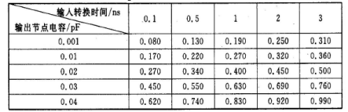

# .lib文件详解

## 模型分类

根据不同的driver model，lib可以分成三类：Concurrent Current Source (CCS), Effective Current Source Model (ECSM), Non-Linear Delay Model (NLDM)

| Library Format | Accuracy | Computation Speed | Filesize | Usage |Suitable for Noise & Power Analysis | Definition |
| --- | --- | --- | --- | --- | --- | --- |
| CCS | High | Slow | Large | Sign off | Yes | A highly accurate library format using multiple current sources to model the behavior of digital gates. |
| ECSM | Medium | Moderate | Medium | Large design | Limited | A library format that uses effective current sources to approximate the behavior of digital circuits, balancing accuracy and computational complexity. |
| NLDM | Low | Fast | Small | Out-dated nodes| No | A library format that models delay and output transition using look-up tables (LUTs) as a function of input slew and output load. |

## 文件结构

```C
library(lib_name){
  /* pvt & condition*/

  /* unit attributes */

  /* default attributes */

  /* threshold definitions */

  /* k-factors */

  /* templates */ 

  /* wire-loads */

  /* cell */
  cell(cell_name){
    /* cell attributes */

    /* pin definitions */
    pin(pin_name){
      /* timing */

      /* power */

    }

    /* bus definitions */
    bus(bus_name){
      /* timing */

      /* power */

    }
  }

}

```

## library共享定义（cell之前的部分）

### pvt & condition

```C
  /*pvt & condition*/
  technology (cmos) ;
  delay_model         : table_lookup;
  library_features(report_delay_calculation,report_noise_calculation,report_power_calculation);
  revision            : 1.1;        
  date                : "Thur Apr 13 2023";
  nom_process         : 1;
  nom_temperature     : 25;
  nom_voltage         : 0.800;
  operating_conditions("tt0p80v25c"){
  process : 1 ;
  temperature : 25 ;
  voltage : 0.800 ;
  tree_type   : "balanced_tree" ;
  }
```

`operating_conditions`的名称需要需要与综合时的选择对应，或者说综合和PR的时候设定的`operating_conditions`就是来自于lib文件中的定义。


tree指的是RC tree，一共三种model。best指的是假设线上没有电阻，或者假设原和终点比较近。balance假设每个终点看到的只有自己相关线上的电阻。worst指的是原点到终点比较远，所有终点都能看到全部线电阻。


### unit attributes

```C
  /* unit attributes */
  time_unit           : "1ns";
  voltage_unit        : "1V";
  current_unit        : "1mA";
  leakage_power_unit  : "1mW";
  capacitive_load_unit(1,pf);
  pulling_resistance_unit        : "1kohm";
```

### default attributes

```C
  /* default attributes */
  default_fanout_load            : 1.000;
  default_cell_leakage_power     : 0.000;
  default_inout_pin_cap          : 0.005;
  default_input_pin_cap          : 0.005;
  default_output_pin_cap         : 0.000;
```

主要是默认漏电流功耗密度、标准单元的漏电流功耗、扇出负载最大值、输出引脚的电容、IO类型的端口电容、输入引脚的电容、最大转换时间。

### threshold definitions

```C
  /* threshold definitions */
  default_leakage_power_density  : 0.000;
  slew_derate_from_library       : 0.500;
  slew_lower_threshold_pct_fall  : 30.000;
  slew_upper_threshold_pct_fall  : 70.000;
  slew_lower_threshold_pct_rise  : 30.000;
  slew_upper_threshold_pct_rise  : 70.000;
  input_threshold_pct_fall       : 50.000;
  input_threshold_pct_rise       : 50.000;
  output_threshold_pct_fall      : 50.000;
  output_threshold_pct_rise      : 50.000;

  default_operating_conditions : tt0p80v25c ;
  default_max_transition        : 1.0 ;
  default_max_fanout            : 20.0 ;

  library_features(report_delay_calculation);
  define_cell_area (pad_drivers,pad_driver_sites) ;
  define_cell_area(bond_pads,pad_slots);
```

`pct`相关的四个主要定义0,1转换的电压阈值。例如input_threshold_pct_fall=60表示，电压下降到60%的时候，认为逻辑已经存1变成了0。


`slew`相关就是为了定义slew到底是哪段东西。比如下降时slew指的是电压从80%下降到20%的时间。


`slew_derate_from_library`这个值主要是用于库中定义的值和压摆范围不一致时候的缩放系数。比如库中定义的是100%-0%的时间。这个参数指的是如何从库中的值（100%-0%）的时间算80%到20%的压摆。综合工具等用到的slew = 库中的值 * slew_derate_from_library

### k-factors

```C
  /* k-factors */
  k_process_cell_fall            : 0.000;
  k_process_cell_leakage_power   : 0.000;
  k_process_cell_rise            : 0.000;
  k_process_fall_transition      : 0.000;
  k_process_hold_fall            : 0.000;
  k_process_hold_rise            : 0.000;
  k_process_internal_power       : 0.000;
  k_process_min_pulse_width_high : 0.000;
  k_process_min_pulse_width_low  : 0.000;
  k_process_pin_cap              : 0.000;
  k_process_recovery_fall        : 0.000;
  k_process_recovery_rise        : 0.000;
  k_process_rise_transition      : 0.000;
  k_process_setup_fall           : 0.000;
  k_process_setup_rise           : 0.000;
  k_process_wire_cap             : 0.000;
  k_process_wire_res             : 0.000;
  k_temp_cell_fall               : 0.000;
  k_temp_cell_rise               : 0.000;
  k_temp_hold_fall               : 0.000;
  k_temp_hold_rise               : 0.000;
  k_temp_min_pulse_width_high    : 0.000;
  k_temp_min_pulse_width_low     : 0.000;
  k_temp_min_period              : 0.000;
  k_temp_rise_propagation        : 0.000;
  k_temp_fall_propagation        : 0.000;
  k_temp_rise_transition         : 0.000;
  k_temp_fall_transition         : 0.000;
  k_temp_recovery_fall           : 0.000;
  k_temp_recovery_rise           : 0.000;
  k_temp_setup_fall              : 0.000;
  k_temp_setup_rise              : 0.000;
  k_volt_cell_fall               : 0.000;
  k_volt_cell_rise               : 0.000;
  k_volt_hold_fall               : 0.000;
  k_volt_hold_rise               : 0.000;
  k_volt_min_pulse_width_high    : 0.000;
  k_volt_min_pulse_width_low     : 0.000;
  k_volt_min_period              : 0.000;
  k_volt_rise_propagation        : 0.000;
  k_volt_fall_propagation        : 0.000;
  k_volt_rise_transition         : 0.000;
  k_volt_fall_transition         : 0.000;
  k_volt_recovery_fall           : 0.000;
  k_volt_recovery_rise           : 0.000;
  k_volt_setup_fall              : 0.000;
  k_volt_setup_rise              : 0.000;

  k_volt_cell_leakage_power : 0.000000 ;
  k_temp_cell_leakage_power : 0.000000 ;
  k_volt_internal_power : 0.000000 ;
  k_temp_internal_power : 0.000000 ;
```

由于一般库中只有单元“nom_xxx”的值，为了计算不同的制程、电压和温度下单元的延迟（或者说是计算不同的操作条件），库中提供了比例缩放因子。根据提供的K参数，DC按下面的公式计算不同的制程，电压和温度的单元延迟：

> Delay derated = (nominal delay)*（1+(DP*KfactorP))*(1+(DV*KfactorV))*(1+(DT*KfactorT))

其中，

- delta = current-nominal;
- DP = CP-NP,CP为current process,NP为nominal process;
- DV=CV-NV,CV为current voltage,NP为nominal voltage;
- DT=CT-NT,CT为current temperature,NT为nominal temperature.
- KfactorP、KfactorV、KfactorT分别是对于的K参数，表示制程、电压、温度对延时的影响。


### templates

```C
  /* templates */ 
  lu_table_template(delay_template_5x5) {
    variable_1 : input_net_transition;
    variable_2 : total_output_net_capacitance;
    index_1 ("0.0024, 0.0342, 0.0978, 0.225, 0.4793");
    index_2 ("0.00013, 0.00078, 0.00458, 0.01695, 0.04446");
  }

  lu_table_template(load_template) {
    variable_1 : total_output_net_capacitance;
    index_1 ("0.0024, 0.0662, 0.1937, 0.4487, 0.9587");
  }

  lu_table_template(constraint_template_5x5) {
    variable_1 : related_pin_transition;
    variable_2 : constrained_pin_transition;
    index_1 ("0.0024, 0.0342, 0.0978, 0.225, 0.4793");
    index_2 ("0.0024, 0.0662, 0.1937, 0.4487, 0.9587");
  }

  power_lut_template(power_template) {
    variable_1 :  input_transition_time;
    index_1 (" 0.0024, 0.0062, 0.0137, 0.0287, 0.0587, 0.1188, 0.239, 0.4793");
  }

  type (bus_2_to_0) {
    base_type : array ;
    data_type : bit   ;
    bit_width : 3     ;
    bit_from  : 2     ;
    bit_to    : 0     ;
    downto    : true  ;
  }

  type (bus_8_to_0) {
    base_type : array ;
    data_type : bit   ;
    bit_width : 9     ;
    bit_from  : 8     ;
    bit_to    : 0     ;
    downto    : true  ;
  }
```

例如上面定义了一个名字叫为delay_template_5x5的lookup table，可以理解为一个模板，有两个变量variable_1和variable_2组成。variable_1代表input_net_transition，variable_2代表total_output_net_capacitance。每个变量是5个断点组成。lookup table的名字是任意的，而变量可以是一个，两个或三个，每个断点的数量一般没有限制。后续在cell定义中调用这个查找表模板，就将会是一个函数，其自变量为这两个变量的值。

同时还定义了一些bus，可以理解为一种结构体，后续将会在cell中调用，作为线宽大于1的pin。

### wire-loads

```C
  /* wire-loads */
  wire_load("sample") {
    resistance   : 1.6e-05;
    capacitance  : 0.0002;
    area         : 1.7;
    slope        : 500;
    fanout_length(1,500);
  }
```

DC采用wire-load模型在布局前预估连线的延时。通常，在工艺库中，根据不同的芯片面积给出了几种模型（上图所示）。这些模型定义了电容、电阻与面积因子。此外，导线负载模型还设置了slope与fanout_length，fanout-length设置了与扇出数相关的导线的长度。
有时候，除了扇出与长度，该属性还包括其他参数的值（这个工艺库没有），例如average_capacitance、standard_deviation与number_of_nets，在DC产生导线负载模型时会自动写出这些值。对于超过fanout-length属性的节点，可将该导线分成斜率不同的几段，以确定它的值。

## cell部分

### 示例

```C
  cell(MODULE_NAME) {
    area : 139000.00;
    dont_use : true;
    dont_touch : true;
    interface_timing : true;

    /* input CLK */
    pin (CLK) {
      direction      : input ;
      capacitance    : 0.0056 ;
      max_transition : 1     ;
    }

    /* input IFN */
    bus (IFN) {
      bus_type       : bus_15_to_0;
      direction      : input      ;
      capacitance    : 0.003      ;
      max_transition : 0.4793     ;
    }

    /* input MEM_EN */
    pin(MEM_EN) {
      direction : input;
      capacitance : 0.00154040182;
      max_transition : 1     ;
      timing() { 
        related_pin : "CLK";
        timing_type : hold_rising;
        rise_constraint(constraint_template_5x5) { 
          index_1 ("0.0018, 0.0336, 0.0973, 0.2246, 0.4793");
          index_2 ("0.0018, 0.0656, 0.1932, 0.4484, 0.9587");
          values ( \
              "0.09551983, 0.09237031, 0.09415479, 0.10354577, 0.128491", \
              "0.09746244, 0.0945713, 0.0965631, 0.10537546, 0.1298349", \
              "0.09662121, 0.09388235, 0.09451092, 0.10226354, 0.1246167", \
              "0.0922782, 0.0886423, 0.0890235, 0.09433205, 0.1134955", \
              "0.0815994, 0.0780689, 0.0763405, 0.0785961, 0.0945168" \
          );
        }
        fall_constraint(constraint_template_5x5) {
          index_1 ("0.0018, 0.0336, 0.0973, 0.2246, 0.4793");
          index_2 ("0.0018, 0.0656, 0.1932, 0.4484, 0.9587");
          values ( \
              "0.10169399, 0.09381473, 0.0814416, 0.0649866, 0.0312483", \
              "0.10718659, 0.09800175, 0.0876225, 0.0680845, 0.0364918", \
              "0.1106969, 0.10260626, 0.09252766, 0.0758937, 0.0458651", \
              "0.1116849, 0.1048942, 0.09628212, 0.0817576, 0.0534822", \
              "0.10757569, 0.10134702, 0.09570043, 0.0820952, 0.0627854" \
          );
        }
      }
      timing() { 
        related_pin : "CLK";
        timing_type : setup_rising;
        rise_constraint(constraint_template_5x5) { 
          index_1 ("0.0024, 0.0342, 0.0978, 0.225, 0.4793");
          index_2 ("0.0024, 0.0662, 0.1937, 0.4487, 0.9587");
          values ( \
              "0.3150999, 0.3302978, 0.3440292, 0.3530888, 0.3515563", \
              "0.30728007, 0.3214751, 0.3337394, 0.3412809, 0.3390875", \
              "0.30209897, 0.3153837, 0.3259335, 0.3315959, 0.3264693", \
              "0.29718202, 0.3117791, 0.3215627, 0.325772, 0.3183234", \
              "0.301782905, 0.3137935, 0.3230922, 0.3264651, 0.3176306" \
          );
        }
        fall_constraint(constraint_template_5x5) { 
          index_1 ("0.0024, 0.0342, 0.0978, 0.225, 0.4793");
          index_2 ("0.0024, 0.0662, 0.1937, 0.4487, 0.9587");
          values ( \
              "0.3133376, 0.3356115, 0.3668884, 0.410394, 0.474849", \
              "0.301360089, 0.3232472, 0.3551052, 0.3993933, 0.464561", \
              "0.2853313, 0.30904868, 0.340746, 0.3852665, 0.451314", \
              "0.2713399, 0.2276982, 0.3252354, 0.3691414, 0.436388", \
              "0.2639724, 0.2837643, 0.3125116, 0.3554399, 0.422263" \
          );
        }
      }
    }
        /* output [255:0] Q */
    bus (Q) {
      bus_type       : bus_255_to_0 ;
      direction      : output       ;
      capacitance    : 0.0012        ;
      max_transition : 1            ;
      timing() { 
        related_pin : "CLK";
        timing_sense : non_unate;
        timing_type : rising_edge;
        cell_rise(delay_template_8x8) { 
          index_1("0.0024, 0.0062, 0.0137, 0.0287, 0.0587, 0.1188, 0.239, 0.4793");
          index_2("0.00013, 0.00075, 0.00199, 0.00447, 0.00942, 0.01932, 0.03913, 0.07874");
          values ( \
            "1.040346, 1.0434552, 1.0486468, 1.0584921, 1.0778102, 1.116496, 1.193802, 1.348107", \
            "1.0420436, 1.0451521, 1.0503435, 1.0601439, 1.0794814, 1.118113, 1.195497, 1.349667", \
            "1.0450846, 1.0482062, 1.0534034, 1.063187, 1.0825521, 1.121099, 1.198254, 1.352956", \
            "1.0500938, 1.0532184, 1.0584104, 1.0682203, 1.0875897, 1.126253, 1.203517, 1.35772", \
            "1.0586034, 1.0617302, 1.0669174, 1.0767142, 1.0960307, 1.134741, 1.211768, 1.366327", \
            "1.0704059, 1.0735221, 1.0787124, 1.0885599, 1.107895, 1.146508, 1.223768, 1.378339", \
            "1.0848239, 1.0879587, 1.0931531, 1.102996, 1.122366, 1.160897, 1.238376, 1.3925", \
            "1.0998605, 1.10306, 1.108275, 1.118083, 1.137423, 1.17598, 1.253259, 1.407474" \
          );
        }
        rise_transition(delay_template_8x8) { 
          index_1("0.0024, 0.0062, 0.0137, 0.0287, 0.0587, 0.1188, 0.239, 0.4793");
          index_2("0.00013, 0.00075, 0.00199, 0.00447, 0.00942, 0.01932, 0.03913, 0.07874");
          values ( \
            "0.0300745, 0.03491413, 0.0420561, 0.0606412, 0.0710844, 0.142664, 0.605789, 1.191791", \
            "0.03010066, 0.03492076, 0.0420572, 0.0606315, 0.0712195, 0.142801, 0.605551, 1.190405", \
            "0.03003263, 0.03489152, 0.0421316, 0.0605643, 0.0715107, 0.142861, 0.605444, 1.193645", \
            "0.03001399, 0.03488931, 0.0421204, 0.0607512, 0.0711429, 0.14344, 0.606857, 1.192592", \
            "0.03004333, 0.03490117, 0.0421361, 0.0606954, 0.0712311, 0.142875, 0.6066, 1.192446", \
            "0.03014684, 0.03495148, 0.042076, 0.0606545, 0.0711255, 0.142573, 0.605195, 1.191814", \
            "0.03030131, 0.0340331, 0.0421509, 0.0606325, 0.0712472, 0.142542, 0.60567, 1.19039", \
            "0.03052212, 0.0342149, 0.0422082, 0.0606657, 0.0714896, 0.142525, 0.604887, 1.190567" \
          );
        }
        cell_fall(delay_template_8x8) { 
          index_1("0.0024, 0.0062, 0.0137, 0.0287, 0.0587, 0.1188, 0.239, 0.4793");
          index_2("0.00013, 0.00075, 0.00199, 0.00447, 0.00942, 0.01932, 0.03913, 0.07874");
          values ( \
            "1.0450961, 1.0479791, 1.0526042, 1.0612354, 1.0782077, 1.112232, 1.180227, 1.315934", \
            "1.0467855, 1.0496658, 1.0543053, 1.0629218, 1.0799393, 1.113882, 1.181726, 1.317707", \
            "1.0497648, 1.0526303, 1.0572599, 1.0658858, 1.0828917, 1.116872, 1.184877, 1.320467", \
            "1.0548035, 1.0576826, 1.0623221, 1.0709261, 1.0879445, 1.121957, 1.189858, 1.325423", \
            "1.0632314, 1.0661154, 1.0707497, 1.0793737, 1.096394,  1.13045,  1.198245, 1.334122", \
            "1.074583,  1.0774649, 1.0821444, 1.0907574, 1.107773,  1.141737, 1.209677, 1.345289", \
            "1.0878649, 1.0907439, 1.0953642, 1.103996,  1.120977,  1.154892, 1.222812, 1.358527", \
            "1.0999669, 1.102845,  1.107468,  1.1161,    1.133102,  1.167208, 1.235072, 1.370547" \
          );
        }
        fall_transition(delay_template_8x8) { 
          index_1("0.0024, 0.0062, 0.0137, 0.0287, 0.0587, 0.1188, 0.239, 0.4793");
          index_2("0.00013, 0.00075, 0.00199, 0.00447, 0.00942, 0.01932, 0.03913, 0.07874");
          values ( \
            "0.02757395, 0.03280885, 0.0447731, 0.0627794, 0.1143275, 0.203078, 0.426383, 0.883932", \
            "0.02756824, 0.03278838, 0.0448311, 0.0628126, 0.1147035, 0.203195, 0.426333, 0.882253", \
            "0.02753132, 0.03276465, 0.0447344, 0.0628064, 0.1144318, 0.203223, 0.426282, 0.882655", \
            "0.02754119, 0.03278644, 0.044756, 0.0627919, 0.1143479, 0.204374, 0.426047, 0.88034", \
            "0.02754951, 0.03279474, 0.0448115, 0.062891, 0.1145042, 0.203152, 0.425903, 0.882445", \
            "0.02757787, 0.03279217, 0.0447579, 0.0627829, 0.1145885, 0.202797, 0.427326, 0.881486", \
            "0.02757279, 0.03279382, 0.0447621, 0.0627899, 0.1144127, 0.202724, 0.426208, 0.88226", \
            "0.02756912, 0.03281395, 0.0447481, 0.062802, 0.1144203, 0.203382, 0.42608, 0.881669" \
          );
        }
      }
    }
  }
```

可以发现，对于位宽为1的称为pin，位宽大于1的则是bus。基础的信息包括`direction`,`capacitance`,`max_transition`等。

### 查找表和时延算法

一个单元的延时跟以下因素有关:器件内部固有的延时、输入转换时间(也称为输入上升/下降时间)、负载(驱动的负载及连线)、温度、电压、制程变化。前三个因素是由电路本身的特性所决定的，后三个因素是由环境决定的。在实际电路中，输入转换时间、负载与连接单元的电路有关，所以我们只需要列出在不同的输入转换时间、不同的负载下单元的延时就可以了。这个延时包括器件的内部固有延时。此外，利用前面提到K缩放因子，将温度、电压、制程的影响也考虑进来。

Synopsys支持的延时模型包括:CMOS通用延时模型、CMOS分段线性延时模型和CMOS非线性延时查找表模型（Nonlinear Delay Model）。前两种模型精度较差，已经被淘汰，主要用非线性延时模型(NLDM)。下面进行解释非线性延时模型。非线性延时模型也称为二维非线性延时模型。在该模型中，用二维列表的形式给出单元在特定的输入转换时间、输出负载下的延迟（包括单元的延时和单元的输出转换时间）。


单元的输出转换时间又成为其驱动的下级单入的输入转换时间。库中每个单元有两个NLDM表。上面的图中，当输出负载和输入转换时间为0.05 pF和0.5 ns时，从表中可查出单元的延迟为0.23 ns，输出转换时间为0.30 ns 。对于在范围之内的点，可以用插值的方法得到;对于在范围之外的点，可以用外推的方法得到。


计算延时的公式为：

> Z=A+BX+CY+DXY

其中，Z代表单元的延时，A, B, C, D是系数，X为输出节点电容，Y为输入转换时间。

输入的上升、下降时间是由上一级输出的上升、下降时间得到的。输出节点的电容可以由负载的输入引脚电容及连线负载计算得到。在综合时，使用导线负载表可以预测导线负载。导线负载模型在综合库中进行了定义。当然，用户也可以自己生成连线负载模型。该模型也是用查找表的方式，列出在不同负载下的平均连线延迟。在布局之后，可以得到更为精确的导线长度。在布线后，可以得到最确切的导线长度。可以用该导线负载来计算最终的延时，以便进行静态时序分析与时序计算。

使用线性插值的举例：一个标准单元的延迟查找表如下图所示:



在查找表中，根据不同的输入转换时间和输出节点电容，列出了标准单元的延时。例如，当输入节点的转换时间为0.1 ns，输出负载为0.01pF时，单元的延时为0.17 ns。如果单元的输入转换时间为0.2 ns，输出节点电容为0.002 pF，则从表中无法直接查找到延时，需要通过线性插值的方法来求得该值：

计算延时的第一步，是求出延时公式中的系数A,  B,  C,  D，然后根据实际的输入转换时间和输出电容求出实际的延时。

假设该单元的输入转换时间为0.2(位于查找表的第1列与第2列之间)，输出节点电容为0.003(位于查找表的第1行与第2行之间)，这样，我们将查找表中的相应的4值代入延时公式，可得：

> 0 .080=A+B*0.1 +C *0.001 +D*0.1*0.001;

> 0 .130=A+B * 0 .5+C * 0.001 +D*0.5*0.001;

> 0 .170=A+B * 0 .1+C*0.01 +D*0.1*0 .01

> 0 .220=A+B * 0.5+C*0.01 +D*0.5*0.01

求解这4个等式，可得 A=0.057 52，B=0.1248，C=9.9998，D=0.2。接下来，我们将实际的节点电容、输入转换时间代入延时公式，可以得到这种情形下该单元的实际延时为：

> Z=0.5752 + 0.1248X0.003+9.9998 X 0.2 + 0.2X0.2X0.003 (ns)

### timing信息

|pin/bus方向|逻辑类型|时序类型(timing_type)|细分类型|说明|
|----|----|----|----|----|
|input |sequential   |  setup_rising     |(a)rise_constraint (b)fall_constraint| 为了满足setup而需要相对于某个信号（通常是时钟）上升沿的约束，跟当前信号和相对信号的转换时间有关  |
|      |             |  hold_rising      |(c)rise_constraint (d)fall_constraint| 为了满足hold而需要相对于某个信号（通常是时钟）上升沿的约束，跟当前信号和相对信号的转换时间有关  |
|      |asyncronous  |  recovery_rising  |(e)rise_constraint (f)fall_constraint| 为了保证单元正确的逻辑功能，要求低电平复位信号或者高电平清零信号在时钟有效沿之前保持有效的最小时间长度  |
|      |             |  removal_rising   |(g)rise_constraint (h)fall_constraint| 为了保证单元正确的逻辑功能，要求低电平复位信号或者高电平清零信号在时钟有效沿之后继续保持有效的最小时间长度  |
|      |combinational|  /                |/| /  |
|output|combinational|  combinational(/) |(i)cell_rise       (j)cell_fall      | 从输入发生变化到输出发生变化的延时,  |
|      |             |                   |(k)rise_transition (l)fall_transition| 输出波形翻转的用时（上升下降时间）   |
|      |  sequential |  rising_edge      |(m)cell_rise       (n)cell_fall      |   |
|      |             |                   |(o)rise_transition (p)fall_transition|   |

### 如何手动编写timing


