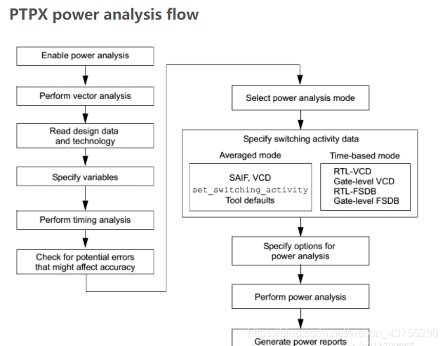

# PrimeTime PX(Power Analysis)

PTPX，是基于primetime环境（简称pt），对全芯片进行power静态和动态功耗分析的工具。包括门级的平均功耗和峰值功耗。可以说PTPX就是pt工具的一个附加工具。通过物理实现后得到的寄生参数提取文件spef文件以及翻转信息文件如vcd等，可以 产能精确地估计功耗。此外，在没有进入后端流程的早期阶段（得到综合网表），也可以使用PTPX进行功耗分析。

PrimeTime PX（PTPX）的核心计算依赖于以下几个关键要素：

- 门级网表 (Gate-Level Netlist)： 综合阶段已经生成了，这提供了设计中所有逻辑单元（Cell）的类型和连接关系。
- 库文件 (Library)： 提供了每个逻辑单元的内部功耗 (Internal Power) 模型、漏电功耗 (Leakage Power) 模型以及其输入引脚电容 (Pin Capacitance)。
- 开关活动 (Switching Activity)： 可以通过功能仿真（如 VCS 配合 SAIF 或 VCD 文件）来获得。
- 互连寄生参数 (Interconnect Parasitics)：  SPEF/SDF 文件，描述实际布线寄生参数。需要完成后端流程才能得到。

> 在没有实际布线寄生参数（SPEF）的情况下，PTPX 仍然可以进行功耗计算, 内部功耗 (Internal Power) & 漏电功耗 (Leakage Power)这两部分功耗的计算主要基于网表、库文件和开关活动，基本不受 SPEF 缺失的影响（除非互连延迟极大影响了内部逻辑的翻转）。开关功耗 (Switching Power) 估算关键在于负载电容，主要由扇出引脚电容（这部分是已知且精确的，因为它在技术库中定义了）和互连电容，后者是spef文件提供的。在缺乏 SPEF 时，PTPX 会使用预布线估算模型 (Pre-Layout Estimation Model) 来估算互连电容。常用的方法包括：连线负载模型 (Wire Load Model, WLM)，根据网线的扇出数（Fanout），从库中查找一个预定义的电容值。这种模型在较早期的流程中常见，但精度较低；拓扑驱动的估算 (Topology-Driven Estimation)： 现代工具会使用更复杂的算法，根据网表的连接拓扑结构（例如，连线的长度、扇出分布等），结合目标工艺的统计数据，来更智能地估算互连电容。

> 在没有提供开关活动的文件时，ptpx会使用默认的开关活动。但是这样也会使得动态功耗（包括内部功耗和转换功耗）的计算非常不准确，与使用saif的结果相比有可能达到[50%的偏差](https://zhuanlan.zhihu.com/p/149914903)

EDA02服务器中，`/home/EDAtools/synopsys/prime/V-2023.12/doc/pt/tutpx`中有教程手册`PrimeTime_PX_Tutorials.pdf`以及示例脚本。

## 功耗建模理论

电路的功耗主要有两种，一种是静态功耗(Static Power)也即漏电功耗(Leakage Power)，也就是一个单元在没有switching，inactive或者static情况下的功耗，包括intrinsic leakage power和gate leakage power。

- 其中intrinsic leakage power主要是由source-to-drain的漏电流引起，也包括扩散区diffusion layer和基底substrate之间的电流泄露。
- Gate leakage power是由source-to-gate和gate-to-drain的漏电流引起，随着工艺尺寸的降低diminish，它已经成为主要的漏电流功耗来源。Gate leakage power主要依赖于gate oxide的厚度和电压强度，不依赖于温度。

另外一种是Dynamic Power，是指电路在active时候的功耗，包括internal power和switching power。

- Internal power是指在cell内的动态功耗，包含cell内部的电容充放电以及PN节之间的瞬时短路（momentary short circuit， P晶体管和N晶体管在关闭打开过程中间的某一短暂时刻，会短路，导致从VDD到GND的瞬时电流）.因此，对于具有较慢transition time的电路，short-circuit power能够占到总的gate power的50%。简单的库单元，动态功耗主要来自短路功耗。复杂的库单元，动态功耗主要来自充放电。
- Switching power是由一个cell的输出端负载电容的充放电导致的。总的load capacitance是输出驱动端（driving output）net和gate电容的累加。与内部功耗的子类—充放电功耗，区别是范围不限于cell内部。

> 一般情况下，需要读入SPEF文件，从而抽取每个节点上的RC参数用于计算switch power。

## 模式及流程

有两种模式

- Averaged mode: SAIF, VCD, set_switching_activity, Tool defaults
- Time-based mode: RTL-VCD, Gate-Level VCD (Peak power)



打开pxpt可以通过在终端输入

```bash
pt_shell
# or directly execute file:
pt_shell -f script.tcl
```

示例脚本在`/home/EDAtools/synopsys/prime/V-2023.12/doc/pt/tutpx/`，配合教程`PrimeTime_PX_Tutorials.pdf`。

### Averaged mode

平均功耗，是基于翻转率toggle rate来分析的。翻转率的标注，可以是默认翻转率、用户定义switching activity、SAIF文件或者VCD文件。功耗结果期望准确的话，首先要保证翻转率的标注要准确。这意味着需要后端布局布线、时钟树等已经完全稳定了。前期做功耗分析，可能只是一个评估作用。工具支持基于仿真的switching activity文件类型，包括vcd/fsdb/vpd/saif，若没有，需要人为设置翻转率。

需要文件：

1. logic库文件，必须是.db格式（lib文件可以通过library compiler转成db文件，详见design compiler章节有提及）；
2. 网表文件，支持verilog、vhdl网表，db、ddc、Milkyway格式的网表也可以；
3. sdc文件，为了计算平均功耗；
4. spef文件，寄生参数信息。可以不提供
5. VCD/saif文件,记录翻转率（若没有，需要人为设置翻转率）。

```Tcl
set power_enable_analysis TRUE
if {$power_enable_timing_analysis == false} { set_app_var power_enable_timing_analysis true } 
set power_analysis_mode averaged

#####################################################################
#       link design
#####################################################################
# set search_path where files used afterwards can be found
set search_path         "/data/home/rh_xu30/work/dac2026/topk/genus/syn/topk_sorter_16_16_8 /data/data_eda2/PDK_Tech/TSMC_22NM_RF_ULL/IP/Std_Cell/tcbn22ullbwp7t40p140_110b/digital/Front_End/timing_power_noise/NLDM/tcbn22ullbwp7t40p140_110b . "

# set std cell library(.db) used during synthesis. pt will search for it in $search_path first
set link_library    " * tcbn22ullbwp7t40p140tt0p8v25c.db"

read_verilog        topk_sorter_postsyn.v
current_design      topk_sorter
link 

#####################################################################
#       read SDC
#####################################################################
# pt will search for file in $search_path first, otherwise, you should use absolute path
# the sdc file was generated during synthesis, and you shold pay attention to the sdc version
# delete "set_current_design" and "set_dont_use" commands in sdc file because pt doesn't recognize them
read_sdc -version 2.0 topk_sorter.func.sdc
set_disable_timing [get_lib_pins ssc_core_typ/*/G]

#####################################################################
#       set transition time / annotate parasitics
#####################################################################
# if you don't have spef file, ignore this step
read_parasitics        ../src/annotate/mac.spef.gz

#####################################################################
#       check/update/report timing
#####################################################################
check_timing
update_timing
report_timing

#####################################################################
#       read switching activity file
#####################################################################
# if you don't have saif/vcd file or want to use default switching activity, ignore this step

# if you have saif file for switching activity description, use "read_saif" command
read_saif "../sim/mac.saif" -strip_path "mac_tb/macinst" 
# strip_path is the hierarchical path of the analysed module instanciated in the testbench which generated the saif file
report_switching_activity -list_not_annotated

# Instead, if you have vcd file for switching activity description, use "read_vcd" command
read_vcd "../sim/vcd.dump.gz" -strip_path "mac_tb/macinst"

#####################################################################
#       check/update/report power
#####################################################################
check_power
update_power
report_power -hierarchy > saif.rpt
quit
```

### Time-based mode

在该模式下，需要提供VCD或FSDB文件，工具会分析峰值功耗，并生成功耗波形等。SAIF格式对此不支持。

示例脚本如下：

```Tcl
set power_enable_analysis TRUE
if {$power_enable_timing_analysis == false} {set_app_var power_enable_timing_analysis true} 
set power_analysis_mode time_based

#####################################################################
#       link design
#####################################################################
set search_path         "../src/hdl/gate ../src/lib/snps . "
set link_library    " * core_typ.db"

read_verilog        mac.vg
current_design        mac
link

#####################################################################
#       set transition time / annotate parasitics
#####################################################################
read_sdc ../src/hdl/gate/mac.sdc
set_disable_timing [get_lib_pins ssc_core_typ/*/G]

# if you don't have spef file, ignore this step
read_parasitics        ../src/annotate/mac.spef.gz

#####################################################################
#       check/update/report timing 
#####################################################################
check_timing
update_timing
report_timing

#####################################################################
#       read switching activity file
#####################################################################
# 如果是rtl，使用read_vcd -rtl，表示输入的是rtl的activity文件。
read_vcd -rtl "../sim/rtlvcd.dump" -strip_path "mac_tb/macinst"
report_switching_activity -list_not_annotated -include_only sequential

# read_vcd -zero_delay表示输入的是netlist文件，但是并没有sdf文件的，可以进行cycle_accurate分析。
read_vcd -zero_delay "../sim/vcd.dump.gz" -strip_path "mac_tb/macinst"

# read_vcd什么都不加时，表示进行基于event的分析。
read_vcd "../sim/vcd.dump.gz" -strip_path "mac_tb/macinst"

#####################################################################
#       check/update/report power 
#####################################################################
check_power
set_power_analysis_options -waveform_format fsdb -waveform_output vcd
update_power
report_power
quit
```

## vcd/fsdb/saif等翻转活动描述文件

### 区别

- VCD（Value/Variable Change Dump）：这是一种基于事件的格式，包含设计中信号的每一次值变化以及发生变化的时间。在averaged和time-based模式下都支持，是国际标准格式。Gate-Level VCD和RTL-Level VCD都可以，但是使用RTL-Level VCD时，需要进行name mapping (set_rtl_to_gate_name)。
- SAIF(Switching Activity Interface Format): 它捕获信号的跳变以及在每个逻辑电平上停留的时间。SAIF 文件包含设计中网表的切换次数和静态概率。只支持averaged模式。有些工具，比如ICC/ICC2，只支持SAIF文件，需要将VCD转换成SAIF文件，在PT安装目录下有一个utility，执行`vcd2saif -input vcd_file -output saif_file ...`
- FSDB(Fast Signal DataBbase):类似于VCD的波形文件，去除了VCD中的冗余信息，数据量小很多，提高了仿真的速度，Synopsys的仿真工具(如vcs)支持较多。

### saif文件生成

要从RTL或Netlist生成SAIF文件，需要在调用rtl或者netlist模块的testbench中使用toggle系统任务指定需要记录的开关活动信息（时间范围和模块）。

```verilog
$set_toggle_region：指定记录模块
$toggle_start：开始记录
$toggle_stop：停止记录
$toggle_report：写SAIF文件
```

比较RTL和门级网表生成的saif文件，可以得出门级网表生成的saif文件更加具体，包含了设计中更多的开关活动信息，提高功耗分析的准确性，同时也意味着增加了Runtime。

示例的testbench如下：

```verilog
timescale 1ns / 1ps

module MyDesign_tb;

    reg clk;

    MyDesign uut (
    // design ports
    );

    initial begin
        $sdf_annotate("MyDesign.sdf",uut)
    end

    always #5 clk = !clk;

    initial begin
        $set_toggle_region(MyDesign_tb.uut);
        $toggle_start();

        // Have your test bench here//
        //........
        //........

        $toggle_stop();
        $toggle_report("power.saif", 1.0e-12, "power_saif_tb ");

        //end simulation
        $finish;
    end
endmodule
```

> 如果已经经过综合生成sdf文件，可以在testbench中调用`$sdf_annotate`命令来反标时序，从而得到更准确的翻转结果。

生成的saif文件(使用rtl而非网表)形如

```
(SAIFILE
(SAIFVERSION "2.0")
(DIRECTION "backward")
(DESIGN )
(DATE "Thu Jan  6 23:02:33 2022")
(VENDOR "Synopsys, Inc")
(PROGRAM_NAME "VCS-Scirocco-MX Power Compiler")
(VERSION "1.0")
(DIVIDER / )
(TIMESCALE 1 ps)
(DURATION 1000000.00)
(INSTANCE power_saif_tb
   (INSTANCE DUT
      (NET
         (in1
            (T0 440000) (T1 560000) (TX 0)
            (TC 25) (IG 0)
         )
         (in2
            (T0 460000) (T1 540000) (TX 0)
            (TC 27) (IG 0)
         )
         (clk
            (T0 500000) (T1 500000) (TX 0)
            (TC 99) (IG 0)
         )
         (rst_n
            (T0 15000) (T1 985000) (TX 0)
            (TC 2) (IG 0)
         )
      )
   )
)
)
```

### vcd文件生成

原理和生成saif文件一样，就是在普通的testbench中加上语句标识vcd文件生成：

```verilog
initial begin
  $dumpfile("test.vcd");
  $dumpvars(0,test); //test是要记录信号的模块名，0表示抓取模块内的所有信号，1表示抓取当前层的信号
end
```
> 如果已经经过综合生成sdf文件，可以在testbench中调用`$sdf_annotate`命令来反标时序，从而得到更准确的翻转结果。

### fsdb文件生成

fsdb文件和vcd文件类似，也是在testbench中加上语句标识fsdb文件生成：

```verilog
initial begin
  $fsdbDumpfile("tb_plot.fsdb");
  $fsdbDumpvars("+all");
end
```

> 如果已经经过综合生成sdf文件，可以在testbench中调用`$sdf_annotate`命令来反标时序，从而得到更准确的翻转结果。
