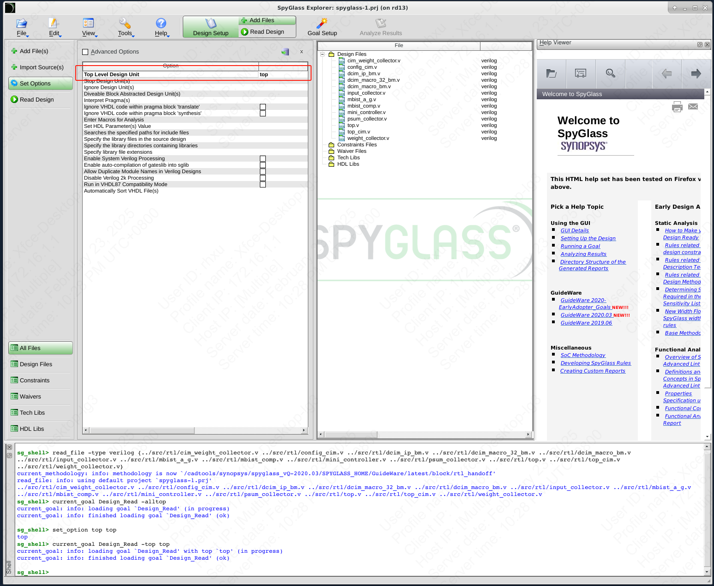
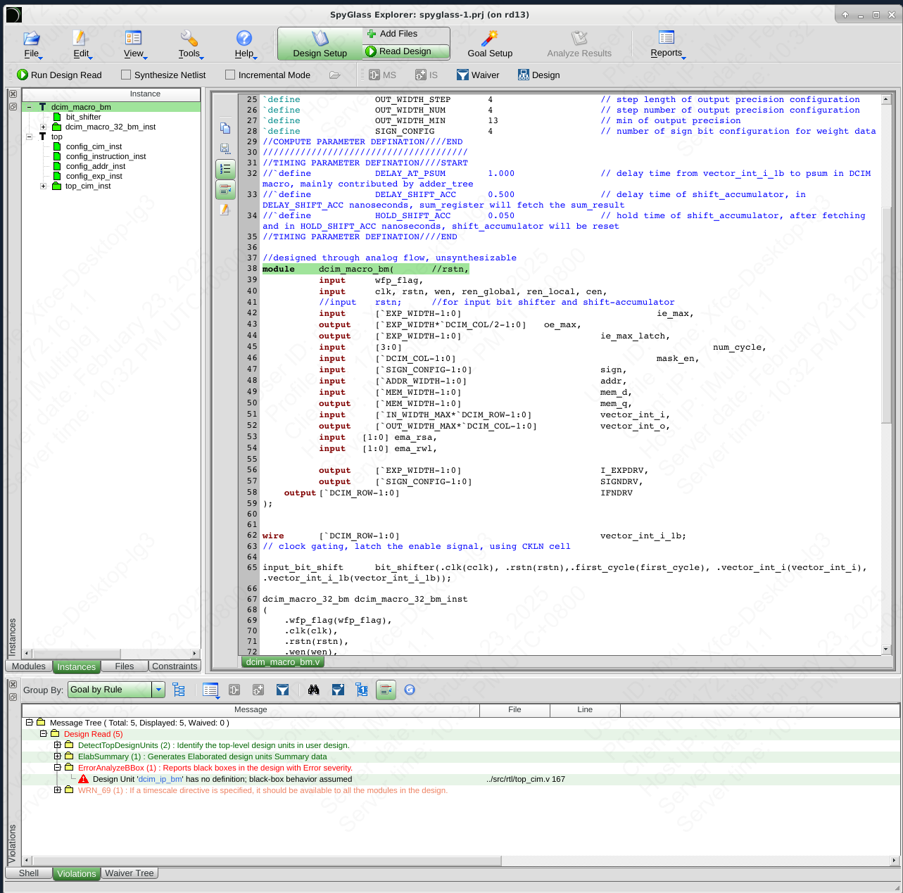
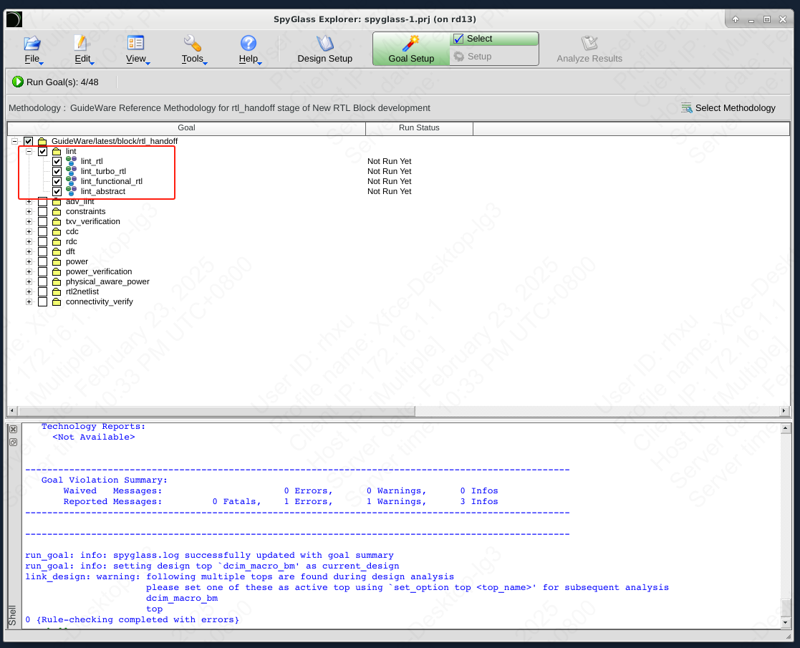
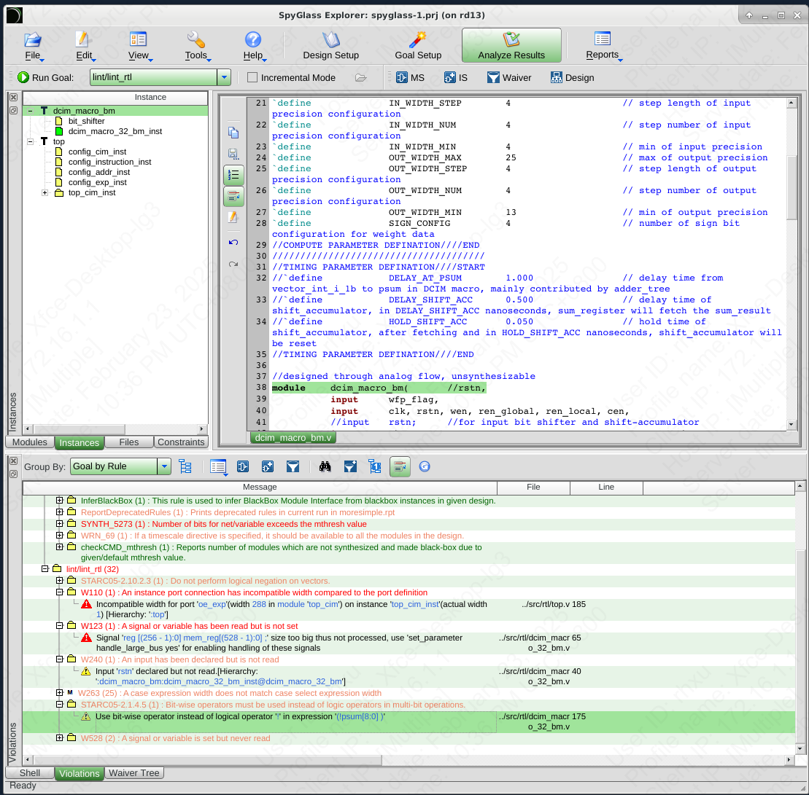
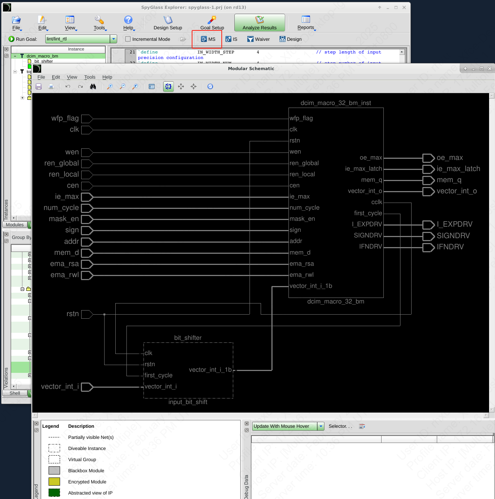

# Spyglass

SPYGLASS是很高效的RTL分析和CDC检查工具，可以有效的帮助规避设计中的难以察觉的问题，帮助设计人员提高设计质量。

## 用法

### 打开gui

```bash
cd spyglass # void work dir
b spyglass # gui
```

### 添加rtl文件

`Design Setup` -> `Add files`

### 设置顶层模块

`Design Setup` -> `Set options` -> `top level design unit`



### 编译设计

`Design Setup` -> `Read design` -> `Run design read`

在读取完成后会在下方窗口列出问题。例如`ErrorAnalyzeB Box`，这是因为有的模块文件没有添加，SPYGLASS找不到，后面SPYGLASS会将其作为黑盒子处理。



> 左侧instance下文件不同颜色标识意义为：绿色表示该模块可进行分析，但不可进行综合；黑色表示该模块作为黑盒子存在；白色表示该模块可综合。需要注意，只是读取设计并不会完成综合，因此也不会创建相关的原理图。

### 静态分析

`Goal setup` -> `lint` -> `Run goals`

可以一次选择多个目标设置，但分析过程是顺序执行的，只要前面的检查通过了才会进行后面的检查。



得到分析结果后，首先查看Lint分析结果。首先展开lint/lint_rtl文件夹消息。错误信息以红色显示，警告以橙色显示，信息以绿色显示。



### 查看原理图

点击`MS`图标即可查看schematic




