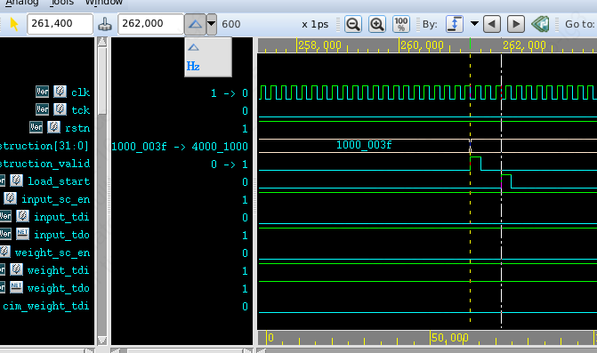
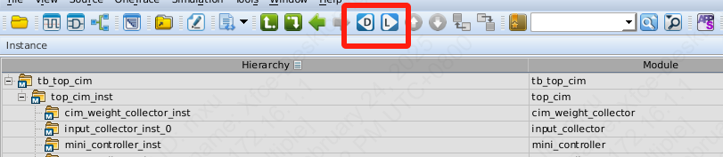
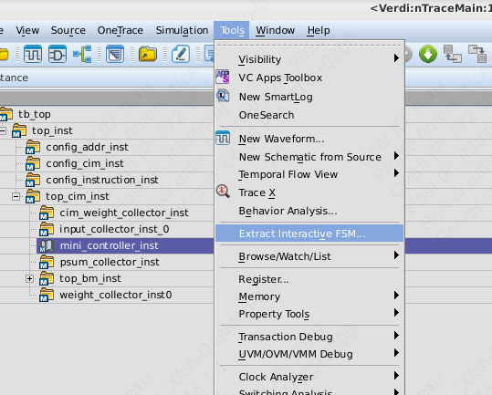
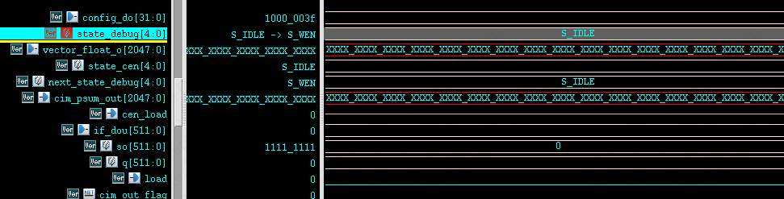

# VCS & Verdi

## Simulation

在编写的testbench中需要加入语句：

```verilog
initial begin
  $fsdbDumpfile("tb_plot.fsdb");//this file is generated in the directory of makefile
  $fsdbDumpvars("+all");
end
```

在需要综合的工作文件夹下写一个list.F以及Makefile([]中是需要修改的地方,顶层模块是tb里的顶层模块，波形文件要和tb中指定的产生的文件名一致)

```Makefile
VCS = vcs +v2k -override_timescale=100ps/1ps -full64 -fsdb -debug_all -sverilog +vcs+flush+all +lint=TFIPC-L -notice +notimingcheck -o simv -l compile.log

all: vcs sim verdi

vcs:
    $(VCS) -f list.F

sim:
    ./simv -l simulation.log

verdi:
    verdi -top [U_top_cim] -sv -f list.F -ssf [tb_plot.fsdb] +define+IS_SIM &

clean:
    rm -rf ./csrc *.daidir ./csrc \
    *.log *.vpd *.vdb simv* *.key stack* vc_hdrs.h novas.rc \
    +race.out* novas.conf novas_dump.log verdi* *fsdb* apb2apb_asyno \
    ddr_addr.txt ddr_data.txt
```

然后`make all`即可仿真并自动打开Verdi查看波形了。

关于反标到案例，可以参考DCO篇。

## Verdi使用技巧

1. 添加波形：选中文本中的信号，按ctrl+w
2. 改变波形颜色：选中信号，按c可以选择颜色，按t可以快速切换到下一个颜色
3. 计算时间间隔：在某个时刻点左键可以标记一条黄线，按滚轮（中键）可以标记一条白线，波形串口左上角可以看到两条线的间隔或者频率
  
4. 保存波形：按shift+s，可以保存当前波形为.rc文件
5. 加载波形：按r可以加载.rc文件显示波形
6. 驱动和负载：在代码文本中选取信号，在工具栏点击D即可跳转到驱动信号，点击L即可跳转到负载信号
  
7. 提取状态机：可以使显示的state的波形的值为状态机的状态
  
  
