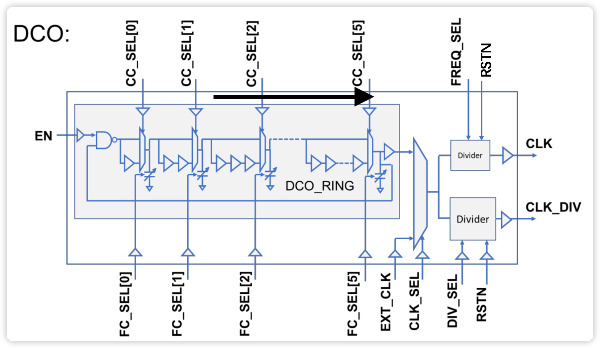
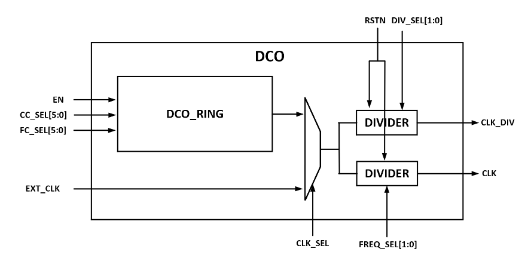
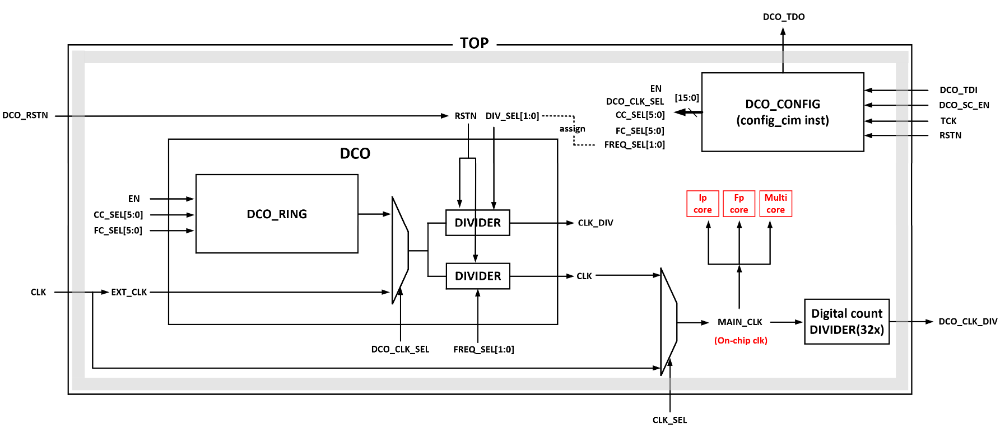
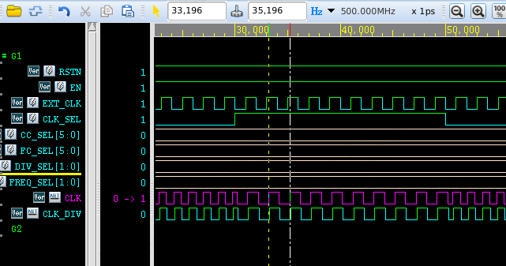
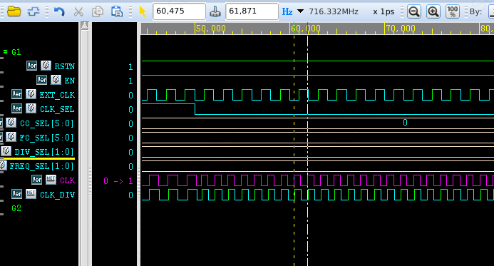

# DCO

## 片上时钟产生模块

- VCO（Voltage-Controlled Oscillator，电压控制振荡器）
- PLL（Phase-Locked Loop，锁相环）
- DCO（Digitally Controlled Oscillator，数字控制振荡器） 
- DPLL（Digital Phase-Locked Loop，数字锁相环）

> DCO通过数字信号控制频率，VCO通过模拟电压控制频率。DCO适合数字IC，VCO适合模拟或混合信号IC; 
> VCO是PLL的核心，PLL通过控制VCO的频率实现同步; 
> DPLL 的核心是数字化的相位锁定机制，而振荡器可以是 DCO 或其他类型的振荡器（如 VCO）。如果 DPLL 采用数字控制方式，DCO 是常见选择。

DCO可以独立使用，作为片上时钟的的产生模块。其输入都是数字信号。

> 关于我们这次为什么选择了DCO而不是PLL：代理没有及时给到相应电压平台的PLL ip，并且我们也没有人会自己设计
> 使用DCO的问题（缺点）：在标准数字电压0.9v的时候，DCO的最大输出频率可能还无法达到我们期望的频率。
> 所以有必要为DCO设置单独的电压，将其提高到高于其他数字域的标准电压。

## 原理图

> 这里介绍的DCO是基于贾老师设计的tsmc22的DCO修改而来。贾老师的原文件在`/project/work/home/tyiia/common/example/tsmc22nm/DCO 22nm`



此次修改后的DCO基于smic22工艺。文件位置在`/work/home/rhxu/DCO_smic/`.



| pin       | in/out   |description                        |
|-----------|----------|-----------------------------------|
| RSTN      | in       | Reset divider, reset:0            |
| EN        | in       | Enable the DCO oscillation, enable: 1     |
| CC_SEL    | in[5:0]  | Coarse tune bits, the larger value, the lower CLK frequency    |
| FC_SEL    | in[5:0]  | Fine tune bits, the larger value, the lower CLK frequency      |
| EXT_CLK   | in       | External clock source (Backup clock)                           |
| CLK_SEL   | in       | Select clock. 0: DCO clock, 1: External clock                  |
| FREQ_SEL  | in[1:0]  | Divider for tile clock. 00: DCO clk, 01: DCO÷2, 11: DCO÷4      |
| DIV_SEL   | in[1:0]  | Divider ratio for test clock: 00: ÷1, 01: ÷2, 11: ÷4|
| CLK       | out      | High-speed clock for tile logics                               |
| CLK_DIV   | out      | Divided clock. Routed off chip for testing.                    |

简单来说，DCO中的DCO ring可以通过数字标准单元构成的的loop来产生时钟，并且产生的时钟频率由cc_sel粗调，fc_sel精调。
DCO ring产生的时钟又可以与外部时钟（EXT_CLK）二选一输出，然后再经过分频（FREQ_SEL控制CLK分频，DIV_SEL控制CLK_DIV分频）后输出为CLK和CLK_DIV。

> CLK是用于片上所有逻辑的时钟，CLK_DIV一般是接到芯片外部用于测试时观测。

> 修改sel配置后可能需要用RSTN复位后才能正常产生时钟信号。



以上是与顶层IO相连的部分以及与顶层模块的关系。需要注意的是，在顶层中，将FREQ_SEL和DIV_SEL设置为相等，也就是用于测试的CLK_DIV和用于片上数字逻辑的CLK是永远相同的。

## 综合

注意DCO的rtl是用工艺库中的标准单元写成的，而非行为级模型。所以在工艺迁移的时候需要更换std cell。为了更准确的仿真，需要一些器件和导线的时序信息，所以需要先综合得到sdf文件后，反标到testbench中进行仿真。

> 在SDF格式中可以指定固有延迟（intrinsic delays），互连延迟（interconnect delays），端口延迟（port delays），时序检查（timing checks），时序约束（timing constraints）和路径脉冲（PATHPULSE）。

> 使用VCS读取SDF文件时，会将延迟值“反向标注（back-annotates）”到设计中，即在源文件中添加或者更改延迟值。


### design compiler综合脚本

具体文件在`/work/home/rhxu/DCO_smic/DCO_syn/scripts/script.tcl`

```tcl
set search_path "/work/home/wumeng/SMIC22_INSTALL/SMIC28HKD_22ULP/IP/STD/SCC28NHKD_HDC30P140_RVT_V0p1a/liberty/0.9v" ;# TODO
set target_library "scc28nhkd_hdc30p140_rvt_ss_v0p9_25c_ccs_lvf.db" ;# TODO
set link_library "* $target_library"

analyze -f sverilog "DCO.v" ;# TODO
elaborate "DCO"
current_design "DCO"
link
set_dont_touch "DCO"
uniquify
write_sdf "DCO.sdf" ;# TODO
```

## 仿真（反标时序）

文件在`/work/home/rhxu/DCO_smic/DCO_sim/`。

### 编写testbench

注意在testbench里加上语句：

```verilog
initial begin
    $sdf_annotate("DCO.sdf",U_DCO,,,"TYPICAL","1.6:1.4:1.2","FROM_MTM");
end
```

`$sdf_annotate(“sdf_file”[,module_instance][,“sdf_configfile”][,“sdf_logfile”][,“mtm_spec”][,“scale_factors”][,“scale_type”]);`

其中：

- "sdf_file"：指定SDF文件的路径。
- "module_instance"：指定反标设计的范围（scope）
- “sdf_configfile”：指定SDF配置文件
- “sdf_logfile”：指定VCS保存error 和warnings消息的SDF日志文件。也可以使用+sdfverbose runtime option来打印所有反标消息
- "mtm_spec"：指定延迟类型"MINIMUM（min）", "TYPICAL（typ）“或者"MAXIMUM（max）”。
- "scale_factors"：分别指定min:typ:max的缩放因子，默认是"1.0:1.0:1.0"
- “scale_type”：指定缩放之前延迟值得来源，“FROM_TYPICAL”,“FROM_MIMINUM”, “FROM_MAXIMUM"和"FROM_MTM" (default).

### 仿真结果



当clk_sel为1的时候，DCO输出外灌时钟信号，确认与原外灌时钟频率一致。



当clk_sel为0，cc_sel为00的时候，DCO ring输出的频率是最高的，并且freq_sel为0，即没有继续分频，因此这是dco可以输出的最高频，在仿真中可以达到716.332MHz。但是根据经验，在实际测试的时候频率会比仿真的时候低。


当FREQ_SEL为0的时候1分频，为1是2分频，为3是四分频。可见分频功能也是正常的。

|cc_sel|fc_sel|freq_sel|clk|
|--|--|--|---|
|000000|000000|00|716.332MHz|
|100000|000000|00|514.668MHz|
|100000|100000|00|514.668MHz|
|100000|111111|00|514.668MHz|
|100001|000000|00|505.051MHz|
|100010|000000|00|505.051MHz|
|100011|000000|00|495.786MHz|
|100100|000000|00|496.771MHz|
|100101|000000|00|487.805MHz|
|100110|000000|00|487.805MHz|
|100110|100000|00|487.805MHz|
|100110|111111|00|487.805MHz|
|111111|000000|00|400.160MHz|
|111111|100000|00|400.160MHz|
|111111|111111|00|400.160MHz|
|111111|111111|01|200.080MHz|
|111111|111111|11|100.040MHz|

其他测试点通过表格展示。可以发现频率确实随着粗调信号cc_sel的增大而减小。此外，fc_sel的调节在该仿真中没有起作用，可能是网络和标准单元的延时在该仿真中不够准确，导致无法仿出来它的影响。