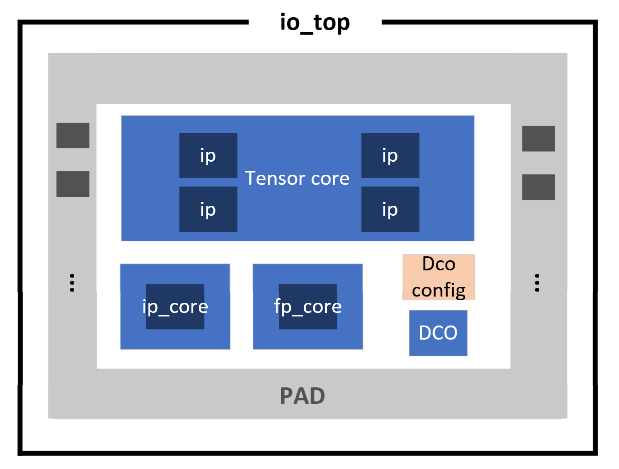
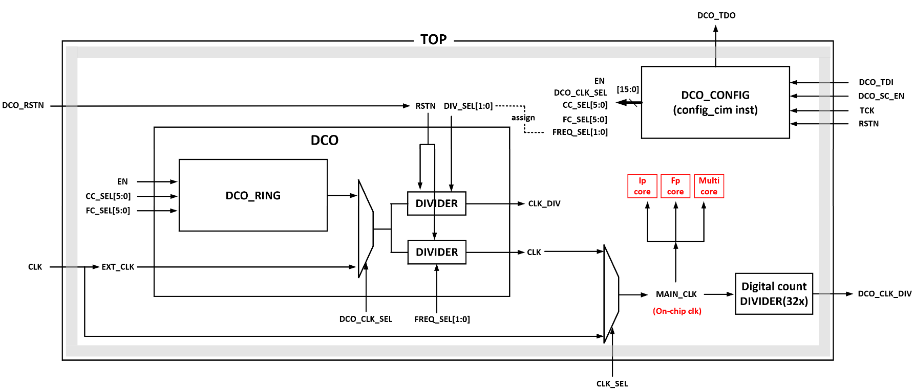

# IO_TOP

> /work/home/rhxu/SMIC2025/IO_TOP/

## 特征概述

- 总共三个计算模块（ip core，fp core，tensor core），共用一套顶层IO以及一个DCO产生的时钟信号。顶层可以通过片选信号来选择使用 哪一个计算模块。
- 片上数字逻辑可以使用DCO产生的时钟，也可以使用芯片外灌时钟
- 各计算模块内部，在dcim ip macro外围通过扫描链来配置输入寄存器（串行输入并行输出给到ip），同样通过扫描链来收集ip输出的数据（并行输入ip算出的数据然后串行输出到顶层io）

### 各计算模块概述

- ip core：验证dcim_core (IN1b-W4b-O9b 矩阵-向量乘)是否正常工作；配有mbist自检电路，可自检SRAM读写功能
- fp core：在dcim_core的基础上，加入移位累加、PSUM后处理、指数对齐、输出格式转换等完整外围电路，支持多种定点/浮点数据格式(INT4,INT8,INT12,INT16,FP16,BF16,BBF16,FP8_E4M3, FP8_E5M2)的矩阵-向量乘计算，输出数据格式为INT32/FP32
- tensor core：由2x2个INT-DCIM ENGINE组成，可配置为执行通用矩阵-矩阵乘法。

## 层次

- IO_TOP(IO_TOP.v)
  - config_dco_inst config_cim(config_cim.v)
  - DCO_inst [DCO](/rtl/DCO.md)
  - fp_core_inst0 [fp_core](/rtl/fp_core.md)
  - ip_core_inst1 [ip_core](/rtl/ip_core.md)
  - multi_core_inst [multi_core](/rtl/tensor_core.md)

> multi core就是指tensor core。因为tensor core里例化了多个dcim ip，因此可以进行gemm。

## 接口

|方向|信号名|关联对象|描述|
|-----|--------------------|-------------|--------------|
|input| IP_SEL             | ip/fp core  |  选择使用ip core还是fp core |
|input| DCO_RSTN           | DCO         |  DCO复位信号，注意在调整DCO频率后可能需要置位复位才能生效 |
|input| DCO_SC_EN          | DCO         |  用于控制DCO的配置扫描链寄存器开始扫描输入的使能信号 |
|input| DCO_TDI            | DCO         |  用于配置DCO的配置扫描链寄存器的串行输入信号 |
|input| CLK                | DCO         |  外灌时钟，用于片上数字逻辑的时钟信号 |
|input| CLK_SEL            | DCO         |  选择使用外灌时钟还是DCO产生的时钟信号 |
|input| TCK                | ip/fp core  |  用于配置扫描链寄存器的时钟信号 |
|input| RSTN               | ip/fp core  |  数字逻辑的复位信号 |
|input| INSTRUCTION_VALID  | ip/fp core  |  来将instruction扫描链寄存器里的数据锁存，得到状态机的转换目标 |
|input| LOAD_START         | ip/fp core  |  在有效时允许状态开始根据上一次锁存的有效instruction进行转换 |
|input| OUT_SEL            | ip/fp core  |  选择输出psum或者cim weight |
|input| OUT_LOAD           | ip/fp core  |  控制psum或者cim weight的扫描链寄存器加载psum或者cim weight的并行输入信号 |
|input| OUT_SC_EN          | ip/fp core  |  用于控制psum或者cim weight的配置扫描链寄存器开始扫描输入的使能信号 |
|input| OUT_TDI            | ip/fp core  |  用于移位psum或者cim weight的配置扫描链寄存器的串行输入信号 |
|input| MBIST_TEST_H       | ip core     |  有效时进入ip core的mbist自检SRAM读写功能 |
|input| MBIST_RESET_L      | ip core     |  mbist自检控制模块的复位信号 |
|input| EN_LOAD            | ip/fp core  |  允许收集了串行输入的input或者weight的寄存器并行加载到buffer上 |
|input| [2:0] CONFIG_SEL   | ip/fp core  |  不同的值代表不同的模式，在不同模式下激活相关的信号 |
|input| CONFIG_SC_EN       | ip/fp core  |  用于控制core内各种配置扫描链寄存器开始扫描输入的使能信号 |
|input| CONFIG_TDI         | ip/fp core  |  用于配置core内各种配置扫描链寄存器的串行输入信号 |
|input| TCK_R              | tensor core |  用于配置扫描链寄存器的时钟信号  |
|input| RSTN_R             | tensor core |  数字逻辑的复位信号 |
|input| INSTRUCTION_VALID_R| tensor core |  来将instruction扫描链寄存器里的数据锁存，得到状态机的转换目标 |
|input| MODE_R             | tensor core |  选择是否为debug模式 |
|input| QUANT_ENABLE_R     | tensor core |  选择是否开启量化功能 |
|input| LOAD_START_R       | tensor core |  在有效时允许状态开始根据上一次锁存的有效instruction进行转换 |
|input| [2:0] OUT_SEL_R    | tensor core |  选择输出（4个中）哪一个ip的cim weight还是psum输出 |
|input| OUT_LOAD_R         | tensor core |  控制psum或者cim weight的扫描链寄存器加载psum或者cim weight的并行输入信号 |
|input| OUT_SC_EN_R        | tensor core |  用于控制psum或者cim weight的配置扫描链寄存器开始扫描输入的使能信号 |
|input| OUT_TDI_R          | tensor core |  用于配置psum或者cim weight的配置扫描链寄存器的串行输入信号 |
|input| EN_LOAD_R          | tensor core |  允许收集了串行输入的input或者weight的寄存器并行加载到buffer上 |
|input| [2:0] CONFIG_SEL_R | tensor core |  不同的值代表不同的模式，在不同模式下激活相关的信号 |
|input| CONFIG_SC_EN_R     | tensor core |  用于控制core内各种配置扫描链寄存器开始扫描输入的使能信号 |
|input| CONFIG_TDI_R       | tensor core |  用于配置core内各种配置扫描链寄存器的串行输入信号 |
|output| OUT_TDO           | ip/fp core  |  psum或者cim weight的配置扫描链寄存器的移位时串行输出信号 |
|output| OUT_TDO_R         | tensor core |  psum或者cim weight的配置扫描链寄存器的移位时串行输出信号 |
|output| CONFIG_TDO        | ip/fp core  |  core内各种配置扫描链寄存器的移位时串行输出信号 |
|output| CONFIG_TDO_R      | tensor core |  core内各种配置扫描链寄存器的移位时串行输出信号 |
|output| MBIST_FAIL        | ip core     |  指示mbist自检是否成功，如果一直为0，则无误 |
|output| MBIST_DONE        | ip core     |  指示mbist自检是否完成 |
|output| DCO_CLK_DIV       | DCO         |  DCO输出的片上时钟信号经过32分频后的输出 |
|output| DCO_TDO           | DCO         |  DCO配置扫描链寄存器的串行输出 |

## 功能描述

### 选择外灌时钟或者DCO振荡产生的时钟信号

当`clk_sel`为1的时候选择的是外灌时钟（顶层输入信号`CLK`）；当`clk_sel`为0的时候选择DCO ring振荡产生的时钟信号，并且可以通过`cc_sel`进行粗调，`fc_sel`进行细调（调的越小，频率越高）。然后会通过DCO中的分频电路（1，2，4分频）进行输出，作为片上数字逻辑的时钟信号。这个时钟信号还会经过顶层模块中的32分频输出到顶层的`DCO_CLK_DIV`，用于观察时钟信号。

### 配置扫描链寄存器

所有计算模块以及DCO都是需要输入、配置或者输出寄存器的。例如DCO的粗调信号`cc_sel`、细调信号`fc_sel`等组成的DCO配置信号，dcim ip计算需要的并行输入的`input`信号等等，这些信号并不是直接在顶层设置了相应的pin直接输入的，而是用相应的寄存器来存储这些配置或者输入值的，而这些寄存器又是通过扫描链来进行串行输入、并行输出。这些扫描链寄存器使用不同于其他数字逻辑使用的时钟，而是一个外灌的时钟`tck`。这样可以解耦配置和计算的时序。

### 选通fp core或者ip core进行浮点或整型计算

当`ip_sel`为0，顶层所有有效的控制信号都会输入到fp core；当`ip_sel`为1，顶层所有有效的控制信号都会输入到ip core。控制信号包括：`tck`, `rstn`, `instruction_valid`, `load_start`, `out_sel`, `out_load`, `out_sc_en`, `out_tdi`, `config_sc_en`, `config_tdi`, `out_tdo`, `config_tdo`.

### 独立于ip core或者fp core使用tensor core

Ip core和fp core在同一时间只能使用其中一个，因为他们的控制和输入信号在顶层是通过片选信号 `ip_sel`来二选一的；但是tensor core的控制和输入信号是独立于这两者的，他们公用的只有一个片上时钟信号。

## layout

