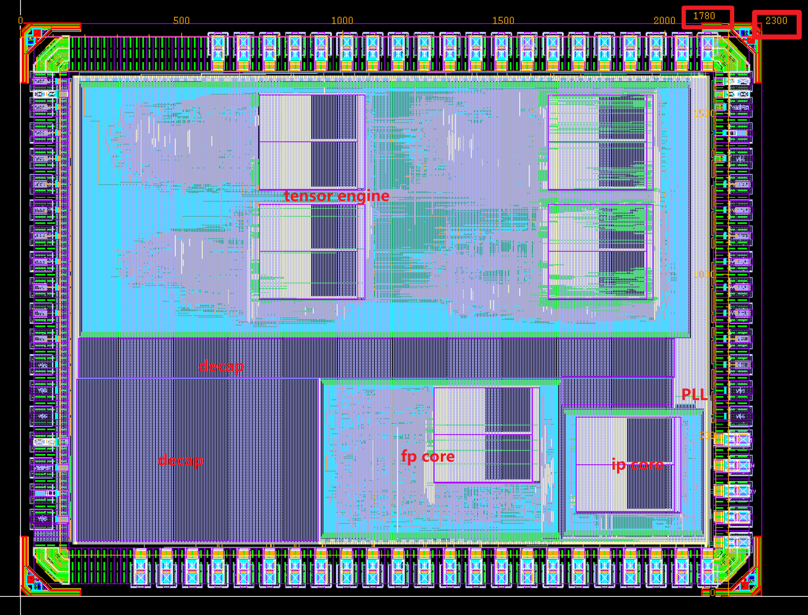

# IO_TOP

> /IO_TOP/

## 层次

- IO_TOP(IO_TOP.v)
  - config_dco_inst config_cim(config_cim.v)
  - DCO_inst [DCO](/rtl/DCO.md)
  - fp_core_inst0 [fp_core](/rtl/fp_core.md)
  - ip_core_inst1 [ip_core](/rtl/ip_core.md)
  - multi_core_inst [multi_core](/rtl/tensor_core.md)

> multi core就是指tensor core。因为tensor core里例化了多个dcim ip，因此可以进行gemm。


## top

### 接口

```verilog
module IO_TOP
(
    input IP_SEL,
    input DCO_RSTN,
    input DCO_SC_EN,
    input DCO_TDI,
    input CLK,
    input CLK_SEL,
    input TCK,
    input RSTN,
    input INSTRUCTION_VALID,
    input LOAD_START,
    input OUT_SEL,
    input OUT_LOAD,
    input OUT_SC_EN,
    input OUT_TDI,
    input MBIST_TEST_H,
    input MBIST_RESET_L,
    input EN_LOAD,
    input [2:0] CONFIG_SEL,
    input CONFIG_SC_EN,
    input CONFIG_TDI,
    input TCK_R,
    input RSTN_R,
    input INSTRUCTION_VALID_R,
    input MODE_R,
    input QUANT_ENABLE_R,
    input LOAD_START_R,
    input [2:0] OUT_SEL_R,
    input OUT_LOAD_R,
    input OUT_SC_EN_R,
    input OUT_TDI_R,
    input EN_LOAD_R,
    input [2:0] CONFIG_SEL_R,
    input CONFIG_SC_EN_R,
    input CONFIG_TDI_R,
    output OUT_TDO,
    output OUT_TDO_R,
    output CONFIG_TDO,
    output CONFIG_TDO_R,
    output MBIST_FAIL,
    output MBIST_DONE,
    output DCO_CLK_DIV,
    output DCO_TDO
);
```

### 图例


### layout（上一版）

