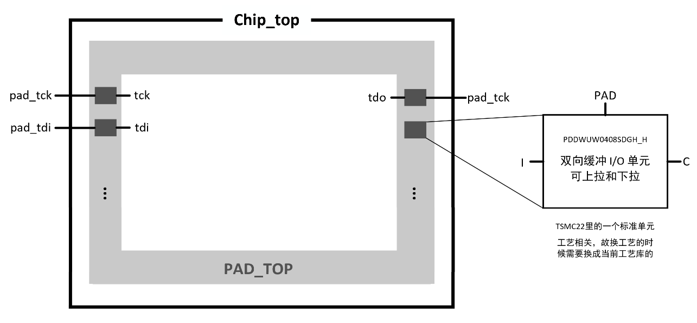
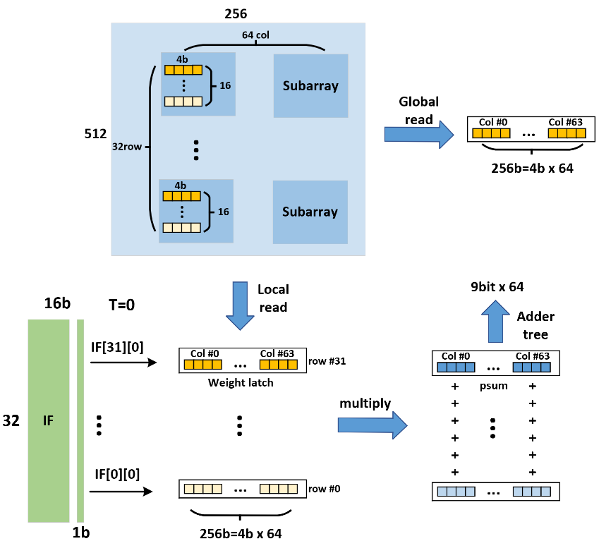

# chip_top

## 层次

```text
chip_top.v
├── PAD_TOP
├── config_dco
├── global_ctrl
│   ├── state_ctrl
│   ├── scan_chain_weight
│   ├── read_compare
│   ├── scan_chain_IF
│   └── scan_chain_psum
├── DCO
└── DCIM_32_4_64
```

没有包含DCIM_32_4_64模块的定义以及子模块，因为在综合的时候，DCIM_32_4_64是作为macro例化的，而非行为级模型综合生成。
DCO的rtl也是网表风格描述的，并非行为级风格描述，且例化了具体工艺库中的标准单元，因此在换工艺的时候也需要重写。

## rtl文件

- PAD_TOP.v
  > 最顶层的所有信号都需要经过这个模块作为缓冲，和内部的其他的模块连接。顶层的所有输入输出信号都是pad_前缀的，过了这个模块后，就会去掉pad_前缀。
- config_dco.v
  > 在sc_en有效的时候，将q从高位往低位移位，tdi作为q的新最高位。时钟信号为tck，一个时钟移一位。
  > 输出的q会作为dco的config，包括了cc_sel, fc_sel, freq_sel, div_sel
- DCO.v
  > DCO是一种通过数字信号控制输出频率的振荡器; PLL是一种通过反馈控制使输出信号与参考信号相位同步的电路, 包括相位检测器（PD）、低通滤波器（LPF）、压控振荡器（VCO）和反馈分频器。
  > 在数字PLL中，DCO替代传统VCO，利用数字控制实现频率调节，提升系统灵活性和精度。
  > 用于产生clk信号，和tck无关。tck是顶层模块外部给的信号。

  > [DCO理解](https://blog.csdn.net/cy413026/article/details/142660352)
- global_ctrl.v
  > config_reg在sc_en有效的时候将q从高位往低位移位，tdi作为q的新最高位。时钟信号为tck，一个时钟移一位。输出的q会作为全局的config。

  > scan_chain_xxx

## chip_top

### 接口

```verilog
module chip_top  ( 
// pad of global ctrl
    input  wire                     pad_tck,
    input  wire                     pad_tdi,
    input  wire                     pad_tms,
    input  wire                     pad_load,
    input  wire [4:0]               pad_sel,

    input  wire                     pad_rstn,
    input  wire                     pad_cnt_en,
    input  wire                     pad_sel_cnt_en,
//  input  wire                     pad_clk,
    input  wire                     pad_cen,
    input  wire                     pad_cen_loop,
    input  wire                     pad_ren,
    input  wire                     pad_wen,
    input  wire                     pad_mem_en,
// pad of DCO
    input  wire                     pad_dco_en,
    input  wire                     pad_dco_ext_clk,
// 0:DCO; 1:External
    input  wire                     pad_clk_sel,
    output wire                     pad_clk_div,
    input  wire                     pad_clk_div_rstn,

// pad of output
    output wire                     pad_comp_out,

    output wire                     pad_tdo_psum,
    output wire                     pad_q_tdo,
    output wire                     pad_tdo
);
```

可以看到，tck是外界给的时钟。供内部使用的clk是DCO产生的，与tck无关。tck

## PAD_TOP

### 接口

```verilog
module PAD_TOP (
// pad of global ctrl
    input  wire                     pad_tck,
    input  wire                     pad_tdi,
    input  wire                     pad_tms,
    input  wire                     pad_load,
    input  wire [4:0]               pad_sel,

    input  wire                     pad_rstn,
    input  wire                     pad_cnt_en,
    input  wire                     pad_sel_cnt_en,
//  input  wire                     pad_clk,
    input  wire                     pad_cen,
    input  wire                     pad_cen_loop,
    input  wire                     pad_ren,
    input  wire                     pad_wen,
    input  wire                     pad_mem_en,

// pad of DCO
    input  wire                     pad_dco_en,
    input  wire                     pad_dco_ext_clk,
// 0:DCO; 1:External
    input  wire                     pad_clk_sel,
    output wire                     pad_clk_div,
    input  wire                     pad_clk_div_rstn,

// pad of output
    output wire                     pad_tdo_psum,
    output wire                     pad_q_tdo,
    output wire                     pad_tdo,
    output wire                     pad_comp_out,

// pad of global ctrl
    output  wire                    tck,
    output  wire                    tdi,
    output  wire                    tms,
    output  wire                    load,
    output  wire [4:0]              sel,

    output  wire                    rstn,
    output  wire                    cnt_en,
    output  wire                    sel_cnt_en,
//  input  wire                     clk,
    output  wire                    cen,
    output  wire                    cen_loop,
    output  wire                    ren,
    output  wire                    wen,
    output  wire                    mem_en,

// pad of DCO
    output  wire                    dco_en,
    output  wire                    dco_ext_clk,
// 0:DCO; 1:External
    output  wire                    clk_sel,
    input   wire                    clk_div,
    output  wire                    clk_div_rstn,

// pad of output
    input wire                      tdo_psum,
    input wire                      q_tdo,
    input wire                      tdo
    input   wire                    comp_out,
);
```

### 图例



## DCIM_32_4_64

> 对于数字流程来说甚至不用非常了解这个行为级模型，因为这个module是用模拟流程来实现的，最后得到的macro可以看作一个黑盒。

### 行为级



### 接口

```verilog
module DCIM_32_4_64  #(
    parameter WL_NUM=16, 
    parameter GBL_NUM=4,
    parameter INST_NUM=32,
    parameter INST_NUM_16=16,
    parameter INST_NUM_4=4,
    parameter ADDR_NUM=9


) (
    input wire                         MEM_EN,
    input wire                         WEN,
    input wire                         REN,
    input wire                         CEN,
    input wire                         CLK,
    input wire [INST_NUM-1:0]          IF,
    input wire [ADDR_NUM-1:0]          ADDR,
    input wire [3:0]                   SIGN,

    input wire [2:0]                   TRIM_POSTWWL,
    input wire [2:0]                   TRIM_PRC2RWL,
    input wire [2:0]                   TRIM_PRC,
    input wire [2:0]                   TRIM_PREWWL,
    input wire [2:0]                   TRIM_RD,
    input wire [2:0]                   TRIM_RWL,
    input wire [2:0]                   TRIM_WWL,

    input  wire [INST_NUM_16*INST_NUM_4*GBL_NUM-1:0] D,
    output reg  [INST_NUM_16*INST_NUM_4*GBL_NUM-1:0] Q,
    output reg  [INST_NUM_16*INST_NUM_4*9-1:0] SUM 
);
```

> 从代码中看，TRIM_前缀的信号似乎并没有被用到。

对于dcim的ip，是用模拟后端定制的，它作为一个macro，可以用db格式的库文件来表征引脚、时序信息等。在前端的时候，我们的完整rtl中可能写了一个dcim ip的行为级模型，但那个module只是用来行为级验证的，并不是用来综合的。综合的时候不要把这个行为级模型rtl包进来，而是采用db格式的库文件来作为顶层中dcim ip的reference。此时就应该将这个macro的db库作为link_library。这样在综合的时候，顶层模块例化了一个dcim ip，这个ip的reference并不是一个逻辑的行为级rtl module，而是一个db描述的macro。这样这个macro作为一个整体，内部的逻辑我们是不关心的，dc也是不会去综合这个macro内部结构的，我们关心的其实只是这个macro的pin和时序。

### 层次

```text
DCIM_32_4_64(DCIM_32_4_64.v)
    DCIM_32_4b_4[15:0] (DCIM_32_4b_4.v)
        ctrl1 (ctrl.v)
        cim_16to1_4b_32if[3:0] (cim_16to1_4b_32if.v)
             cim_16to1_4b[31:0] (cim_16to1_4b.v)
             addertree[31:0] (addertree.v)
             write_block[31:0] (write_block.v)
```

