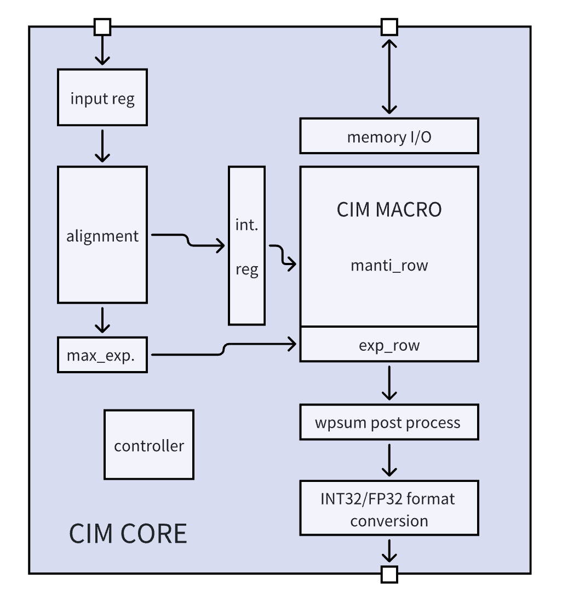

# FP Core

> /fp_core_review/rtl/

> /fp_core_review/front_end_sim/list.f

```text
/rtl/format_conversion.v
/rtl/top.v
/rtl/psum_collector.v
/rtl/top_cim.v
/rtl/dcim_macro_bm.v
/rtl/input_align.v
/rtl/post_process.v
/rtl/input_collector.v
/rtl/mini_controller.v
/rtl/dcim macro_32_bm.v
/rtl/weight_collector.v
/rtl/config_cim.v
/rtl/top_bm.v
/rtl/controller.v
/rtl/cim_weight_collector.y
/rtl/dcim_ip_bm.v
```

## 层次

```text
top(top.v)
    config_cim_inst config_cim(config_cim.v)
    config_instruction_inst config_cim (config_cim.v)
    config_addr_inst config_cim(config_cim.v)
    top_cim_inst top_cim (top_cim.v)
        mini_controller_inst mini_controller(mini controller.v)
        weight_collector_inst weight_collector (weight collector.v)
        input_collector_inst input_collector(input_collector.v)
        cim_weight_collector_inst cim_weight_collector(cim_weight_collector.v)
        psum_collector_inst psum_collector (psum_collector.v)
        top_bm_inst top_bm(top_bm.v)
            input_align_inst input_align(input_align.v)
            post_process_inst post_process(post_process.v)
            format_conversion_inst format_conversion(format_conversion.v)
            controller_inst controller(controller.v)
            dcim_macro_bm(dcim_macro_bm.v)
                bit_shifter input_bit_shift (dcim_macro_bm.v)
                dcim_macro_32_bm_inst dcim_macro_32_bm (dcim_macro_32_bm.v)
                    dcim_ip_bm_inst dcim_ip_bm(dcim_ip_bm.v)(HARD MACRO)
                    shift_acc_block[0:15].shift_acc_0~3:shift_accumulator(dcim_macro_32_bm.v)
```

## rtl文件

- top.v
- psum_collector.v
  > psum_collector 顺序输入的寄存器so, 每次输入新的lsb，寄存器向高位移位；接受so并行输出load的寄存器q，并且可以以LENGTH位单位进行移位，并行输出LENGTH长度的msbs
- top_cim.v
- input_collector.v
  > input_collector 顺序输入的寄存器so, 每次输入新的lsb，寄存器向高位移位；接受so并行输出load的寄存器q，并且可以以LENGTH位单位进行移位，并行输出LENGTH长度的msbs
- mini_controller.v
  > mini_controller instruction里的都是不带cim_前缀的，例如ren，wen。然后通过instruction_valid来将instruction里的这些信号锁存，得到状态机的转换目标；然后在load_start有效时（时钟上升沿）允许状态转换（因此其实状态转换的目标只取决于load_start前一次instruction_valid时的instruction，因为它已经被锁存。）。状态机输出逻辑是根据状态输出cim_前缀的信号，例如cim_ren, cim_wen等等，这些输出信号会输入到dcim ip里。

  > 第一组状态机：REN_GLOBAL, REN_LOCAL, WEN_LOCAL之类的。当处于IDLE状态时，当load_start拉高的时候，状态才开始转换。在状态没有带LOOP的情况下，cnt达到instructin里给出的cnt上限就变回IDLE。如果是带LOOP的，则只要loop信号有效，就一直继续状态，不回到IDLE。因此如果进入LOOP状态，想要回到IDLE，必须让instruction valid一次来让所有信号归零，从而回到IDLE。

  > 第二组状态机：SCEN，SCEN_LOOP。该状态下输出的是cim_cen有效。cim_cen将输入到input_collector, 在有效时，q以LENGTH为单位进行移位，并行输出高LENGTH位msbs。
- weight_collector.v
  > weight_collector 顺序输入的寄存器so, 每次输入新的lsb，寄存器向高位移位；接受so并行输出load的寄存器q，并且可以以LENGTH位单位进行移位，并行输出LENGTH长度的msbs
- config_cim.v
  > config_cim 顺序输入，并行输出的寄存器。每次输入新的lsb，寄存器向高位移位
- cim_weight_collector.v

## top

### 接口

```verilog
module top(
    input                       clk,
    input                       tck,
    input                       rstn,
    input                       instruction_valid,//save instruction
    input                       load_start,

    input                       out_sel,
    input                       out_load,
    input                       out_sc_en,
    input                       out_tdi,
    output                      out_tdo,

    input [2:0]                 config_sel,
    input                       config_sc_en,
    input                       config_tdi,
    output                      config_tdo,
);
```

## top_bm

### 图例



