# FP Core

## 特征概述

fp_core和ip_cored的层次非常相似，在不考虑自检测模块的情况下，相当于就是把ip_core最里面调用的只能进行整数运算、没有时序累加的ip替换成了一个带浮点处理、可以浮点运算的模块top_bm。现在top_bm通过uvm验证后可以认为这是一个跟ip类似的计算模块。

## 架构图

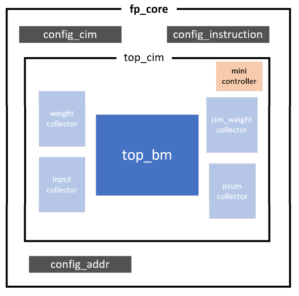

## 文件路径

> /work/home/rhxu/SMIC2025/fp_core_review/

```text
/rtl/format_conversion.v
/rtl/top.v
/rtl/psum_collector.v
/rtl/top_cim.v
/rtl/dcim_macro_bm.v
/rtl/input_align.v
/rtl/post_process.v
/rtl/input_collector.v
/rtl/mini_controller.v
/rtl/dcim macro_32_bm.v
/rtl/weight_collector.v
/rtl/config_cim.v
/rtl/top_bm.v
/rtl/controller.v
/rtl/cim_weight_collector.y
/rtl/dcim_ip_bm.v
```

## RTL层次

```text
top(top.v)
    config_cim_inst config_cim(config_cim.v)
    config_instruction_inst config_cim (config_cim.v)
    config_addr_inst config_cim(config_cim.v)
    top_cim_inst top_cim (top_cim.v)
        mini_controller_inst mini_controller(mini controller.v)
        weight_collector_inst weight_collector (weight collector.v)
        input_collector_inst input_collector(input_collector.v)
        cim_weight_collector_inst cim_weight_collector(cim_weight_collector.v)
        psum_collector_inst psum_collector (psum_collector.v)
        top_bm_inst top_bm(top_bm.v)
            input_align_inst input_align(input_align.v)
            post_process_inst post_process(post_process.v)
            format_conversion_inst format_conversion(format_conversion.v)
            controller_inst controller(controller.v)
            dcim_macro_bm(dcim_macro_bm.v)
                bit_shifter input_bit_shift (dcim_macro_bm.v)
                dcim_macro_32_bm_inst dcim_macro_32_bm (dcim_macro_32_bm.v)
                    dcim_ip_bm_inst dcim_ip_bm(dcim_ip_bm.v)(HARD MACRO)
                    shift_acc_block[0:15].shift_acc_0~3:shift_accumulator(dcim_macro_32_bm.v)
```

> top_bm的图例在下面。

### rtl模块功能说明

- top.v
- psum_collector.v
  > psum_collector 顺序输入的寄存器so, 每次输入新的lsb，寄存器向高位移位；接受so并行输出load的寄存器q，并且可以以LENGTH位单位进行移位，并行输出LENGTH长度的msbs
- top_cim.v
- input_collector.v
  > input_collector 顺序输入的寄存器so, 每次输入新的lsb，寄存器向高位移位；接受so并行输出load的寄存器q，并且可以以LENGTH位单位进行移位，并行输出LENGTH长度的msbs
- mini_controller.v
  > mini_controller instruction里的都是不带cim_前缀的，例如ren，wen。然后通过instruction_valid来将instruction里的这些信号锁存，得到状态机的转换目标；然后在load_start有效时（时钟上升沿）允许状态转换（因此其实状态转换的目标只取决于load_start前一次instruction_valid时的instruction，因为它已经被锁存。）。状态机输出逻辑是根据状态输出cim_前缀的信号，例如cim_ren, cim_wen等等，这些输出信号会输入到dcim ip里。

  > 第一组状态机state_debug：S_REN_GLOBAL, S_REN_LOCAL, S_WEN之类的。当处于IDLE状态时，当load_start拉高的时候，状态才开始转换。在状态没有带LOOP的情况下，cnt达到instruction里给出的cnt上限就变回IDLE。如果是带LOOP的，则只要loop信号有效，就一直继续状态，不回到IDLE。因此如果进入LOOP状态，想要回到IDLE，必须让instruction valid一次来让所有信号归零，从而回到IDLE。

  > 第二组状态机state_cen：S_CEN，S_CEN_LOOP。该状态下输出的是cim_cen有效。cim_cen将输入到input_collector, 在有效时，q以LENGTH为单位进行移位，并行输出高LENGTH位msbs。
- weight_collector.v
  > weight_collector 顺序输入的寄存器so, 每次输入新的lsb，寄存器向高位移位；接受so并行输出load的寄存器q，并且可以以LENGTH位单位进行移位，并行输出LENGTH长度的msbs
- config_cim.v
  > config_cim 顺序输入，并行输出的寄存器。每次输入新的lsb，寄存器向高位移位
- cim_weight_collector.v

## 接口

|方向|信号名|描述|
|---|---|---|
|input |  clk              | 片上数字逻辑时钟  |
|input |  tck              | 用于配置扫描链寄存器的时钟信号  |
|input |  rstn             | 片上数字逻辑复位信号  |
|input |  instruction_valid| 来将instruction扫描链寄存器里的数据锁存，得到状态机的转换目标  |
|input |  load_start       | 在有效时允许状态开始根据上一次锁存的有效instruction进行转换  |
|input |  out_sel          | 选择输出psum或者cim weight  |
|input |  out_load         | 控制psum或者cim weight的扫描链寄存器加载psum或者cim weight的并行输入信号  |
|input |  out_sc_en        | 用于控制psum或者cim weight的配置扫描链寄存器开始扫描输入的使能信号  |
|input |  out_tdi          | 用于移位psum或者cim weight的配置扫描链寄存器的串行输入信号  |
|output|  out_tdo          | psum或者cim weight的配置扫描链寄存器的移位时串行输出信号  |
|input |  en_load          | 允许收集了串行输入的input或者weight的寄存器并行加载到buffer上  |
|input |  [2:0] config_sel | 不同的值代表不同的模式，在不同模式下激活相关的信号  |
|input |  config_sc_en     | 用于控制core内各种配置扫描链寄存器开始扫描输入的使能信号  |
|input |  config_tdi       | 用于配置core内各种配置扫描链寄存器的串行输入信号  |
|output|  config_tdo       | core内各种配置扫描链寄存器的移位时串行输出信号  |

### 验证

在top_cim正确的基础上，再验证top_cim外的扫描链都正常工作即可。

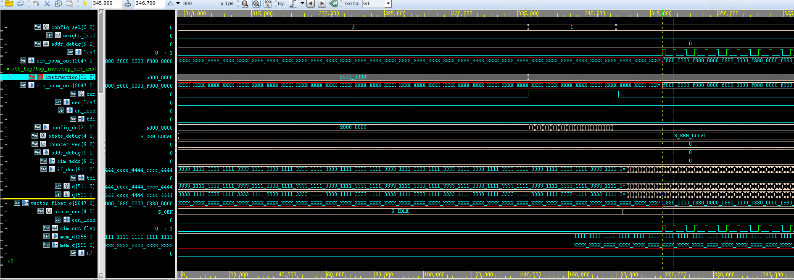

例如希望下一个状态是S_REN_LOCAL，则instruction值为2000_0000，instruction扫描链可以正常写入，并且可以看到在load_start有效后，状态机状态成功转化到S_REN_LOCAL。

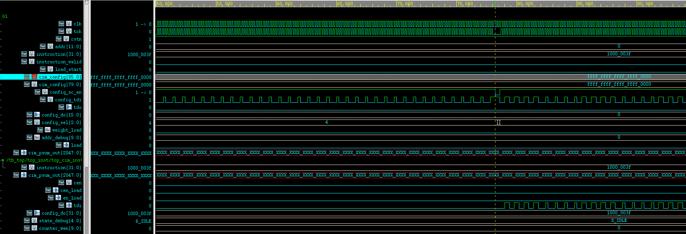

cim_config的扫描链可以正常写入，例如在cim_mask_en为64{1'b1}时而其他相关参数都为0时，cim_config扫描链输出ffff_ffff_ffff_ffff_0000.

## appendix：top_cim

在可以进行浮点mvm的模块`top_bm`的外围加上input、weight、psum的扫描链，从而可以配置mvm模块的输入并读取输出。

### 图例

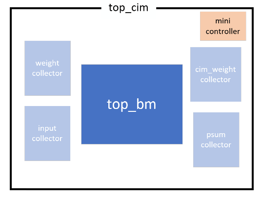

### 验证

由于最核心的`top_bm`模块已经通过uvm验证了，在浮点计算的情况下有可以容忍的误差。因此对于调用`top_bm`的顶层模块`top_cim`来说，只要保证控制信号以及扫描链可以正常写入就没问题了。

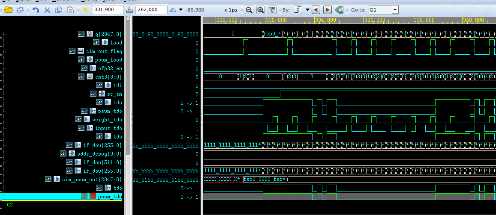

psum的扫描链可以正常输出

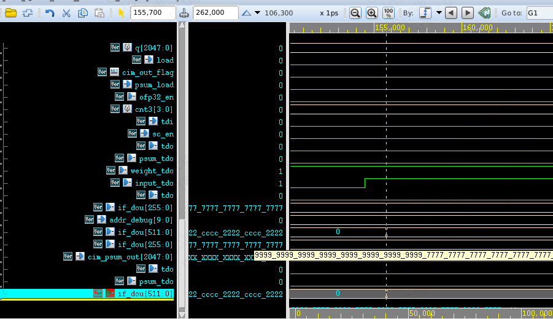

input扫描链也可以正确地读入，例如读入串行数据{16{{4{4'b1100}},{4{4'b0010}}}}并行输出16{cccc_2222}

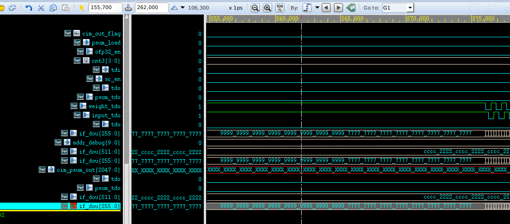

weight扫描链也可以正常读入，例如读入串行数据{8{{4{4'b0011}},{4{4'b1101}}}}并行输出{8{9999}，8{7777}}

## appendix：top_bm

### 功能描述

可以进行多种数制的向量矩阵乘计算模块。

### 图例

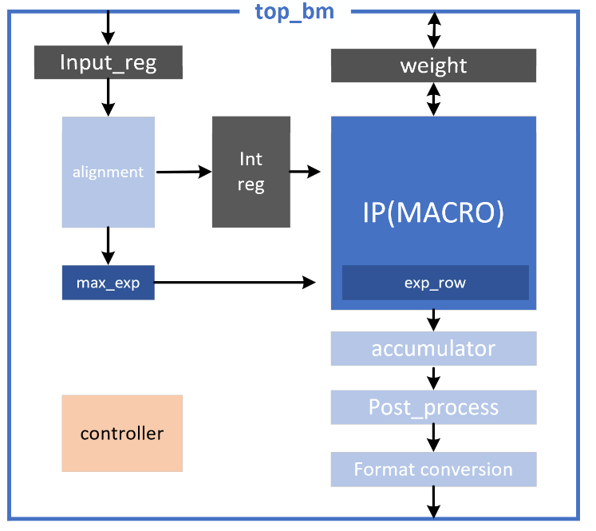

### 验证

该模块由于可配置的数制很多，而且输入输出需要转换数值，模块实际的输入输出为二进制，核对和计算比较麻烦，因此考虑使用uvm进行全面的验证。该uvm是公司的黎孟宇老师编写的，简单来说其原理如下：

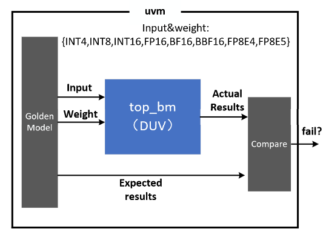

验证结果类似下图

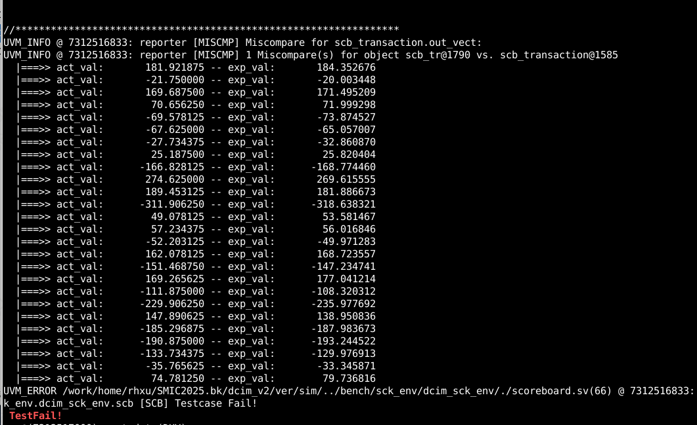
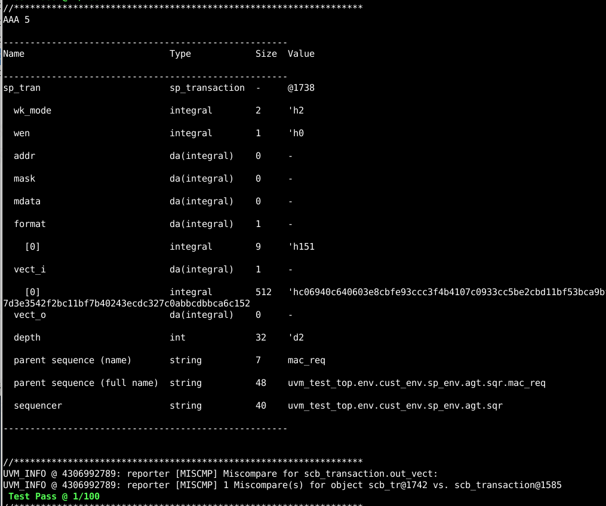

下表总结了`weight`和`input`分别为不同数值的时候，计算结果与期望结果的相对误差。其中，横轴为`weight`的数制，纵轴为`input`的数制。


在数制为整形的时候，输出都是完全正确的，但是在有浮点参与计算的时候就产生了的一定的误差，分析为在计算浮点的过程中由于指数对齐的操作以及数制的转换过程中引入了误差。例如在对齐的时候，由于需要提取出输入中最大的指数，导致指数较小的数字经过移位后丢失掉了尾数的一部分信息。

| 相对误差(%) | INT4 | INT8 | INT16 | FP16 | BF16 | FP8E4 | FP8E5 |
|-------------|------|------|-------|------|------|-------|-------|
| INT4        | 0    | 0    | 0     | 0    | 0    | -0.45 | -0.13 |
| INT8        | 0    | 0    | 0     | 0    | 0    | 0.42  | 0.31  |
| INT16       | 0    | 0    | 0     | 0    | 0    | -0.78 | -0.74 |
| FP16        | 0    | 0    | 0     | 0    | 0    | -0.24 | 0.52  |
| BF16        | 0    | 0    | 0     | 0    | 0    | -0.16 | -0.55 |
| BBF16       | -0.39| -0.06| 0.07  | 0.01 | -0.87| 0.15  | -0.5  |
| FP8E4       | 0.67 | -0.07| 0.73  | 0.56 | -0.22| 0.34  | -0.33 |
| FP8E5       | 0.49 | -0.18| -0.32 | -0.63| 0.47 | 0.013 | 0.04  |
