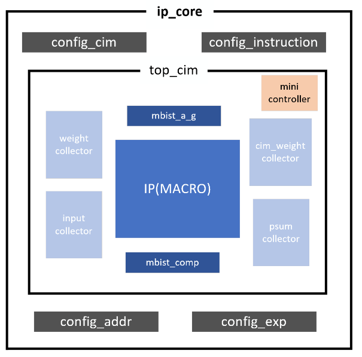
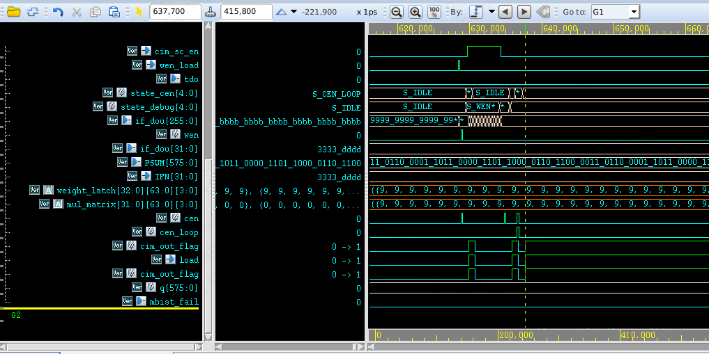
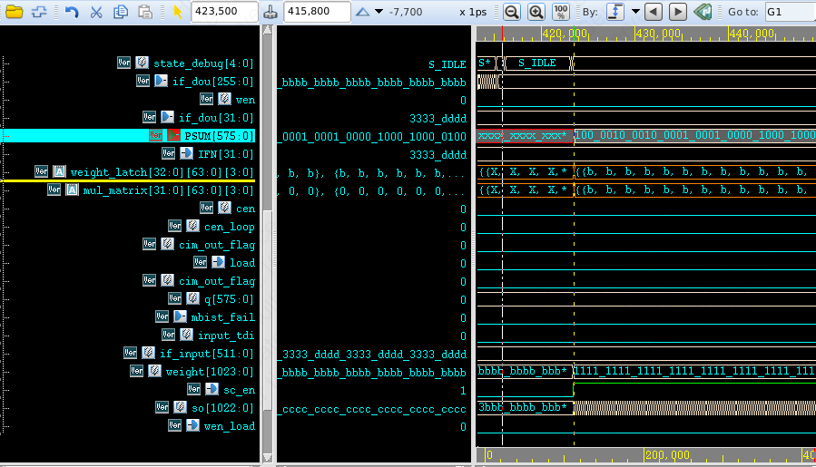
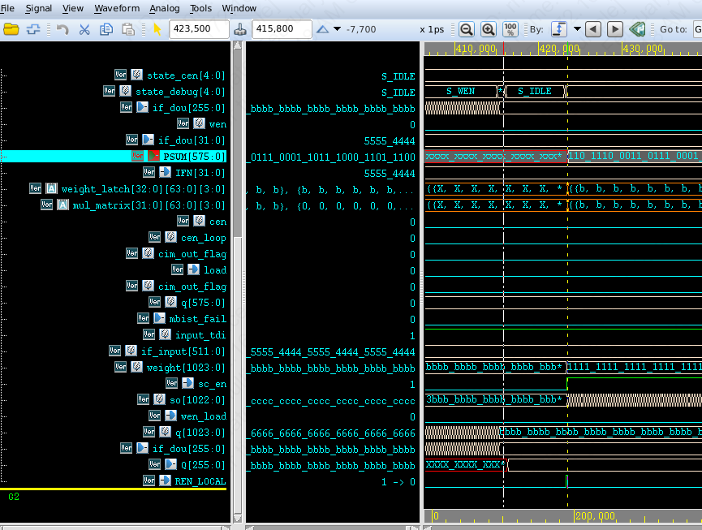
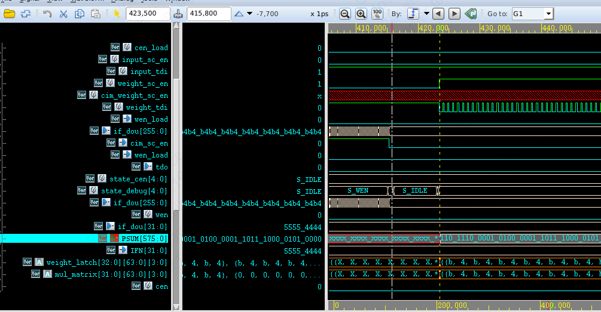
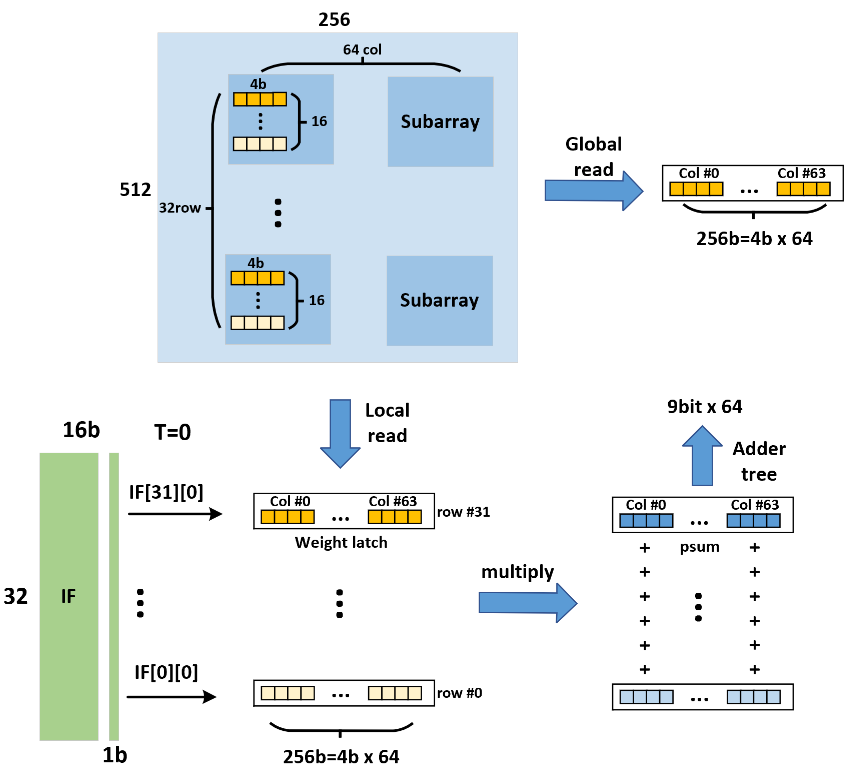

# ip core

## 特征概述

总体来看，这就是在ip（只能处理整型、没有时序累加）的外面加了输入、输出、控制、检测模块。验证DCIM MACRO本身是否正常工作。

- 输入：`config_cim`, `config_addr`, `config_instruction`, `config_exp`, `weight_collector`, `input_collector`都是我们可以配置的寄存器，配置的方式是通过扫描链串行输入，并行输出。
- 输出：`psum_collector`, `cim_weight_collector`是并行输入，串行输出的扫描链，用于将内层的ip输出的数据存起来，串行输出，方便我们观测。
- 自检：`mbist_a_g`模块可以自动顺序生成控制ip为不同模式的控制信号，以及相应的地址和数据，给到ip后，再通过`mbist_comp`模块比对期望的数据和ip的输出是不是一样。

## 架构图



## 文件路径

> /work/home/rhxu/SMIC2025/ip_core_review/

```text
/rtl/top.v
/rtl/psum_collector.v
/rtl/top_cim.v
/rtl/dcim_macro_bm.v
/rtl/input_collector.v
/rtl/mini_controller.v
/rtl/dcim_macro_32_bm.v
/rtl/weight_collector.v
/rtl/config_cim.v
/rtl/cim_weight_collector.v
/rtl/mbist_a_g.v
/rtl/mbist_comp.v
/rtl/dcim_ip_bm.v
```

## RTL层次

```text
top(top.v)
    config_cim_inst config_cim(config_cim.v)                                    # 扫描链用于配置cim_mask_en, sign, ema_rsa, ema_rwl等
    config_instruction_inst config_cim (config_cim.v)                           # 扫描链用于配置cen, ren_global, ren_local等
    config_addr_inst config_cim(config_cim.v)                                   # 扫描链用于配置addr
    config_exp_inst config_cim(config_cim.v)                                    # 扫描链用于配置exp
    top_cim_inst top_cim(top_cim.v)
        mini_controller_inst mini controller(mini controller.v)                 # 状态机，根据instruction来输出控制dcim ip的读/写使能信号
        weight_collector_inst weight_collector (weight collector.v)             # 扫描链用于配置weight
        input_collector_inst input_collector(input_collector.v)                 # 扫描链用于配置input
        mbist_a_g_inst mbist_a_g (mbist_a_g.v)                                  # 在mbist模式下自动控制输出控制dcim ip的读/写使能信号
        dcim_ip_bm_inst dcim_ip_bm(dcim_ip_bm.v)(HARD MACRO)                    # ip 行为级模型
        cim_weight_collector_inst cim_weight_collector(cim_weight_collector.v)  # 扫描链收集dcim ip的Q
        psum_collector_inst psum_collector (psum_collector.v)                   # 扫描链收集dcim ip的psum
        mbist_comp_inst mbist_comp(mbist_comp.v)                                # 用于比较dcim ip输出的Q和当时写入的值是否一致
```

### rtl模块功能说明

- top.v
- mbist_a_g.v
  > mbist_a_g 当mbist_test_h有效的时候，进行检测。自动轮流依次检测多种模式，生成相应的wen，ren，addr等信号。并生成对应的正确数据test_data, 用于与cim的实际输出进行比对。
- mbist_comp.v
- psum_collector.v
  > psum_collector 顺序输入的寄存器so, 每次输入新的lsb，寄存器向高位移位；接受so并行输出load的寄存器q，并且可以以LENGTH位单位进行移位，并行输出LENGTH长度的msbs
- top_cim.v
- input_collector.v
  > input_collector 顺序输入的寄存器so, 每次输入新的lsb，寄存器向高位移位；接受so并行输出load的寄存器q，并且可以以LENGTH位单位进行移位，并行输出LENGTH长度的msbs
- mini_controller.v
  > mini_controller instruction里的都是不带cim_前缀的，例如ren，wen。然后通过instruction_valid来将instruction里的这些信号锁存，得到状态机的转换目标；然后在load_start有效时（时钟上升沿）允许状态转换（因此其实状态转换的目标只取决于load_start前一次instruction_valid时的instruction，因为它已经被锁存。）。状态机输出逻辑是根据状态输出cim_前缀的信号，例如cim_ren, cim_wen等等，这些输出信号会输入到dcim ip里。

  > 第一组状态机state_debug：S_REN_GLOBAL, S_REN_LOCAL, S_WEN之类的。当处于IDLE状态时，当load_start拉高的时候，状态才开始转换。在状态没有带LOOP的情况下，cnt达到instruction里给出的cnt上限就变回IDLE。如果是带LOOP的，则只要loop信号有效，就一直继续状态，不回到IDLE。因此如果进入LOOP状态，想要回到IDLE，必须让instruction valid一次来让所有信号归零，从而回到IDLE。

  > 第二组状态机state_cen：S_CEN，S_CEN_LOOP。该状态下输出的是cim_cen有效。cim_cen将输入到input_collector, 在有效时，q以LENGTH为单位进行移位，并行输出高LENGTH位msbs。
- weight_collector.v
  > weight_collector 顺序输入的寄存器so, 每次输入新的lsb，寄存器向高位移位；接受so并行输出load的寄存器q，并且可以以LENGTH位单位进行移位，并行输出LENGTH长度的msbs
- config_cim.v
  > config_cim 顺序输入，并行输出的寄存器。每次输入新的lsb，寄存器向高位移位。
- cim_weight_collector.v


## 接口

|方向|信号名|描述|
|---|---|---|
|input |  clk              | 片上数字逻辑时钟  |
|input |  tck              | 用于配置扫描链寄存器的时钟信号  |
|input |  rstn             | 片上数字逻辑复位信号  |
|input |  instruction_valid| 来将instruction扫描链寄存器里的数据锁存，得到状态机的转换目标  |
|input |  load_start       | 在有效时允许状态开始根据上一次锁存的有效instruction进行转换  |
|input |  out_sel          | 选择输出psum或者cim weight  |
|input |  out_load         | 控制psum或者cim weight的扫描链寄存器加载psum或者cim weight的并行输入信号  |
|input |  out_sc_en        | 用于控制psum或者cim weight的配置扫描链寄存器开始扫描输入的使能信号  |
|input |  out_tdi          | 用于移位psum或者cim weight的配置扫描链寄存器的串行输入信号  |
|output|  out_tdo          | psum或者cim weight的配置扫描链寄存器的移位时串行输出信号  |
|input |  en_load          | 允许收集了串行输入的input或者weight的寄存器并行加载到buffer上  |
|input |  [2:0] config_sel | 不同的值代表不同的模式，在不同模式下激活相关的信号  |
|input |  config_sc_en     | 用于控制core内各种配置扫描链寄存器开始扫描输入的使能信号  |
|input |  config_tdi       | 用于配置core内各种配置扫描链寄存器的串行输入信号  |
|output|  config_tdo       | core内各种配置扫描链寄存器的移位时串行输出信号  |
|input |  mbist_test_h     | 有效时进入ip core的mbist自检SRAM读写功能  |
|input |  mbist_reset_l    | mbist自检控制模块的复位信号  |
|output|  mbist_fail       | 指示mbist自检是否成功，如果一直为0，则无误  |
|output|  mbist_done       | 指示mbist自检是否完成  |

## 验证结果



给到dcim ip的IFN为3333_dddd（即实际的input是cccc_2222）, dcim里存的权重全部为16{9999}，最后算出来的是64{9'b001101100},与期望值一样


给到dcim ip的IFN为3333_dddd（即实际的input是cccc_2222）, dcim里存的权重全部为16{bbbb}，最后算出来的是64{9'b010000100},与期望值一样


给到dcim ip的IFN为5555_4444（即实际的input是aaaa_bbbb）, dcim里存的权重全部为16{bbbb}，最后算出来的是64{9'b011011100},与期望值一样


给到dcim ip的IFN为5555_4444（即实际的input是aaaa_bbbb）, dcim里存的权重全部为16{b4b4}，最后算出来的是32{{9'b011011100},{9'b001010000}},与期望值一样


## appendix：dcim_ip行为级模型

> designed through analog flow, unsynthesizable.

> 内部寄存器大小为528x256位，或(16x33)x(64x4)位，即64列4bit权重，33行尺寸为16的subarray。

> 输出是单bit输入feature和4bit权重的按列累加和，没有时序上的累加。（时序上的累加需要在外部接一个shift accumulator）

### 接口

```verilog
/////SIZE PARAMETER DEFINATION////START
`define  ADDR_WIDTH  10      // width of memory ADDRess
`define  MEM_HEIGHT  528     // row number of SRAM
`define  MEM_WIDTH   256     // column number of SRAM
`define  MEM_MUX     1       // column mux
`define  DCIM_COL    64      // number of DCIM_COL
`define  DCIM_COL_WIDTH  4   // width of DCIM_COL
`define  DCIM_ROW    32      // number of DCIM_ROW
`define  DCIM_ROW_DEPTH  16  // depth of DCIM_ROW
`define  EXP_WIDTH   9       // width of exponent
//SIZE PARAMETER DEFINATION////END
//////////////////////////////////////
//COMPUTE PARAMETER DEFINATION////START
`define  IN_WIDTH_MAX   16  // max of input precision
`define  IN_WIDTH_STEP  4   // step length of input precision configuration
`define  IN_WIDTH_NUM   4   // step number of input precision configuration
`define  IN_WIDTH_MIN   4   // min of input precision
`define  OUT_WIDTH_MAX  25  // max of output precision
`define  OUT_WIDTH_STEP 4   // step length of output precision configuration
`define  OUT_WIDTH_NUM  4   // step number of output precision configuration
`define  OUT_WIDTH_MIN  13  // min of output precision
`define  PSUM_WIDTH     9   //
`define  SIGN_CONFIG    4   // number of SIGN bit configuration for weight data
```

```verilog
module  dcim_ip_bm(  //rstn,
    input CLK, WEN, REN_GLOBAL, REN_LOCAL,
    input   [1:0]  EMA_RSA,
    input   [1:0]  EMA_RWL,
    input   [`ADDR_WIDTH-1:0]      ADDR,
    //input  rstn;  //for input bit shifter and shift-accumulator
    input   [`EXP_WIDTH-1:0]       I_EXP,
    output  [`EXP_WIDTH*`DCIM_COL/2-1:0]    O_EXP,
    input   [`DCIM_COL-1:0]        MASK,
    input   [`SIGN_CONFIG-1:0]     SIGN,

    input   [`MEM_WIDTH-1:0]       D,
    output  [`MEM_WIDTH-1:0]       Q,
    input   [`DCIM_ROW-1:0]        IFN,

    output  [`EXP_WIDTH-1:0]       I_EXPDRV,
    output  [`SIGN_CONFIG-1:0]     SIGNDRV,
    output  [`DCIM_ROW-1:0]        IFNDRV,
    output  [(`OUT_WIDTH_MIN-`IN_WIDTH_MIN)*`DCIM_COL-1:0]  PSUM // reg -> wire
);
```

| NO. | NAME         | TYPE   | DESCRIPTION                                                                 |
|-----|--------------|--------|-----------------------------------------------------------------------------|
| 1   | IFN[32-1:0]  | input  | input vector                                                                |
| 2   | D[64*4-1:0]  | input  | write data port                                                             |
| 3   | Q[64*4-1:0]  | output | Read data port                                                              |
| 4   | MASK[64-1:0] | input  | INT4-level write bit-mask configuration                                      |
| 5   | ADDR[9:0]    | input  | memory address data port                                                    |
|     |              |        | overall: 10'h0_00 to 10'h2_0f                                                |
|     |              |        | mantissa: 10'h0_00 to 10'h1_ff                                               |
|     |              |        | exponent: 10'h2_00 to 10'h2_0f                                              |
| 6   | SIGN[3:0]    | input  | Data format configuration:                                                  |
|     |              |        | 4'b1111 (INT4),                                                              |
|     |              |        | 4'b1010 (INT8),                                                              |
|     |              |        | 4'b1000 (INT16)                                                             |
| 7   | PSUM[64*9-1:0]| output | 64 channel, 9b per channel;                                                  |
|     |              |        | Mantissa MAC result for 32*1b*4b=9b                                         |
| 8   | I_EXP[9-1:0] | input  | Exponent(9b) input                                                         |
| 9   | O_EXP[32*9-1:0]| output | 32 channel, 9b per channel;                                                  |
|     |              |        | Exponent(9b) add result output                                              |
| 10  | IFNDRV[32-1:0]| output | pipe to next macro: input vector                                            |
| 11  | SIGNDRV[3:0] | output | pipe to next macro: sign configuration                                       |
| 12  | I_EXPDRV[9-1:0]| output | pipe to next macro: exponent input                                          |
| 13  | CLK          | input  | Main clk, posedge trig.                                                     |
| 14  | WEN          | input  | Write enable                                                                |
| 15  | REN_LOCAL    | input  | Internal read enable for computing                                          |
| 16  | REN_GLOBAL   | input  | External read enable, read out Q[64*4-1:0]                                  |
| 17  | EMA_RSA[1:0] | input  | External read: pulse width configuration                                     |
|     |              |        | 2'b11: low frequency; 2'b00: high frequency                                 |
| 18  | EMA_RWL[1:0] | input  | External read: pulse width configuration                                    |
|     |              |        | 2'b11: low frequency; 2'b00: high frequency                                 |
| 19  | VDDCM        | power  | Power for Memory read/write                                                 |
| 20  | VDDCLO       | power  | Power for Compute module                                                    |
| 21  | VSSC         | ground |                                                                             |

### 数据流架构图




