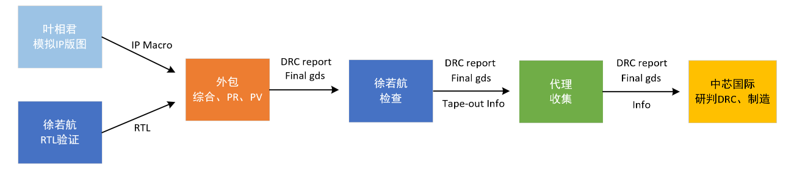
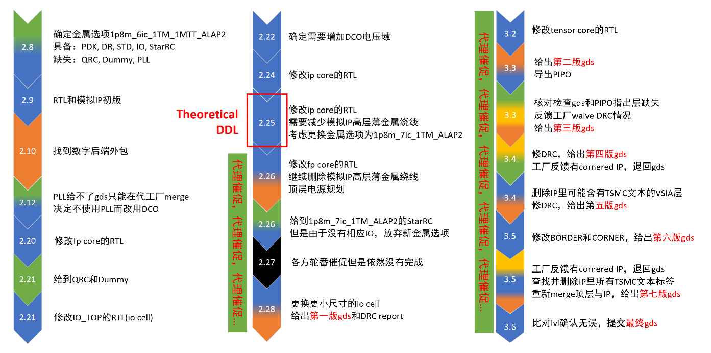

# 2.25shuttle记录与反思

## 主体

## 日程

## 反思

- 工艺文件一定要要全。选定金属层选项后，需要有配套的、**最新**的
  - `PDK`
  - `std cell`
  - `io cell`
  - `sram compiler`
  - `DRC`
  - `QRC`(Synopsys Innovus when PR)
  - `StarRC`(Cadence PrimeTime when sign-off)
  - `Dummy`
  - `redhawk`
- 仔细研读并在遇到各种问题的时候去查看`Design Rule`文档、std cell和io cell的datasheet以及waive list
  - 各种金属层的说明以及DRC都在文档里面有详细说明
  - waive list可能在errortype文件
- 工艺迁移的时候，一定要检查所有label以及text，不能遗留旧工艺的信息
  - 例如T家会在其器件的某些层的金属上打上高度为零也就是不可见的label来保留其版权信息
- 合理规划电源域，并做好隔离，防止不同的电源之间串扰以及注意IR drop
- 注意io cell还有pad的尺寸，尽量让信号io和电源io统一尺寸，并需要与封装厂确认是否支持封装
- 一定要为自己留足时间上的裕度。如果一个东西三天后要交，那么必须让上游提前两天交过来，否则到了ddl就会很被动
- 找外包并不是让外包帮忙handle所有，外包的作用是帮忙干一些你知道怎么做但没时间和人力做的事情，依然要保持“自己handle整个流程”的态度，才能把控好每个细节不出岔子
