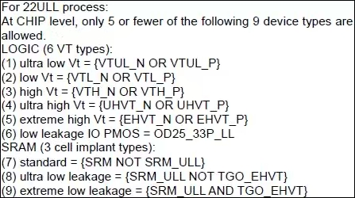
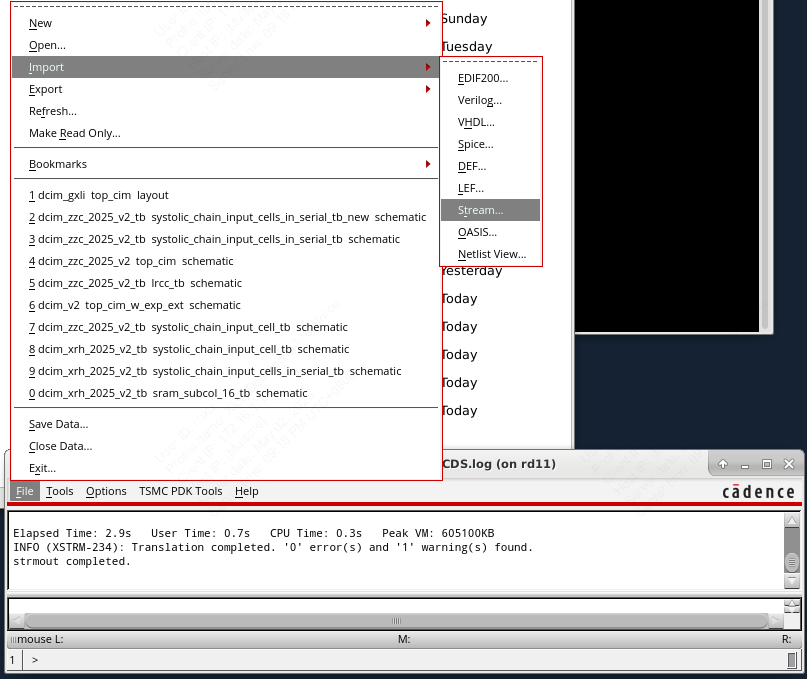
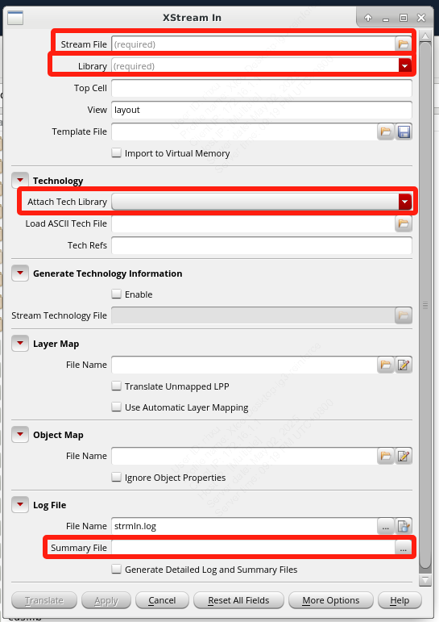
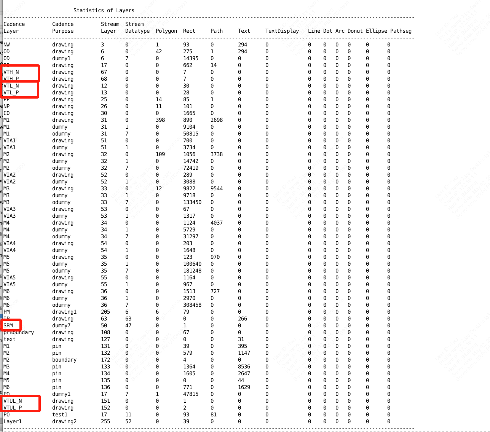
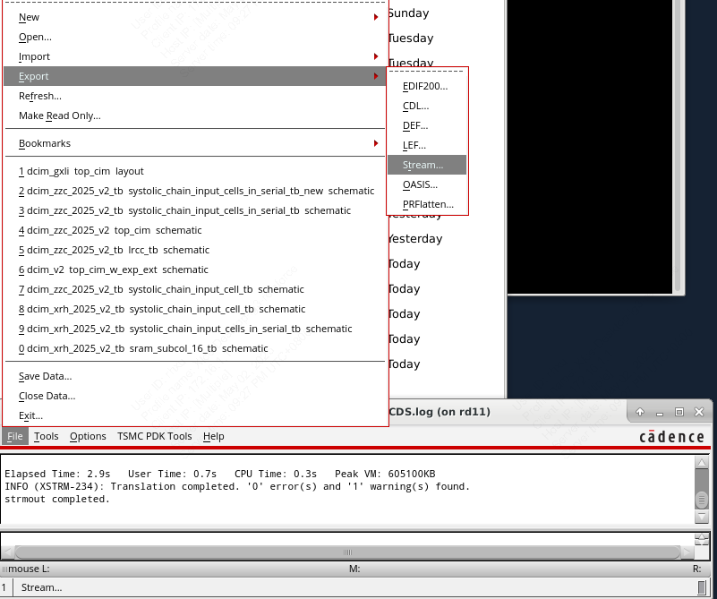
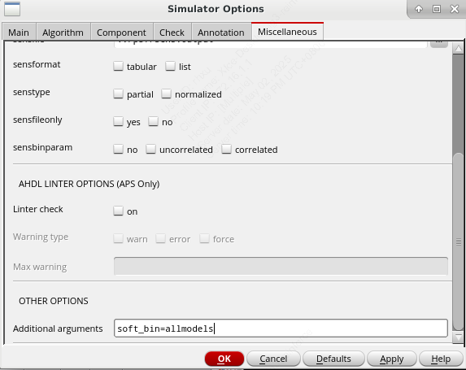

# tips for tape-out

## Layer uasage summary

在交付的时候常常需要知道整个设计使用了工艺库中的哪些层，同时也可以借此确定使用了哪些特殊器件。



此处提供两种方法来查看layer的使用情况，分别是

- 你有一个gds文件
- 你有一个virtuoso library

### from gds

1. 在`Virtuoso`里新建一个库，用于导入gds
2. 选择`File` -> `Import` -> `Stream`



3. `Stream File`为用于导入的gds文件，`Library`选择刚才新建的库，尽量不要选择已有的库，因为gds导入将会将所有层次的cell导入。然后attach到相应的工艺库，并且指定`Summary File`文件名用于导出summary文件。其他的都没有必要填，例如top cell是可以自动识别的。最后点击`Translate`



4. 在产生的summary文件中就可以看到所有layer的使用情况



### from library

1. 选择`File` -> `Export` -> `Stream`



2. 在`XStream Out` 窗口中，选择`Library`为需要导出的库，`Stream File`为导出的gds文件名，top cell可以不填，因为会自动识别。并且需要指定`Summary File`文件名用于导出summary文件。最后点击`Translate`

3. 在产生的summary文件中就可以看到所有layer的使用情况

## setting the value of`soft_bin` option to `allmodels`

在使用spectre仿真的时候出现管子尺寸不符合要求的报错，如：

```text
Error found by spectre during initialsetup.
   ERROR (CMI-2440): "input.scs" 24848: I0.I6_10__MNM0@2:  The length, width, or area of the instancedoes not fit the given lmax-lmin, wmax-wmin, or areamax-areamin range for anymodel in the `nch_33' group. The channel width is 2.000000e+00 and length is3.250000e-01. Specify channel width and length that do not exceed thereferenced maximal area Lmax=5.000100e-05, Lmin=3.250000e-07, Wmax=1.000010e-04and Wmin=1.350000e-07. You can choose the nearest model by setting the value of`soft_bin' option to `allmodels'.
   ERROR (CMI-2440): "input.scs" 72: I0.I6_10__MPM8:  The length, width, or area of the instancedoes not fit the given lmax-lmin, wmax-wmin, or areamax-areamin range for anymodel in the `pch_33' group. The channel width is 3.500000e+00 and length is2.800000e-01. Specify channel width and length that do not exceed thereferenced maximal area Lmax=5.000100e-05, Lmin=2.800000e-07, Wmax=1.000010e-04and Wmin=1.350000e-07. You can choose the nearest model by setting the value of`soft_bin' option to `allmodels'.
```

说明手册原文：soft_bin=singlemodelsIf set to singlemodels, it is used only on non-binned models.Possible values are inglemodels, no and allmodels.

当尺寸不匹配，soft_bin选择no时会报错，选择allmodels会挑相近参数继续仿真。

设置方法：在ADE L中`Simulation`->`Options`->`Analog`界面中选择`Miscellaneous`选项卡，找到最下方`additional arguement`，添加`soft_bin=allmodels`即可。


